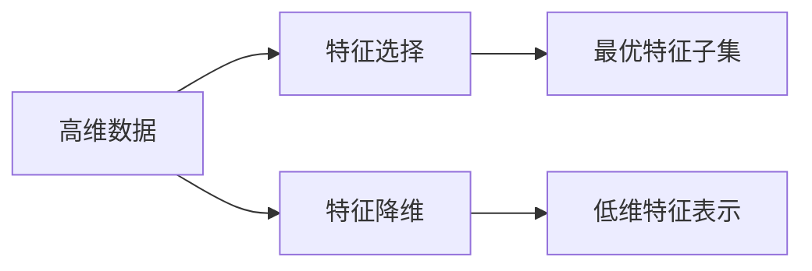

好的,我会严格按照您的要求,以《特征选择与特征降维原理与代码实战案例讲解》为题,撰写一篇8000字以上的技术博客文章。下面是文章正文:

# 特征选择与特征降维原理与代码实战案例讲解

关键词:特征选择,特征降维,PCA,LDA,Lasso,代码实战

## 1. 背景介绍 
### 1.1 问题的由来
在机器学习和数据挖掘领域,我们经常会遇到高维数据。高维数据不仅会增加计算复杂度,还会带来维度灾难等问题,严重影响模型的性能。因此,如何从高维数据中选择最有效的特征子集,构建精简高效的学习模型,是一个亟待解决的问题。
### 1.2 研究现状
目前,针对高维数据的特征选择和降维,已经有了很多成熟的理论和算法。比如特征选择中的过滤法、包裹法、嵌入法等,特征降维中的PCA、LDA等。但在实际应用中如何权衡算法的有效性和效率,构建最优的特征子空间,还有待进一步研究。
### 1.3 研究意义
特征选择和降维是机器学习的重要前处理环节。找到最优特征子集,不仅可以降低学习任务的难度,提高模型的泛化性能,还可以帮助我们更好地理解数据的内在规律,有利于后续的数据分析和解释。因此,深入研究特征优化技术,对于推动机器学习的发展具有重要意义。
### 1.4 本文结构
本文将重点介绍几种主流的特征选择与降维算法的原理,并通过实际的案例数据和Python代码,演示如何应用这些算法优化特征。内容安排如下:

- 第2部分:介绍特征选择与降维的基本概念和分类
- 第3部分:重点剖析几种典型算法的原理和步骤 
- 第4部分:推导算法中用到的数学模型和公式
- 第5部分:使用案例数据和Python代码,展示算法的具体实现
- 第6部分:讨论算法在实际场景中的应用 
- 第7部分:推荐相关的学习资源和工具
- 第8部分:总结全文,展望未来的研究方向和挑战
- 第9部分:附录,解答一些常见问题

## 2. 核心概念与联系
特征选择和特征降维都是在高维数据的基础上,选择一个最优的特征子集用于后续学习任务。二者的主要区别在于:

- 特征选择:从原有特征集合中选择最相关、最重要的部分特征,特征维度保持不变,特征语义不变,是一种特征子集搜索问题。按照特征选择准则,可分为:
  - 过滤法(Filter):基于特征本身的统计特性筛选,如方差、相关系数等
  - 包裹法(Wrapper):将特征子集的生成与学习器的训练过程包裹在一起,根据学习性能评估特征子集
  - 嵌入法(Embedding):将特征选择过程与学习器训练过程融合,如L1正则化等 
- 特征降维:通过某种数学变换将原始高维特征映射到一个低维空间,在保留数据内在结构的同时,减少特征维度。新特征通常是原始特征的线性或非线性组合,特征语义发生改变。常见的降维算法有:
  - PCA:主成分分析,通过线性变换将相关特征转化为若干个不相关的主成分
  - LDA:线性判别分析,通过最大化类间方差和最小化类内方差找到最优投影方向
  - MDS:多维缩放,保持样本之间的距离不变,将高维数据映射到低维空间

下图展示了特征选择和降维的基本过程:

## 3. 核心算法原理 & 具体操作步骤
下面我们重点介绍几种常用的特征选择和降维算法。
### 3.1 过滤法 - 方差选择法
#### 3.1.1 算法原理
方差选择法的基本思想是:方差太小的特征对学习任务的影响很小,可以视为无效特征予以剔除。假设某个特征的方差为0,即所有样本在该特征上取值完全相同,这个特征显然不具有区分样本的能力。因此,可以用特征的方差大小来度量其重要性。
#### 3.1.2 算法步骤
1. 计算每个特征的方差:

$$Var(X_j)=\frac{1}{m}\sum_{i=1}^m(x_j^{(i)}-\mu_j)^2, \quad j=1,2,...,n$$

其中$X_j$表示第$j$个特征,$m$为样本数量,$\mu_j$为该特征的均值。

2. 根据预设的方差阈值,过滤掉方差小于阈值的特征。留下的就是选中的特征子集。

方差选择法的优点是计算简单高效,缺点是没有考虑特征之间的相关性,可能会选择一些冗余特征。
### 3.2 包裹法 - 递归特征消除法
#### 3.2.1 算法原理  
递归特征消除法(Recursive Feature Elimination,RFE)是一种逐步筛选特征子集的方法。它的基本思路是:反复构建模型,每次基于模型的精度排除若干最不重要的特征,直到达到所需的特征数量。整个过程可以看作是一个特征子集搜索问题,以模型的性能作为特征子集的评估准则。
#### 3.2.2 算法步骤
1. 选择一个基模型$M$,比如SVM或随机森林等,用全部$n$个特征训练该模型,得到各特征的重要性权重。

2. 去除若干权重最小的特征,留下$n-k$个特征。 

3. 基于$n-k$个特征重新训练模型$M$,得到新的特征权重。

4. 重复2-3步,直到剩余特征达到预设数量$r$。最终留下的$r$个特征即为选定的特征子集。

RFE的优点是特征子集的选择与具体学习器密切相关,选出的特征更适合后续建模。缺点是计算开销大,需要反复训练模型。
### 3.3 嵌入法 - L1正则化
#### 3.3.1 算法原理
L1正则化即在目标函数中加入L1范数作为正则化项,它倾向于使许多特征的权重为0,从而达到稀疏化和特征选择的效果。以线性回归为例,使用L1正则化的目标函数为:

$$\min_w \frac{1}{2m}\sum_{i=1}^m(y^{(i)}-w^Tx^{(i)})^2 + \alpha||w||_1$$

其中$\alpha$为正则化系数,$||w||_1$为权重向量$w$的L1范数。上式在均方误差的基础上,加入了L1正则化项,当$\alpha$较大时会使许多权重变为0,相应的特征被剔除。
#### 3.3.2 算法优缺点
L1正则化的优点是可以同时实现特征选择和模型学习,得到的模型更简洁高效。缺点是$\alpha$的选择需要交叉验证,计算量较大。此外,当多个特征高度相关时,L1正则化倾向于选择其中的任意一个,而不是全部相关特征。
### 3.4 降维算法 - PCA
#### 3.4.1 算法原理
PCA的目标是在最小化投影损失的前提下,找到样本的一个正交线性变换,将数据投影到一个低维子空间。在新的坐标系下,不同维度的特征之间是线性无关的,且按照重要性从高到低排列。PCA的数学本质是对协方差矩阵进行特征值分解。
#### 3.4.2 算法步骤
1. 对原始数据进行中心化:

$$x^{(i)} := x^{(i)} - \frac{1}{m}\sum_{i=1}^m x^{(i)}$$

2. 计算协方差矩阵:

$$\Sigma=\frac{1}{m}X^TX$$

其中$X$为中心化后的数据矩阵,$X^T$为其转置。

3. 对协方差矩阵$\Sigma$进行特征值分解:

$$\Sigma=U\Lambda U^T$$

其中$U$为特征向量矩阵,$\Lambda$为特征值构成的对角矩阵。

4. 取出前$k$个最大特征值对应的特征向量,构成变换矩阵$W$:

$$W=(w_1,w_2,...,w_k)$$

5. 用变换矩阵$W$将原始数据$X$映射到$k$维子空间:

$$Z=XW$$

$Z$就是降维后的数据矩阵。

#### 3.4.3 算法优缺点
PCA的优点是具有良好的数学理论基础,可以充分利用数据的统计特性揭示数据内在结构,计算也相对简单。缺点是仅考虑了数据的方差信息,没有利用类别信息,因此不太适合有监督学习任务。此外,PCA得到的新特征具有可解释性差的问题。

## 4. 数学模型和公式 & 详细讲解 & 举例说明
前面我们介绍了几种特征选择和降维算法的基本原理,这里再通过一个具体的数学推导过程,帮助大家深入理解其中的关键技术细节。以PCA为例,我们详细讲解其数学模型的构建与求解。
### 4.1 数学模型构建
PCA的优化目标可以表述为:寻找一个$d\times k$维的变换矩阵$W$,将原始$d$维数据$X$映射到$k$维空间($k<d$),使得投影后样本点的方差最大化。直观理解就是让投影后的数据尽可能分散,包含更多的原始数据信息。

我们知道,对中心化的数据$X$,其协方差矩阵$\Sigma$的对角元素恰好就是各特征的方差,非对角元素为不同特征间的协方差。因此,优化目标可以表示为最大化$\Sigma$的对角元素之和,即其迹(trace):

$$\max_{W} tr(W^T\Sigma W), \quad s.t. W^TW=I$$

其中$I$为单位矩阵,限制条件$W^TW=I$确保变换矩阵$W$是正交的,避免新特征之间相关。
### 4.2 公式推导过程 
为了求解上述优化问题,我们使用拉格朗日乘子法。引入拉格朗日乘子$\Lambda=diag(\lambda_1,...,\lambda_k)$,构造拉格朗日函数:

$$L(W,\Lambda)=tr(W^T\Sigma W)-tr(\Lambda(W^TW-I))$$

对$W$求导并令导数为0:

$$\frac{\partial L}{\partial W}=2\Sigma W-2\Lambda W=0$$

整理得:

$$\Sigma W=\Lambda W$$

这说明$W$的列向量$w_i$恰好是协方差矩阵$\Sigma$的特征向量,$\lambda_i$为对应的特征值。

将约束条件$W^TW=I$代入目标函数:

$$tr(W^T\Sigma W)=tr(W^T\Lambda W)=\sum_{i=1}^k \lambda_i$$

要最大化目标函数,只需取$\Sigma$的前$k$个最大特征值对应的特征向量构成$W$即可。这就是主成分分析的解。
### 4.3 案例分析与讲解
下面我们用一个简单的二维数据集来直观演示PCA的降维过程。如图所示,原始数据呈椭圆形分布:

图中红色箭头表示数据的两个主成分方向。PCA的目标就是找到这两个方向,并将数据投影到其中的一个或多个方向上。

假设我们要将数据降到一维,只需取第一主成分(图中长箭头)。将数据投影到该向量上,就得到了降维后的一维表示:

可以看到,