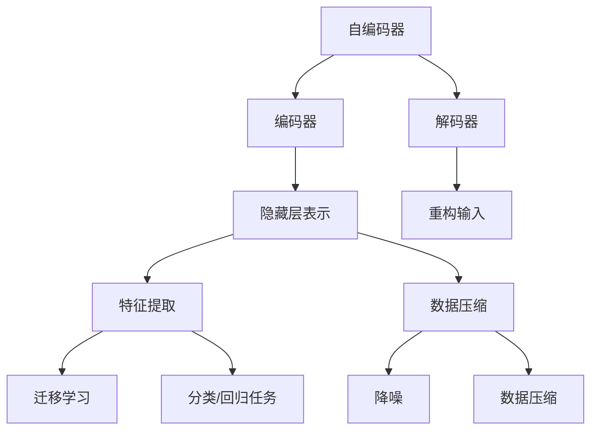

# 自编码器(Autoencoders) - 原理与代码实例讲解

## 1. 背景介绍

### 1.1 问题的由来

在机器学习和深度学习的领域中,数据表示和特征提取是一个关键挑战。传统的特征工程方法需要大量的人工干预和领域专业知识,这不仅耗时耗力,而且往往难以获得理想的结果。因此,研究人员一直在探索自动化的无监督特征学习方法,以便从原始数据中自动发现有用的模式和表示。

自编码器(Autoencoders)作为一种无监督学习技术,在解决这一挑战中扮演着重要角色。它旨在从输入数据中学习一种紧凑且富有信息的表示方式,同时尽可能保留输入数据的关键特征和结构。这种表示方式不仅可以用于数据压缩和降噪,还可以作为其他机器学习任务的特征提取器,从而提高模型的性能。

### 1.2 研究现状

自编码器的概念最早可以追溯到上世纪80年代,但直到近年来,随着深度学习的兴起,它才受到广泛关注和研究。研究人员提出了多种变体和改进版本,如稀疏自编码器(Sparse Autoencoders)、变分自编码器(Variational Autoencoders)、去噪自编码器(Denoising Autoencoders)等,以解决不同的问题和应用场景。

目前,自编码器已被广泛应用于图像处理、语音识别、自然语言处理、推荐系统等多个领域。它不仅可以用于无监督特征学习,还可以与监督学习模型结合,提高模型的泛化能力和鲁棒性。

### 1.3 研究意义

自编码器的研究对于机器学习和人工智能领域具有重要意义:

1. **自动特征学习**: 自编码器可以自动从原始数据中学习有用的特征表示,减少了人工特征工程的工作量,提高了模型的性能。

2. **数据压缩和降噪**: 自编码器可以将高维数据压缩为低维表示,同时保留关键信息,这对于数据压缩和降噪任务非常有用。

3. **半监督学习**: 自编码器可以结合少量标记数据和大量未标记数据进行半监督学习,提高模型的泛化能力。

4. **数据生成**: 一些变体自编码器(如变分自编码器)可用于生成新的数据样本,在数据增强、图像合成等领域有广泛应用。

5. **迁移学习**: 自编码器学习到的特征表示可以作为其他任务的初始化,加速模型的训练过程。

### 1.4 本文结构

本文将全面介绍自编码器的原理、算法细节、数学模型、代码实现和实际应用。具体内容安排如下:

1. 核心概念与联系
2. 核心算法原理与具体操作步骤
3. 数学模型和公式详细讲解与案例分析
4. 项目实践:代码实例和详细解释说明
5. 实际应用场景
6. 工具和资源推荐
7. 总结:未来发展趋势与挑战
8. 附录:常见问题与解答

## 2. 核心概念与联系

自编码器(Autoencoder)是一种无监督学习算法,由两个主要部分组成:编码器(Encoder)和解码器(Decoder)。

- **编码器(Encoder)**: 将高维输入数据映射到低维隐藏层表示,实现特征提取和数据压缩。
- **解码器(Decoder)**: 将低维隐藏层表示重构为与原始输入数据尽可能相近的输出,用于数据重建和降噪。

在自编码器的训练过程中,模型会自动学习如何最小化输入数据与重构输出之间的差异,从而捕获输入数据的关键特征。

自编码器的核心思想是通过压缩和重构数据的过程,发现数据的内在结构和模式。这种无监督特征学习方法具有广泛的应用:

1. **特征提取**: 隐藏层的表示可作为其他机器学习任务(如分类、回归等)的特征输入,提高模型性能。
2. **数据压缩**: 将高维数据压缩为低维表示,实现有损数据压缩。
3. **降噪**: 通过重构过程,可以从噪声数据中恢复出原始信号,实现数据降噪。
4. **数据生成**: 一些变体自编码器(如变分自编码器)可用于生成新的数据样本。
5. **迁移学习**: 自编码器学习到的特征表示可用于初始化其他任务的模型,加速训练过程。

总的来说,自编码器是一种强大的无监督学习技术,在数据表示学习、特征工程、数据处理等领域有着广泛的应用前景。

## 3. 核心算法原理与具体操作步骤

### 3.1 算法原理概述

自编码器的核心原理是通过最小化输入数据与重构输出之间的差异,学习输入数据的紧凑表示。具体来说,它包含以下几个关键步骤:

1. **编码(Encoding)**: 将高维输入数据 $\boldsymbol{x}$ 映射到低维隐藏层表示 $\boldsymbol{h}$,即 $\boldsymbol{h} = f(\boldsymbol{x})$。这个过程被称为编码器(Encoder),通常由神经网络实现。

2. **解码(Decoding)**: 将低维隐藏层表示 $\boldsymbol{h}$ 重构为与原始输入 $\boldsymbol{x}$ 尽可能相近的输出 $\boldsymbol{r}$,即 $\boldsymbol{r} = g(\boldsymbol{h})$。这个过程被称为解码器(Decoder),也由神经网络实现。

3. **损失函数(Loss Function)**: 定义一个损失函数 $\mathcal{L}(\boldsymbol{x}, \boldsymbol{r})$ 来衡量输入 $\boldsymbol{x}$ 与重构输出 $\boldsymbol{r}$ 之间的差异,常用的损失函数有均方误差(Mean Squared Error, MSE)、交叉熵(Cross Entropy)等。

4. **优化(Optimization)**: 通过优化算法(如梯度下降)最小化损失函数,迭代更新编码器和解码器的参数,使得重构输出 $\boldsymbol{r}$ 尽可能接近原始输入 $\boldsymbol{x}$。

5. **特征表示(Feature Representation)**: 经过训练后,隐藏层表示 $\boldsymbol{h}$ 就包含了输入数据 $\boldsymbol{x}$ 的关键特征,可以用于其他机器学习任务。

自编码器的关键在于通过重构过程,强制隐藏层学习输入数据的紧凑而有意义的表示。这种无监督特征学习方式避免了人工特征工程,可以自动发现数据的内在结构和模式。

### 3.2 算法步骤详解

自编码器算法的具体步骤如下:

1. **数据准备**: 收集并预处理输入数据 $\boldsymbol{X} = \{\boldsymbol{x}^{(1)}, \boldsymbol{x}^{(2)}, \ldots, \boldsymbol{x}^{(m)}\}$,其中 $m$ 为样本数量。

2. **定义网络架构**: 设计编码器网络 $f(\cdot)$ 和解码器网络 $g(\cdot)$ 的架构,通常为多层神经网络。确定隐藏层的维度 $d$,使得 $\boldsymbol{h} \in \mathbb{R}^d$。

3. **初始化参数**: 随机初始化编码器和解码器网络的权重和偏置参数。

4. **前向传播(Forward Propagation)**: 对于每个输入样本 $\boldsymbol{x}^{(i)}$:
   - 编码: 计算隐藏层表示 $\boldsymbol{h}^{(i)} = f(\boldsymbol{x}^{(i)})$。
   - 解码: 计算重构输出 $\boldsymbol{r}^{(i)} = g(\boldsymbol{h}^{(i)})$。

5. **计算损失(Loss Computation)**: 计算输入 $\boldsymbol{x}^{(i)}$ 与重构输出 $\boldsymbol{r}^{(i)}$ 之间的损失 $\mathcal{L}(\boldsymbol{x}^{(i)}, \boldsymbol{r}^{(i)})$,并对所有样本求平均,得到总损失 $J(\boldsymbol{X}, \boldsymbol{R})$。

6. **反向传播(Backpropagation)**: 计算总损失 $J(\boldsymbol{X}, \boldsymbol{R})$ 相对于编码器和解码器参数的梯度。

7. **参数更新(Parameter Update)**: 使用优化算法(如梯度下降)根据梯度更新编码器和解码器的参数。

8. **迭代训练(Iterative Training)**: 重复步骤4-7,直到损失函数收敛或达到最大迭代次数。

9. **特征提取(Feature Extraction)**: 对于新的输入数据 $\boldsymbol{x}_{\text{new}}$,通过训练好的编码器网络 $f(\cdot)$ 计算隐藏层表示 $\boldsymbol{h}_{\text{new}} = f(\boldsymbol{x}_{\text{new}})$,将其作为特征表示用于其他任务。

需要注意的是,自编码器的性能很大程度上取决于网络架构的设计和超参数的选择,如隐藏层维度、激活函数、正则化方法等。此外,还存在一些变体自编码器,如稀疏自编码器、变分自编码器等,它们在基本原理的基础上做了一些改进和扩展。

### 3.3 算法优缺点

**优点**:

1. **自动特征学习**: 自编码器可以自动从原始数据中学习有用的特征表示,减少了人工特征工程的工作量。

2. **无监督学习**: 自编码器属于无监督学习范畴,不需要大量标记数据,可以利用海量未标记数据进行训练。

3. **数据压缩和降噪**: 自编码器可以将高维数据压缩为低维表示,同时具有一定的降噪能力。

4. **可解释性**: 自编码器学习到的特征表示通常具有一定的可解释性,有助于理解数据的内在结构。

5. **可扩展性**: 自编码器可以与其他机器学习模型相结合,如用于初始化模型参数、提供特征输入等,提高模型的性能和泛化能力。

**缺点**:

1. **潜在过拟合风险**: 如果网络结构过于复杂或训练数据有限,自编码器可能会过拟合训练数据,导致泛化能力下降。

2. **超参数选择**: 自编码器的性能很大程度上依赖于超参数的选择,如隐藏层维度、正则化方法等,需要进行大量实验调优。

3. **非凸优化问题**: 自编码器的训练过程是一个非凸优化问题,存在多个局部最优解,需要合理的参数初始化和优化算法。

4. **黑箱特征**: 虽然自编码器学习到的特征具有一定的可解释性,但对于复杂的深度网络,这些特征仍然是一个黑箱,难以完全理解。

5. **计算资源需求**: 训练深度自编码器网络通常需要大量的计算资源,如GPU加速等。

总的来说,自编码器是一种强大的无监督特征学习技术,但也存在一些局限性。在实际应用中,需要根据具体问题和数据特点,权衡利弊选择合适的自编码器变体和超参数设置。

### 3.4 算法应用领域

自编码器作为一种通用的无监督特征学习技术,可以应用于多个领域:

1. **图像处理**:
   - 图像压缩和降噪
   - 图像生成和增强
   - 图像分割和目标检测的