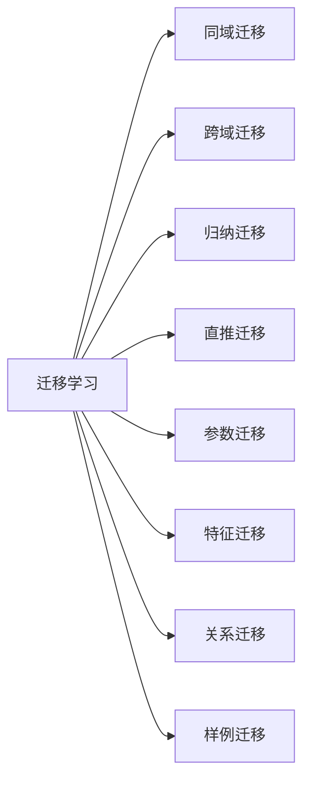

禅与计算机程序设计艺术 / Zen and the Art of Computer Programming

# 迁移学习Transfer Learning原理与代码实例讲解

关键词：迁移学习、深度学习、机器学习、神经网络、领域自适应

## 1. 背景介绍 
### 1.1 问题的由来
在现实世界中,我们经常会遇到这样一个问题:手头上有一个任务需要完成,但是缺乏足够的标注数据来训练一个性能良好的模型。比如要构建一个识别不常见动物的分类器,但是收集和标注大量这些动物的图像非常困难。传统的做法通常是不得不从头开始训练模型,这非常耗时且成本高昂。那有没有一种方法,可以利用我们在其他相关领域(如识别常见动物)已经掌握的知识,来帮助学习新任务呢?迁移学习正是用来解决这一类问题的机器学习方法。

### 1.2 研究现状
迁移学习作为机器学习中的一个重要分支,近年来受到了学术界和工业界的广泛关注。一方面,深度学习的快速发展为迁移学习提供了更加有效的技术手段;另一方面,海量数据和计算能力的积累,也为迁移学习的研究和应用提供了更广阔的空间。目前,迁移学习已经在计算机视觉、自然语言处理、语音识别、无线通信、推荐系统等诸多领域取得了显著成果。一些代表性的研究如下:

- 计算机视觉:利用ImageNet预训练的网络进行迁移学习是视觉领域的常见做法[1]。如采用ResNet在ImageNet上的预训练权重,通过微调来训练特定领域的分类或检测模型,可以大幅提升模型性能和收敛速度。
- 自然语言处理:基于Transformer的预训练语言模型如BERT[2]、GPT系列[3]掀起了NLP领域的革命。通过在大规模无标注文本上进行自监督预训练,再在下游任务上微调,可以显著提升文本分类、阅读理解、命名实体识别等任务的效果。  
- 语音识别:利用源语言的丰富标注数据训练声学模型,再适配到目标语言,可以减少目标语言的标注需求[4]。
- 推荐系统:在用户和物品特征相似的不同领域之间,可以进行用户偏好和物品属性的迁移,缓解冷启动问题[5]。

总的来说,迁移学习已经成为机器学习领域的一个新兴研究热点,在学术界和工业界都受到高度重视,是实现人工智能规模化应用的重要途径。

### 1.3 研究意义
迁移学习之所以受到如此多的关注,主要基于以下几点考虑:

1. 减少标注成本:对很多任务而言,从头收集和标注大规模训练数据非常困难,成本高昂。迁移学习可以最大限度利用已有的标注数据,大幅减轻对新数据的标注需求。

2. 加速模型开发:从零开始训练复杂模型通常需要漫长的训练时间。采用预训练模型进行迁移学习,可以显著加快模型收敛,缩短开发周期。

3. 提升模型性能:在数据不足的情况下,从头训练的模型很难学到鲁棒和泛化的特征。通过在大规模数据上预训练再迁移,模型可以习得更加通用的特征表示,从而提升性能。

4. 扩展应用范围:很多领域缺乏规模化的标注数据,难以直接应用深度学习技术。迁移学习为这些领域应用AI开辟了一条可行之路。

5. 探索人工智能的可迁移性:人类有强大的学习迁移能力,如何赋予机器同样的能力,是人工智能的一个核心问题。迁移学习对于理解智能的本质、构建通用人工智能系统有重要意义。

因此,深入研究迁移学习的理论和方法,对于推动人工智能技术的发展和应用具有重要的科学意义和实践价值。

### 1.4 本文结构
本文将全面介绍迁移学习的原理和方法,内容安排如下:

第2部分介绍迁移学习的核心概念,阐述不同概念之间的联系。
第3部分讲解迁移学习的主要算法,包括算法原理、优缺点和应用场景。
第4部分进一步用数学语言描述迁移学习的理论框架,并举例说明。
第5部分通过代码实例演示如何使用深度学习框架实现迁移学习。 
第6部分总结迁移学习的实际应用场景及案例。
第7部分推荐迁移学习的学习资源、开发工具和相关文献。
第8部分对全文进行总结,展望迁移学习的未来发展方向和挑战。
第9部分列举了一些常见问题,并给出了参考答案。

## 2. 核心概念与联系

迁移学习的核心思想是利用已有的知识来学习新的知识,从而减少对新数据的依赖。这里需要明确几个关键概念:

- 域(Domain):由特征空间X和边缘概率分布P(X)定义,其中X={x1,…,xn} ∈ X。如在图像分类中,X为所有可能的图像像素值构成的空间。
- 任务(Task):由标签空间Y和条件概率分布P(Y|X)定义。如对给定图像进行分类,Y为所有可能的图像类别标签。  
- 源域(Source Domain):已有标注数据的域,记为Ds。
- 目标域(Target Domain):需要进行学习的新域,记为Dt。
- 源任务(Source Task):在源域上进行学习的任务,记为Ts。
- 目标任务(Target Task):在目标域上进行学习的新任务,记为Tt。

迁移学习的目标是利用源域Ds和源任务Ts的知识,来优化目标域Dt上目标任务Tt的学习效果。根据Ds、Dt、Ts、Tt之间的差异和关联,迁移学习可以分为以下几种情况:

1. 同域迁移:Ds=Dt,即源域和目标域服从相同的数据分布。此时主要关注不同任务之间的迁移。
2. 跨域迁移:Ds≠Dt,即源域和目标域的数据分布不同。需要缩小域间分布差异,寻找域不变的特征表示。
3. 归纳迁移:Ts≠Tt,即源任务和目标任务不同,但相关。如在图像分类任务上预训练,迁移到目标检测任务。
4. 直推迁移:Ts=Tt,即源任务和目标任务相同。典型的如跨语言的文本分类。

从知识迁移的粒度来看,又可分为:

1. 参数迁移:将源任务模型的部分或全部参数复制到目标任务模型,再进行微调。
2. 特征迁移:学习一个跨域的特征变换,将不同域的数据映射到共同的特征空间。
3. 关系迁移:挖掘数据中共享的关系知识,如不变量、规则等,指导目标任务学习。
4. 样例迁移:从源域选择部分样本用于辅助目标域的学习。

下图总结了几种主要的迁移学习范式:

可见,迁移学习涉及诸多维度和类别,不同的任务可以采用不同的迁移策略。需要根据源域和目标域的特点,权衡各种方法的优劣,选择最佳的迁移方案。

## 3. 核心算法原理 & 具体操作步骤

### 3.1 算法原理概述

迁移学习的核心是找到源域和目标域之间的相似性,并加以利用。这种相似性可能存在于特征、样本、参数、关系等不同层面。因此,迁移学习算法的设计思路,大致可分为数据层面、特征层面、模型层面三个方面。

在数据层面,主要思路是对源域和目标域的数据进行重要性加权,突出两个域的共性,削弱领域特性。权重的计算可基于样本间的相似度,也可基于样本对模型损失函数的贡献。典型方法有TrAdaBoost[6]和KLIEP[7]等。

在特征层面,核心是学习一个跨域的特征变换,将原始特征映射到一个域不变的特征空间,从而消除域间分布差异。以深度网络为例,可以通过对抗训练[8]、最大平均差异[9]、相关对齐[10]等手段,来学习域不变特征。还可以显式地最小化特征空间的统计距离,如MMD[11]、CORAL[12]等。

在模型层面,主要有两类做法:参数迁移和子空间学习。参数迁移是利用源域模型的知识来初始化目标模型,这可以显著加速收敛和提升效果。子空间学习则将源域和目标域的参数映射到共享的低维子空间,通过子空间的一致性来实现迁移[13]。多任务学习[14]也是一种常见的参数迁移形式。

除了上述三个层面,还有一类基于meta-learning的迁移方法,如MAML[15]。其思想是学习一个对不同任务都有良好初始化效果的meta参数,从而可以在新任务上快速适应。

### 3.2 算法步骤详解

下面以深度网络中的参数迁移为例,详细说明迁移学习算法的具体步骤。以ResNet在ImageNet上的分类模型为源任务,目标任务是细粒度图像识别(如鸟类识别)。

步骤1:源模型预训练。在ImageNet数据集上训练ResNet分类模型,学习到鲁棒的通用图像特征。

步骤2:目标模型构建。移除源模型的输出层,替换为与目标任务类别数匹配的全连接层。

步骤3:模型参数初始化。将源模型的卷积层参数复制到目标模型,作为初始化参数。输出层则随机初始化。

步骤4:模型微调。在目标域的标注数据上,通过反向传播来微调整个网络的权重。通常会使用较小的学习率,以免破坏初始参数。

步骤5:模型评估。在目标域的测试集上评估模型性能,不断调整超参数,直至达到最优效果。

可以看到,参数迁移避免了从零开始训练模型,利用源模型的知识可以大大减少训练时间,提升模型质量。整个过程可以总结为:

### 3.3 算法优缺点

基于参数迁移的深度迁移学习具有以下优点:

1. 简单高效:只需复制源模型参数,无需对网络结构做大的改动,实现简单。
2. 通用性强:源模型可以是不同结构、在不同数据集上训练的模型,具有很强的通用性。  
3. 效果显著:源模型掌握了大量先验知识,可以显著提升目标任务的性能,尤其在小样本场景下优势明显。

但参数迁移也存在一定局限:

1. 依赖源任务:如果源任务与目标任务差异过大,迁移效果会大打折扣。这需要谨慎选择源模型。
2. 负迁移风险:如果源域数据存在偏差,或者与目标任务不相关,反而会引入负面影响,导致负迁移。
3. 黑盒模型:迁移学习常常只关注模型效果的提升,但对模型内部知识的理解有限。从而影响可解释性。

因此在实践中,需要根据具体任务的特点,权衡迁移学习的利弊,选择合适的方法。

### 3.4 算法应用领域

迁移学习在诸多领域都有成功应用,下面列举一些典型场景:

- 计算机视觉:利用