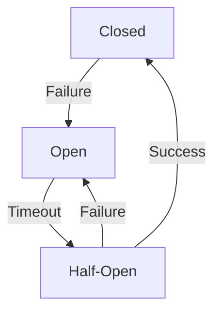

## 1.背景介绍

在当今的互联网时代，分布式系统已经成为了支撑大规模应用的基础设施。然而，随着系统规模的扩大和复杂性的增加，服务的稳定性和可用性成为了我们面临的重要挑战。为了解决这个问题，服务熔断机制应运而生。

服务熔断机制是一种应对系统故障的保护措施，它的主要目标是防止系统在出现故障时过度消耗资源，从而导致整个系统的崩溃。这种机制的灵感来源于电路保护中的熔断器，当电流过大时，熔断器会自动断开，防止电路过载。

## 2.核心概念与联系

服务熔断机制主要涉及到以下几个核心概念：

- **服务熔断**：当某个服务出现故障，无法正常提供服务时，系统会自动将该服务标记为不可用，后续的请求将不再转发到该服务，直到该服务恢复正常。

- **服务降级**：当某个服务出现故障，系统可以选择提供一种降级的服务，即提供部分功能，而不是完全无法使用。

- **服务恢复**：当故障的服务恢复正常后，系统会自动将该服务标记为可用，后续的请求可以再次转发到该服务。

这三个概念之间的关系可以用一个状态机来表示，如下图所示：



## 3.核心算法原理和具体操作步骤以及数学模型公式详细讲解

服务熔断机制的核心算法主要包括以下几个步骤：

1. **请求转发**：当接收到一个请求时，系统首先检查目标服务的状态，如果是关闭状态，则直接转发请求；如果是开启状态，则直接返回错误；如果是半开状态，则尝试转发请求。

2. **故障检测**：系统会定期检查每个服务的健康状态，如果发现某个服务的错误率超过了预设的阈值，就将该服务的状态设置为开启。

3. **服务恢复**：当一个服务的状态为开启时，系统会定期尝试向该服务发送请求，如果请求成功，则将该服务的状态设置为关闭；如果请求失败，则继续保持开启状态。

这个过程可以用以下的数学模型来描述：

假设 $S$ 是服务的状态，$R$ 是请求的结果，$T$ 是阈值，$F$ 是错误率，那么我们可以得到以下的状态转移方程：

$$
S_{t+1} = \begin{cases}
\text{Closed}, & \text{if } S_t = \text{Open} \text{ and } R_t = \text{Success} \\
\text{Open}, & \text{if } S_t = \text{Closed} \text{ and } F_t > T \\
\text{Half-Open}, & \text{if } S_t = \text{Open} \text{ and } R_t = \text{Failure} \\
S_t, & \text{otherwise}
\end{cases}
$$

## 4.具体最佳实践：代码实例和详细解释说明

在实际的系统设计中，我们可以使用开源的熔断器库，如 Hystrix，来实现服务熔断机制。以下是一个简单的示例：

```java
public class Service {
    private final HystrixCommand<String> command;

    public Service() {
        this.command = new HystrixCommand<String>(HystrixCommandGroupKey.Factory.asKey("ExampleGroup")) {
            @Override
            protected String run() {
                return callService();
            }

            @Override
            protected String getFallback() {
                return "Fallback";
            }
        };
    }

    public String call() {
        return command.execute();
    }

    private String callService() {
        // Call the actual service here
    }
}
```

在这个示例中，我们首先创建了一个 `HystrixCommand` 对象，然后在 `run` 方法中调用实际的服务，在 `getFallback` 方法中提供了降级的服务。最后，我们在 `call` 方法中执行这个命令。

## 5.实际应用场景

服务熔断机制广泛应用于各种分布式系统中，例如微服务架构、云计算平台等。它可以有效地防止系统在出现故障时过度消耗资源，提高系统的稳定性和可用性。

## 6.工具和资源推荐

- **Hystrix**：Netflix 开源的一个熔断器库，提供了丰富的配置选项和监控功能。

- **Resilience4j**：一个轻量级的熔断器库，提供了简洁的 API 和灵活的配置。

- **Spring Cloud Circuit Breaker**：Spring Cloud 提供的一个熔断器抽象，可以方便地集成各种熔断器库。

## 7.总结：未来发展趋势与挑战

随着系统规模的扩大和复杂性的增加，服务熔断机制的重要性将越来越明显。然而，如何设计一个既能有效防止系统过载，又能快速恢复服务的熔断器，仍然是一个挑战。此外，如何将熔断器与其他的系统组件（如负载均衡器、服务发现等）有效地集成，也是未来的一个研究方向。

## 8.附录：常见问题与解答

**Q: 服务熔断和服务降级有什么区别？**

A: 服务熔断是指当某个服务出现故障，系统会自动将该服务标记为不可用，后续的请求将不再转发到该服务。服务降级是指当某个服务出现故障，系统可以选择提供一种降级的服务，即提供部分功能，而不是完全无法使用。

**Q: 如何设置熔断器的阈值？**

A: 熔断器的阈值通常需要根据实际的业务需求和系统负载来设置。一般来说，如果系统的负载较高，或者服务的重要性较低，可以设置一个较高的阈值；反之，如果系统的负载较低，或者服务的重要性较高，可以设置一个较低的阈值。

**Q: 熔断器的状态如何转换？**

A: 熔断器的状态主要有三种：关闭、开启和半开。当服务正常时，熔断器处于关闭状态；当服务出现故障，且错误率超过阈值时，熔断器会转换到开启状态；当服务恢复正常后，熔断器会先转换到半开状态，然后再转换到关闭状态。