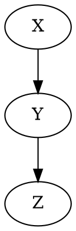

好的,我明白了您的要求。以下是技术博客文章"AGI的开发工具与资源"的全部内容:

# "AGI的开发工具与资源"

## 1.背景介绍

### 1.1 人工通用智能(AGI)的定义
人工通用智能(Artificial General Intelligence,AGI)是指能够像人类一样,在各种不同的认知任务上表现出一般智能的人工智能系统。与现有的专门化人工智能系统不同,AGI旨在创造一种通用的理性智能实体,可以胜任广泛的认知任务,如学习、规划、推理、解决问题、理解自然语言等。

### 1.2 AGI的重要性
AGI被认为是人工智能领域的终极目标,其重要性不言而喻。一旦实现,它将彻底改变人类社会的方方面面,给我们带来巨大的机遇和挑战。从医疗、教育、交通到艺术创作等各个领域都将受到深刻影响。

### 1.3 AGI发展现状
虽然距离实现AGI还有很长的路要走,但近年来AGI研究取得了长足进展。像OpenAI的GPT、DeepMind的AlphaGo等重大突破,都为AGI研究铺平了道路。

## 2.核心概念与联系

### 2.1 符号主义与连接主义
符号主义(Symbolism)和连接主义(Connectionism)是AGI研究中的两大流派。前者将智能视为基于明确规则和知识表示的推理过程,后者则将其视为人工神经网络等模拟生物神经系统的连接方式。两种方法各有利弊,现代AGI系统往往结合两者的优点。

### 2.2 机器学习与深度学习
机器学习是实现AGI所需要的关键技术。无监督、半监督和强化学习等各种机器学习方法为AGI奠定基础。其中,深度学习尤其在语音识别、自然语言处理、计算机视觉等领域取得巨大成功,成为AGI不可或缺的部分。

### 2.3 知识表示与推理
知识表示和推理是AGI的核心,现有的知识图谱、本体论等方法有助于构建 AGI所需的庞大知识库。统一表示和高效推理则是挑战所在。

## 3.核心算法原理
AGI的研究离不开大量复杂的数学模型和算法。这里我们梳理几个核心算法原理。

### 3.1 深度神经网络
深度神经网络是当前机器学习最成功的模型,也是AGI系统的基石。它们通过有效建模非线性函数,学习多层次抽象特征表达。一个典型的前馈神经网络可以表示为:

$$
\begin{align}
\vec{h}^{(i)} &= f\left(\vec{W}^{(i)}\vec{h}^{(i-1)} + \vec{b}^{(i)}\right) \\
\vec{y} &= g\left(\vec{W}^{(n)}\vec{h}^{(n-1)} + \vec{b}^{(n)}\right)
\end{align}
$$

其中 $\vec{h}^{(i)}$ 是第i层隐含层的激活值向量。$\vec{W}^{(i)}$ 和 $\vec{b}^{(i)}$ 分别是权重矩阵和偏置向量。$f$ 是非线性激活函数。

训练深度网络的关键是通过方法如反向传播等优化目标函数:

$$J(\theta) = \frac{1}{m}\sum_{j=1}^mL\left(y^{(j)}, \hat{y}^{(j)}\right)$$

其中 $L$ 是损失函数，$y$ 和 $\hat{y}$ 分别是真实标签和预测值。

高级架构如卷积网络、递归网络、transformer等都可以看做是在特定任务中对基本网络结构的改进。

### 3.2 强化学习
强化学习通过试错和奖惩机制优化代理智能体与环境的交互策略，其核心是解决贝尔曼方程:

$$v_\pi(s) = \mathbb{E}_\pi[G_t|S_t=s]$$

其中 $v_\pi(s)$ 是在策略 $\pi$ 下状态 $s$ 的价值函数,等于从该状态出发后的期望回报。通过各种算法如Q-learning、策略梯度等近似求解该方程。

### 3.3 贝叶斯网络与概率图模型
贝叶斯网络和概率图模型通过利用概率论和图论表达变量之间的复杂依赖关系,被广泛应用于推理和决策系统。一个简单的贝叶斯网络例子:



其中 $X$ 是原因节点, $Z$ 是观测结果,通过网络可以计算 $P(X|Z)$:

$$P(X|Z) = \frac{P(Z|X)P(X)}{P(Z)}$$

结合逻辑规则等,贝叶斯网络可以构建出强大的知识库和推理系统。

### 3.4 组合优化
多智能体协作、规划与决策是AGI系统的重要组成部分,其中组合优化问题普遍存在。例如在排列优化问题中,求解旅行商问题的整数规划模型:

$$\begin{aligned}
& \text{minimize} & & \sum_{i,j} c_{ij}x_{ij} \\
& \text{subject to} & & \sum_j x_{ij} = 1 &&\forall i \\
&                   & & \sum_i x_{ij} = 1 &&\forall j \\
&                   & & \sum_{i,j \in S} x_{ij} \le |S| - 1 &&\forall S \subset N, 2 \le |S| \le |N| - 2
\end{aligned}$$

其中 $x_{ij}$ 是决策变量,表示是否将城市 $i$ 和 $j$ 相连。最后一组约束用于消除子环。

这类组合优化问题通常是 NP 难的,需要启发式算法或cirka平行算法等来高效求解。

### 3.5 蒙特卡罗树搜索
蒙特卡罗树搜索是一种有效的在线规划算法,被广泛应用于游戏、机器人等领域。它通过反复采样构建搜索树,用概率近似值函数:

$$v(s) \approx \frac{1}{N(s)}\sum_{i=1}^{N(s)}y_i$$

其中 $y_i$ 是第 $i$ 次模拟从状态 $s$ 后续得到的回报。基于 $v(s)$ 来选择最佳行动。

## 4.具体最佳实践

### 4.1 谷歌PipelineAI系统
谷歌的PipelineAI系统是一个综合式AGI系统,集合了多种技术如自然语言处理、计算机视觉、推理、规划等。这里以其中的推理规划模块为例:

```python
from pipeline.reasoning import ReasoningModule

def make_sandwich(ingredients):
    rm = ReasoningModule()
    
    # 知识加载
    rm.load_ontology('cooking.owl')
    
    # 规划请求
    goal = rm.create_goal('exists (?s) (isA ?s Sandwich)')
    plan = rm.plan(initial_state, goal, ingredients)
    
    # 执行规划并反馈
    for action in plan.actions:
        execute(action)
        rm.update(action.observe())
        
    return plan.obj # 制作好的三明治
```

首先加载本体论知识库cooking.owl。然后构造目标"制作一个三明治"并使用InGeNo求解器进行规划。最后执行规划中的动作并反馈观测结果。

### 4.2 OpenAI的InstructGPT
InstructGPT是OpenAI针对AGI系统开发的一种大型语言模型,能够通过自然语言指令学习执行复杂任务。以下是一个简单的Python示例:

```python
from instruct import InstructFollower

follower = InstructFollower()

instruction = "根据给定的商品价目表,计算出水果和蔬菜的总价格。每一行是一项商品,格式为 '名称,数量,单价'。货币单位为美元。"
price_data = """
apple,3,0.5
banana,2,0.25
lettuce,1,1.75
carrot,4,0.6
"""

result = follower(instruction, price_data)
print(result)
```

InstructGPT能够理解自然语言,逐步拆解和执行多步骤的指令。上述指令中它会识别出计算总价的任务,从数据中解析出商品明细并遍历计算和。

## 5.实际应用场景
AGI系统可以应用在包括但不限于以下许多场景:

- 智能助理:像Siri和Alexa这样的虚拟助理,已广泛用于日常生活
- 决策支持:利用知识推理和强化学习等技术,为企业决策提供支持
- 自动化系统:自动驾驶、智能制造、机器人等自动化系统
- 游戏AI:从国际象棋、围棋到电子游戏中充当对手
- 医疗诊断:协助医生诊断疾病并推荐治疗方案
- 教育辅助:根据学生个人情况进行个性化教学
- 艺术创作:使用AGI进行艺术创作和设计
- 科学发现:AGI可用于数学、物理等领域的科学探索

## 6.工具和资源推荐  

实现AGI需要许多工具和资源的支持,这里推荐一些优秀的开源项目和有价值的资源:

- OpenAI Gym: 强化学习研究平台,提供多种环境
- PyTorch/TensorFlow: 主流深度学习框架
- OpenCog/OpenNARS: 以符号主义为核心的AGI项目
- DeepMind Lab: DeepMind开源的3D游戏环境
- ConceptNet: 免费的知识图谱数据库 
- PatternSimilarityResources: 常用文本数据集
- ScienceQA: 科学问答数据集
- LectureBank: MIT在线免费公开课资源

## 7.总结:未来发展趋势与挑战

虽然距离真正实现AGI还有相当长的路要走,但未来发展趋势是可以把握的:

- 硬件升级:专用硬件、光子计算等新型计算设备
- 算法创新:生成式对抗网络、强化框架等全新算法
- 数据扩充:从多模态和现实世界中获取更多训练数据
- 知识库完善:自动构建更加庞大的知识图谱
- 跨领域融合:将自然语言、视觉、规划等多种技术结合

可以预见,AGI系统将不断向着模仿人类学习和思考的方式发展。但同时也面临诸多挑战:

- 可解释性:提高AGI系统的透明度和可解释性
- 安全可控:确保AGI不会对人类社会构成潜在威胁 
- 道德伦理:赋予AGI良好的道德观和价值观
- 社会影响:正视AGI可能带来的社会变革和就业问题
- ... 

## 8.附录:常见问题与解答

### 8.1 AGI和窄义AI(ANI)的区别是什么?
窄义AI(Artificial Narrow Intelligence)指专注于某一特定领域并擅长于其中某一任务的人工智能系统。而AGI是一种通用人工智能,具有类似于人类通用认知能力,可以解决广泛的跨领域问题。

### 8.2 AGI研究面临哪些主要挑战?
主要挑战包括:
- 缺乏统一的理论框架
- 多模态感知和交互能力有限  
- 情感社交能力较弱
- 缺乏类人学习和概念建模机制
- 常识推理和因果推理能力薄弱

### 8.3 人工智能会取代人类劳动力吗?
AGI的出现可能会使部分劳动力被淘汰,但同时也会创造出新的就业机会。我们需要提前应对这一变革,培养人力资源的新型技能。

### 8.4 AGI系统会不会走向"恶"的方向?
这取决于我们如何设计和引导AGI系统。赋予其正确的道德价值观和目标函数,并建立监管机制,就能避免走向恶的发展道路。