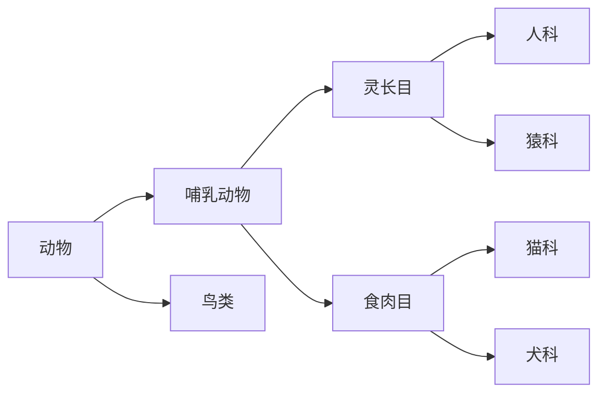

# 通用人工智能的基本原理与框架

## 1. 背景介绍

### 1.1 人工智能的发展历程
人工智能(Artificial Intelligence, AI)是当代最具挑战性和前景广阔的研究领域之一。自20世纪50年代问世以来,人工智能经历了起伏跌宕的发展历程,从最初的符号主义到知识工程,再到机器学习、深度学习的兴起,涌现出了大量令人瞩目的理论与应用成果。

### 1.2 通用人工智能的愿景
然而,当前的人工智能系统大多专注于解决特定领域的问题,缺乏通用性和灵活性。通用人工智能(Artificial General Intelligence, AGI)旨在创建一种与人类智能相当,甚至超越人类智能的通用人工智能系统,这是人工智能领域最终极的目标。

### 1.3 AGI的重要性
AGI系统不仅可以学习和推理,还能自主规划、解决问题、创造性思考。它们将极大地提高人类的生产效率,加速科技进步,并在医疗、教育、环保等诸多领域发挥巨大作用。因此,AGI被视为人类智能的终极追求,其重要性不言而喻。

## 2. 核心概念与联系

### 2.1 智能的定义
在探讨AGI之前,我们首先需要明确智能的定义。智能可被视为一种可以获取和处理信息,并以最优方式对环境作出响应的能力。智能生物能够学习、推理、规划和解决问题。

### 2.2 人工智能与AGI
人工智能是一种模拟或扩展人类智能的技术,旨在让机器表现出某种智能行为。目前,人工智能主要关注狭义人工智能(Narrow AI),即为特定任务设计的专家系统。而AGI则旨在创造一种通用的人工智能,能够胜任任何智力活动。

### 2.3 AGI的关键特征
一个真正的AGI系统应当具备以下关键特征:

- 通用性:能够学习和处理各种任务,而不局限于单一领域。
- 自主性:能够自主规划、作出决策并付诸行动。
- 学习能力:具备持续学习和累积知识的能力。
- 推理能力:能够进行复杂推理、抽象概括和创造性思维。
- 自我意识:拥有类似于人类的自我认知和情感体验。

## 3. 核心算法原理

AGI的实现离不开诸多核心算法的支撑,这些算法联合构成了AGI系统的"大脑"。我们将逐一探讨其中的关键算法原理。

### 3.1 机器学习算法

机器学习是实现AGI的基础,赋予系统学习和获取知识的能力。常见的机器学习算法包括:

#### 3.1.1 监督学习

监督学习算法通过学习大量标注好的训练数据,获取映射规则,从而对新数据进行预测或分类。

常见监督学习算法:
- 线性回归
- 逻辑回归 
- 支持向量机
- 决策树和随机森林
- 神经网络

##### 线性回归

线性回归是一种常用的监督学习算法,用于预测数值型目标变量。其基本思想是通过最小化预测值与实际值之间的均方差,来学习预测因变量Y与自变量X之间的线性关系,从而对新数据进行预测。

线性回归的数学模型可表示为:

$$y = w_0 + w_1x_1 + w_2x_2 + ... + w_nx_n$$

其中$y$为因变量的预测值,$w_0$为常数项, $w_1, w_2, ..., w_n$为模型参数, $x_1, x_2, ..., x_n$为自变量。

通过最小化均方误差损失函数:

$$J(w) = \frac{1}{2m}\sum_{i=1}^m(y_i - \hat{y}_i)^2$$

我们可以得到最优模型参数$w$, 从而使预测值$\hat{y}$尽可能接近真实值$y$。

#### 3.1.2 无监督学习

无监督学习算法基于未标注的原始数据,自动发现其中的模式和结构。主要算法包括:

- 聚类算法(K-Means,层次聚类,DBSCAN等)
- 降维算法(PCA,t-SNE等)
- 关联规则挖掘
- 主题模型(LDA等)

#### 3.1.3 强化学习

强化学习算法模拟生物通过反复试错并获得奖惩来学习的过程。算法通过与环境不断互动,调整自身策略,以获取最大累计奖励。主要算法有:

- Q-Learning
- Sarsa
- 策略梯度算法(REINFORCE等)
- 深度Q网络等

示例:AlphaGo通过强化学习实现了超越人类的围棋水平。

### 3.2 知识表示与推理

AGI系统需要对现实世界的知识有丰富的表示和灵活的推理能力。常见的知识表示形式包括:

- 逻辑规则
- 语义网络
- 框架表示法
- 概念图
- 案例库

#### 3.2.1 逻辑推理

逻辑推理是AGI系统进行有效推理的基础。常用的逻辑推理方法包括:

- 命题逻辑(如命题演算)
- 一阶逻辑(如谓词演算)
- 非单调逻辑(如缺省推理、模糊逻辑等)
- 概率逻辑(如马尔可夫逻辑网络、贝叶斯网络等)

以命题逻辑为例:

$$((P \to Q) \wedge P) \to Q$$

上式表示,如果"P蕴含Q"且P为真,则必然可以推导出Q为真。

推理系统通过建立逻辑基本公理和推理规则,可对知识库中的事实进行前向推理或逆向推理,获得新的推论。

#### 3.2.2 本体论与语义网络

本体论是AGI系统对领域概念及其相互关系的形式化表示。语义网络是一种建模本体论的常用工具,通过节点和边连接概念实体及其关系。

例如,以下语义网络表示了部分动物分类知识:



基于语义网络,AGI可以建立复杂的知识推理,并整合背景知识得出新见解。

### 3.3 规划算法

规划是AGI系统根据当前状态、目标和约束条件,生成一系列行动来达成目标的过程。主要规划算法包括:

#### 3.3.1 经典规划算法

- 状态空间搜索
  - 图搜索算法(BFS,DFS等)
  - 启发式搜索算法(A*,IDA*等)
- 部分观测马尔可夫决策过程(POMDP)
- 等

例如,基于A*算法的路径规划:

通过构造如下评估函数:

$$f(n) = g(n) + h(n)$$

其中$g(n)$为从初始节点到节点$n$的实际代价, $h(n)$为启发式函数(如曼哈顿距离)估计的从节点$n$到目标节点的最小代价。通过遍历最小$f(n)$值的扩展路径,可获得最优路径解。

#### 3.3.2 自动规划

自动规划是一种更高层次的规划范式,AGI系统可根据领域知识和正式化问题描述自动生成可行的规划方案。主要方法包括:

- 时间线规划
- 等式规划
- 层次任务网规划
- 混合规划
- 程序综合

### 3.4 认知架构

认知架构是将各项核心能力有机整合,模拟人类认知过程的框架系统。典型的AGI认知架构包括:

- Soar 
- ACT-R
- OpenCog
- LIDA
- NARS
- 等

这些架构通常包含感知、学习、记忆、推理、规划、行为控制等多个功能模块,并对整体系统的运作过程进行仿真和控制。

## 4. 具体最佳实践

以OpenCog为例,该架构围绕原子思维模型(Atomistic Philosophical Model)构建,旨在模拟人类认知和情感过程。我们看一个简单的推理示例:

```python
# 引入OpenCog启动器
from opencog.atomspace import AtomSpace, TruthValue, types

# 创建原子操作空间
atomspace = AtomSpace()

# 定义概念节点
dog = atomspace.add_node(types.ConceptNode, "Dog")
animal = atomspace.add_node(types.ConceptNode, "Animal")
bark = atomspace.add_node(types.PredicateNode, "can_bark")  

# 添加继承关系
inheritance_link = atomspace.add_link(types.InheritanceLink, [dog, animal])
# 添加评分
inheritance_link.tv = TruthValue(0.9, 0.8)

# 添加描述语句
evaluation_link = atomspace.add_link(
    types.EvaluationLink,
    [bark, dog],
    TruthValue(0.7, 1.0)
)

# 定义基本推理规则  
# 如果 X 是 Y 的实例, 而 Y 具有 Z 属性, 则可推断 X 也具有 Z 属性
atomspace.add_node(
    types.BindLink, ... 
)

# 基于已知知识和推理规则进行推理得到结果
results = atomspace.get_atoms_by_type(types.InheritanceLink)
```

上例展示了如何在OpenCog中表示基本概念和知识,并应用推理规则进行形式化推导。类似的,我们可以构建更复杂的认知模型和决策系统。

## 5. 实际应用场景

作为通用智能,AGI理论上可以应用于任何需要复杂认知和决策支持的领域,如:

### 5.1 智能助手

无论是私人助理、专业顾问,还是提供教育、医疗等服务的人工智能助手,都可受益于AGI的通用认知推理能力。

### 5.2 智能机器人  

赋予通用智能的机器人可用于广泛领域,如家庭服务、厂房自动化、太空探索等。通过组合感知、规划和操控,可实现复杂任务的自主执行。

### 5.3 智能决策系统

在金融、工业、物流等领域,AGI系统可整合各种知识和数据,为复杂问题提供高质量决策支持。

### 5.4 科学发现系统

AGI有望在物理、化学、生物等领域,通过扩展人类认知能力,推动新理论和新发现的产生。

### 5.5 创作智能

艺术创作、文字写作等创意活动,都可能借助AGI强大的综合推理和想象力获得质的飞跃。

## 6. 工具和资源推荐

开发AGI系统需要大量工具和资源支持,包括但不限于:

### 6.1 编程语言和框架

Python、C++、Java等常见编程语言,以及Pytorch、TensorFlow、Theano等深度学习框架。此外,专门的规划建模、知识表示和推理框架亦不可或缺。  

### 6.2 数据集

高质量、标注良好的数据集可用于训练机器学习模型,包括图像、文本、语音等不同类型数据。通用数据集如ImageNet、WikiCorpus等,领域数据集如生物、医学、金融数据等。知识图谱如WordNet、DBpedia等亦有重要价值。

### 6.3 计算硬件

研发AGI系统需要大量算力,因此GPU、TPU等加速硬件,以及分布式计算集群都是必需的。量子计算等新兴计算模式有望进一步推动AGI进展。

### 6.4 开源项目

坚实的开源社区贡献了众多AGI架构、算法和工具,如OpenCog、DeepMind Lab、Ray、Caffe等,为AGI研究提供了强大支撑。

### 6.5 学习资源

除官方文档外,可从书籍、课程、视频、论坛等渠道获取丰富的人工智能和AGI学习资源,如麻省理工公开课程、Coursera、fast.ai等。

## 7. 总结:未来发展趋势与挑战

尽管AGI理论研究和技术积累已经取得长