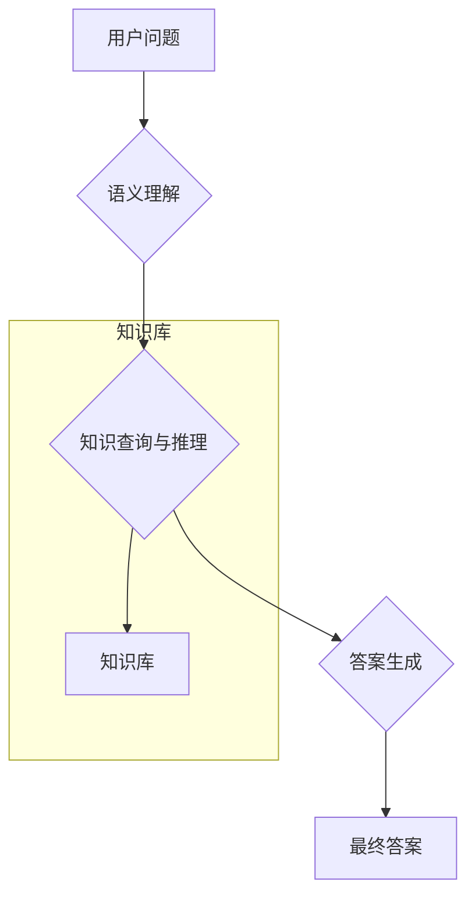

# "AI在政府管理领域的应用"

## 1. 背景介绍

### 1.1 政府管理的挑战

随着社会的快速发展和复杂化,政府管理面临着前所未有的挑战。传统的管理模式难以应对海量数据、复杂决策和多元需求。因此,亟需引入先进的人工智能(AI)技术,提高政府管理的效率和质量。

### 1.2 AI在政府管理中的价值

AI技术在政府管理中具有广阔的应用前景,可以协助以下几个方面:

- 数据分析与决策支持
- 公共服务优化
- 风险预警与应急响应
- 智能监管与反腐倡廉

### 1.3 本文内容概述

本文将从政府管理的实际需求出发,介绍AI在该领域的核心技术、应用实践、未来趋势等,旨在为读者提供全面的理解。

## 2. 核心概念与联系

### 2.1 人工智能(AI)

人工智能是一门以机器模拟人类智能行为为目标的计算机科学理论与技术。主要包括机器学习、自然语言处理、计算机视觉等领域。

### 2.2 机器学习

机器学习是AI的核心,它使计算机系统能够从数据中自动分析获得模式,并用于决策或预测。常见的机器学习算法有:

- 监督学习(如回归、分类等)
- 非监督学习(如聚类分析)
- 强化学习
- 深度学习(多层神经网络)

### 2.3 自然语言处理

自然语言处理(NLP)研究计算机如何理解和生成人类语言数据。在政务场景中,NLP可广泛应用于信息抽取、智能问答、舆情分析等。

### 2.4 计算机视觉

计算机视觉是AI系统从图像或视频中获取信息的过程。对于政务管理而言,它可用于场景识别、行为检测、生物特征识别等。

## 3. 核心算法原理

政务AI系统通常涉及多种算法模型,下面将介绍其中的关键算法原理。

### 3.1 监督学习

#### 3.1.1 线性回归

线性回归用于预测连续型数值,基于对历史数据的拟合建立回归方程。

假设数据集 $D = \{(x_1,y_1),(x_2,y_2),...,(x_n,y_n)\}$,其中 $x_i$ 为特征向量, $y_i$ 为连续标量目标值。线性回归试图学习一个线性函数 $f(x) = w^Tx + b$,使目标函数 $J(w,b) = \sum\limits_{i=1}^{n}(y_i - f(x_i))^2$ 最小化,其中 $w$ 为权重向量, $b$ 为偏置项。

通过梯度下降法等优化算法可以求解 $w,b$ 的最优解。

#### 3.1.2 逻辑回归

逻辑回归是监督分类的基本算法,常用于二分类问题,也可扩展到多分类。

对于二分类问题,我们令 $P(Y=1|x)$ 为 x 被判为正例的概率,逻辑回归模型为:

$$P(Y=1|x) = \frac{1}{1+e^{-w^Tx-b}}$$

其中 $w$ 为权重向量, $b$ 为偏置项。

在已知数据集 $D=\{(x_1,y_1),(x_2,y_2),...,(x_n,y_n)\}$ 的条件下,通过极大似然估计等方法求解最优的 $w,b$。

对于新样本 $x^*$,通过 $P(Y=1|x^*)$ 的值与设定的阈值比较,即可进行分类预测。

#### 3.1.3 决策树与随机森林

决策树是一种常用的分类与回归模型。它通过对特征进行递归划分,将输入样本划分到不同的叶子节点,并给出相应的分类或回归结果。

构建决策树的核心算法是ID3、C4.5和CART等。这些算法通过信息增益、信息增益比或基尼指数等指标选择最优的划分特征,递归构建决策树。

为了提高泛化性能,通常会基于决策树集成出随机森林等模型,进一步提高预测精度。

#### 3.1.4 支持向量机

支持向量机(SVM)是一种常用的监督学习模型,既可用于分类,也可用于回归问题。

对于线性可分的二分类问题,SVM试图找到一个超平面 $w^Tx+b=0$,使正负实例到该平面的几何距离之和最大化。这相当于求解凸二次规划问题:

$$\min\limits_{w,b}\frac{1}{2}\|w\|^2\\s.t. \ y_i(w^Tx_i+b)\geqslant 1,i=1,2,...,n$$

通过核技巧,SVM还可以学习非线性分类模型。

SVM的回归问题形式类似,只是引入了松弛变量,使大多数样本的残差值可以落在一个边界误差范围内。

### 3.2 非监督学习  

#### 3.2.1 K-Means聚类

K-Means是一种常用的聚类算法,通过迭代优化将样本划分到K个簇中,使簇内样本相似度高、簇间相似度低。算法流程为:

1) 随机初始化K个聚类中心
2) 计算每个样本到各聚类中心的距离,将样本分配到最近的聚类 
3) 重新计算每个簇的均值作为新的聚类中心
4) 重复2)、3)直至收敛或满足停止条件

目标函数为:

$$J(c,\mu) = \sum\limits_{i=1}^{K}\sum\limits_{x\in C_i}\|x-\mu_i\|^2$$

其中 $C_i$ 为第i个簇, $\mu_i$ 为其均值向量。

#### 3.2.2 关联规则挖掘

关联规则挖掘是发现数据集中有趣关联或相关模式的技术。规则形如 $A\rightarrow B$,含义为"交易同时包含集合A和B的概率远大于随机情况"。关键指标包括:

- 支持度(Support): $P(A\cup B)$
- 置信度(Confidence): $P(B|A) = \dfrac{P(A\cup B)}{P(A)}$
- 提升度(Lift): $Lift(A\rightarrow B) = \dfrac{P(A\cup B)}{P(A)P(B)}$

常用的Apriori算法是通过迭代K项集发现频繁项集,再从中产生高置信度规则。

### 3.3 深度学习

#### 3.3.1 前馈神经网络

前馈神经网络(Feedforward Neural Networks)是一种将输入经过多层神经元传递变换而获得输出的模型。每一层的神经元会将上一层输出的加权和经过非线性激活函数后作为输入。

具体来说,给定输入 $x$,第 $l$ 层的输出为:

$$a^{(l)} = g(W^{(l)}a^{(l-1)}+b^{(l)})$$

其中 $W^{(l)}$ 为权重矩阵, $b^{(l)}$ 为偏置向量, $g$ 为非线性激活函数(如Sigmoid、ReLU等)。

通过反向传播算法和优化方法(如梯度下降),可以学习网络的参数 $W,b$,使损失函数最小化。

#### 3.3.2 卷积神经网络

卷积神经网络(CNN)是一种在计算机视觉领域非常成功的深度学习模型。CNN主要包含以下几个基本层:

- 卷积层(Conv Layer): 通过滑动核对输入进行卷积操作提取局部特征
- 汇聚层(Pooling Layer): 对特征图下采样提取主要特征,常用最大汇聚
- 全连接层(Fully-Connected Layer): 将局部特征组合起来进行最终分类或回归

可以通过反向传播算法和梯度下降等优化方法学习卷积核和权重参数。

#### 3.3.3 循环神经网络 

循环神经网络(RNN)是一种可以处理序列数据(如文本、语音)的模型。与前馈网络不同的是,RNN会对当前输入与前一状态输出进行综合,并更新其内部状态。

在时间步 $t$ 时,RNN的更新过程为:

$$\begin{align*}
h_t &= \phi(W_{hh}h_{t-1} + W_{xh}x_t + b_h)\\
y_t &= \psi(W_{hy}h_t + b_y)
\end{align*}$$

其中 $h_t$ 为隐状态, $\phi$ 和 $\psi$ 为非线性激活函数, 而 $W$ 为各种参数。

长短期记忆网络(LSTM)和门控循环单元(GRU)是RNN的常用改进变体。

#### 3.3.4 注意力机制

注意力机制是近年来在深度学习中被广泛应用的思想,它使模型能够专注于输入数据的不同部分,从而提高性能。

具体来说,对于输入序列 $\mathbf{x} = (x_1,\ldots,x_T)$,我们计算注意力分数:  

$$e_t = f_{att}(h_t, x_t)$$

其中 $f_{att}$ 为某种评分函数,常用如下形式:

$$f_{att}(h_t, x_t) = v^\top \tanh(W_h h_t + W_x x_t)$$

再对注意力分数做softmax归一化:

$$\alpha_t = \dfrac{\exp(e_t)}{\sum_{t'=1}^T\exp(e_{t'})}$$

最后对输入进行加权求和,构建注意力表示 $c$:

$$c = \sum_{t=1}^T \alpha_t h_t$$

通过注意力机制,模型能更好关注有价值的信息,增强了在特定任务上的性能。

### 3.4 知识图谱与图神经网络

在政务管理中,很多场景需要处理结构化的关系型数据。知识图谱及其处理模型图神经网络(GNN)能较好解决此类问题。

知识图谱是由实体(Entity)和关系(Relation)构成的异质信息网络,可形式化地表示现实世界的概念及其关系。

GNN则是运行在图结构数据上的一种深度学习模型。它沿用卷积神经网络的思想,在邻接节点间传播信息,学习节点的表示向量。对于节点 $v$,常用如下层递归关系更新其表征:

$$h_v^{l+1} = \phi\left(h_v^l, \square_{u\in \mathcal{N}(v)}g\left(h_v^l,h_u^l,e_{v,u}\right)\right)$$

其中 $\mathcal{N}(v)$ 为 $v$ 的邻域节点集,$ \phi$ 和 $g$ 为待学习的函数,如神经网络。最终节点表示可用于节点分类、链接预测、知识推理等任务。

## 4. 具体最佳实践  

### 4.1 智能政务服务与办公平台

智能政务服务平台应用自然语言处理、知识图谱等技术,帮助公众更加便捷地获取政务信息和办理业务。

以"xx市智能政务服务平台"为例,包含以下关键功能:  

1) 面向公众的智能问答系统
2) 政务知识图谱构建与管理
3) 基于知识图谱的信息查询  
4) 智能客服机器人
5) 自动化流程审批引擎

#### 4.1.1 智能问答系统  

智能问答系统结合了自然语言处理、深度学习等技术,帮助公众用自然语言提问,并返回准确合理的答案。

系统架构如下:

核心技术包括:

1) 命名实体识别与问句分类(监督学习分类模型)
2) 语义插槽填充(序列标注模型,如BiLSTM-CRF)
3) 知识库构建(知识图谱与关系抽取)
4) 语义匹配与知识推理(语义相似度模型、知识库查询与推理引擎)  
5) 自然语言生成(Seq2Seq等模型)