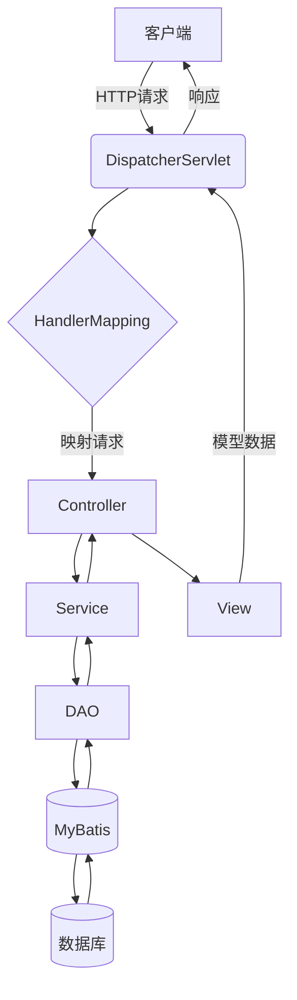

# 基于SSM的林木生长管理系统

## 1. 背景介绍

### 1.1 林木资源的重要性

林木资源对于维系地球生态系统的平衡至关重要。森林不仅是重要的碳汇,也为人类提供了木材、食物和药材等宝贵资源。然而,由于人类活动的影响,全球森林面临着严重的威胁,如砍伐、火灾和气候变化等。因此,有效管理和保护林木资源对于可持续发展至关重要。

### 1.2 传统林木管理的挑战

传统的林木管理方式主要依赖人工记录和现场勘测,这种方式存在诸多挑战:

- 数据采集效率低下,难以覆盖大面积林区
- 数据质量参差不齐,缺乏标准化
- 数据分析能力有限,难以发现深层次规律

### 1.3 数字化林木管理的需求

为了更好地管理林木资源,迫切需要一种数字化的林木生长管理系统,该系统能够:

- 高效采集林木生长数据
- 标准化数据格式,确保数据质量
- 利用先进的数据分析技术,发现林木生长规律
- 为林业决策提供科学依据

## 2. 核心概念与联系

### 2.1 SSM架构

SSM(Spring+SpringMVC+MyBatis)是一种流行的Java EE企业级开发架构,由轻量级开源框架Spring、SpringMVC和MyBatis组成。

- Spring: 提供了面向切面编程(AOP)和控制反转(IOC)等核心功能
- SpringMVC: 基于MVC设计模式的Web层框架
- MyBatis: 一种优秀的持久层框架,支持自定义SQL、存储过程等

### 2.2 林木生长模型

林木生长模型是描述林木生长过程的数学模型,常用模型包括:

- 生长方程: 描述林木年龄、胸高直径、树高等指标的变化规律
- 生物量方程: 估算林木的地上/地下生物量
- 产量模型: 预测林分的材积和产量

### 2.3 数据采集技术

高效准确地采集林木生长数据是系统的基础,主要技术包括:

- 遥感技术: 利用航空、卫星等手段获取林区遥感影像
- 物联网技术: 使用传感器实时监测林木生长状况
- 移动GIS: 借助移动设备在野外高效采集数据

## 3. 核心算法原理和具体操作步骤

### 3.1 林木生长模型拟合

#### 3.1.1 生长方程

常用的生长方程有Logistic方程、Richards方程和Weibull方程等,这些方程能够很好地描述林木生长过程。以Logistic方程为例:

$$
Y=\frac{\alpha}{1+\beta e^{-kT}}
$$

其中:
- $Y$表示林木某一指标(如树高、胸高直径等)
- $T$表示林龄
- $\alpha$、$\beta$、$k$为待估计参数

利用历史观测数据,可以使用非线性最小二乘法等方法估计出模型参数,进而拟合出生长曲线。

#### 3.1.2 生物量方程

生物量方程通常采用如下形式:

$$
W=aD^bH^c
$$

其中:
- $W$表示林木生物量
- $D$表示胸高直径
- $H$表示树高
- $a$、$b$、$c$为待估计参数

同样可以利用实测数据,使用回归分析等方法估计出参数值。

#### 3.1.3 产量模型

产量模型常采用如下形式:

$$
V=f(A, H, N, G)
$$

其中:
- $V$表示林分产量(材积)
- $A$表示林龄
- $H$表示平均树高
- $N$表示每公顷株数
- $G$表示每公顷基径

利用长期定样数据,可以构建出适合本地区的产量模型。

### 3.2 数据处理与分析

#### 3.2.1 数据预处理

- 数据清洗: 剔除异常值、填补缺失值等
- 数据标准化: 将数据转换为统一的量纲和格式
- 数据分割: 将数据分为训练集和测试集

#### 3.2.2 模型训练

- 特征工程: 从原始数据中提取有效特征
- 模型选择: 选择合适的机器学习算法,如随机森林、人工神经网络等
- 模型训练: 使用训练集对模型进行训练
- 模型评估: 在测试集上评估模型性能,必要时进行调参

#### 3.2.3 数据可视化

- 利用可视化技术将分析结果以图表等形式呈现
- 支持多种可视化方式,如折线图、散点图、热力图等
- 可视化不同指标在时间和空间上的变化趋势

## 4. 数学模型和公式详细讲解举例说明

### 4.1 生长方程举例

以Logistic方程为例,我们利用某林分的树高观测数据,使用最小二乘法估计模型参数:

已知观测数据如下:

| 林龄(年) | 平均树高(米) |
|----------|--------------|
| 5        | 2.1          |
| 10       | 5.7          |
| 15       | 10.2         |
| 20       | 13.8         |
| 25       | 16.1         |

构建目标函数:

$$
S=\sum_{i=1}^{n}[y_i-\frac{\alpha}{1+\beta e^{-kx_i}}]^2
$$

其中$n$为观测数据个数,$(x_i,y_i)$为第$i$个观测值。

使用数值优化算法(如高斯-牛顿法、拟牛顿法等),可以求解出模型参数$\alpha=17.8,\beta=28.6,k=0.12$。

那么,该林分的树高生长方程为:

$$
H=\frac{17.8}{1+28.6e^{-0.12T}}
$$

其中$H$表示平均树高(米),$T$表示林龄(年)。

根据该方程,我们可以预测林分在不同年龄时的平均树高,为林业经营决策提供依据。

### 4.2 生物量方程举例

以某地区马尾松生物量方程为例:

$$
W=0.03928D^{1.9832}H^{0.8163}
$$

其中:
- $W$表示单株生物量(kg)
- $D$表示胸高直径(cm)
- $H$表示树高(m)

假设一株马尾松的胸高直径为25cm,树高为18m,那么它的生物量为:

$$
W=0.03928\times 25^{1.9832}\times 18^{0.8163}=174.6\text{kg}
$$

如果已知一个林分的胸高直径和树高数据,就可以利用该方程估算出林分的总生物量。

### 4.3 产量模型举例

以某地区臭椿人工林的产量模型为例:

$$
V=0.2396A^{1.0586}H^{0.6586}N^{0.5586}
$$

其中:
- $V$表示每公顷材积(m^3)
- $A$表示林龄(年)
- $H$表示平均树高(m)
- $N$表示每公顷株数(株)

假设一个20年生的臭椿人工林,平均树高为15m,每公顷株数为1200株,那么它的每公顷材积为:

$$
V=0.2396\times 20^{1.0586}\times 15^{0.6586}\times 1200^{0.5586}=211.4\text{m}^3
$$

利用该模型,可以预测不同林龄、密度等条件下的产量,为林业经营提供决策依据。

## 5. 项目实践:代码实例和详细解释说明

### 5.1 系统架构

本系统采用SSM(Spring+SpringMVC+MyBatis)架构,架构图如下:



各层次职责如下:

- 表现层(View): 渲染UI界面,接收用户请求
- 控制层(Controller): 处理用户请求,调用Service层
- 服务层(Service): 实现业务逻辑
- 持久层(DAO): 执行数据库操作
- MyBatis: 基于映射配置文件,自动将SQL与Java对象映射

### 5.2 关键模块

#### 5.2.1 数据采集模块

该模块负责采集林木生长数据,主要代码如下:

```java
// 遥感影像采集
RemoteSensingData rsData = remoteSensingService.acquireData(region, date);

// 物联网数据采集 
List<SensorData> sensorData = sensorService.collectData(forestId, startTime, endTime);

// 移动GIS数据采集
List<GISData> gisData = mobileGISService.uploadData(operator, location, rawData);
```

其中,`RemoteSensingData`、`SensorData`和`GISData`分别表示遥感、物联网和移动GIS采集的数据。这些数据将被存储在数据库中,为后续分析提供基础数据。

#### 5.2.2 模型训练模块

该模块负责训练林木生长模型,主要代码如下:

```java
// 加载训练数据
List<GrowthData> trainData = growthDataDAO.loadTrainData(forestType, region);

// 特征工程
List<Instance> instances = FeatureEngineering.extractFeatures(trainData);

// 模型训练
GrowthModel model = ModelTrainer.trainModel(instances, algorithm);

// 模型评估
double rmse = ModelEvaluator.evaluate(model, testData);

// 模型持久化
modelDAO.saveModel(model);
```

其中,`GrowthData`表示林木生长数据,`Instance`表示特征向量,`GrowthModel`表示训练得到的模型。系统支持多种机器学习算法,如随机森林、人工神经网络等。

#### 5.2.3 数据分析模块

该模块负责分析林木生长数据,预测未来趋势,主要代码如下:

```java
// 加载模型
GrowthModel model = modelDAO.loadModel(modelId);

// 加载待分析数据
List<GrowthData> analyzeData = growthDataDAO.loadAnalyzeData(forestId);

// 特征工程
List<Instance> instances = FeatureEngineering.extractFeatures(analyzeData);  

// 模型预测
List<Prediction> predictions = model.predict(instances);

// 结果可视化
Chart chart = ChartGenerator.generateChart(predictions, chartType);
```

系统可以加载已训练好的模型,对新的林木生长数据进行预测分析,并以图表等形式将结果可视化,为决策提供支持。

### 5.3 关键技术

#### 5.3.1 Spring

Spring作为整个系统的核心框架,提供了诸多功能:

- 控制反转(IOC): 通过依赖注入的方式管理对象,降低耦合度
- 面向切面编程(AOP): 实现系统级功能,如日志、事务等
- 数据访问: 支持多种数据访问技术,如JDBC、Hibernate等

#### 5.3.2 SpringMVC

SpringMVC作为表现层框架,主要负责:

- 请求映射: 将URL映射到对应的Controller方法
- 数据绑定: 将请求参数绑定到方法参数上
- 视图渲染: 根据处理结果渲染对应的视图

#### 5.3.3 MyBatis

MyBatis作为持久层框架,主要特性包括:

- 支持自定义SQL、存储过程等
- 提供映射配置,自动将SQL结果映射为Java对象
- 支持动态SQL,可根据条件动态构建SQL语句

#### 5.3.4 机器学习算法

系统集成了多种机器学习算法,用于训练林木生长模型:

- 随机森林: 集成多个决策树,具有良好的泛化能力
- 人工神经网络: 对非线性问题有强大的拟合能力
- 支持向量机: 基于核技巧,可高效处理高维数据
- 其他算法: 如线性回归、逻辑回归等

## 6. 实际应用场景

### 6.1 精准林业管理

利用本系统,林业管理者可以:

- 全面掌握林区的林木生长状况
- 预测未来的生长趋势,