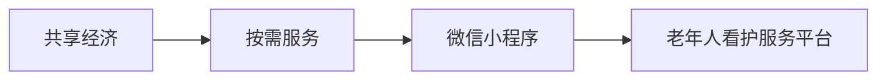
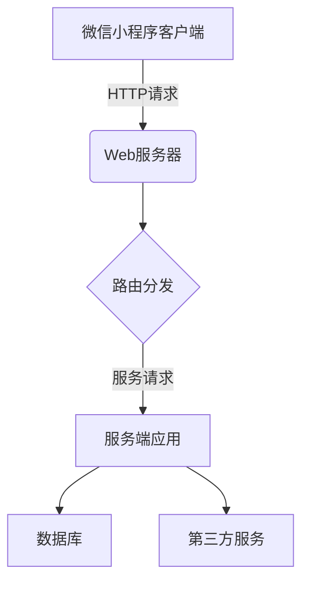
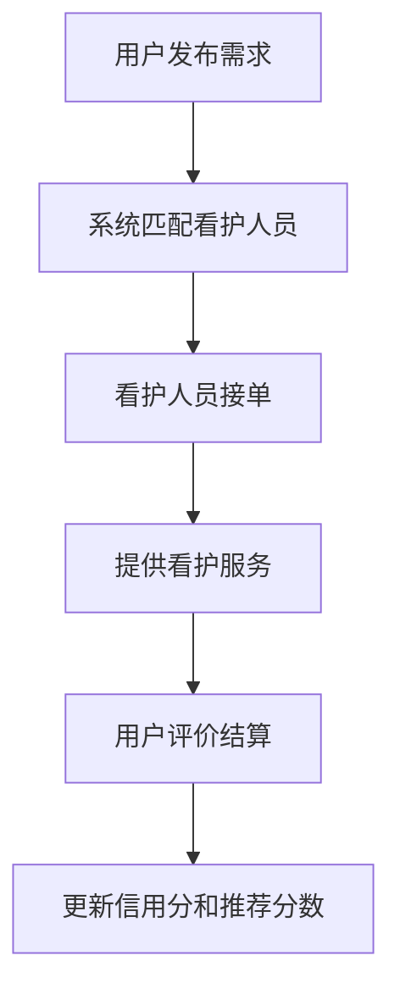
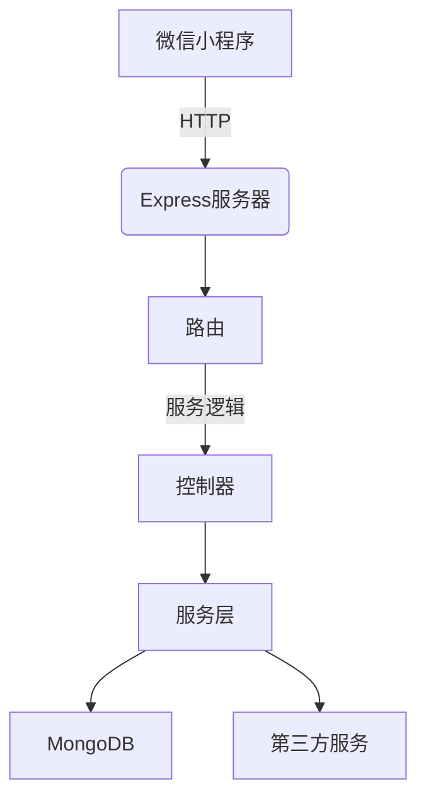

# 微信小程序老年人看护兼职系统

## 1.背景介绍

### 1.1 老龄化社会的挑战

随着人口老龄化的加剧,老年人的生活照料和看护成为了一个日益严峻的社会问题。据统计,我国60岁以上老年人口已超过2.4亿,占总人口的18.1%。然而,由于传统家庭模式的变迁和子女外出务工等原因,很多老年人无人照料,生活质量受到严重影响。

### 1.2 看护服务的供需矛盾

目前,专业的老年人看护服务供给严重不足,无法满足快速增长的需求。一方面,正规的养老机构数量有限,收费昂贵;另一方面,社会上缺乏规范化的居家看护服务渠道,老年人难以找到合适的看护人员。这种供需矛盾加剧了老年人的生活困境。

### 1.3 互联网+看护服务的机遇

移动互联网和共享经济的兴起,为解决老年人看护难题提供了新的机遇。通过互联网平台,可以高效对接看护服务的供需双方,实现资源的优化配置。微信小程序作为一种轻量级的移动应用,具有开发和使用成本低、覆盖人群广等优势,非常适合构建老年人看护服务平台。

## 2.核心概念与联系

### 2.1 共享经济

共享经济(Sharing Economy)是指将闲置的资源或服务通过互联网平台进行共享,从而实现资源的高效利用。在老年人看护领域,共享经济可以将分散的看护服务资源通过平台进行整合,提高资源利用率。

### 2.2 按需服务

按需服务(On-Demand Service)是指根据用户的实际需求,按需提供相应的服务。老年人看护服务具有很强的个性化和不确定性,采用按需服务模式可以更好地满足老年人的差异化需求。

### 2.3 微信小程序

微信小程序是一种无需下载安装即可使用的小型应用程序,可以在微信客户端内运行。小程序开发成本低、应用场景广、用户触达面大,非常适合构建老年人看护服务平台。

### 2.4 关系概念图



## 3.核心算法原理具体操作步骤

### 3.1 需求分析

老年人看护服务平台的核心需求包括:

1. 看护服务发布和查找
2. 看护人员实时状态管理
3. 订单匹配和派单
4. 服务评价和信用体系
5. 支付和结算

### 3.2 系统架构设计

基于微信小程序的老年人看护服务平台采用前后端分离的架构设计,具体如下:



1. 微信小程序客户端: 提供用户界面,发起HTTP请求
2. Web服务器: 接收HTTP请求,转发给服务端应用
3. 服务端应用: 处理业务逻辑,操作数据库和调用第三方服务
4. 数据库: 存储用户、订单、评价等数据
5. 第三方服务: 如地图、推送、支付等服务

### 3.3 关键算法

#### 3.3.1 地理位置与距离计算

为了实现就近匹配看护人员,需要计算用户和看护人员之间的地理距离。可以使用经纬度坐标,通过球面距离公式计算:

$$d=R\times\arccos\left(\sin\left(\phi_1\right)\sin\left(\phi_2\right)+\cos\left(\phi_1\right)\cos\left(\phi_2\right)\cos\left(\lambda_2-\lambda_1\right)\right)$$

其中:
- $d$为两点间的距离(米)
- $R$为地球半径(约6371000米)
- $\phi_1,\phi_2$为两点的纬度(弧度)
- $\lambda_1,\lambda_2$为两点的经度(弧度)

#### 3.3.2 订单匹配算法

订单匹配是系统的核心算法,需要综合考虑多个因素:

1. 地理距离
2. 看护人员评分和等级
3. 服务类型和技能匹配
4. 时间段和价格区间

可以采用加权评分的方式,将各因素打分后加权求和,选择综合得分最高的看护人员:

$$\text{Score}=w_1\times\text{DistanceScore}+w_2\times\text{RatingScore}+w_3\times\text{SkillMatchScore}+w_4\times\text{TimeScore}+w_5\times\text{PriceScore}$$

其中$w_1,w_2,...,w_5$为各因素的权重,可根据实际情况调整。

#### 3.3.3 推荐算法

为了提高用户体验,可以在系统中引入个性化推荐算法,推荐合适的看护人员或服务。可以采用基于用户的协同过滤算法,计算用户之间的相似度,推荐与目标用户相似的其他用户喜欢的看护人员。

相似度可以使用余弦相似度或皮尔逊相关系数等方法计算。对于用户$u$和$v$,余弦相似度为:

$$\text{sim}(u,v)=\frac{\sum_{i\in I}r_{ui}r_{vi}}{\sqrt{\sum_{i\in I}r_{ui}^2}\sqrt{\sum_{i\in I}r_{vi}^2}}$$

其中$I$为两个用户都评价过的看护人员集合,$r_{ui}$和$r_{vi}$分别为用户$u$和$v$对看护人员$i$的评分。

### 3.4 系统工作流程

1. 用户通过小程序发布看护服务需求
2. 系统根据用户位置和需求,匹配附近的合适看护人员
3. 看护人员接受订单后,系统记录订单并推送通知
4. 看护人员提供服务,用户评价并结算
5. 系统根据评价更新看护人员信用分和推荐分数



## 4.数学模型和公式详细讲解举例说明

### 4.1 地理位置距离计算

我们以北京市海淀区中关村大街18号为例,计算其与北京市朝阳区酒仙桥路14号的球面距离:

```python
import math

def haversine(lon1, lat1, lon2, lat2):
    # 地球半径,单位米
    R = 6371000
    
    # 将经纬度转为弧度
    phi1 = math.radians(lat1)
    phi2 = math.radians(lat2)
    delta_phi = math.radians(lat2 - lat1)
    delta_lambda = math.radians(lon2 - lon1)
    
    # 使用haversine公式计算
    a = math.sin(delta_phi / 2.0) ** 2 + math.cos(phi1) * math.cos(phi2) * math.sin(delta_lambda / 2.0) ** 2
    c = 2 * math.atan2(math.sqrt(a), math.sqrt(1 - a))
    d = R * c
    
    return d

# 中关村大街18号
lon1, lat1 = 116.322987, 39.983424
# 酒仙桥路14号  
lon2, lat2 = 116.481288, 39.934153

distance = haversine(lon1, lat1, lon2, lat2)
print(f"两地球面距离为: {distance:.2f} 米")
```

输出结果:

```
两地球面距离为: 10623.04 米
```

### 4.2 订单匹配加权评分

假设有一个看护服务需求,地点在北京市海淀区中关村大街18号,时间为2023年6月1日9:00-12:00,价格在100-150元/小时。我们有三名看护人员A、B、C,具体情况如下:

| 看护人员 | 距离(米) | 评分 | 技能匹配度 | 时间段 | 价格(元/小时) |
|----------|----------|------|------------|--------|----------------|
| A        | 2000     | 4.8  | 90%        | 9-12   | 120            |
| B        | 5000     | 4.5  | 80%        | 8-13   | 100            |  
| C        | 1500     | 4.7  | 95%        | 10-14  | 130            |

我们设置各因素权重为:
- 距离权重$w_1=0.3$
- 评分权重$w_2=0.2$  
- 技能匹配权重$w_3=0.2$
- 时间权重$w_4=0.2$
- 价格权重$w_5=0.1$

则三名看护人员的综合得分为:

```python
# 距离得分范围0-5分,5分为距离最近
def distance_score(d):
    return 6 - d // 1000 if d <= 5000 else 1

# 评分得分等于原始评分
def rating_score(rating):
    return rating

# 技能匹配度得分等于原始百分比
def skill_match_score(match):
    return match

# 时间段得分,完全匹配为5分,无重叠为0分
def time_score(time1, time2):
    # 计算重叠时间段...
    return 5

# 价格得分范围0-5分,5分为价格最合适
def price_score(price):
    # 计算价格得分...  
    return 5

candidates = [
    {"distance": 2000, "rating": 4.8, "skill_match": 0.9, "time": "9-12", "price": 120},
    {"distance": 5000, "rating": 4.5, "skill_match": 0.8, "time": "8-13", "price": 100},
    {"distance": 1500, "rating": 4.7, "skill_match": 0.95, "time": "10-14", "price": 130}
]

weights = [0.3, 0.2, 0.2, 0.2, 0.1]

for candidate in candidates:
    d = candidate["distance"]
    r = candidate["rating"]
    m = candidate["skill_match"]
    t = time_score(candidate["time"], "9-12")
    p = price_score(candidate["price"])
    
    scores = [distance_score(d), r, m, t, p]
    score = sum(x * y for x, y in zip(weights, scores))
    print(f"看护人员综合得分: {score:.2f}")
```

输出结果:

```
看护人员综合得分: 4.35
看护人员综合得分: 3.65
看护人员综合得分: 4.55
```

根据综合得分,C看护人员最合适。

## 5.项目实践：代码实例和详细解释说明

### 5.1 系统架构

我们采用前后端分离的架构,后端使用Node.js+Express构建RESTful API,前端使用Vue.js开发微信小程序。后端连接MongoDB数据库存储数据,并调用第三方地图、推送等服务。



### 5.2 关键API

#### 5.2.1 看护人员API

- `GET /caregivers`：获取看护人员列表
- `GET /caregivers/:id`：获取看护人员详情
- `POST /caregivers`：创建新看护人员
- `PUT /caregivers/:id`：更新看护人员信息
- `DELETE /caregivers/:id`：删除看护人员

#### 5.2.2 订单API

- `GET /orders`：获取订单列表
- `GET /orders/:id`：获取订单详情
- `POST /orders`：创建新订单
- `PUT /orders/:id`：更新订单状态
- `DELETE /orders/:id`：取消订单

#### 5.2.3 评价API

- `GET /reviews`：获取评价列表
- `POST /reviews`：创建新评价

### 5.3 订单匹配示例

```javascript
// 订单匹配服务
const matchService = {
  // 根据订单需求匹配看护人员
  matchCaregivers(order) {
    const { location, timeRange, priceRange } = order;
    
    // 获取所有在线看护人员
    const caregivers = caregiversRepo.getAvailable();
    
    // 计算每个看护人员的综合得分
    const scored = caregivers.map