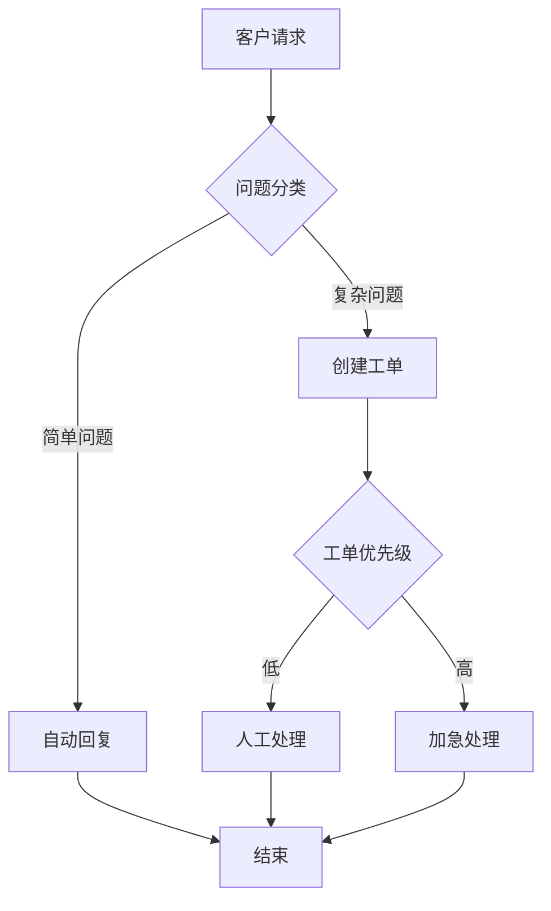
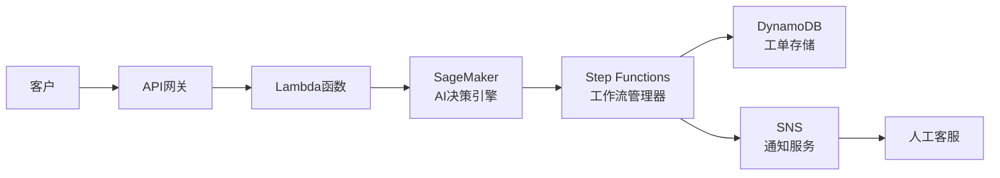

# 1. 背景介绍

## 1.1 AI代理工作流的兴起

随着人工智能(AI)技术的不断发展和应用范围的扩大,AI代理工作流已经成为企业和组织实现自动化和优化业务流程的关键工具。AI代理工作流是指利用AI技术(如机器学习、自然语言处理等)来自动执行一系列任务和决策的工作流程。

在传统的业务流程中,人工参与是不可避免的,这不仅效率低下,而且容易出现人为错误。而AI代理工作流能够自动化执行大部分任务,减少人工干预,提高效率和准确性。

## 1.2 云服务的优势

随着云计算技术的发展,越来越多的企业和组织开始将应用和基础设施迁移到云端。云服务具有可扩展性、高可用性、按需付费等优势,非常适合部署和运行AI代理工作流。

相比于传统的本地部署方式,基于云服务的AI代理工作流部署具有以下优势:

1. **可扩展性**:云服务可以根据需求动态调整计算资源,轻松应对工作流负载的波动。
2. **高可用性**:云服务提供商通常会在多个地理位置部署冗余基础设施,确保服务的高可用性。
3. **按需付费**:只需为实际使用的资源付费,避免了前期大量资本投入。
4. **快速部署**:利用云服务可以快速构建和部署AI代理工作流,缩短上线时间。

因此,基于云服务的AI代理工作流部署策略成为了企业实现智能自动化的理想选择。

# 2. 核心概念与联系

## 2.1 AI代理工作流

AI代理工作流是指利用AI技术自动执行一系列任务和决策的工作流程。它通常包括以下几个核心组件:

1. **事件监听器**:监控触发工作流的事件或条件。
2. **AI决策引擎**:根据输入数据和预定义的规则或模型做出决策。
3. **任务执行器**:执行工作流中的各个任务,可能涉及人工干预。
4. **工作流管理器**:协调整个工作流的执行过程。

AI代理工作流可以应用于多个领域,如客户服务、审批流程、供应链管理等,极大提高了工作效率。

## 2.2 云服务

云服务是指通过互联网提供的按需交付和按使用量付费的IT资源,包括计算能力、存储空间、网络资源等。常见的云服务模式有:

1. **基础设施即服务(IaaS)**: 提供基础的计算、存储和网络资源。
2. **平台即服务(PaaS)**: 提供开发、测试、部署应用程序所需的环境和工具。 
3. **软件即服务(SaaS)**: 直接提供可用的应用软件服务。

云服务的核心优势在于其弹性可扩展、高可用、按需付费等特点,非常适合部署和运行AI代理工作流等需求波动较大的应用。

## 2.3 联系

基于云服务的AI代理工作流部署,就是将AI代理工作流相关的组件和服务部署在云端,利用云服务的优势来支撑工作流的运行。

这种部署方式能够充分发挥云服务的弹性扩展能力,根据工作流负载的变化动态调整资源;同时借助云服务商提供的高可用性基础设施,确保工作流的稳定运行;并且只需为实际使用的资源付费,降低了前期投资成本。

因此,基于云服务的AI代理工作流部署策略成为了企业实现智能自动化的理想之选。

# 3. 核心算法原理和具体操作步骤

## 3.1 AI决策引擎

AI决策引擎是AI代理工作流的核心部分,负责根据输入数据做出智能决策。常用的AI决策算法有:

### 3.1.1 机器学习算法

机器学习算法通过对大量历史数据的训练,建立数学模型,从而对新的输入数据做出预测或决策。常见的有:

1. **决策树算法**: 将决策过程表示为树状结构模型。
2. **逻辑回归算法**: 对于分类问题,预测输入数据属于某个类别的概率。
3. **支持向量机算法**: 通过构造高维空间超平面,实现数据分类或回归。

### 3.1.2 规则引擎算法

规则引擎算法是基于预定义的一系列规则进行决策的。规则可以由领域专家制定,或通过机器学习从历史数据中提取。规则引擎适用于决策逻辑相对固定的场景。

### 3.1.3 其他算法

除了上述常见算法,AI决策引擎还可以使用深度学习、强化学习等算法,具体取决于应用场景和数据特征。

## 3.2 工作流管理器

工作流管理器负责协调和控制整个AI代理工作流的执行过程。它的核心算法包括:

### 3.2.1 工作流建模算法

将业务流程用图形化的方式(如BPMN标记)建模,描述任务节点、决策网关、数据流等。常用的建模算法有层次分析法、Petri网等。

### 3.2.2 工作流调度算法  

根据工作流模型和实时状态,对各个任务节点进行调度,确定执行顺序和分配资源。经典的调度算法有:

1. **先来先服务算法**
2. **优先级调度算法**  
3. **基于规则的调度算法**

### 3.2.3 异常处理算法

当工作流执行过程中出现异常(如任务失败、数据缺失等),异常处理算法将根据预定义的策略进行处理,如重试、跳过、终止等。

## 3.3 具体操作步骤

基于云服务部署AI代理工作流的一般操作步骤如下:

1. **选择云服务提供商**:根据需求选择合适的IaaS、PaaS或SaaS云服务。
2. **设计工作流模型**:使用建模工具设计工作流,描述任务、决策逻辑等。
3. **构建AI决策引擎**:开发或选择合适的机器学习、规则引擎等算法模型。
4. **部署工作流组件**:在云服务上部署工作流管理器、AI决策引擎等组件。
5. **集成外部系统**:将工作流与企业内外部系统(如CRM、ERP等)集成。
6. **配置监控和告警**:设置工作流关键指标的监控,并配置告警机制。
7. **测试和优化**:进行充分的测试,根据实际运行数据持续优化工作流。

# 4. 数学模型和公式详细讲解举例说明

AI决策引擎中常用的机器学习算法往往基于一些数学模型和公式,下面将对其中的代表性模型进行详细讲解。

## 4.1 逻辑回归

逻辑回归是一种常用的分类算法,可以预测输入数据属于某个类别的概率。其数学模型如下:

$$P(Y=1|X) = \frac{1}{1 + e^{-(\beta_0 + \beta_1X_1 + \beta_2X_2 + ... + \beta_nX_n)}}$$

其中:
- $Y$是二元类别变量(0或1)
- $X$是特征向量$[X_1, X_2, ..., X_n]$  
- $\beta$是模型参数,通过对训练数据的最大似然估计获得

对于多分类问题,可以使用Softmax回归,公式如下:

$$P(Y=k|X) = \frac{e^{\beta_k^TX}}{\sum_{j=1}^K e^{\beta_j^TX}}$$

其中$K$是类别总数。

逻辑回归的优点是模型简单,计算高效;缺点是对于非线性决策边界的分类问题,效果不佳。

## 4.2 支持向量机(SVM)

支持向量机是一种常用的分类和回归算法,其基本思想是在高维特征空间中构造一个超平面,将不同类别的数据点分开,且分隔超平面与最近数据点的距离最大。

对于线性可分的二分类问题,分隔超平面可表示为:

$$w^Tx + b = 0$$

其中$w$是超平面的法向量,$b$是位移项。SVM的目标是最大化分类间隔:

$$\max\limits_{w,b} \frac{2}{\|w\|}$$

满足约束条件:

$$y_i(w^Tx_i + b) \geq 1, i=1,2,...,n$$

这是一个凸二次规划问题,可以通过拉格朗日对偶性质求解。

对于非线性问题,SVM通过核技巧将数据映射到高维特征空间,从而使其线性可分。常用的核函数有线性核、多项式核、高斯核等。

SVM的优点是泛化能力强,可以有效处理高维数据;缺点是对缺失数据和异常值敏感,计算开销较大。

## 4.3 其他模型

除了上述两种经典模型,AI决策引擎中还可能使用其他模型,如:

- **决策树**: 基于信息熵或基尼指数的特征选择,构建决策树模型。
- **贝叶斯分类器**: 基于贝叶斯定理,计算后验概率进行分类。 
- **人工神经网络**: 仿生大脑神经元结构,对输入数据进行非线性变换。
- **深度学习模型**: 如卷积神经网络(CNN)、循环神经网络(RNN)等。

模型的选择需要根据具体的应用场景、数据特征、精度要求等因素综合考虑。

# 5. 项目实践:代码实例和详细解释说明

为了更好地理解基于云服务的AI代理工作流部署策略,我们将通过一个客户服务机器人的实例进行说明。

## 5.1 需求描述

某电商公司需要一个自动化的客户服务机器人,能够快速响应客户的常见问题,如订单查询、投诉处理等。同时对于一些复杂问题,需要将工单分配给人工客服进行处理。

## 5.2 工作流设计

我们使用BPMN建模工具设计了如下工作流:



该工作流包括以下主要步骤:

1. 接收客户请求
2. 使用AI决策引擎对问题进行分类
3. 对于简单问题,自动给出标准回复
4. 对于复杂问题,创建工单,并根据优先级分配给人工客服处理

## 5.3 云服务部署

我们选择了AWS作为云服务提供商,部署架构如下:



- **API网关**: 接收客户请求,作为工作流的入口点
- **Lambda函数**: 运行一些简单的任务,如数据预处理
- **SageMaker**: 基于AWS的机器学习平台,部署了AI决策引擎
- **Step Functions**: AWS的无服务器工作流服务,充当工作流管理器
- **DynamoDB**: 存储工单数据的NoSQL数据库
- **SNS**: 简单通知服务,用于向人工客服发送工单通知

## 5.4 AI决策引擎

AI决策引擎使用了两种算法:

1. **文本分类器**: 基于BERT模型的迁移学习,对客户问题进行分类
2. **优先级评估器**: 基于XGBoost的机器学习模型,对工单优先级进行评估

下面是BERT文本分类器的Python代码示例:

```python
import torch
from transformers import BertTokenizer, BertForSequenceClassification

# 加载预训练BERT模型和分词器
tokenizer = BertTokenizer.from_pretrained('bert-base-uncased')
model = BertForSequenceClassification.from_pretrained('bert-base-uncased', num_labels=