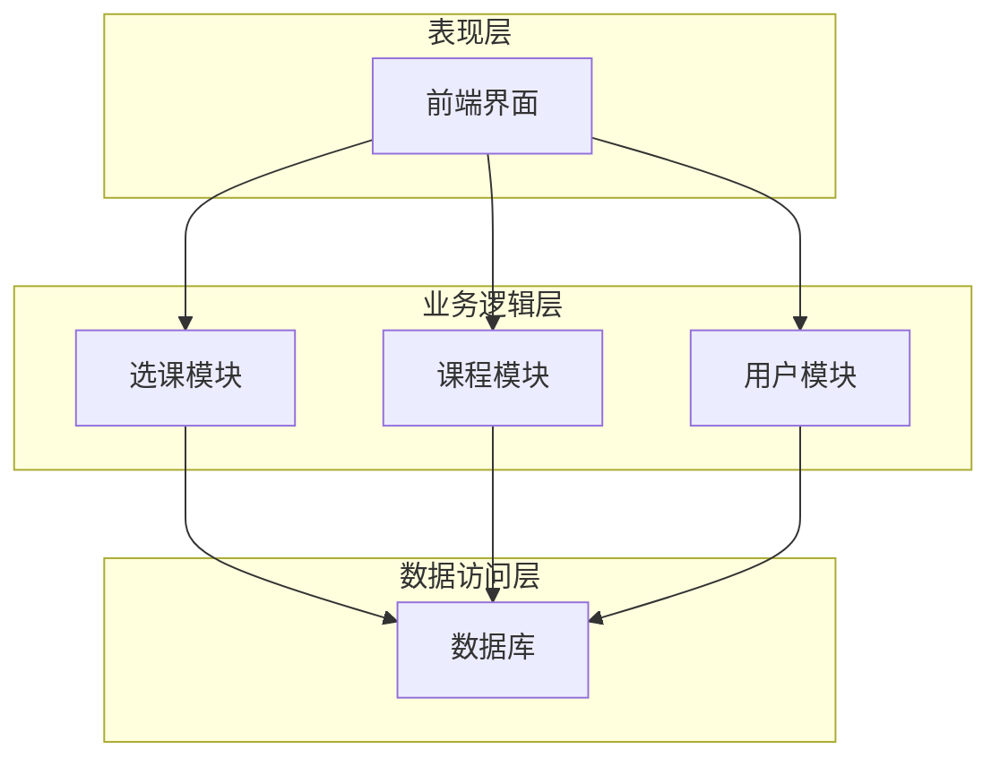
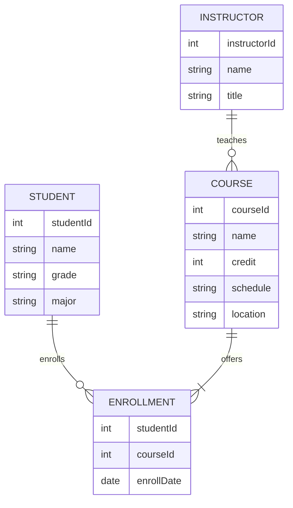

# 学生网上选课系统详细设计与具体代码实现

## 1.背景介绍

### 1.1 选课系统的重要性

在当今时代,网上选课系统已经成为高校教学管理的重要组成部分。它不仅方便了学生选课,也大大提高了教务管理的效率。一个良好设计的选课系统,可以实现多方位的功能需求,如课程信息查询、选课、退课、成绩查询等,为师生提供高效便捷的服务。

### 1.2 系统设计的挑战

设计一个完善的选课系统并非易事,需要解决诸多技术难题:

- 用户权限控制
- 数据存储与管理
- 并发请求处理
- 系统扩展性和可维护性

### 1.3 本文概述

本文将详细介绍一个基于B/S架构的学生网上选课系统的设计与实现,包括需求分析、概念模型设计、数据库设计、系统架构、关键算法,以及具体代码实现等内容。我们将重点探讨系统的核心模块,如选课算法、并发控制等,并给出可行的解决方案。

## 2.核心概念与联系

### 2.1 选课系统的核心概念

- 课程:包括课程编号、名称、学分、上课时间、上课地点、任课教师等信息
- 学生:包括学号、姓名、所属年级、专业等信息
- 教师:包括工号、姓名、职称、所授课程等信息
- 选课规则:如最大修课学分限制、先修课程限制等
- 选课结果:学生实际选修的课程列表

### 2.2 概念之间的关系

- 一门课程可以由多名教师授课
- 一名教师可以授多门课程 
- 一名学生可以选多门课程
- 一门课程可以被多名学生选修
- 选课规则约束着学生的选课行为

## 3.核心算法原理具体操作步骤

### 3.1 选课算法

选课算法是系统的核心,需要在满足各种选课规则的前提下,为学生安排合理的课程。我们采用了一种基于优先级的选课算法。

#### 3.1.1 算法原理

1. 根据选课规则,为每门课程设置优先级
2. 按优先级从高到低的顺序处理课程
3. 对于每门课程,按照"先到先得"的原则,安排学生名单
4. 如果某门课程的学生名单已满,则拒绝后续选课请求

#### 3.1.2 算法步骤

1. 获取所有待选课程的列表
2. 根据选课规则,计算每门课程的优先级
3. 按优先级对课程列表排序
4. 遍历排序后的课程列表
5. 对于每门课程:
    - 获取该课程的最大选课人数限制
    - 按先到先得原则,从学生的选课请求中安排前N个学生
    - 如果该课程的选课人数已满,则拒绝后续选课请求
6. 返回最终的选课结果

该算法的时间复杂度为O(nlogn),其中n为课程数量。

### 3.2 并发控制

由于可能有多个学生同时发出选课请求,因此需要对共享资源(如课程名额)进行并发控制,防止出现资源竞争的情况。我们采用了基于数据库事务的乐观并发控制机制。

#### 3.2.1 乐观并发控制原理

乐观并发控制的核心思想是:假设并发问题在实际应用中的出现概率很小,因此先执行操作,只有在提交数据时检查是否有其他并发事务更新了相同的数据。如果没有,则顺利提交,否则执行补偿操作(如重试)。

#### 3.2.2 具体实现步骤

1. 开启数据库事务
2. 查询课程的当前选课人数
3. 模拟选课操作,更新课程的选课人数
4. 尝试提交事务
5. 如果提交失败(意味着有其他事务修改了相同数据),则回滚并重试
6. 如果提交成功,则选课操作完成

该机制能够有效防止并发问题,但在高并发场景下,可能会导致大量重试,影响系统性能。

## 4.数学模型和公式详细讲解举例说明

### 4.1 选课优先级计算模型

为了公平地安排学生的选课,我们需要为每门课程设置一个优先级。优先级的计算模型如下:

$$
P_i = w_1 \times f_1(c_i) + w_2 \times f_2(c_i) + \cdots + w_n \times f_n(c_i)
$$

其中:

- $P_i$表示第i门课程的优先级
- $w_j$表示第j个因素的权重,且$\sum_{j=1}^n w_j = 1$
- $f_j(c_i)$表示针对第i门课程计算第j个因素的函数

常见的影响选课优先级的因素有:

- 课程类型(必修/选修)
- 课程年级
- 任课教师评分
- 先修课程要求
- ...

我们可以根据实际需求,设计不同的函数$f_j$来量化这些因素的影响。

### 4.2 举例:先修课程优先级计算

假设我们希望优先安排有先修课程要求的学生选课,则可以设计如下函数:

$$
f(c_i) = \begin{cases}
1, & \text{如果学生已修完}c_i\text{的先修课程}\\
0, & \text{否则}
\end{cases}
$$

将该函数代入优先级计算模型,并设置一个较大的权重$w$,就可以确保有先修课程要求的课程获得更高的优先级,从而被优先安排。

## 4.项目实践:代码实例和详细解释说明

### 4.1 系统架构

我们采用了经典的三层架构,包括表现层(前端)、业务逻辑层(后端)和数据访问层。



### 4.2 数据库设计

#### 4.2.1 E-R模型



#### 4.2.2 表结构

**学生表(STUDENT)**

| 字段名   | 类型         | 描述     |
|----------|--------------|----------|
| studentId| INT PRIMARY KEY | 学号    |
| name     | VARCHAR(50)    | 姓名    |
| grade    | VARCHAR(10)    | 年级    |
| major    | VARCHAR(50)    | 专业    |

**课程表(COURSE)** 

| 字段名     | 类型          | 描述     |
|------------|----------------|----------|
| courseId   | INT PRIMARY KEY| 课程编号|
| name       | VARCHAR(100)   | 课程名称|
| credit     | INT            | 学分    |
| schedule   | VARCHAR(50)    | 上课时间|
| location   | VARCHAR(50)    | 上课地点|

**教师表(INSTRUCTOR)**

| 字段名      | 类型          | 描述   |
|-------------|----------------|--------|
| instructorId| INT PRIMARY KEY| 工号  |  
| name        | VARCHAR(50)    | 姓名  |
| title       | VARCHAR(50)    | 职称  |

**选课表(ENROLLMENT)**

| 字段名    | 类型          | 描述     |
|------------|----------------|----------|
| studentId  | INT FOREIGN KEY| 学号    |
| courseId   | INT FOREIGN KEY| 课程编号|
| enrollDate | DATE           | 选课日期|

### 4.3 选课模块实现

#### 4.3.1 选课算法实现

```python
from typing import List, Tuple
import heapq

Course = Tuple[int, int, int]  # (优先级, 课程id, 最大选课人数)

def schedule_courses(student_requests: List[Tuple[int, int]],
                     courses: List[Course]) -> List[Tuple[int, int]]:
    """
    根据学生选课请求和课程信息,进行选课安排
    
    Args:
        student_requests: 学生选课请求列表,每个元素为(学号,课程id)
        courses: 可选课程列表,每个元素为(优先级,课程id,最大选课人数)
        
    Returns:
        选课结果列表,每个元素为(学号,课程id)
    """
    # 按优先级从高到低对课程排序
    pq = [-x for x in courses]
    heapq.heapify(pq)
    
    enroll_results = []
    while pq:
        # 取出优先级最高的课程
        _, course_id, capacity = heapq.heappop(pq)
        
        # 按先到先得原则安排学生
        students_to_enroll = []
        for student_id, cid in student_requests:
            if cid == course_id and len(students_to_enroll) < capacity:
                students_to_enroll.append(student_id)
        
        # 记录选课结果
        for student_id in students_to_enroll:
            enroll_results.append((student_id, course_id))
            
        # 从请求列表中移除已安排的学生
        student_requests = [(s, c) for s, c in student_requests
                            if s not in students_to_enroll]
    
    return enroll_results
```

该函数的核心思路是:

1. 根据优先级对课程排序
2. 遍历排序后的课程列表
3. 对于每门课程,按先到先得原则安排学生
4. 记录选课结果,并从请求列表中移除已安排的学生

#### 4.3.2 并发控制实现

```python
import contextlib

@contextlib.contextmanager
def db_transaction(cursor):
    """
    数据库事务上下文管理器
    
    Args:
        cursor: 数据库游标对象
    """
    try:
        yield cursor
    except:
        cursor.execute("ROLLBACK")
        raise
    else:
        cursor.execute("COMMIT")

def enroll_course(student_id, course_id, cursor):
    """
    为学生选修一门课程
    
    Args:
        student_id: 学号
        course_id: 课程编号
        cursor: 数据库游标对象
        
    Returns:
        是否选课成功
    """
    with db_transaction(cursor):
        # 查询课程当前选课人数
        cursor.execute("""
            SELECT capacity, enrolled 
            FROM courses
            WHERE course_id = %s
        """, (course_id,))
        capacity, enrolled = cursor.fetchone()
        
        # 如果课程未满,则模拟选课操作
        if enrolled < capacity:
            try:
                cursor.execute("""
                    UPDATE courses
                    SET enrolled = enrolled + 1
                    WHERE course_id = %s
                """, (course_id,))
                
                cursor.execute("""
                    INSERT INTO enrollments (student_id, course_id)
                    VALUES (%s, %s)
                """, (student_id, course_id))
            except:
                # 如果提交失败,则重试
                return False
            else:
                # 提交成功,选课完成
                return True
        else:
            # 课程已满,选课失败
            return False
```

该实现使用了Python的上下文管理器来实现数据库事务,并采用乐观并发控制策略:

1. 查询课程当前选课人数
2. 如果课程未满,则模拟选课操作(更新选课人数并插入选课记录)
3. 尝试提交事务
4. 如果提交失败(意味着有其他事务修改了相同数据),则回滚并返回False
5. 如果提交成功,则选课操作完成,返回True

## 5.实际应用场景

学生网上选课系统在高校教务管理中有着广泛的应用,可以为师生提供高效便捷的服务。

### 5.1 学生使用场景

- 查询开设课程信息
- 根据专业、年级等条件筛选课程
- 选修心仪课程
- 退选已选课程
- 查询个人选课情况
- 查询成绩等

### 5.2 教师使用场景  

- 维护所授课程信息
- 查看选修该课程的学生名单
- 录入或导入学生成绩

### 5.3 教务人员使用场景

- 开设新课程
- 设置选课规则
-