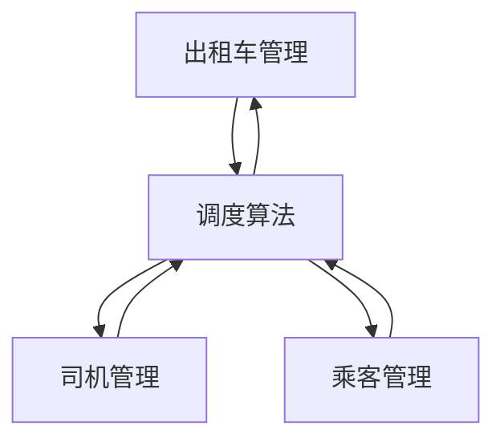

## 1.背景介绍

出租车作为城市的重要交通工具，其管理系统的设计与实现对于提高城市交通效率、提升乘客出行体验以及优化出租车公司的运营都有重要的影响。本文将围绕出租车管理系统的详细设计与具体代码实现进行深入探讨。

### 1.1 出租车行业的现状和挑战

出租车行业在过去的几年里，由于网络叫车的兴起，面临着巨大的挑战。出租车公司必须提升服务质量，优化运营效率，才能在激烈的市场竞争中立足。

### 1.2 出租车管理系统的需求

对于出租车公司来说，一个好的出租车管理系统应该能满足以下几个核心需求：
1. 提高调度效率：通过优化算法，使得出租车的调度更加合理，减少空驶率。
2. 提升服务质量：通过实时追踪出租车的位置，以便在乘客有需要的时候，能够快速派车。
3. 管理司机：对司机的工作时间、行车路线等进行管理，使得运营更加规范。

## 2.核心概念与联系

在设计出租车管理系统时，我们需要理解一些核心的概念和联系，包括出租车、司机、乘客、调度中心等。

### 2.1 出租车

出租车是系统的核心，每一辆出租车都有一个唯一的标识，这个标识可以是车牌号，也可以是内部的车辆编号。出租车的主要信息包括车辆状态（如是否空闲）、当前位置等。

### 2.2 司机

司机是出租车的操作者，他们通过系统接收调度信息，驾驶出租车完成任务。

### 2.3 乘客

乘客是出租车服务的对象，他们通过系统预约出租车，系统需要记录乘客的预约信息和出行记录。

### 2.4 调度中心

调度中心是出租车管理系统的核心，它根据各种信息（如出租车的位置、状态，乘客的需求等）进行出租车的调度。

## 3.核心算法原理具体操作步骤

出租车管理系统的核心算法是调度算法，它根据出租车的位置、状态和乘客的需求，决定如何分配出租车。

### 3.1 距离最近优先算法

这是最简单的调度算法，当乘客预约出租车时，系统会找到距离乘客最近的空闲出租车，然后将这个出租车分配给乘客。

### 3.2 基于预测的调度算法

这种算法会预测未来的乘客需求和出租车的空闲情况，然后根据预测的结果进行调度。这种算法更加复杂，但是在某些情况下，可以提高出租车的使用率和乘客的满意度。

## 4.数学模型和公式详细讲解举例说明

在设计出租车管理系统时，我们可以使用数学模型来描述和解决一些问题。

### 4.1 距离计算

计算两点之间的距离是出租车调度的基础，我们可以使用欧式距离公式来计算。

$$
d = \sqrt{(x_2-x_1)^2 + (y_2-y_1)^2}
$$

其中，$(x_1, y_1)$ 和 $(x_2, y_2)$ 分别是两点的坐标。

### 4.2 预测模型

我们可以使用时间序列预测模型来预测未来的乘客需求。一个简单的预测模型是移动平均模型：

$$
\hat{y}_{t+1} = \frac{1}{n} \sum_{i=0}^{n-1} y_{t-i}
$$

其中，$\hat{y}_{t+1}$ 是预测的需求，$y_{t-i}$ 是过去的需求，$n$ 是平均的时间窗口长度。

## 4.项目实践：代码实例和详细解释说明

下面我们将通过一个简单的出租车管理系统的设计和实现，来具体展示如何使用上述的概念和算法。

### 4.1 系统设计

系统主要包括以下几个部分：

1. **出租车管理**：管理出租车的信息，包括位置、状态等。
2. **司机管理**：管理司机的信息，包括工作时间、路线等。
3. **乘客管理**：管理乘客的信息，包括预约信息、出行记录等。
4. **调度算法**：根据出租车的位置、状态和乘客的需求进行调度。

这些部分之间的交互如下图所示：



### 4.2 代码实现

接下来，我们将使用 Python 语言来实现这个系统。由于篇幅限制，这里只展示部分核心代码。

首先，我们定义出租车的类：

```python
class Taxi:
    def __init__(self, id, location):
        self.id = id
        self.location = location
        self.status = 'idle'
```

然后，我们定义调度中心的类，它使用最近优先算法进行调度：

```python
class DispatchCenter:
    def __init__(self):
        self.taxis = {}

    def add_taxi(self, taxi):
        self.taxis[taxi.id] = taxi

    def dispatch(self, customer_location):
        closest_taxi_id = None
        closest_distance = float('inf')
        for id, taxi in self.taxis.items():
            if taxi.status == 'idle':
                distance = self.calculate_distance(taxi.location, customer_location)
                if distance < closest_distance:
                    closest_taxi_id = id
                    closest_distance = distance
        if closest_taxi_id:
            self.taxis[closest_taxi_id].status = 'busy'
        return closest_taxi_id

    def calculate_distance(self, location1, location2):
        return ((location1[0] - location2[0]) ** 2 + (location1[1] - location2[1]) ** 2) ** 0.5
```

## 5.实际应用场景

出租车管理系统在以下几个场景中有实际应用：

1. **城市出租车公司**：通过使用出租车管理系统，出租车公司可以提高调度效率，提升服务质量，优化运营效率。
2. **机场、火车站等大型交通枢纽**：这些地方的出租车需求量大，通过使用出租车管理系统，可以有效地调度出租车，满足乘客的需求。
3. **大型活动**：在大型活动（如音乐节、体育赛事等）结束后，会有大量的乘客需要出租车，出租车管理系统可以帮助快速、高效地调度出租车。

## 6.工具和资源推荐

在设计和实现出租车管理系统时，以下工具和资源可能会有所帮助：

1. **Python**：Python 是一种简单易学的编程语言，有丰富的库和框架，非常适合用来实现出租车管理系统。
2. **Google Maps API**：Google Maps API 提供了地图服务和位置服务，可以帮助我们获取和处理位置相关的数据。
3. **Scikit-learn**：Scikit-learn 是一个强大的机器学习库，我们可以使用它来实现预测模型。

## 7.总结：未来发展趋势与挑战

随着技术的发展，出租车管理系统将面临更多的机遇和挑战。

对于机遇，一方面，随着大数据和人工智能技术的发展，我们有可能开发出更加智能和高效的调度算法；另一方面，随着物联网技术的发展，我们可以获取更多的实时数据，以便更好地管理出租车和司机。

对于挑战，一方面，随着网络叫车服务的普及，出租车行业的竞争将更加激烈，出租车公司需要不断优化管理系统，提高服务质量和运营效率；另一方面，随着数据量的增加，如何有效地处理和利用这些数据，也是一个重要的问题。

## 8.附录：常见问题与解答

1. **问：出租车管理系统的调度算法有哪些？**
答：常见的调度算法包括距离最近优先算法、基于预测的调度算法等。

2. **问：如何计算两点之间的距离？**
答：可以使用欧式距离公式来计算两点之间的距离。

