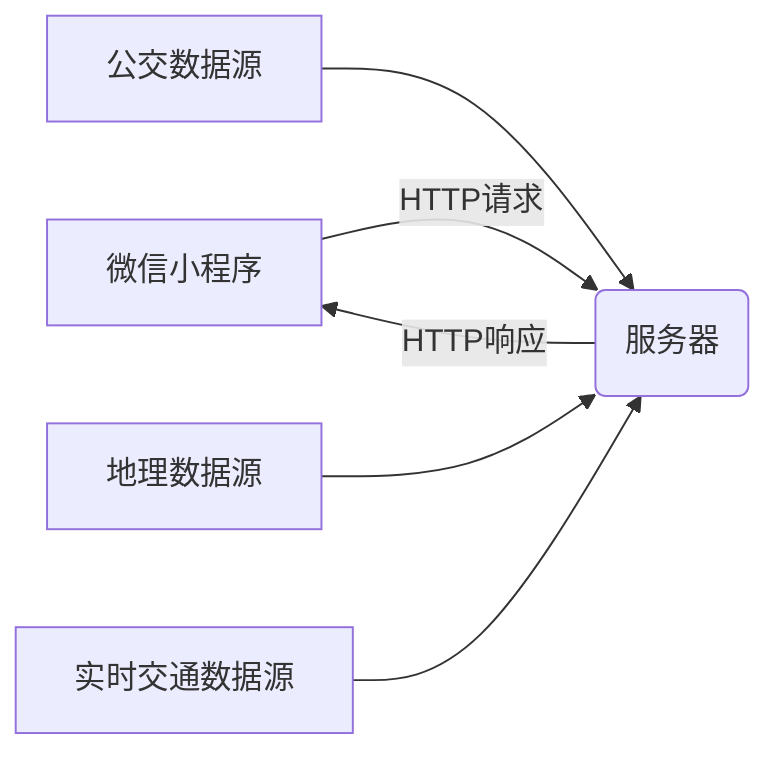

# 微信小程序的城市公交查询系统

## 1. 背景介绍

### 1.1 城市公交出行的重要性

在现代城市生活中,公共交通系统扮演着至关重要的角色。作为一种经济实惠、环保且高效的出行方式,公交系统为市民提供了便捷的交通服务,缓解了城市拥堵问题,减少了空气污染和能源消耗。随着城市化进程的不断推进,公交系统的优化和升级成为了提高城市生活质量的关键因素之一。

### 1.2 传统公交查询系统的局限性

然而,传统的公交查询系统存在诸多不足。例如,需要安装特定的应用程序或访问特定的网站,操作步骤繁琐;信息更新滞后,无法实时反映路线变化;界面设计单一,缺乏个性化和智能化功能等。这些问题严重影响了公交出行的便利性和用户体验。

### 1.3 微信小程序的机遇

微信小程序作为一种全新的轻量级应用模式,为解决上述问题提供了绝佳的机会。小程序无需下载安装,可直接在微信中运行,操作简单便捷;其开放的生态系统支持第三方数据接入,确保信息的实时性;同时,小程序还可以与微信的其他功能无缝集成,为用户提供更加智能化和个性化的服务。

## 2. 核心概念与联系

### 2.1 微信小程序

微信小程序是一种全新的连接用户与服务的技术方案,它可以在微信内被便捷地获取和传播,同时具有出色的体验性能。小程序的开发采用了Web技术,并在源码级进行了优化,使其拥有接近原生App的体验。

### 2.2 公交数据

公交数据是指描述城市公交系统的各种信息,包括线路、站点、车辆位置、时刻表等。获取准确及时的公交数据是构建高效公交查询系统的基础。

### 2.3 地理信息系统(GIS)

地理信息系统(GIS)是一种将地理数据与相关属性信息进行采集、存储、管理、运算、分析、显示和描述的技术系统。在公交查询系统中,GIS技术可用于展示公交线路、站点位置,并辅助路径规划和导航。

### 2.4 实时交通数据

实时交通数据是指反映当前交通状况的动态数据,如车辆位置、路况等。通过整合实时数据,公交查询系统可以为用户提供更加准确的出行信息。

## 3. 核心算法原理和具体操作步骤

### 3.1 公交线路规划算法

#### 3.1.1 Dijkstra算法

Dijkstra算法是一种经典的最短路径算法,可用于计算从起点到其他所有点的最短路径。在公交线路规划中,我们可以将公交网络抽象为一个加权图,其中站点为节点,线路为边,边的权重为行驶距离或时间。通过应用Dijkstra算法,可以找到从起点到目的地的最短路径,即最优公交线路。

算法步骤:

1. 初始化:将起点加入集合S,其余节点加入集合U,并将起点到其余节点的距离初始化为无穷大。
2. 选取距离起点最近的节点u,将u从U中移除,加入S中。
3. 更新U中所有节点的距离值,如果经过u到达该节点的距离更短,则更新距离值。
4. 重复步骤2和3,直到所有节点都被加入S中。

时间复杂度为$O(n^2)$,其中n为节点数量。

#### 3.1.2 A*算法

A*算法是一种常用的启发式搜索算法,可以更高效地求解最短路径问题。在公交线路规划中,我们可以将A*算法应用于加权图,其中边的权重为行驶时间。算法通过估计函数来评估节点到目标节点的剩余成本,从而有效地剪枝搜索空间。

估计函数:$f(n) = g(n) + h(n)$

其中:
- $g(n)$为从起点到当前节点n的实际成本(已走过的路径长度)
- $h(n)$为从当前节点n到目标节点的估计成本(启发函数)

算法步骤:

1. 初始化开放列表和闭合列表,将起点加入开放列表。
2. 从开放列表中选取$f(n)$值最小的节点n。
3. 如果n是目标节点,则结束搜索,输出路径。
4. 将n从开放列表移至闭合列表,并检查n的邻居节点:
    - 如果邻居节点在闭合列表中,则忽略。
    - 如果邻居节点不在开放列表中,则加入开放列表,并计算其$f、g、h$值。
    - 如果邻居节点在开放列表中,但经过n的路径更短,则更新其$g$和$f$值。
5. 重复步骤2-4,直到找到目标节点或开放列表为空。

A*算法的时间复杂度取决于启发函数的质量,在最坏情况下为$O(b^d)$,其中b为节点的分支因子,d为起点到目标节点的最短路径长度。

### 3.2 公交实时位置追踪

#### 3.2.1 卡尔曼滤波

卡尔曼滤波是一种常用的时间序列估计算法,可用于估计系统的内部状态。在公交实时位置追踪中,我们可以将车辆的位置、速度等作为状态变量,利用卡尔曼滤波从GPS数据中估计出这些变量的值。

状态方程:$x_k = Ax_{k-1} + Bu_k + w_k$
观测方程:$z_k = Hx_k + v_k$

其中:
- $x_k$为时刻k的状态向量
- $u_k$为控制输入向量
- $w_k$为过程噪声
- $z_k$为观测值
- $v_k$为观测噪声
- $A、B、H$为状态转移矩阵

算法步骤:

1. 初始化:设定初始状态$\hat{x}_0$和协方差矩阵$P_0$。
2. 预测:计算先验状态估计$\hat{x}_k^-$和协方差$P_k^-$。
3. 更新:根据观测值$z_k$,计算卡尔曼增益$K_k$,更新后验状态估计$\hat{x}_k$和协方差$P_k$。
4. 重复步骤2-3,持续更新状态估计值。

卡尔曼滤波可以有效地滤除噪声,提高位置估计的精度和稳定性。

#### 3.2.2 粒子滤波

粒子滤波是一种基于蒙特卡罗方法的顺序重要性采样技术,可用于非线性非高斯状态估计。在公交实时位置追踪中,粒子滤波可以更好地处理车辆运动的非线性特征和各种不确定因素。

算法步骤:

1. 初始化:生成N个粒子,每个粒子代表一个可能的状态。
2. 预测:根据运动模型,对每个粒子进行状态预测。
3. 更新:根据观测值,计算每个粒子的权重。
4. 重采样:根据权重,从当前粒子集合中重新采样,获得新的粒子集合。
5. 输出:计算粒子集合的均值或众数作为状态估计值。
6. 重复步骤2-5,持续更新状态估计值。

粒子滤波能够有效地处理非线性、非高斯问题,但计算复杂度较高。

## 4. 数学模型和公式详细讲解举例说明

### 4.1 公交线路规划数学模型

假设公交网络可以抽象为一个加权有向图$G=(V,E)$,其中$V$为站点集合,$E$为线路集合。对于任意线路$e\in E$,定义其权重$w(e)$为行驶时间。我们的目标是找到从起点$s$到终点$t$的最短路径,即行驶时间最短的线路组合。

令$d(u,v)$表示从节点$u$到$v$的最短路径长度,则有:

$$d(u,v)=\begin{cases}
0 &\text{if }u=v\\
\min\limits_{e=(u,x)\in E}\{w(e)+d(x,v)\} &\text{if }u\neq v
\end{cases}$$

上式给出了动态规划方程,可以通过Dijkstra算法或A*算法求解。

以A*算法为例,估计函数为:

$$f(n)=g(n)+h(n)$$

其中:

- $g(n)$为从起点$s$到当前节点$n$的实际行驶时间
- $h(n)$为从当前节点$n$到终点$t$的估计行驶时间

一种常用的启发函数是欧几里得距离:

$$h(n)=\sqrt{(x_n-x_t)^2+(y_n-y_t)^2}$$

其中$(x_n,y_n)$和$(x_t,y_t)$分别为节点$n$和$t$的坐标。

通过不断扩展搜索并更新$f(n)$值,A*算法可以有效地找到最短路径。

### 4.2 卡尔曼滤波公式推导

设车辆的状态为$x_k=\begin{bmatrix}p_k\\v_k\end{bmatrix}$,其中$p_k$和$v_k$分别为位置和速度。

状态方程:

$$x_k=\begin{bmatrix}
1&\Delta t\\
0&1
\end{bmatrix}x_{k-1}+\begin{bmatrix}
\frac{1}{2}\Delta t^2\\
\Delta t
\end{bmatrix}a_{k-1}+w_k$$

观测方程:

$$z_k=\begin{bmatrix}1&0\end{bmatrix}x_k+v_k$$

其中$a_{k-1}$为时刻$k-1$的加速度,$w_k$和$v_k$分别为过程噪声和观测噪声,服从高斯分布。

令$\hat{x}_k^-$和$\hat{x}_k$分别表示时刻$k$的先验估计和后验估计,则卡尔曼滤波算法为:

1) 预测:
$$\hat{x}_k^-=A\hat{x}_{k-1}+Bu_{k-1}$$
$$P_k^-=AP_{k-1}A^T+Q$$

2) 更新:
$$K_k=P_k^-H^T(HP_k^-H^T+R)^{-1}$$
$$\hat{x}_k=\hat{x}_k^-+K_k(z_k-H\hat{x}_k^-)$$
$$P_k=(I-K_kH)P_k^-$$

其中$A,B,H$为状态转移矩阵,$Q$和$R$分别为过程噪声和观测噪声的协方差矩阵,$K_k$为卡尔曼增益。

通过迭代计算,卡尔曼滤波可以获得车辆状态的最优估计值。

## 5. 项目实践:代码实例和详细解释说明

### 5.1 系统架构

我们的城市公交查询系统采用前端(微信小程序)和后端(服务器)分离的架构。前端负责用户交互和数据展示,后端负责数据处理和算法计算。两者通过RESTful API进行通信。



### 5.2 前端实现

#### 5.2.1 小程序框架

我们使用微信官方提供的小程序框架进行开发,主要包括以下几个部分:

- `app.js`: 小程序的入口文件,用于注册全局数据和方法。
- `pages`: 存放各个页面的代码,每个页面包含`.wxml`(结构)、`.wxss`(样式)和`.js`(逻辑)三个文件。
- `utils`: 存放公共的工具函数。
- `config.js`: 存放全局配置信息,如API地址等。

#### 5.2.2 页面布局

以线路查询页面为例,其`.wxml`文件的结构如下:

```xml
<view class="container">
  <view class="search-bar">
    <!-- 搜索框 -->
  </view>
  <view class="map-container">
    <!-- 地图组件 -->