# 财务管理系统详细设计与具体代码实现

## 1.背景介绍

### 1.1 财务管理系统的重要性

财务管理是企业经营管理的核心环节之一,涉及资金筹集、资金运用和资金监控等多个方面。有效的财务管理不仅能够确保企业资金的安全性和流动性,还能提高资金使用效率,为企业创造更多的经济效益。因此,构建一套完善的财务管理系统对于企业的健康发展至关重要。

### 1.2 传统财务管理模式的缺陷

传统的财务管理模式主要依赖人工处理,存在诸多弊端:

- 工作效率低下,重复性劳动占用大量人力
- 数据存在差错,难以保证财务数据的准确性
- 缺乏实时监控,无法及时发现财务风险
- 报表生成周期长,决策支持能力有限

### 1.3 财务管理系统的作用

基于以上传统模式的不足,构建财务管理信息系统已成为大多数企业的迫切需求。通过将财务管理工作流程信息化、自动化和智能化,财务管理系统可以极大提高工作效率,确保数据准确性,实现实时监控和快速决策支持,从而有效规避财务风险,提升企业竞争力。

## 2.核心概念与联系

### 2.1 总账和明细账

总账(General Ledger)是记录企业所有经济业务活动的账簿,是财务核算的基础,反映企业财务状况和经营成果的全部情况。

明细账(Subsidiary Ledger)是对总账的进一步细分,记录某一类具体经济业务的明细数据,如应收账款明细账、应付账款明细账等。

总账与明细账相辅相成,总账提供整体数据,明细账提供分类细节,两者相互核对、相互restraint。

### 2.2 会计科目

会计科目是财务核算的基本单位,用于区分不同经济业务的类型。常见的会计科目包括资产类、负债类、权益类、收入类、费用类等。每一项经济业务都需要按照"借方科目、贷方科目"的形式进行记账,以保证会计核算的"借贷平衡"。

### 2.3 出纳管理

出纳是指现金和银行存款的收付管理。出纳管理包括现金和银行存款的日常收付、保管、核算等工作,是财务管理的重要组成部分。出纳管理的目标是确保资金的安全性和流动性。

### 2.4 财务报表

财务报表是反映企业财务状况和经营成果的文件,包括资产负债表、利润表、现金流量表等。财务报表是企业对外提供财务信息的主要载体,也是企业内部进行财务分析和决策的重要依据。

## 3.核心算法原理具体操作步骤

### 3.1 总分类账核算

总分类账核算是财务核算的基本方法,遵循以下步骤:

1. 按照经济业务的类型,设置相应的会计科目
2. 将发生的经济业务按照"借方科目、贷方科目"的形式,同时分别记入总账和明细账
3. 定期将明细账的数据与总账的数据核对,确保两者的一致性
4. 根据总账的数据,编制财务报表

### 3.2 出纳管理流程

出纳管理的基本流程包括:

1. 现金和银行存款的收款
   - 收到现金或银行存款时,出纳员需要审核相关单据
   - 在总账和明细账中同时记录收款金额和科目
2. 现金和银行存款的付款
   - 根据经手人的付款申请单,审核付款事由和金额
   - 在总账和明细账中同时记录付款金额和科目
3. 现金和银行存款的日常核算
   - 每日核对现金和银行存款的实际余额与账面余额
   - 发现差异时,及时查明原因并调整账目
4. 现金和银行存款的保管
   - 现金存放于指定的现金柜或银行
   - 严格执行现金和银行存款的审批手续

### 3.3 财务报表的生成

财务报表的生成流程如下:

1. 从总账中导出本期发生额和期末余额等数据
2. 按照规定的报表格式,填充相应的数据项
3. 对报表数据进行审核,确保无误后输出报表文件
4. 将报表数据按规定的方式对外披露或内部分析

常见的财务报表包括:

- 资产负债表:反映企业资产、负债和所有者权益情况
- 利润表:反映企业获利能力和经营成果
- 现金流量表:反映企业现金流入、流出和结余情况

## 4.数学模型和公式详细讲解举例说明

在财务管理系统中,有一些常用的数学模型和公式,用于计算和分析财务数据。

### 4.1 会计分录模型

会计分录是指根据一项经济业务,确定其对应的"借方科目、贷方科目和金额"。会计分录模型可以用一个三元组来表示:

$$
(借方科目, 贷方科目, 金额)
$$

例如,一笔销售收入10000元的分录为:

$$
(应收账款, 主营业务收入, 10000)
$$

### 4.2 财务比率分析

财务比率是利用财务报表数据计算得到的相对数字,用于分析企业的财务状况和经营成果。常用的财务比率包括:

1. 流动比率 = 流动资产 / 流动负债

   衡量企业短期偿债能力,比率越高,短期偿债能力越强。

2. 资产负债率 = 负债总额 / 资产总额 × 100%

   反映企业资产的债务风险程度,比率越低,风险越小。

3. 净资产收益率 = 净利润 / 所有者权益 × 100%

   反映所有者权益的收益水平,比率越高,收益能力越强。

### 4.3 现金流量分析

现金流量分析是评估企业现金流入、流出和结余情况的重要手段。现金流量表中的主要计算公式为:

$$
\begin{aligned}
期初现金余额 &= 上期期末现金余额\\
本期现金流入 &= 经营活动现金流入 + 投资活动现金流入 + 筹资活动现金流入\\
本期现金流出 &= 经营活动现金流出 + 投资活动现金流出 + 筹资活动现金流出\\
期末现金余额 &= 期初现金余额 + 本期现金流入 - 本期现金流出
\end{aligned}
$$

## 4.项目实践:代码实例和详细解释说明

为了更好地理解财务管理系统的设计与实现,我们将通过一个基于Java语言的项目实例来进行说明。该项目采用三层架构设计,包括表示层(View)、业务逻辑层(BLL)和数据访问层(DAL)。

### 4.1 系统架构设计

```mermaid
classDiagram
    View <|-- MainFrame
    View <|-- AccountingDocDialog
    View <|-- GeneralLedgerPanel
    View <|-- SubsidiaryLedgerPanel
    View <|-- FinancialReportPanel
    BLL <|-- AccountingService
    BLL <|-- GeneralLedgerManager
    BLL <|-- SubsidiaryLedgerManager
    BLL <|-- FinancialReportGenerator
    DAL <|-- AccountingDAO
    DAL <|-- GeneralLedgerDAO
    DAL <|-- SubsidiaryLedgerDAO
    class MainFrame {
        -panels: List~Panel~
        +showPanel(panel: Panel)
    }
    class AccountingDocDialog {
        -voucherData: VoucherData
        +createVoucher()
        +updateVoucher()
    }
    class GeneralLedgerPanel {
        -table: JTable
        +showGeneralLedger()
    }
    class SubsidiaryLedgerPanel {
        -table: JTable
        +showSubsidiaryLedger()
    }
    class FinancialReportPanel {
        -reportViewer: JPanel
        +showBalanceSheet()
        +showIncomeStatement()
        +showCashFlowStatement()
    }
    class AccountingService {
        +createVoucher(voucherData: VoucherData)
        +updateVoucher(voucherData: VoucherData)
    }
    class GeneralLedgerManager {
        +getGeneralLedgerData()
    }
    class SubsidiaryLedgerManager {
        +getSubsidiaryLedgerData()
    }
    class FinancialReportGenerator {
        +generateBalanceSheet()
        +generateIncomeStatement()
        +generateCashFlowStatement()
    }
    class AccountingDAO {
        +insertVoucher(voucherData: VoucherData)
        +updateVoucher(voucherData: VoucherData)
    }
    class GeneralLedgerDAO {
        +getGeneralLedgerData()
    }
    class SubsidiaryLedgerDAO {
        +getSubsidiaryLedgerData()
    }
```



该系统架构主要包括以下几个部分:

1. 表示层(View)
   - `MainFrame`: 主窗口,负责显示各个面板
   - `AccountingDocDialog`: 用于创建和修改会计凭证
   - `GeneralLedgerPanel`: 显示总账数据
   - `SubsidiaryLedgerPanel`: 显示明细账数据
   - `FinancialReportPanel`: 显示财务报表

2. 业务逻辑层(BLL)
   - `AccountingService`: 处理会计凭证的创建和修改
   - `GeneralLedgerManager`: 管理总账数据
   - `SubsidiaryLedgerManager`: 管理明细账数据
   - `FinancialReportGenerator`: 生成财务报表

3. 数据访问层(DAL)
   - `AccountingDAO`: 访问会计凭证数据
   - `GeneralLedgerDAO`: 访问总账数据
   - `SubsidiaryLedgerDAO`: 访问明细账数据

### 4.2 核心代码实现

#### 4.2.1 会计凭证处理

会计凭证是记录经济业务的基本单位,包括凭证号、日期、摘要、分录等信息。我们定义一个`VoucherData`类来表示凭证数据:

```java
public class VoucherData {
    private String voucherNo;
    private Date voucherDate;
    private String summary;
    private List<VoucherEntry> entries;

    // 构造函数、getter和setter方法
}
```

其中,`VoucherEntry`类表示一条分录:

```java
public class VoucherEntry {
    private String debitAccount;
    private String creditAccount;
    private BigDecimal amount;

    // 构造函数、getter和setter方法
}
```

在`AccountingService`中,我们提供了创建和修改凭证的方法:

```java
public class AccountingService {
    private AccountingDAO accountingDAO;

    public void createVoucher(VoucherData voucherData) {
        // 校验凭证数据
        validateVoucherData(voucherData);

        // 保存凭证数据到数据库
        accountingDAO.insertVoucher(voucherData);

        // 更新总账和明细账
        updateLedgers(voucherData);
    }

    public void updateVoucher(VoucherData voucherData) {
        // 校验凭证数据
        validateVoucherData(voucherData);

        // 更新数据库中的凭证数据
        accountingDAO.updateVoucher(voucherData);

        // 更新总账和明细账
        updateLedgers(voucherData);
    }

    private void validateVoucherData(VoucherData voucherData) {
        // 验证凭证号、日期、摘要等必填项
        // 验证分录的借贷平衡
        // ...
    }

    private void updateLedgers(VoucherData voucherData) {
        // 根据凭证分录更新总账和明细账
        // ...
    }
}
```

在`AccountingDAO`中,我们实现了插入和更新凭证数据的方法,这里以MySQL数据库为例:

```java
public class AccountingDAO {
    private Connection conn;

    public void insertVoucher(VoucherData voucherData) {
        String sql = "INSERT INTO voucher (voucher_no, voucher_date, summary) VALUES (?, ?, ?)";
        try (PreparedStatement stmt = conn.prepareStatement(sql)) {
            stmt.setString(1, voucherData.getVoucherNo());
            stmt.setDate(2, new java.sql.Date(voucherData.getVoucherDate().getTime()));
            stmt.setString(3, voucherData.getSummary());
            stmt.executeUpdate();

            // 插入凭证分录
            insertVoucherEntries(voucherData.getVoucherNo(), voucherData.getEntries());
        } catch (SQLException e) {
            e.printStackTrace();
        }
    }

    public void updateVoucher(VoucherData voucherData) {
        String sql = "UPDATE voucher SET voucher_date = ?, summary = ? WHERE voucher_no = ?";
        try (PreparedStatement stmt = conn{"msg_type":"generate_answer_finish"}