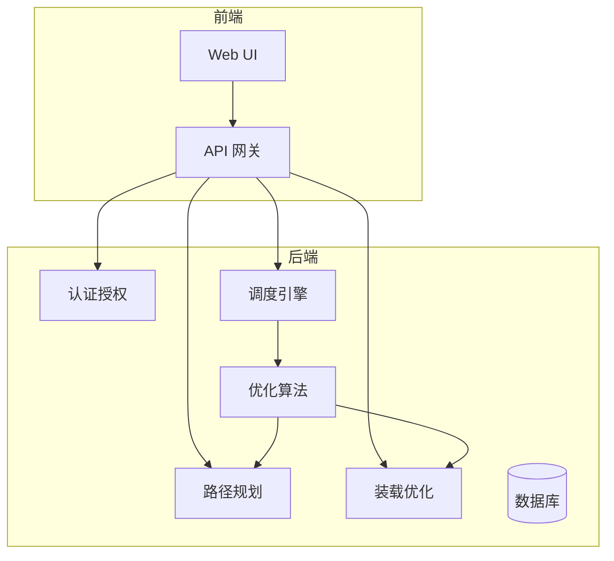

# 1. 背景介绍

## 1.1 车队调度的重要性

在现代社会中,物流运输行业扮演着至关重要的角色。无论是生活必需品还是工业原材料,都需要通过高效的运输网络进行配送。而车队调度管理系统正是确保物流运输高效运转的关键所在。

## 1.2 传统车队调度面临的挑战

传统的车队调度方式主要依赖人工经验和简单的规则,这种方式存在以下几个主要问题:

- **效率低下** 人工调度无法快速响应动态变化的运输需求,导致车辆利用率不高。
- **成本高昂** 由于调度不合理,会产生较多的空载行驶,浪费大量燃料和人力成本。
- **服务质量难以保证** 人工调度难以兼顾多种约束条件,如时间窗口、车辆载重量等,无法为客户提供高质量服务。

## 1.3 智能调度系统的优势

基于人工智能技术的智能车队调度管理系统,能够克服传统方式的诸多缺陷,主要优势包括:

- **高效动态调度** 能够实时处理动态订单,快速生成优化的调度方案。
- **降低运营成本** 通过优化路径规划和装载算法,减少空载行驶,节省燃料和人力。
- **提升服务质量** 综合考虑多种约束,为客户提供更加可靠和高效的运输服务。

# 2. 核心概念与联系 

## 2.1 车辆路径优化问题

车辆路径优化(Vehicle Routing Problem, VRP)是车队调度的核心问题。它需要在满足一系列约束条件(如车辆载重量、时间窗口等)的前提下,为车队规划出一组最优路径,使总行驶距离(或时间)最小化。

## 2.2 装载优化问题

装载优化(Loading Problem)是另一个重要问题。它需要合理安排货物在车辆上的摆放位置,使车辆的总载重量不超过限制,并且满足一些特殊约束(如易碎品不能在底部等)。

## 2.3 两个问题的联系

车辆路径优化和装载优化问题存在紧密联系:

- 装载方案会影响车辆的可用载重量,进而影响可行路径。
- 路径的不同也会影响装载的可行性(如装载顺序等)。

因此,在设计调度系统时,需要同时考虑这两个问题,并在它们之间寻求最优平衡。

# 3. 核心算法原理和具体操作步骤

## 3.1 车辆路径优化算法

### 3.1.1 问题建模

车辆路径优化可以建模为一个组合优化问题。令$G=(V,E)$表示路网,其中$V$是节点集合(包括配送中心和客户地点),$E$是路段集合。对每条边$(i,j) \in E$,定义其代价$c_{ij}$(如行驶距离或时间)。

令$K$为车辆数量,$Q_k$为第$k$车的载重量限制。每个客户$i$有一个服务量$q_i$和一个时间窗口$[e_i,l_i]$,表示必须在$[e_i,l_i]$时间段内为其服务。

目标是找到$K$条路径$R=\{R_1,R_2,...,R_K\}$,使总代价$\sum_{k=1}^K\sum_{(i,j)\in R_k}c_{ij}$最小,同时满足:

- 每个客户仅被服务一次
- 每条路径的总服务量不超过对应车辆的载重量限制
- 每条路径的服务时间满足所有客户的时间窗口约束

这是一个NP-hard的组合优化问题,无法在可接受的时间内精确求解,因此需要使用启发式或近似算法。

### 3.1.2 算法流程

一种常用的启发式算法是分层策略:

1. **构造初始解**
    - 从配送中心出发,使用启发式规则(如最近邻、最远插入等)构造出初始的可行解。

2. **局部优化**
    - 使用局部搜索算法(如2-opt、交换等)对初始解进行优化,消除路径中的冗余环路,缩短总行驶距离。

3. **全局优化** 
    - 在局部最优解的基础上,使用元启发式算法(如模拟退火、禁忌搜索等)进一步跳出局部最优,尽可能接近全局最优解。

4. **后处理**
    - 对优化后的解进行进一步的路径平滑、负载均衡等处理,提高实际可行性。

以上算法可以通过并行计算、增加启发式规则等方式进行加速,以满足实时调度的需求。

### 3.1.3 数学模型

我们可以使用整数线性规划模型对VRP问题进行精确建模:

**决策变量**:
- $x_{ijk}$: 如果车辆$k$经过路段$(i,j)$则为1,否则为0
- $y_{ik}$: 如果客户$i$被车辆$k$服务则为1,否则为0

**目标函数**:
$$\min \sum_{i \in V}\sum_{j \in V}\sum_{k=1}^K c_{ij}x_{ijk}$$

**约束条件**:

- 每个客户被且仅被服务一次:
$$\sum_{k=1}^K y_{ik} = 1 \quad \forall i \in V \setminus \{0\}$$

- 车辆进出客户点的流量平衡:
$$\sum_{j \in V} x_{ijk} - \sum_{j \in V} x_{jik} = y_{ik} \quad \forall i \in V, k=1,...,K$$

- 每条路径的载重量限制:
$$\sum_{i \in V \setminus \{0\}} q_i y_{ik} \leq Q_k \quad \forall k=1,...,K$$

- 时间窗口约束:
$$e_i \leq t_i \leq l_i \quad \forall i \in V \setminus \{0\}$$

- 其他约束(如子环消除等)

其中$t_i$表示车辆到达客户$i$的时间,可以通过额外的变量和约束来建模。

由于这是一个NP-hard问题,对于大规模实例无法在可接受时间内求解,因此通常使用上述启发式算法求解。

## 3.2 装载优化算法

### 3.2.1 问题建模

装载优化问题可以看作是将一组箱体(货物)装载到一个容器(车厢)中的排样问题。我们需要确定每个箱体在容器中的位置和方向,使得:

- 所有箱体都被装载
- 箱体之间不重叠
- 满足一些特殊约束(如易碎品不能在底部等)

通常假设箱体和容器都是长方体,可以用三元组$(l,w,h)$表示长宽高。对于每个箱体$i$,已知其长宽高$\{l_i,w_i,h_i\}$和重量$m_i$。容器的尺寸为$(L,W,H)$,载重量限制为$M$。

### 3.2.2 算法流程

装载优化也是一个NP-hard问题,常用的启发式算法包括:

1. **层级装载算法**
    - 将容器分成水平层级,在每层内使用底面建筑法则进行装载。
    - 优点是简单高效,但无法处理复杂约束。

2. **体积驱动层级装载算法**
    - 先对箱体按体积大小排序,依次装载大箱体,再填充剩余空间。
    - 可以有效利用空间,但对易碎品等约束处理不佳。

3. **基于规则的启发式算法**
    - 设计一些装载规则,如易碎品放上层、重物靠下等。
    - 根据规则对箱体进行分类和排序,再进行装载。
    - 可处理一些特殊约束,但规则设计复杂。

4. **元启发式算法**
    - 使用模拟退火、遗传算法等元启发式算法进行全局优化。
    - 性能较好,但计算代价高。

在实际应用中,通常会将上述算法进行组合和改进,以平衡计算效率和装载质量。

### 3.2.3 数学模型

我们可以使用三维条带装载模型(3D Strip Packing)对装载问题进行建模:

**决策变量**:
- $x_i,y_i,z_i$: 箱体$i$在容器中的位置坐标
- $l_i,w_i,h_i$: 箱体$i$的长宽高
- $o_i \in \{0,1,2,3,4,5\}$: 箱体$i$的朝向

**目标函数**:
$$\min \max\limits_{1 \leq i \leq n} \{x_i + l_i, y_i + w_i, z_i + h_i\}$$

**约束条件**:

- 箱体被完全装载:
$$\sum_{i=1}^n l_i w_i h_i \leq L W H$$

- 箱体不重叠:
$$\begin{align*}
&x_i + l_i \leq x_j \quad \text{or} \quad x_j + l_j \leq x_i\\
&y_i + w_i \leq y_j \quad \text{or} \quad y_j + w_j \leq y_i\\
&z_i + h_i \leq z_j \quad \text{or} \quad z_j + h_j \leq z_i
\end{align*}$$

- 箱体朝向约束:
$$\begin{align*}
&(l_i, w_i, h_i) = \begin{cases}
(L_i, W_i, H_i) &\text{if } o_i = 0\\
(L_i, H_i, W_i) &\text{if } o_i = 1\\
(W_i, L_i, H_i) &\text{if } o_i = 2\\
(W_i, H_i, L_i) &\text{if } o_i = 3\\
(H_i, W_i, L_i) &\text{if } o_i = 4\\
(H_i, L_i, W_i) &\text{if } o_i = 5
\end{cases}
\end{align*}$$

- 其他特殊约束(如易碎品位置等)

这是一个混合整数规划模型,对于大规模实例也很难精确求解,因此通常使用上述启发式算法。

# 4. 项目实践:代码实例和详细解释说明

## 4.1 系统架构

我们的车队调度管理系统采用前后端分离的架构,具体如下:



- **Web UI**: 提供友好的用户界面,用于输入订单信息、查看调度方案等。
- **API 网关**: 统一暴露系统API,对请求进行鉴权、路由等处理。
- **认证授权模块**: 管理用户身份,控制访问权限。
- **路径规划模块**: 根据路网数据,提供最短路径查询服务。
- **装载优化模块**: 根据车型和货物信息,给出最优装载方案。
- **调度引擎**: 系统的核心模块,集成优化算法,生成整体调度方案。
- **优化算法模块**: 实现前文提到的各种优化算法。
- **数据库**: 存储路网、车辆、订单等数据。

## 4.2 优化算法实现

以下是优化算法的核心代码实现,以Python伪代码的形式展示。

### 4.2.1 车辆路径优化

```python
from ortools.constraint_solver import pywrapcp

def solve_vrp(data):
    """使用OR-Tools求解VRP"""
    # 创建模型
    manager = pywrapcp.RoutingModelManager(
        data['locations'], data['num_vehicles'], data['depot'])
    routing = manager.RoutingModel()

    # 设置约束
    distance = create_distance_callback(data)
    transit_callback_index = routing.RegisterTransitCallback(distance)
    routing.SetArcCostEvaluatorOfAllVehicles(transit_callback_index)
    
    # 添加时间窗口约束
    time_dimension = routing.CreateDimensionTransitVariables(
        'Time', 30, 60, data['time_windows'])
    routing.AddDimensionWithVehicleTransitAndCapacity(
        time_dimension, 0, data['vehicle_{"msg_type":"generate_answer_finish"}