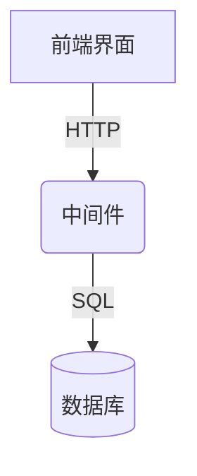
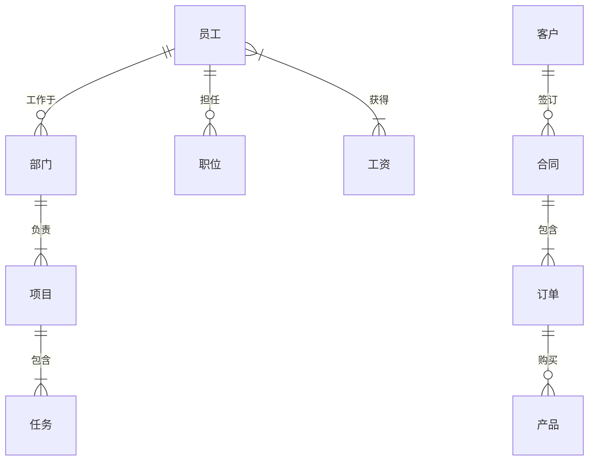
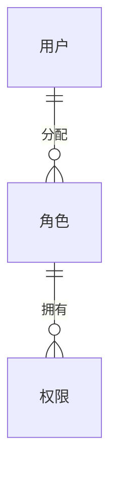

# 1. 背景介绍

## 1.1 公司管理系统的重要性

在当今快节奏的商业环境中，高效的公司管理系统对于确保企业的顺利运营至关重要。随着公司规模的不断扩大和业务复杂度的增加,传统的手工管理方式已经无法满足现代企业的需求。因此,开发一个全面、灵活且易于使用的公司管理系统,能够帮助企业提高运营效率、降低管理成本、优化资源分配,并为决策者提供准确及时的信息支持。

## 1.2 系统设计目标

本文旨在详细阐述一个完整的公司管理系统的设计思路和实现过程,包括系统架构、核心功能模块、数据模型、业务逻辑等多个方面。该系统的主要目标包括:

1. 集中管理公司的人力资源、财务、项目、客户等核心业务数据。
2. 提供高效的数据查询、统计和报表生成功能,为决策提供支持。
3. 实现跨部门的信息共享和协作,提高工作效率。
4. 具有良好的可扩展性和可维护性,以适应未来业务发展需求。
5. 提供友好的用户界面,降低使用门槛。

# 2. 核心概念与联系

## 2.1 系统架构概览

公司管理系统通常采用三层或多层架构,包括表现层(前端)、业务逻辑层(中间件)和数据访问层。前端通常采用 Web 技术实现,为用户提供友好的图形界面;中间件负责处理业务逻辑,实现各功能模块的核心功能;数据访问层则负责与数据库进行交互,执行数据持久化操作。



## 2.2 核心功能模块

一个典型的公司管理系统通常包括以下核心功能模块:

### 2.2.1 人力资源管理

包括员工信息管理、招聘管理、培训管理、绩效考核、薪酬福利等子模块。

### 2.2.2 财务管理

包括总账管理、收付管理、费用报销、税务管理、资产管理等子模块。

### 2.2.3 项目管理

包括项目计划、任务分配、进度跟踪、风险管控、文档管理等子模块。

### 2.2.4 客户关系管理

包括客户信息管理、营销机会管理、合同管理、售后服务等子模块。

### 2.2.5 供应链管理

包括采购管理、库存管理、物流管理等子模块。

### 2.2.6 系统管理

包括权限管理、日志审计、系统配置等子模块。

## 2.3 数据模型概览

系统的数据模型是系统设计的基础,通常采用关系数据库进行持久化存储。核心数据实体包括员工、部门、职位、工资、项目、任务、客户、合同、订单、产品等。这些实体之间存在着复杂的关联关系,如一对一、一对多、多对多等,需要在数据库设计阶段予以体现。



# 3. 核心算法原理和具体操作步骤

## 3.1 系统权限管理

权限管理是系统安全的基石,需要对用户、角色和权限之间的关系进行建模,并实现高效的权限验证和授权机制。

### 3.1.1 RBAC模型

基于角色的访问控制(RBAC)是一种行之有效的权限管理模型。其核心思想是:在用户和权限之间,引入角色的概念,用户与角色相关联,角色与权限相关联。这样通过分配角色给用户,就间接地将相应的权限也分配给了用户。



### 3.1.2 权限验证算法

1) 获取当前用户的所有角色集合 $R$
2) 获取所有角色的权限集合 $P$
3) 计算用户的权限集合 $U = \bigcup\limits_{r \in R} P(r)$
4) 判断当前请求的操作 $a$ 是否包含在 $U$ 中,如果包含则放行,否则拒绝访问

该算法的时间复杂度为 $O(n+m)$,其中 $n$ 为用户角色数,$ m$ 为系统权限数。

## 3.2 项目进度计算

项目进度的计算是项目管理的一个核心环节,需要考虑任务之间的依赖关系、工期估算等多方面因素。

### 3.2.1 关键路径算法

关键路径算法用于计算完成整个项目的最短时间,即项目的理论工期。它基于活动在节点网络中的拓扑排序,采用动态规划的思想求解。

对于有向无环图 $G=(V,E)$,其中节点表示活动,边表示活动之间的依赖关系。算法步骤如下:

1) 计算每个节点的最早开始时间 $ES$
2) 计算每个节点的最晚开始时间 $LS$
3) 将所有满足 $ES(u) + d(u,v) = LS(v)$ 的边 $(u,v)$ 标记为关键活动
4) 关键路径即由所有关键活动构成的路径

该算法的时间复杂度为 $O(|V|+|E|)$。

### 3.2.2 项目进度计算

已知项目关键路径的理论工期 $D$,以及当前时间 $t$,已完成活动集合 $C$,则项目的理论进度为:

$$\text{Progress} = \frac{\sum\limits_{u \in C}d(u)}{D} \times 100\%$$

其中 $d(u)$ 表示活动 $u$ 的工期。

# 4. 数学模型和公式详细讲解举例说明

## 4.1 人力资源核心数学模型

### 4.1.1 工资计算模型

工资通常由多个部分组成,包括基本工资、绩效工资、补贴等。设员工 $i$ 的基本工资为 $b_i$,绩效工资为 $p_i$,补贴为 $a_i$,则员工 $i$ 的月薪为:

$$w_i = b_i + p_i + a_i$$

绩效工资 $p_i$ 通常由员工的绩效评分 $s_i$ 和系数 $\alpha$ 决定:

$$p_i = \alpha s_i$$

其中 $\alpha$ 是公司制定的绩效系数,用于调节绩效工资的占比。

### 4.1.2 员工编制模型

为了控制人力成本,公司需要根据业务发展需求,合理制定员工编制计划。设公司年度营收目标为 $R$,平均员工营收贡献为 $\rho$,则所需员工人数 $N$ 为:

$$N = \lceil\frac{R}{\rho}\rceil$$

该模型忽略了部门、职位等因素,在实际应用中需要进行调整。

### 4.1.3 实例分析

某公司员工张三的基本工资为 8000 元,绩效评分为 85 分(满分 100 分),补贴 1000 元,绩效系数 $\alpha = 0.5$。则张三的月薪为:

$$\begin{aligned}
p_3 &= 0.5 \times 85 = 42.5 \\
w_3 &= 8000 + 42.5 + 1000 = 9042.5
\end{aligned}$$

如果公司年度营收目标为 1 亿元,平均员工营收贡献为 100 万元,则所需员工人数为:

$$N = \lceil\frac{10000}{ 100}\rceil = 100$$

## 4.2 项目管理数学模型

### 4.2.1 资源平衡模型

在项目执行过程中,需要合理分配有限的资源(人力、物力等),使项目按期保质保量地完成。设有 $n$ 个活动,每个活动 $i$ 需要 $r_i$ 个单位的资源,持续时间为 $d_i$,并且活动 $i$ 必须在时间 $[es_i,ls_i]$ 内完成。令决策变量 $x_{it}$ 表示在时间 $t$ 分配给活动 $i$ 的资源量,则资源平衡模型为:

$$\begin{aligned}
\text{min} &\quad \sum_{i=1}^n\sum_{t=es_i}^{ls_i}x_{it} \\
\text{s.t.} &\quad \sum_{t=es_i}^{ls_i}x_{it} = r_id_i,\quad i=1,2,\ldots,n\\
&\quad \sum_{i=1}^nx_{it} \le R_t,\quad t=1,2,\ldots,T\\
&\quad x_{it} \ge 0,\quad i=1,2,\ldots,n;\ t=es_i,es_i+1,\ldots,ls_i
\end{aligned}$$

其中 $R_t$ 为时间 $t$ 的可用资源量。该模型是一个整数规划问题,可使用分支定界法等算法求解。

### 4.2.2 项目经费控制模型

为了控制项目的总体成本,需要在项目执行过程中动态调整资金使用计划。设项目预算为 $B$,活动 $i$ 的实际成本为 $c_i$,则项目经费控制模型为:

$$\begin{aligned}
\text{min} &\quad \sum_{i=1}^n(c_i - \hat{c}_i)^2\\
\text{s.t.} &\quad \sum_{i=1}^nc_i \le B\\
&\quad c_i \ge 0,\quad i=1,2,\ldots,n
\end{aligned}$$

其中 $\hat{c}_i$ 为活动 $i$ 的计划成本,目标函数旨在最小化实际成本与计划成本的差异。该模型是一个二次规划问题,可使用内点法等算法求解。

# 5. 项目实践:代码实例和详细解释说明

为了更好地说明系统的实现细节,我们将以 Java 语言为例,展示部分核心模块的代码实现。

## 5.1 权限管理模块

### 5.1.1 实体类

```java
// 用户实体
@Entity
public class User {
    @Id
    private Long id;
    private String username;
    @ManyToMany
    private Set<Role> roles;
    // ...
}

// 角色实体 
@Entity
public class Role {
    @Id 
    private Long id;
    private String name;
    @ManyToMany
    private Set<Permission> permissions;
    // ...
}

// 权限实体
@Entity 
public class Permission {
    @Id
    private Long id;
    private String name;
    private String description;
    // ...
}
```

使用 JPA 注解对实体类进行映射,`User`、`Role`、`Permission` 三者之间通过 `@ManyToMany` 注解建立多对多关联关系。

### 5.1.2 权限验证

```java
@Component
public class PermissionChecker {
    
    @Autowired
    private UserRepository userRepo;

    public boolean check(String username, String permission) {
        User user = userRepo.findByUsername(username);
        Set<String> permissions = getPermissions(user);
        return permissions.contains(permission);
    }

    private Set<String> getPermissions(User user) {
        Set<String> permissions = new HashSet<>();
        Set<Role> roles = user.getRoles();
        for (Role role : roles) {
            for (Permission perm : role.getPermissions()) {
                permissions.add(perm.getName());
            }
        }
        return permissions;
    }
}
```

`PermissionChecker` 类实现了权限验证的核心逻辑,其中 `check` 方法根据用户名和请求的权限字符串,判断当前用户是否拥有该权限。`getPermissions` 方法则根据用户的角色集合,获取该用户所拥有的所有权限。

### 5.1.3 权限注解

```java
@Target(ElementType.METHOD)
@Retention(RetentionPolicy.RUNTIME)
public @interface PreAuthorize {
    String value();
}
```

自定义 `@PreAuthorize` 注解,用于标记需要进行权限验证的方法。

```java
@Component
@Aspect
public class PermissionAsp