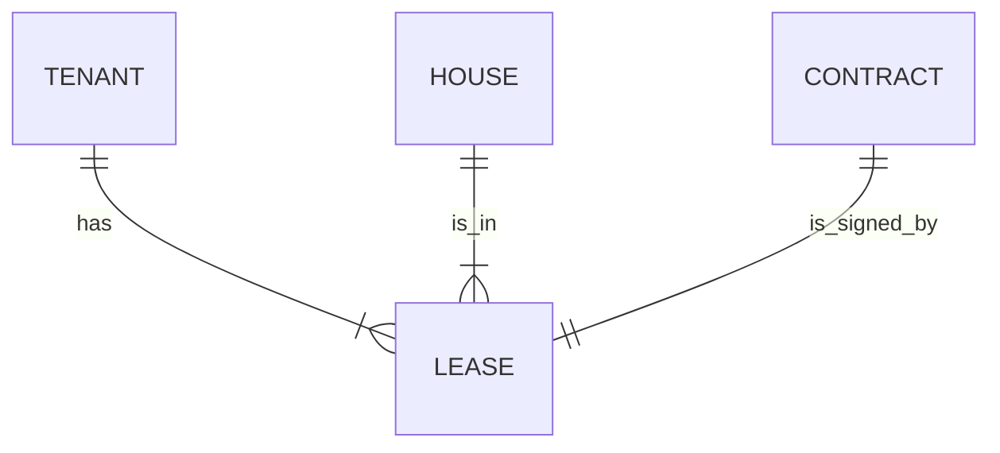

## 1.背景介绍

房屋租赁市场是日益活跃的一个行业，伴随着社会的发展，房屋租赁市场的需求越来越大。然而，传统的房屋租赁方式存在诸多不便，如信息不透明，合同管理混乱，租客权益保护不力等。为了解决这些问题，我们需要一个房屋租赁管理信息系统。本文将详细介绍这个系统的设计和实现过程。

## 2.核心概念与联系

在设计房屋租赁管理信息系统时，我们需要对以下几个核心概念有深入理解：

- **租赁信息管理**：租赁信息管理是房屋租赁管理信息系统的核心功能之一，包括房屋信息的发布、修改、删除，以及查询等功能。

- **合同管理**：合同管理主要负责租赁合同的签订、修改、终止和查询。

- **租客管理**：租客管理主要涉及租客的注册、登录、信息修改和查询等功能。

- **系统管理**：系统管理主要包括系统设置、权限管理、操作日志等功能。

以上四个模块相互关联，共同构成了房屋租赁管理信息系统的核心框架。

## 3.核心算法原理和具体操作步骤

在进行房屋租赁管理信息系统的设计和实现时，我们主要采用了MVC（Model-View-Controller）架构模式。MVC模式将业务逻辑、数据和用户界面分离，使得修改任一部分都不会影响其他部分，从而提高了软件的可维护性和可复用性。

具体操作步骤如下：

1. **需求分析**：明确系统需要完成的功能，制定相应的功能模块。

2. **数据库设计**：根据功能需求设计数据库表结构。

3. **系统设计**：根据MVC架构模式设计系统架构。

4. **编程实现**：根据系统设计进行编程实现。

5. **系统测试**：对系统进行各项功能测试，确保其正常运行。

## 4.数学模型和公式详细讲解举例说明

在设计房屋租赁管理信息系统时，我们可以使用ER模型（Entity-Relationship Model）来描述系统中的实体和实体之间的关系。ER模型是一种数据模型，它使用实体集、关系集和属性三种基本概念来描述现实世界。在ER模型中，实体可以对应到数据库中的表，关系可以对应到表之间的关联。

例如，我们可以定义“租客”、“房屋”和“合同”三个实体集，定义“租赁”关系集，如下图所示：

在这个模型中，“租客”实体集有属性“姓名”、“电话”等，“房屋”实体集有属性“地址”、“租金”等，“合同”实体集有属性“合同编号”、“签订日期”等。“租赁”关系集表示租客、房屋和合同之间的关系。

## 5.实际应用场景

房屋租赁管理信息系统可以广泛应用于房地产公司、物业公司、租赁公司等场所。通过系统，租客可以方便地查找和租赁房屋，房东可以方便地管理房屋和合同，同时系统还可以为物业公司提供方便的房屋管理和租赁服务。此外，政府部门也可以通过系统进行房屋租赁市场的监管，保护租客和房东的权益。

## 6.工具和资源推荐

在实现房屋租赁管理信息系统时，推荐使用以下工具和资源：

- **编程语言**：推荐使用Java或Python，两者都有丰富的开源资源和大量的社区支持。

- **开发环境**：推荐使用IntelliJ IDEA或PyCharm，它们都是功能强大的IDE，可以大大提高开发效率。

- **数据库**：推荐使用MySQL或PostgreSQL，两者都是开源的关系型数据库，具有良好的性能和稳定性。

- **版本控制**：推荐使用Git进行版本控制，它是目前最流行的版本控制系统。

## 7.总结：未来发展趋势与挑战

随着科技的发展，房屋租赁管理信息系统将面临更多的发展趋势和挑战：

- **智能化**：通过引入人工智能技术，比如机器学习、深度学习等，可以进一步优化房屋推荐、价格预测等功能。

- **移动化**：随着移动互联网的普及，系统需要提供更好的移动端体验。

- **安全性**：随着数据量的增加，数据的安全性和隐私保护将变得越来越重要。

面对这些趋势和挑战，我们需要不断学习新的技术和方法，以便更好地设计和实现房屋租赁管理信息系统。

## 8.附录：常见问题与解答

1. **Q: 如何确保系统的安全性？**

   A: 我们可以通过以下几种方式来保证系统的安全性：采用HTTPS协议进行数据传输，对敏感数据进行加密存储，对用户输入进行合法性检查，对系统进行定期的安全审计和漏洞扫描等。

2. **Q: 如何提升系统的可用性？**

   A: 我们可以通过以下几种方式来提升系统的可用性：采用微服务架构进行系统设计，通过负载均衡技术提高系统的处理能力，通过容灾备份和快速恢复技术提高系统的稳定性等。

3. **Q: 如何提升系统的用户体验？**

   A: 我们可以通过以下几种方式来提升系统的用户体验：提供简洁的用户界面和流畅的交互过程，提供个性化的服务和推荐，提供多渠道的用户支持等。

希望通过本文，你可以对如何设计并实现一个房屋租赁管理信息系统有一个全面的理解。如果你有任何问题或建议，欢迎在下方留言。