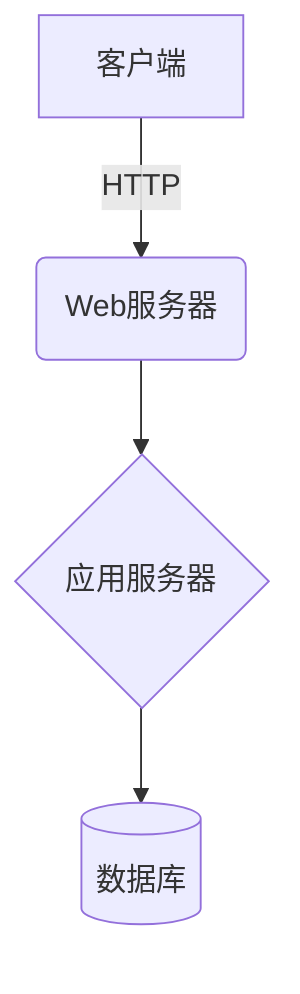

# 酒店预定管理系统详细设计与具体代码实现

## 1. 背景介绍

### 1.1 酒店业的重要性

酒店业是服务业的重要组成部分,在促进旅游业发展、满足人们住宿需求等方面发挥着重要作用。随着经济的不断发展和人们生活水平的提高,酒店业也在不断扩大规模和提升服务质量。

### 1.2 酒店预定系统的必要性

传统的人工预定方式已经无法满足现代酒店业的需求,存在效率低下、错误率高等问题。因此,开发一套高效、智能的酒店预定管理系统就显得尤为重要。

### 1.3 系统目标

本系统旨在提供一个方便、快捷、安全的酒店预定平台,实现酒店客房资源的高效管理,提升酒店运营效率,优化客户体验。

## 2. 核心概念与联系

### 2.1 系统架构

酒店预定管理系统通常采用 B/S 或 C/S 架构,包括:

- 客户端(Customer End)
- 应用服务器(Application Server)
- 数据服务器(Database Server)

### 2.2 主要功能模块

- 客房管理模块
- 预定管理模块 
- 财务管理模块
- 统计报表模块
- 系统管理模块

### 2.3 关键技术

- 面向对象分析与设计(OOA/D)
- 关系数据库及 SQL
- Web 开发技术(HTML/CSS/JS)
- 服务器端语言(Java/Python/C#)
- 安全技术(加密、认证等)

## 3. 核心算法原理与具体操作步骤

### 3.1 预定处理算法

#### 3.1.1 预定查询算法

```python
def search_available_rooms(hotel, checkin_date, checkout_date):
    available_rooms = []
    all_rooms = hotel.rooms
    for room in all_rooms:
        if room.is_available(checkin_date, checkout_date):
            available_rooms.append(room)
    return available_rooms
```

该算法根据入住和离店日期查询酒店的空闲客房。

#### 3.1.2 预定确认算法

```python
def confirm_reservation(customer, room, checkin_date, checkout_date):
    # 检查客户信息
    if not customer.is_valid():
        return False
    
    # 检查房间是否可预定
    if not room.is_available(checkin_date, checkout_date):
        return False
    
    # 创建预定记录
    reservation = Reservation(customer, room, checkin_date, checkout_date)
    reservation.confirm()
    
    # 更新房间状态
    room.reserve(checkin_date, checkout_date)
    
    return True
```

该算法完成预定确认的全过程,包括客户信息验证、房间状态检查、预定记录创建和房间状态更新。

### 3.2 房态更新算法

```python
def update_room_status(room, checkin_date, checkout_date, status):
    curr_date = checkin_date
    while curr_date < checkout_date:
        room.set_status(curr_date, status)
        curr_date += timedelta(days=1)
```

该算法根据预定信息更新房间在特定日期范围内的状态,如"已预订"、"已入住"等。

## 4. 数学模型和公式详细讲解举例说明

### 4.1 房价计算模型

酒店客房的实际价格通常由房型基准价格、节假日加价、长住优惠等多种因素共同决定。我们可以用下面的数学模型来描述:

$$
P = P_0 + \alpha P_0 + \beta \gamma^d
$$

其中:

- $P$是客房的实际价格
- $P_0$是该房型的基准价格
- $\alpha$是节假日加价系数,通常设为0.1~0.3
- $\beta$是长住优惠系数,通常设为-0.05~-0.2
- $\gamma$是每增加一晚的折扣率,通常设为0.9~0.98
- $d$是预定的入住天数

### 4.2 客房出租率计算

在一个特定时间段内,客房的出租率可以用下面的公式计算:

$$
\text{出租率} = \frac{\sum\limits_i \text{出租天数}_i}{\text{总房间数} \times \text{总天数}} \times 100\%
$$

这个指标反映了酒店客房的实际使用情况,是评估经营状况的重要依据。

## 5. 项目实践:代码实例和详细解释说明

### 5.1 系统架构设计

我们采用经典的三层架构设计,包括表现层(前端)、业务逻辑层(应用服务器)和数据访问层(数据库服务器)。



### 5.2 主要类设计

#### 5.2.1 Room类

```python
class Room:
    def __init__(self, number, room_type, price):
        self.number = number
        self.type = room_type
        self.price = price
        self.status = {}
        
    def is_available(self, checkin, checkout):
        ...
        
    def reserve(self, checkin, checkout):
        ...
        
    def set_status(self, date, status):
        ...
```

Room类描述了酒店客房的基本属性和状态管理方法。

#### 5.2.2 Reservation类

```python
class Reservation:
    def __init__(self, customer, room, checkin, checkout):
        self.customer = customer
        self.room = room
        self.checkin = checkin
        self.checkout = checkout
        self.status = "Pending"
        
    def confirm(self):
        ...
        
    def cancel(self):
        ...
        
    def checkin(self):
        ...
        
    def checkout(self):
        ...
```

Reservation类负责管理预定的详细信息和生命周期。

#### 5.2.3 其他主要类

- Customer: 描述客户信息
- RoomType: 描述客房类型信息
- Invoice: 描述账单信息
- Payment: 描述付款信息

### 5.3 关键功能实现

#### 5.3.1 客户端预定

```python
# 查询可用房间
avail_rooms = search_available_rooms(hotel, checkin, checkout)

# 客户选择房间
selected = avail_rooms[0] 

# 确认预定
customer = get_customer_info()
if confirm_reservation(customer, selected, checkin, checkout):
    print("预定成功!")
else:
    print("预定失败,请重试")
```

#### 5.3.2 入住/离店

```python
# 入住
reservation = find_reservation(conf_number)
if not reservation:
    print("无效的预定号")
else:
    reservation.checkin()
    print(f"入住成功,房间号: {reservation.room.number}")
    
# 离店
reservation = find_reservation_by_room(room_number)
if not reservation:
    print("无效的房间号")
else:
    reservation.checkout()
    invoice = create_invoice(reservation)
    print(f"退房成功,账单: {invoice.total} 元")
```

## 6. 实际应用场景

- 酒店官网预定系统
- 在线旅行平台(如携程、去哪儿等)
- 连锁酒店集团的统一管理系统
- 特定场景的定制化预定系统(如会议预定等)

## 7. 工具和资源推荐

- 开发工具: PyCharm、Visual Studio Code等IDE
- Web框架: Django(Python)、Spring(Java)、ASP.NET(C#)
- 数据库: MySQL、PostgreSQL、SQL Server等
- 前端框架: React、Vue、Angular等
- 云服务: AWS、Azure、阿里云等
- 设计工具: StarUML、Visual Paradigm等

## 8. 总结:未来发展趋势与挑战

### 8.1 发展趋势

- 智能化:利用人工智能技术提供个性化服务
- 移动优先:针对移动端进行优化和创新
- 跨平台一体化:多渠道整合提供无缝体验 
- 大数据分析:利用大数据进行精准营销和决策

### 8.2 面临挑战

- 信息安全:保护客户隐私和交易安全
- 技术升级:持续跟进新技术以保持竞争力
- 成本控制:在提升服务质量的同时控制成本支出
- 人才培养:培养复合型技术人才以适应新需求

## 9. 附录:常见问题与解答

### 9.1 如何保证系统的高可用性?

可以采用负载均衡、主从热备、缓存技术等措施提高系统的可用性和响应能力。

### 9.2 如何防范预订信息被恶意篡改?

可以使用加密、数字签名等技术手段,并在关键环节进行审计,来保证信息的完整性和不可否认性。

### 9.3 如何实现个性化推荐和智能决策?

可以基于客户的历史数据、行为偏好,利用机器学习算法进行建模,从而实现个性化推荐和决策支持。