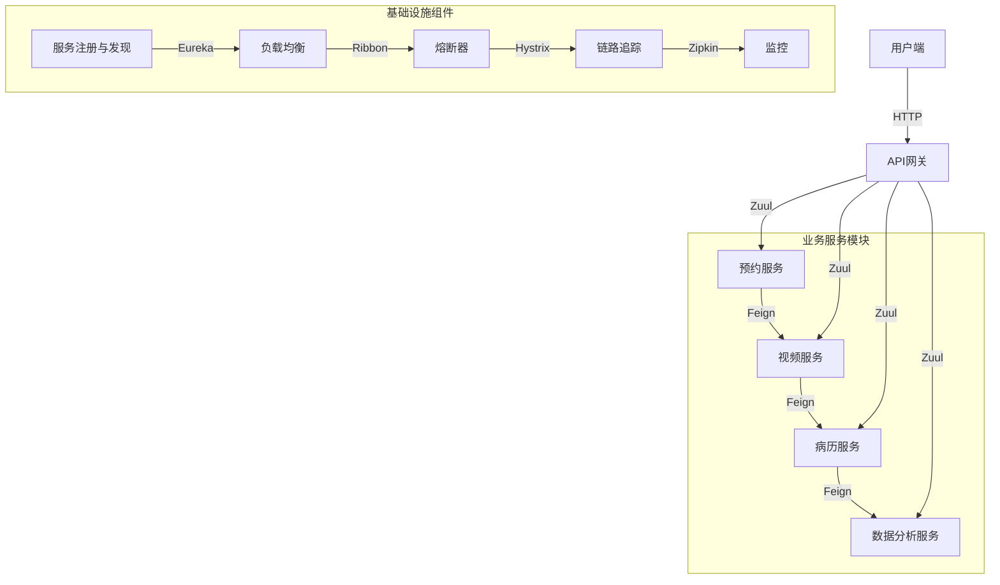
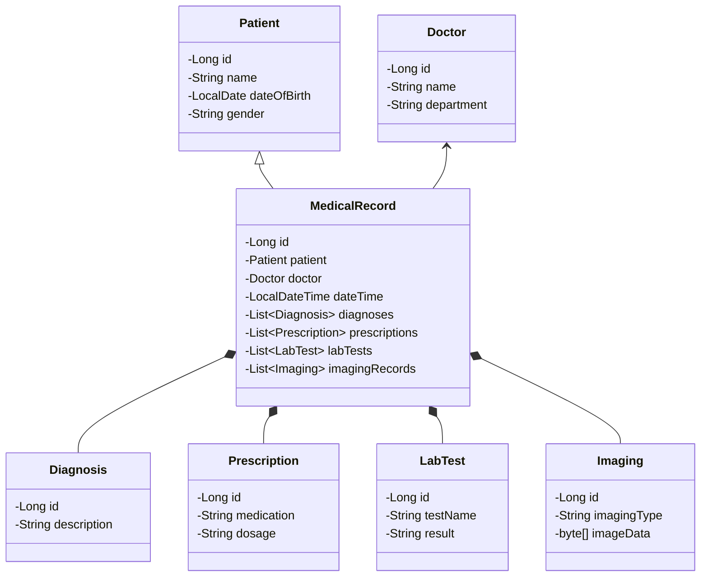

# 基于SpringBoot的社区智慧医疗系统

## 1. 背景介绍

### 1.1 医疗卫生行业现状

随着人口老龄化和城市化进程的加快,医疗卫生服务需求不断增长,传统的医疗模式已经无法满足人们日益增长的医疗需求。同时,医疗资源的不均衡分布、就医环境拥挤、医患矛盾频发等问题也日益突出。因此,构建一个高效、便捷、智能的社区医疗服务体系,成为了解决当前医疗卫生行业痛点的关键。

### 1.2 智慧医疗的兴起

智慧医疗是指利用物联网、大数据、云计算、人工智能等新兴信息技术,实现医疗资源的高效配置和优化利用,提供个性化、精准化的医疗服务。智慧医疗系统可以实现远程医疗、智能辅助诊断、电子病历管理、健康监测等功能,有助于缓解就医压力,提高医疗服务质量和效率。

### 1.3 社区智慧医疗的重要性

社区是居民生活和医疗服务的基础,构建社区智慧医疗系统可以更好地服务社区居民。通过智能化的预约挂号、远程视频问诊、健康数据采集和分析等功能,居民可以享受到高质量、高效率的基层医疗服务,减少重复就医、错过就医的情况,提高生活质量。

## 2. 核心概念与联系

### 2.1 SpringBoot

SpringBoot是一个基于Spring框架的全新开源项目,旨在简化Spring应用的初始搭建以及开发过程。它使用了特有的方式来进行配置,从根本上简化了繁琐的配置过程。同时它集成了大量常用的第三方库,开箱即用,大大节省了开发人员的时间和精力。

### 2.2 微服务架构

微服务架构是一种将单一应用程序划分为多个小型服务的架构风格,每个服务运行在自己的进程中,并通过轻量级机制(如HTTP API)进行通信和协作。这种架构模式可以使应用程序更加敏捷、可靠和可伸缩。

### 2.3 社区智慧医疗系统

社区智慧医疗系统是一个基于微服务架构的分布式应用系统,集成了预约挂号、远程视频问诊、电子病历管理、健康数据分析等多种功能模块,为社区居民提供一站式的智能化医疗服务。

### 2.4 核心概念联系

SpringBoot作为开发框架,可以快速构建微服务应用。微服务架构则是系统的整体架构模式,将系统拆分为多个独立的服务模块。社区智慧医疗系统作为一个具体的应用场景,采用了SpringBoot和微服务架构,实现了高效、智能、一体化的社区医疗服务。

## 3. 核心算法原理和具体操作步骤

### 3.1 系统架构设计

社区智慧医疗系统采用了微服务架构,将系统拆分为多个独立的服务模块,如预约服务、视频服务、病历服务、数据分析服务等。每个服务模块都是一个独立的SpringBoot应用,通过RESTful API进行交互。系统还包括服务注册与发现、负载均衡、熔断、链路追踪等基础设施组件,确保系统的高可用性和可扩展性。

#### 3.1.1 系统架构图



### 3.2 预约服务模块

预约服务模块负责管理就诊预约信息,包括预约挂号、取消预约、查询预约等功能。

#### 3.2.1 预约算法

预约算法需要考虑医生的工作时间、剩余可预约数量等因素,以确保预约的合理性和公平性。可以采用以下步骤:

1. 获取医生的工作时间段和可预约数量
2. 根据用户选择的就诊时间,查找可预约的时间段
3. 如果有多个可选时间段,按照先来先服务的原则分配
4. 更新医生的剩余可预约数量

#### 3.2.2 代码实现

```java
@Service
public class AppointmentService {
    
    @Autowired
    private DoctorRepository doctorRepo;
    
    @Autowired
    private AppointmentRepository appointmentRepo;
    
    public Appointment makeAppointment(Long doctorId, LocalDateTime dateTime) {
        Doctor doctor = doctorRepo.findById(doctorId).orElseThrow(...);
        
        // 检查预约时间是否在医生工作时间内
        if (!doctor.getWorkingHours().contains(dateTime)) {
            throw new InvalidAppointmentException(...);
        }
        
        // 查找可预约的时间段
        List<LocalDateTime> availableSlots = findAvailableSlots(doctor, dateTime);
        if (availableSlots.isEmpty()) {
            throw new NoAvailableSlotException(...);
        }
        
        // 分配预约时间段
        LocalDateTime appointmentTime = availableSlots.get(0);
        
        // 创建预约记录
        Appointment appointment = new Appointment();
        appointment.setDoctor(doctor);
        appointment.setDateTime(appointmentTime);
        appointmentRepo.save(appointment);
        
        // 更新医生剩余可预约数量
        doctor.setRemainingAppointments(doctor.getRemainingAppointments() - 1);
        doctorRepo.save(doctor);
        
        return appointment;
    }
    
    // ...
}
```

### 3.3 视频服务模块

视频服务模块提供远程视频问诊功能,包括建立视频通话、发送聊天消息、共享医疗影像等。

#### 3.3.1 视频通话算法

视频通话算法需要处理信令交换、媒体传输等过程,可以采用WebRTC技术实现。

1. 建立信令服务器,用于处理信令交换
2. 浏览器获取本地媒体流(视频、音频)
3. 通过信令服务器进行媒体协商,交换SDP信息
4. 建立P2P连接,进行媒体传输

#### 3.3.2 代码实现

```javascript
// 信令服务器
const server = require('socket.io')();

server.on('connection', socket => {
  socket.on('call', data => {
    socket.broadcast.emit('call', data);
  });
  
  socket.on('answer', data => {
    socket.broadcast.emit('answer', data);
  });
  
  socket.on('ice-candidate', data => {
    socket.broadcast.emit('ice-candidate', data);
  });
});

// 浏览器端
const socket = io();
const pc = new RTCPeerConnection();

// 获取本地媒体流
navigator.mediaDevices.getUserMedia({ video: true, audio: true })
  .then(stream => {
    pc.addStream(stream);
    
    // 创建Offer
    pc.createOffer()
      .then(offer => {
        pc.setLocalDescription(offer);
        socket.emit('call', { sdp: offer });
      });
  });

// 处理Offer
socket.on('call', data => {
  pc.setRemoteDescription(new RTCSessionDescription(data.sdp))
    .then(() => pc.createAnswer())
    .then(answer => {
      pc.setLocalDescription(answer);
      socket.emit('answer', { sdp: answer });
    });
});

// 处理Answer
socket.on('answer', data => {
  pc.setRemoteDescription(new RTCSessionDescription(data.sdp));
});

// 处理ICE候选
socket.on('ice-candidate', data => {
  pc.addIceCandidate(new RTCIceCandidate(data.candidate));
});
```

### 3.4 病历服务模块

病历服务模块负责管理患者的电子病历,包括创建病历、更新病历、查询病历等功能。

#### 3.4.1 病历数据模型



#### 3.4.2 病历管理操作

```java
@Service
public class MedicalRecordService {
    
    @Autowired
    private MedicalRecordRepository recordRepo;
    
    public MedicalRecord createRecord(Patient patient, Doctor doctor, List<Diagnosis> diagnoses, 
                                      List<Prescription> prescriptions, List<LabTest> labTests,
                                      List<Imaging> imagingRecords) {
        MedicalRecord record = new MedicalRecord();
        record.setPatient(patient);
        record.setDoctor(doctor);
        record.setDateTime(LocalDateTime.now());
        record.setDiagnoses(diagnoses);
        record.setPrescriptions(prescriptions);
        record.setLabTests(labTests);
        record.setImagingRecords(imagingRecords);
        
        return recordRepo.save(record);
    }
    
    public MedicalRecord updateRecord(Long id, List<Diagnosis> diagnoses, 
                                      List<Prescription> prescriptions, List<LabTest> labTests,
                                      List<Imaging> imagingRecords) {
        MedicalRecord record = recordRepo.findById(id).orElseThrow(...);
        
        record.setDiagnoses(diagnoses);
        record.setPrescriptions(prescriptions);
        record.setLabTests(labTests);
        record.setImagingRecords(imagingRecords);
        
        return recordRepo.save(record);
    }
    
    public MedicalRecord getRecord(Long id) {
        return recordRepo.findById(id).orElseThrow(...);
    }
    
    // ...
}
```

## 4. 数学模型和公式详细讲解举例说明

### 4.1 协同过滤算法

在社区智慧医疗系统中,协同过滤算法可以用于基于患者的历史就诊记录和其他患者的相似记录,为患者推荐合适的医生或医疗服务。

协同过滤算法的核心思想是:对于目标用户,找到与其有相似兴趣或行为的其他用户,并基于这些相似用户的偏好,为目标用户推荐物品。

#### 4.1.1 用户相似度计算

计算两个用户之间的相似度,常用的方法是基于两个用户对相同物品的评分,计算它们的余弦相似度或皮尔逊相关系数。

余弦相似度公式:

$$sim(u, v) = \frac{\sum\limits_{i \in I_{uv}} r_{ui}r_{vi}}{\sqrt{\sum\limits_{i \in I_u} r_{ui}^2} \sqrt{\sum\limits_{i \in I_v} r_{vi}^2}}$$

其中:
- $u$和$v$分别表示两个用户
- $I_u$和$I_v$分别表示用户$u$和$v$评分过的物品集合
- $I_{uv}$表示两个用户都评分过的物品集合
- $r_{ui}$表示用户$u$对物品$i$的评分

皮尔逊相关系数公式:

$$sim(u, v) = \frac{\sum\limits_{i \in I_{uv}} (r_{ui} - \overline{r_u})(r_{vi} - \overline{r_v})}{\sqrt{\sum\limits_{i \in I_u} (r_{ui} - \overline{r_u})^2} \sqrt{\sum\limits_{i \in I_v} (r_{vi} - \overline{r_v})^2}}$$

其中:
- $\overline{r_u}$和$\overline{r_v}$分别表示用户$u$和$v$的平均评分

#### 4.1.2 基于用户的协同过滤推荐

对于目标用户$u$,基于其他与$u$相似的用户的偏好,为$u$推荐物品。具体步骤如下:

1. 计算$u$与其他所有用户的相似度
2. 选取与$u$