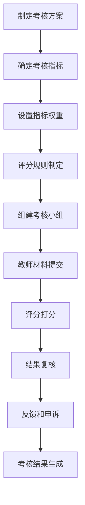
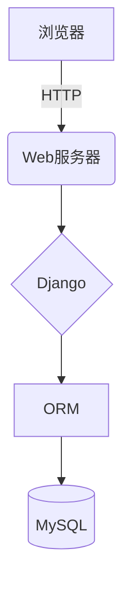

# 基于Web的师资管理系统设计与实现

## 1. 背景介绍

### 1.1 师资管理系统的重要性

在当今教育领域中,师资管理系统扮演着至关重要的角色。教师是教育事业的核心力量,他们的专业素质和工作绩效直接影响着教育质量。有效的师资管理不仅能够优化教师队伍建设,合理分配教学资源,还能促进教师的专业发展,提高教学质量。

### 1.2 传统师资管理模式的缺陷

传统的师资管理模式主要依赖人工操作,存在诸多弊端:

- 信息孤岛,数据难以共享
- 工作效率低下,重复劳动多
- 管理流程复杂,响应速度慢
- 数据安全性和可靠性较差

### 1.3 Web师资管理系统的优势

基于Web的师资管理系统可以很好地解决上述问题:

- 数据集中,信息共享无障碍
- 自动化流程,提高工作效率 
- 无地域限制,实现远程管理
- 数据安全有保障,可靠性高

## 2. 核心概念与联系

### 2.1 系统架构

Web师资管理系统通常采用B/S(Browser/Server)架构模式,包括:

- 客户端(Browser)
- 应用服务器(Web Server)
- 数据服务器(Database)

### 2.2 关键技术

实现该系统需要综合运用多种技术:

- 前端技术(HTML/CSS/JavaScript)
- 服务器端语言(Java/Python/PHP等)
- 数据库技术(MySQL/Oracle/SQLServer等)
- Web框架(Spring/Django/Laravel等)

### 2.3 系统功能模块

一个完整的师资管理系统通常包括:

- 教师信息管理模块
- 教学任务管理模块 
- 教师培训管理模块
- 教师考核管理模块
- 系统管理模块

## 3. 核心算法原理和具体操作步骤

### 3.1 教师信息管理

#### 3.1.1 数据库设计

教师信息表是系统的核心表,需要合理设计表结构:

```sql
CREATE TABLE teacher_info (
    id INT PRIMARY KEY AUTO_INCREMENT,
    name VARCHAR(50) NOT NULL,
    gender CHAR(1) NOT NULL,
    birthday DATE NOT NULL,
    edu_bg VARCHAR(100),
    title VARCHAR(50),
    department VARCHAR(100),
    hire_date DATE,
    ...
);
```

#### 3.1.2 数据操作

- 增加教师信息:

```python
def add_teacher(data):
    sql = "INSERT INTO teacher_info (name, gender, birthday, ...) VALUES (%s, %s, %s, ...)"
    values = (data['name'], data['gender'], data['birthday'], ...)
    cursor.execute(sql, values)
    db.commit()
```

- 修改教师信息:

```python
def update_teacher(data):
    sql = "UPDATE teacher_info SET name=%s, gender=%s, ... WHERE id=%s"
    values = (data['name'], data['gender'], ..., data['id']) 
    cursor.execute(sql, values)
    db.commit()
```

- 删除教师信息:

```python
def delete_teacher(id):
    sql = "DELETE FROM teacher_info WHERE id=%s"
    cursor.execute(sql, (id,))
    db.commit()
```

- 查询教师信息:

```python
def query_teachers(conditions=None):
    sql = "SELECT * FROM teacher_info"
    if conditions:
        sql += " WHERE " + " AND ".join(conditions)
    cursor.execute(sql)
    return cursor.fetchall()
```

#### 3.1.3 数据验证

- 输入数据合法性校验
- 查重防止重复录入
- 级联删除相关信息

### 3.2 教学任务管理

#### 3.2.1 数据模型

```python
class Course:
    def __init__(self, name, code, teacher, ...):
        ...

class TeachingTask:
    def __init__(self, course, classroom, timeslot, ...):
        ...
```

#### 3.2.2 任务分配算法

- 约束条件:同一时间段,同一教师只能分配一个课程
- 目标函数:最小化教室闲置时间和教师空闲时间
- 算法思路:
    - 构建教师-课程关系矩阵
    - 构建教室-时间段关系矩阵 
    - 基于矩阵计算得出最优分配方案

```python
def assign_tasks(courses, teachers, classrooms):
    # 构建关系矩阵
    ...
    
    # 计算最优分配方案
    while unassigned_tasks:
        # 选取最优任务
        best_task = ...
        
        # 分配任务
        assign(best_task)
        
        # 更新矩阵
        ...
        
    return task_assignments
```

### 3.3 教师培训管理

#### 3.3.1 培训需求分析

- 调查问卷收集教师培训需求
- 数据分析,确定培训主题和内容

#### 3.3.2 培训计划制定

- 确定培训目标
- 设计培训课程
- 选择培训师资
- 排期安排培训计划

#### 3.3.3 过程管理

- 发布培训通知
- 教师报名和审核
- 签到和考勤管理
- 培训资料发放

#### 3.3.4 效果评估

- 理论和实践考核
- 培训满意度调查
- 培训效果跟踪评估

### 3.4 教师考核管理  

#### 3.4.1 考核模型

$$
\begin{aligned}
\text{总分} = \sum\limits_{i=1}^{n}{w_i \cdot x_i} \\
\text{其中:} \\
n &= \text{考核指标个数} \\
w_i &= \text{第i个指标权重} \\
x_i &= \text{第i个指标分数}
\end{aligned}
$$

#### 3.4.2 考核流程



#### 3.4.3 数据统计分析

- 单个教师历年考核结果对比
- 按部门、职称等维度统计分析
- 生成可视化报表

## 4. 数学模型和公式详细讲解举例说明

在教学任务分配算法中,我们需要构建数学模型来描述问题,并设计算法求解最优方案。

### 4.1 问题建模

设有 $m$ 个教师 $T = \{t_1, t_2, \ldots, t_m\}$, $n$ 个课程 $C = \{c_1, c_2, \ldots, c_n\}$, $k$ 个教室 $R = \{r_1, r_2, \ldots, r_k\}$, 以及 $p$ 个时间段 $S = \{s_1, s_2, \ldots, s_p\}$。

我们构建一个三维矩阵 $X$:

$$
X = \begin{bmatrix}
    x_{111} & x_{112} & \cdots & x_{11p} \\
    x_{121} & x_{122} & \cdots & x_{12p} \\
    \vdots & \vdots & \ddots & \vdots \\
    x_{1k1} & x_{1k2} & \cdots & x_{1kp} \\
    x_{211} & x_{212} & \cdots & x_{21p} \\
    \vdots & \vdots & \ddots & \vdots \\
    x_{nk1} & x_{nk2} & \cdots & x_{nkp}
\end{bmatrix}
$$

其中 $x_{ijl} \in \{0, 1\}$ 表示课程 $c_i$ 是否被安排在教室 $r_j$ 的时间段 $s_l$ 上。

我们的目标是找到一种最优的分配方案,使得:

$$
\begin{aligned}
& \min \sum\limits_{i=1}^{n}{\sum\limits_{j=1}^{k}{\sum\limits_{l=1}^{p}{x_{ijl}}}} \\
& \text{subject to:} \\
& \sum\limits_{j=1}^{k}{\sum\limits_{l=1}^{p}{x_{ijl}}} = 1 \qquad \forall i \in \{1, 2, \ldots, n\} \\
& \sum\limits_{i=1}^{n}{x_{ijl}} \leq 1 \qquad \forall j \in \{1, 2, \ldots, k\}, l \in \{1, 2, \ldots, p\} \\
& \sum\limits_{j=1}^{k}{\sum\limits_{l=1}^{p}{x_{ijl} \cdot \text{teacher}(c_i, t_q)}} \leq 1 \qquad \forall q \in \{1, 2, \ldots, m\}, l \in \{1, 2, \ldots, p\}
\end{aligned}
$$

其中:

- 目标函数最小化总的任务分配数,避免资源闲置
- 第一个约束条件保证每门课程都被安排
- 第二个约束条件保证同一时间段同一教室最多只能安排一门课程
- 第三个约束条件保证同一教师在同一时间段最多只能被分配一门课程

这是一个整数线性规划问题,可以使用求解器如 CPLEX 或 Gurobi 来求解。

### 4.2 算法实现

我们可以使用 Python 中的 PuLP 库来建模和求解该问题:

```python
import pulp

# 创建问题
prob = pulp.LpProblem("Teaching Task Assignment", pulp.LpMinimize)

# 创建决策变量
assignments = {
    (i, j, l): pulp.LpVariable(f"x_{i}_{j}_{l}", cat="Binary")
    for i in range(n) for j in range(k) for l in range(p)
}

# 设置目标函数
prob += sum(assignments.values()), "Total Assignments"

# 添加约束条件
for i in range(n):
    prob += sum(assignments[i, j, l] for j in range(k) for l in range(p)) == 1

for j in range(k):
    for l in range(p):
        prob += sum(assignments[i, j, l] for i in range(n)) <= 1
        
for q in range(m):
    for l in range(p):
        prob += sum(assignments[i, j, l] * teacher(courses[i], teachers[q])
                    for i in range(n) for j in range(k)) <= 1
                    
# 求解
prob.solve()

# 输出结果
for i in range(n):
    for j in range(k):
        for l in range(p):
            if assignments[i, j, l].value() == 1:
                print(f"Course {courses[i]} is assigned to Room {rooms[j]} at Timeslot {timeslots[l]}")
```

通过以上方式,我们可以得到一个满足所有约束条件的最优任务分配方案。

## 5. 项目实践:代码实例和详细解释说明

在本节中,我们将通过一个基于 Django Web 框架的实例项目,展示如何实现一个基于 Web 的师资管理系统。

### 5.1 系统架构



我们采用了典型的 B/S 架构,其中:

- 浏览器作为客户端
- Django Web 框架提供应用服务
- ORM 层实现对象关系映射
- MySQL 作为后端数据库

### 5.2 Models 设计

```python
# models.py
from django.db import models

class Teacher(models.Model):
    name = models.CharField(max_length=50)
    gender = models.CharField(max_length=1, choices=(('M', 'Male'), ('F', 'Female')))
    birthday = models.DateField()
    # 其他字段
    
class Course(models.Model):
    name = models.CharField(max_length=100)
    code = models.CharField(max_length=20)
    teacher = models.ForeignKey(Teacher, on_delete=models.CASCADE)
    # 其他字段
    
class TeachingTask(models.Model):
    course = models.ForeignKey(Course, on_delete=models.CASCADE)
    classroom = models.ForeignKey(Classroom, on_delete=models.CASCADE)
    timeslot = models.ForeignKey(Timeslot, on_delete=models.CASCADE)
    # 其他字段
    
# 其他模型
```

我们定义了 `Teacher`、`Course` 和 `TeachingTask` 三个核心模型,以及其他一些辅助模型。通过 Django ORM,我们可以很方便地在数据库中创建相应的表结构。

### 5.3 Views 实现

```python
# views.py
from django.shortcuts import render, redirect, get_object_or_404
from .models import Teacher, Course, TeachingTask
from .forms import TeacherForm, CourseForm, TaskForm

def teacher_list(request):
    teachers = Teacher.objects.all()
    return render(request, 'teachers.html', {'teachers': teachers})

def teacher_detail(request, pk):