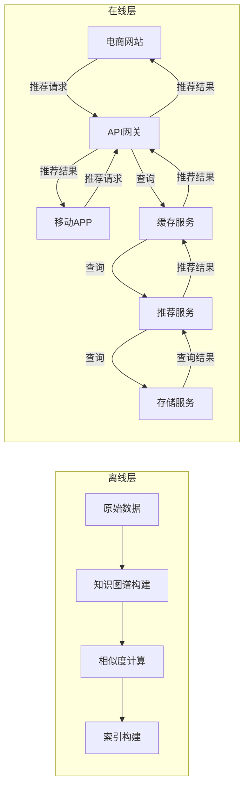

# *基于知识图谱的相似商品推荐

## 1. 背景介绍

### 1.1 电子商务中的商品推荐系统

在当今电子商务时代,商品推荐系统已成为各大电商平台不可或缺的核心功能。随着互联网用户数量的激增和商品种类的日益丰富,如何为用户推荐合适的商品成为了一个巨大的挑战。传统的基于协同过滤的推荐算法虽然可以给出不错的推荐结果,但也存在着冷启动问题、数据稀疏性问题等缺陷。

### 1.2 知识图谱在商品推荐中的应用

近年来,知识图谱(Knowledge Graph)技术逐渐被引入商品推荐领域。知识图谱是一种结构化的语义知识库,能够描述实体(Entity)之间的关系。将商品、用户、品类等信息建模为知识图谱,可以更好地挖掘商品之间的语义关联,为相似商品推荐提供有力支持。

### 1.3 本文主旨

本文将详细介绍基于知识图谱的相似商品推荐技术,包括知识图谱的构建、相似度计算、在线服务等关键环节。我们将结合实际案例,深入探讨算法原理、数学模型以及工程实践,为读者提供一个完整的技术解决方案。

## 2. 核心概念与联系  

### 2.1 知识图谱

知识图谱是一种结构化的语义知识库,由实体(Entity)、关系(Relation)和属性(Attribute)三个要素构成。它能够描述现实世界中事物之间的关联关系,是表示和存储知识的有效方式。

在商品推荐场景中,我们可以将商品、品类、属性等信息建模为知识图谱中的实体和关系,形成一个庞大的商品知识网络。例如,我们可以定义如下几种常见的实体类型和关系类型:

- 实体类型:Product(商品)、Category(品类)、Brand(品牌)、Attribute(属性)等
- 关系类型:isSubCategoryOf(子品类)、isBrandOf(品牌)、hasAttribute(属性)等

通过构建知识图谱,我们可以充分挖掘商品之间的语义关联,为相似商品推荐提供有力支持。

### 2.2 相似度计算

相似度计算是相似商品推荐的核心环节。在知识图谱场景下,我们需要定义合理的相似度计算模型,量化任意两个商品实体之间的相似程度。常见的相似度计算方法有:

- 基于路径的相似度:利用实体之间的最短路径长度计算相似度
- 基于投影的相似度:将实体投影到低维向量空间,利用向量相似度表示实体相似度  
- 基于规则的相似度:基于领域知识定义相似度计算规则

我们将在后续章节对上述方法进行详细介绍和对比分析。

### 2.3 在线服务

构建完知识图谱并定义好相似度计算模型后,我们还需要将其集成到在线服务系统中,为电商网站和APP提供高效、可靠的相似商品推荐服务。这涉及到分布式存储、在线检索、实时计算等诸多技术环节,对系统的可扩展性、高可用性等方面提出了很高要求。

## 3. 核心算法原理具体操作步骤

### 3.1 知识图谱构建

#### 3.1.1 数据采集

构建知识图谱的第一步是采集相关数据源,主要包括:

- 商品数据:标题、描述、价格、品类等结构化数据
- 用户数据:浏览记录、购买记录等行为数据
- 第三方知识库:如百度百科、维基百科等

这些数据将为后续的实体发现、实体链接、关系抽取等步骤提供原始输入。

#### 3.1.2 实体发现与链接

实体发现(Entity Discovery)的目标是从非结构化文本中识别出实体mention,并将其链接(Entity Linking)到知识库中的唯一实体。以"苹果手机"为例,我们需要将其识别为商品实体,并链接到知识库中对应的"iPhone"实体。

常用的实体发现方法有基于规则的方法、基于统计的方法和基于深度学习的方法。实体链接则主要利用上下文信息、知识库别名、embedding相似度等特征进行实体disambigution。

#### 3.1.3 关系抽取

关系抽取(Relation Extraction)的目的是从文本中识别出实体之间的语义关系,并将其标注为特定的关系类型。例如从"苹果手机的屏幕为6.1英寸"这一句话中,我们可以抽取出"iPhone"与"6.1英寸"之间的"hasScreenSize"关系。

主流的关系抽取方法有基于监督学习的方法(如使用PCNN/BLSTM+ATT模型)和基于远程监督的方法(如使用MultiR模型)。近年来,基于预训练语言模型(如BERT)的关系抽取方法也取得了很好的效果。

#### 3.1.4 知识融合

通过上述步骤,我们可以从各种数据源中抽取出大量的实体和关系,但这些知识往往是分散、冗余、存在噪声的。因此我们需要进行知识融合(Knowledge Fusion),将冗余的实体和关系进行合并、去噪,最终形成一个干净、连通、一致的知识图谱。

常用的知识融合技术包括:基于规则的实体合并、基于embedding的实体对齐、基于知识库的事实推理、基于约束的知识图谱理解等。

### 3.2 相似度计算模型

#### 3.2.1 基于路径的相似度

基于路径的相似度计算方法的核心思想是:两个实体在知识图谱中越近,则它们的相似度就越高。我们可以利用两个实体之间的最短路径长度来定义相似度:

$$sim_{path}(e_1,e_2) = \frac{1}{1+sp(e_1,e_2)}$$

其中$sp(e_1,e_2)$表示实体$e_1$和$e_2$之间的最短路径长度。

该方法简单直观,但也存在一些缺陷:
1) 无法区分不同类型的关系路径
2) 对于无连接路径的实体对无法计算相似度

因此,我们可以引入关系类型权重,并考虑实体的语义类型,对上述公式进行改进。

#### 3.2.2 基于投影的相似度

另一种思路是将实体投影到低维连续向量空间中,利用向量之间的相似度(如余弦相似度)表示实体相似度:

$$sim_{proj}(e_1,e_2) = \cos(\vec{e_1},\vec{e_2}) = \frac{\vec{e_1} \cdot \vec{e_2}}{||\vec{e_1}|| \cdot ||\vec{e_2}||}$$

实体的向量表示可以通过TransE、DistMult等知识图谱embedding模型学习得到。

这种方法能够较好地解决基于路径方法的缺陷,但也存在一些问题:
1) 无法很好地解释向量空间的语义
2) 对于新增实体需要重新训练模型

#### 3.2.3 基于规则的相似度

基于规则的相似度计算方法是由领域专家定义一系列相似度计算规则,例如:

- 如果两个商品属于同一个品类,则相似度为0.8
- 如果两个商品的品牌相同,则相似度增加0.1
- 如果两个商品的价格差距在10%以内,则相似度增加0.05
- ...

最终的相似度是各个规则相似度的加权求和:

$$sim_{rule}(e_1,e_2) = \sum_{i=1}^{n}w_i \cdot f_i(e_1,e_2)$$

其中$f_i$是第i条规则对应的相似度计算函数,$w_i$是对应的权重。

这种方法的优点是可解释性强,缺点是需要大量的领域知识和人工经验,且缺乏通用性。在实践中,我们可以将其与上述两种方法相结合,发挥各自的优势。

### 3.3 相似商品检索

有了相似度计算模型后,我们就可以为任意一个商品查找与之最为相似的Top-K商品了。最直接的方法是,对于每一个商品,计算它与其他所有商品的相似度,然后排序取前K个。但这种方法的时间复杂度是$O(n^2)$,在商品数量较大时将变得非常低效。

为了提高检索效率,我们可以借助索引技术。最常见的是构建反向索引(Inverted Index),将每个商品的相似商品列表存储在索引库中,查询时直接检索索引即可。

此外,我们还可以使用局部敏感哈希(Locality Sensitive Hashing,LSH)等近似最近邻(Approximate Nearest Neighbor,ANN)搜索算法,将相似度计算问题转化为最近邻搜索问题,进一步提升检索效率。

### 3.4 在线服务系统

构建知识图谱、定义相似度计算模型、建立索引库之后,我们就可以将其集成到在线服务系统中,为电商网站和APP提供高效、可靠的相似商品推荐服务了。

一个典型的在线服务系统架构如下所示:



其中:

- 离线层负责构建知识图谱、计算相似度并建立索引库,这是一个批处理的工作流程。
- 在线层包括缓存服务、推荐服务、存储服务等多个模块,对外提供相似商品推荐查询接口。
- API网关接收来自电商网站和移动APP的推荐请求,并对请求进行负载均衡、限流、熔断等处理。
- 缓存服务用于缓存热门的推荐结果,提高查询效率。
- 推荐服务根据请求查询索引库,获取相似商品列表。
- 存储服务负责持久化存储索引库等数据。

该系统架构能够满足高并发、高可用、可扩展等要求,为电商平台提供稳定、高效的相似商品推荐服务。

## 4. 数学模型和公式详细讲解举例说明

在第3节中,我们介绍了几种常见的相似度计算模型,包括基于路径的相似度、基于投影的相似度和基于规则的相似度。这些模型都涉及到一些数学公式,下面我们将对它们进行详细讲解,并给出具体的计算示例。

### 4.1 基于路径的相似度

基于路径的相似度计算公式为:

$$sim_{path}(e_1,e_2) = \frac{1}{1+sp(e_1,e_2)}$$

其中$sp(e_1,e_2)$表示实体$e_1$和$e_2$在知识图谱中的最短路径长度。

为了计算最短路径长度,我们可以使用经典的广度优先搜索(BFS)或 Dijkstra 算法。以下是一个使用 BFS 计算最短路径长度的Python示例:

```python
from collections import deque

def shortest_path_length(kg, source, target):
    visited = set()
    queue = deque([(source, 0)])
    
    while queue:
        node, dist = queue.popleft()
        if node == target:
            return dist
        visited.add(node)
        for neighbor in kg.neighbors(node):
            if neighbor not in visited:
                queue.append((neighbor, dist + 1))
    
    return float('inf')  # 如果没有路径连接source和target
```

其中`kg`是知识图谱对象,`source`和`target`分别是起点实体和终点实体。

假设我们有一个简单的知识图谱,包含以下四个实体和关系:

```