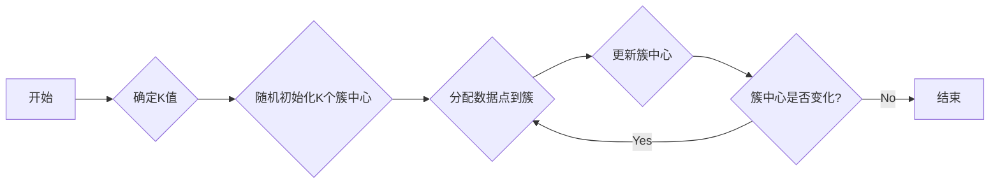

## 1. 背景介绍

### 1.1 无监督学习的魅力

机器学习领域，算法大致分为两大类：监督学习和无监督学习。监督学习如同一位严格的老师，手把手地教导模型，通过提供带有标签的数据进行训练，例如图像分类、语音识别等。而无监督学习则更像一位引导者，将一堆杂乱无章的数据交给模型，让它自己去探索其中的规律和结构，例如聚类、降维等。

K-Means聚类算法，便是无监督学习中一颗耀眼的明星。它以其简单、高效、易于理解的特点，在数据挖掘、模式识别、图像处理等领域得到广泛应用。

### 1.2 聚类的意义

聚类，顾名思义，就是将一堆数据按照某种相似性度量方式，划分为若干个簇（Cluster），使得同一簇内的数据尽可能相似，不同簇之间的数据尽可能不同。

想象一下，面对浩瀚的星空，我们如何才能更好地理解和认识它？答案就是将星星们按照一定的规律进行分类，比如星座。同样地，面对海量的数据，聚类算法帮助我们揭示数据背后的隐藏结构，为进一步分析和应用提供基础。

## 2. 核心概念与联系

### 2.1 K-Means聚类的核心思想

K-Means聚类的核心思想非常直观：

1. **确定簇的数量（K）**： 首先，我们需要预先设定想要将数据划分为多少个簇，这个数字就是K。
2. **初始化簇中心**： 随机选择K个数据点作为初始的簇中心。
3. **分配数据点**： 计算每个数据点到各个簇中心的距离，将每个数据点分配到距离它最近的簇中心所在的簇。
4. **更新簇中心**： 重新计算每个簇中所有数据点的平均值，将这个平均值作为新的簇中心。
5. **重复步骤3和4**： 直到簇中心不再发生变化，或者达到预设的迭代次数。

### 2.2 距离度量

K-Means聚类算法中，距离度量起着至关重要的作用。常用的距离度量方法包括：

* **欧几里得距离**： 最常见的距离度量方式，计算两点之间的直线距离。
* **曼哈顿距离**： 计算两点之间横纵坐标差之和。
* **余弦相似度**： 计算两个向量夹角的余弦值。

选择合适的距离度量方法取决于数据的类型和应用场景。

## 3. 核心算法原理具体操作步骤

### 3.1 K-Means算法的具体操作步骤

1. **确定K值**： 根据实际问题和数据情况，选择合适的K值。
2. **随机初始化K个簇中心**： 从数据集中随机选择K个数据点作为初始的簇中心。
3. **分配数据点到簇**： 对于每个数据点，计算它到K个簇中心的距离，并将它分配到距离最近的簇中心所在的簇。
4. **更新簇中心**： 对于每个簇，重新计算所有数据点的平均值，并将这个平均值作为新的簇中心。
5. **重复步骤3和4**： 直到簇中心不再发生变化，或者达到预设的迭代次数。

### 3.2 算法流程图



## 4. 数学模型和公式详细讲解举例说明

### 4.1 目标函数

K-Means聚类的目标函数是**最小化簇内平方误差（SSE）**，即每个数据点到其所属簇中心的距离平方之和：

$$
SSE = \sum_{i=1}^{K} \sum_{x \in C_i} ||x - \mu_i||^2
$$

其中，$K$是簇的数量，$C_i$表示第$i$个簇，$x$表示$C_i$中的数据点，$\mu_i$表示第$i$个簇的中心。

### 4.2 距离计算公式

* **欧几里得距离**：

$$
d(x, y) = \sqrt{\sum_{i=1}^{n}(x_i - y_i)^2}
$$

* **曼哈顿距离**：

$$
d(x, y) = \sum_{i=1}^{n}|x_i - y_i|
$$

* **余弦相似度**：

$$
cos(\theta) = \frac{x \cdot y}{||x|| ||y||}
$$

### 4.3 举例说明

假设我们有以下二维数据点：

```
(1, 2), (1, 4), (1, 0), (4, 2), (4, 4), (4, 0)
```

我们想要将它们聚类成两簇。

1. 确定K值： K = 2
2. 随机初始化簇中心： 假设初始的簇中心为 (1, 2) 和 (4, 4)
3. 分配数据点到簇：
    * (1, 2), (1, 4), (1, 0) 被分配到第一个簇
    * (4, 2), (4, 4), (4, 0) 被分配到第二个簇 
4. 更新簇中心：
    * 第一个簇的新中心为 (1, 2)
    * 第二个簇的新中心为 (4, 2)
5. 重复步骤3和4，直到簇中心不再变化

最终，数据点被聚类成以下两簇：

* 第一簇： (1, 2), (1, 4), (1, 0)
* 第二簇： (4, 2), (4, 4), (4, 0) 
