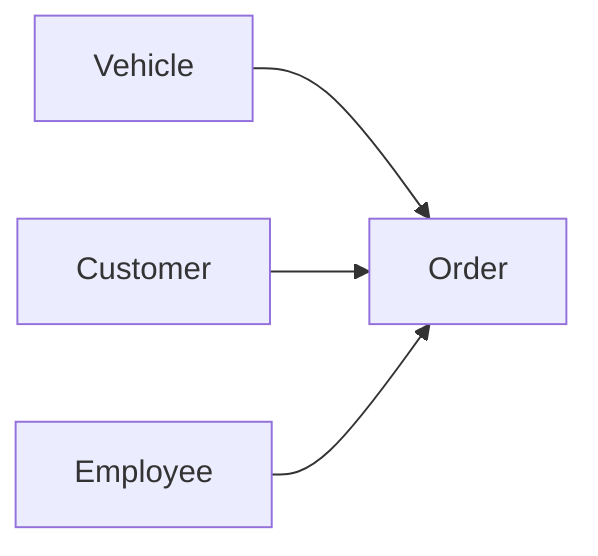

# 出租公司管理系统详细设计与具体代码实现

作者：禅与计算机程序设计艺术

## 1. 背景介绍

### 1.1 出租公司管理系统的必要性
在现代社会中,出租行业发挥着越来越重要的作用。随着出租业务的不断扩大,传统的人工管理模式已经无法满足日益增长的业务需求。因此,开发一套高效、可靠的出租公司管理系统势在必行。

### 1.2 系统目标
出租公司管理系统旨在实现出租业务的信息化管理,提高工作效率,减少人为错误,为公司的决策提供数据支持。具体目标包括:

- 实现车辆、客户、订单等信息的电子化管理
- 提供友好的用户界面,简化操作流程  
- 支持多用户并发访问,保证数据安全
- 生成各类统计报表,为管理决策提供依据

### 1.3 系统功能概述
出租公司管理系统主要包括以下功能模块:

- 车辆管理:车辆信息录入、查询、修改等
- 客户管理:客户信息录入、查询、修改等 
- 订单管理:订单创建、派车、结算、查询等
- 员工管理:员工信息管理、权限分配等
- 统计报表:营业额统计、车辆使用情况统计等

## 2. 核心概念与关系

### 2.1 车辆(Vehicle)
车辆是出租公司的核心资源,具有以下属性:
- 车辆编号(id)
- 车牌号(plate_number)
- 品牌型号(model)
- 车辆类型(type)
- 购买日期(purchase_date)
- 行驶里程(mileage)
- 状态(status):空闲/出租中/维修中

### 2.2 客户(Customer)  
客户是出租业务的服务对象,具有以下属性:
- 客户编号(id)
- 姓名(name)
- 性别(gender)
- 联系电话(phone) 
- 身份证号(id_card)

### 2.3 订单(Order)
订单是记录每次出租业务的单据,具有以下属性:  
- 订单编号(id)
- 客户编号(customer_id)
- 车辆编号(vehicle_id)
- 驾驶员编号(driver_id)
- 开始时间(start_time)
- 结束时间(end_time)
- 起点(origin)  
- 终点(destination)
- 里程数(distance)
- 租金(fee)
- 状态(status):进行中/已完成/已取消

### 2.4 员工(Employee)
员工是公司的内部人员,具有以下属性:
- 员工编号(id) 
- 姓名(name)
- 性别(gender)
- 联系电话(phone)
- 职位(position)
- 用户名(username)
- 密码(password)

### 2.5 实体关系图
下图展示了各实体之间的关系:

## 3. 核心算法原理与具体步骤

### 3.1 订单调度算法
订单调度是出租公司管理系统的核心业务,其目标是根据客户需求,合理分配车辆和驾驶员,使得总体效益最大化。本系统采用了基于匈牙利算法的订单调度策略。

#### 3.1.1 问题建模
我们可以将订单调度问题建模为二分图匹配问题:
- 二分图的两个顶点集分别为订单集合O和车辆集合V
- 如果订单oi与车辆vj匹配,则连接oi和vj的边权重wij为该车辆执行该订单的效益值
- 目标是寻找一个完美匹配,使得总权重最大

#### 3.1.2 匈牙利算法步骤
1. 初始化:
   - 对每个订单oi,设置其顶标为与之相连的边权重的最大值
   - 对每个车辆vj,设置其顶标为0
2. 为未匹配的订单oi寻找增广路:
   - 令S为已访问的订单集合,T为已访问的车辆集合
   - 初始时S=T=∅
   - 从oi出发,对二分图进行广度优先遍历,过程中记录父节点
   - 遍历过程中,