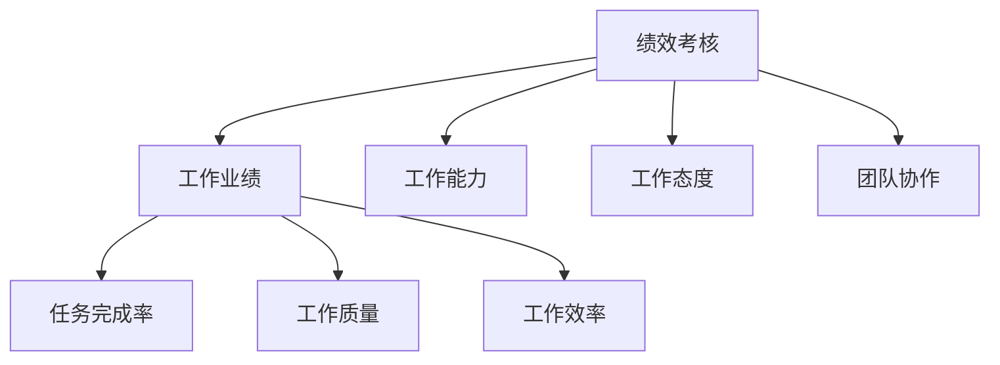

# 员工绩效管理系统详细设计与具体代码实现

作者：禅与计算机程序设计艺术

## 1. 背景介绍
### 1.1 绩效管理的重要性
在现代企业管理中,员工绩效管理扮演着至关重要的角色。有效的绩效管理可以提高员工的工作效率和积极性,促进企业的可持续发展。通过对员工的工作表现进行系统化的评估、反馈和改进,绩效管理有助于实现组织目标与个人发展的协调统一。

### 1.2 传统绩效管理方式的局限性
传统的绩效管理方式往往存在一些局限性,例如:
- 过于主观和片面的评估标准
- 缺乏及时有效的反馈和沟通机制  
- 难以量化和追踪员工的工作表现
- 评估周期过长,无法及时发现和解决问题

### 1.3 员工绩效管理系统的必要性
为了克服传统绩效管理的局限性,越来越多的企业开始引入员工绩效管理系统。通过信息化手段,绩效管理系统可以:
- 建立科学合理的绩效指标体系
- 实现全流程的绩效管理,包括目标设定、过程跟踪、结果评估等
- 提供实时的数据分析和可视化呈现
- 促进管理者与员工之间的双向沟通与反馈

因此,设计并实现一套高效的员工绩效管理系统对于现代企业而言至关重要。

## 2. 核心概念与联系
### 2.1 绩效指标(KPI)
KPI(Key Performance Indicator)是评估员工工作表现的关键指标。通常包括:
- 工作量指标:完成任务的数量和效率
- 质量指标:工作成果的质量和准确性 
- 能力指标:掌握的技能和知识水平
- 态度指标:工作主动性、责任心等

### 2.2 平衡计分卡(BSC) 
平衡计分卡是一种战略性的绩效管理工具,从财务、客户、内部流程、学习与成长四个维度来评估组织和个人的绩效,强调绩效指标与企业战略目标的一致性。

### 2.3 目标管理(MBO)
目标管理强调管理者和员工共同制定绩效目标,并定期检查目标完成情况。MBO 的基本流程包括:
- 目标设定:上级与下级共同商讨确定绩效目标
- 过程管理:定期检查目标进展,提供必要的指导和支持
- 绩效评估:考核目标完成情况,并据此进行奖惩和改进

### 2.4 360度评估
360度评估是一种多维度的绩效评估方式,不仅包括上级对下级的考评,还包括同事、下属、客户等利益相关方的评价。360度评估能够全面客观地反映员工的工作表现。

### 2.5 绩效反馈与辅导
绩效反馈是管理者就员工的工作表现与其进行沟通和交流的过程。通过反馈,员工能够及时了解自身的优势和不足,有助于其进一步改进。同时,管理者还应提供必要的辅导和支持,帮助员工提升绩效。

## 3. 核心算法原理与具体操作步骤
### 3.1 绩效指标权重的确定
在绩效评估中,不同的指标重要性不尽相同。可以采用层次分析法(AHP)来确定各项指标的权重:
1. 建立指标层次结构模型
2. 构造两两比较判断矩阵
3. 计算判断矩阵的最大特征值和对应的特征向量
4. 进行一致性检验
5. 计算组合权重并进行排序

### 3.2 绩效考核结果的计算
员工的综合绩效考核得分可由各项指标得分及其权重加权求和得到:

$$
S=\sum_{i=1}^{n} w_i \times s_i
$$

其中,$S$为综合绩效考核得分,$w_i$为第$i$项指标的权重,$s_i$为第$i$项指标的得分,$n$为指标数量。

### 3.3 考核结果的等级划分
为了便于绩效管理,通常将考核结果划分为若干等级,如A(优秀)、B(良好)、C(合格)、D(不合格)等。可以采用正态分布的方法进行等级划分:
1. 计算考核得分的平均值$\mu$和标准差$\sigma$
2. 根据正态分布表,确定各等级的分数区间
3. 将员工的考核得分映射到相应的等级

### 3.4 绩效的统计分析
通过对员工绩效数据进行统计分析,可以发现一些有价值的信息,例如:
- 绩效的分布情况(如各等级人数占比)
- 绩效的纵向趋势(如月度、季度、年度变化)
- 绩效的横向比较(如不同部门、岗位间的差异)
- 绩效与其他指标的相关性(如绩效与薪酬、流失率的关系)

常用的统计分析方法包括:描述统计、$t$检验、方差分析、相关分析、回归分析等。

### 3.5 绩效面谈的流程
绩效面谈是绩效管理中的重要环节,通常包括以下流程:
1. 准备阶段:收集绩效数据,设定面谈时间和地点,通知员工做好准备
2. 开场白:营造良好的沟通氛围,说明面谈的目的和流程
3. 自我评估:员工先进行自我评估,谈谈自己的工作情况和感受
4. 绩效反馈:管理者针对员工的绩效表现给出中肯的评价,并提供具体的事例佐证
5. 绩效诊断:共同分析绩效中存在的问题,探讨原因所在
6. 改进计划:针对诊断出的问题,制定切实可行的改进措施和行动计划
7. 会谈总结:对面谈过程进行总结,达成共识,明确后续行动

## 4. 数学模型和公式详细讲解举例说明
### 4.1 层次分析法(AHP)
在绩效指标权重的确定中,层次分析法是一种行之有效的方法。以下通过一个简单的例子来说明其计算步骤。

假设某公司的绩效指标体系包括四个维度:工作业绩($P$)、工作能力($A$)、工作态度($A_t$)和团队协作($C$),其中工作业绩又细分为三个子指标:任务完成率($P_1$)、工作质量($P_2$)和工作效率($P_3$)。

1. 建立层次结构模型



2. 构造判断矩阵

首先对第一层指标两两比较,得到判断矩阵$\mathbf{A}$:

$$
\mathbf{A}=
\begin{bmatrix} 
1 & 3 & 5 & 7\\ 
1/3 & 1 & 2 & 3\\
1/5 & 1/2 & 1 & 2\\
1/7 & 1/3 & 1/2 & 1
\end{bmatrix}
$$

然后对工作业绩下的三个子指标进行两两比较:

$$
\mathbf{A_p}=
\begin{bmatrix}  
1 & 2 & 5\\ 
1/2 & 1 & 2\\
1/5 & 1/2 & 1
\end{bmatrix}
$$

3. 计算权重

对于判断矩阵$\mathbf{A}$,其最大特征值$\lambda_{max}=4.0385$,对应的特征向量$\mathbf{w}=(0.5396,0.2544,0.1396,0.0664)^T$,归一化后得到权重向量$\mathbf{w}=(0.5396,0.2544,0.1396,0.0664)^T$。

同理,可以计算出$\mathbf{A_p}$的权重向量$\mathbf{w_p}=(0.5816,0.3090,0.1095)^T$。

4. 一致性检验

利用一致性指标$CI$和平均随机一致性指标$RI$,计算一致性比率$CR$:

$$
CI=\frac{\lambda_{max}-n}{n-1}, \quad CR=\frac{CI}{RI}
$$

当$CR<0.1$时,认为判断矩阵具有满意的一致性。

对于$\mathbf{A}$,有$CI=0.0128$,$RI=0.89$,从而$CR=0.0144<0.1$,通过一致性检验。

对于$\mathbf{A_p}$,有$CI=0.0036$,$RI=0.52$,从而$CR=0.0069<0.1$,也通过了一致性检验。

5. 计算组合权重

将各层权重进行组合可得:

- 任务完成率$P_1$的权重为$0.5396 \times 0.5816=0.3139$  
- 工作质量$P_2$的权重为$0.5396 \times 0.3090=0.1667$
- 工作效率$P_3$的权重为$0.5396 \times 0.1095=0.0591$
- 工作能力$A$的权重为$0.2544$
- 工作态度$A_t$的权重为$0.1396$
- 团队协作$C$的权重为$0.0664$

至此,我们通过层次分析法计算出了各项绩效指标的权重,可以用于后续的绩效考核。

### 4.2 绩效考核等级的划分
在对员工绩效考核结果进行等级划分时,可以利用正态分布的特性。设考核得分服从正态分布$X \sim N(\mu,\sigma^2)$,根据正态分布的分位数,可以确定各等级的分数区间。

例如,假设考核得分的平均值$\mu=80$,标准差$\sigma=10$,划分$A$、$B$、$C$、$D$四个等级,分别对应正态分布的区间$(\mu+\sigma,+\infty)$、$(\mu,\mu+\sigma]$、$(\mu-\sigma,\mu]$、$(-\infty,\mu-\sigma]$,则有:

- $A$等级:$(90,+\infty)$,即得分大于90分
- $B$等级:$(80,90]$,即得分在80到90之间  
- $C$等级:$(70,80]$,即得分在70到80之间
- $D$等级:$(-\infty,70]$,即得分小于等于70分

这种划分方法可以保证绩效考核等级的分布与正态分布相吻合,避免主观划分的弊端。

## 5. 项目实践:代码实例与详细解释说明
下面我们使用Python来实现员工绩效管理系统的部分功能,主要包括:绩效指标的定义与权重计算、员工绩效数据的录入、绩效考核等级的划分与统计等。

### 5.1 绩效指标的定义与权重计算

```python
import numpy as np

# 定义绩效指标类
class KPI:
    def __init__(self, name, weight=1):
        self.name = name  # 指标名称
        self.weight = weight  # 指标权重
        self.score = 0  # 指标得分
        
    def __str__(self):
        return f"{self.name}: 权重 {self.weight}, 得分 {self.score}"

# 定义层次分析法函数
def AHP(matrix):
    # 计算最大特征值和对应的特征向量
    eigenvalues, eigenvectors = np.linalg.eig(matrix)
    max_idx = np.argmax(eigenvalues)
    max_eigenvalue = eigenvalues[max_idx].real
    max_eigenvector = eigenvectors[:,max_idx].real
    # 归一化特征向量得到权重
    weights = max_eigenvector / sum(max_eigenvector)
    # 计算一致性比率CR
    n = matrix.shape[0]
    CI = (max_eigenvalue - n) / (n - 1)
    RI = [0, 0, 0.52, 0.89, 1.12, 1.26, 1.36, 1.41, 1.46, 1.49, 1.52, 1.54, 1.56, 1.58]
    CR = CI / RI[n-1]
    return weights, CR

# 创建绩效指标对象
p1 = KPI("任务完成率")  
p2 =