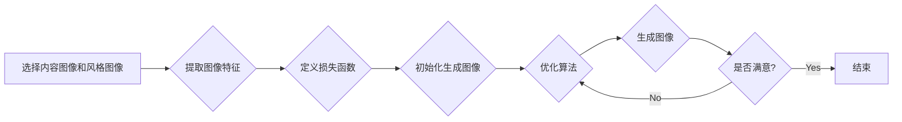

## 1. 背景介绍

### 1.1 概述

图像风格迁移 (Image Style Transfer) 是近年来计算机视觉和深度学习领域的一个热门研究方向，其目标是将一张图像的内容与另一张图像的风格进行融合，生成一张具有目标风格的新图像。这项技术将艺术与科技完美结合，为图像处理和创作开辟了全新的可能性。

### 1.2 发展历程

图像风格迁移的概念最早可以追溯到20世纪90年代，当时的研究主要集中在基于非参数模型的纹理合成方法。随着深度学习的兴起，基于卷积神经网络 (CNN) 的风格迁移算法取得了突破性的进展。2015年，Gatys等人提出了基于神经网络的图像风格迁移算法，利用卷积神经网络提取图像的内容和风格特征，并通过优化算法将两者进行融合，生成具有目标风格的新图像。

### 1.3 研究意义

图像风格迁移技术具有广泛的应用前景，例如：

* **艺术创作：** 可以将照片转换为不同艺术风格的绘画作品，为艺术家提供创作灵感和辅助工具。
* **图像增强：** 可以改善图像的视觉效果，例如提高图像的清晰度、对比度和色彩饱和度。
* **图像编辑：** 可以对图像进行风格化处理，例如将照片转换为卡通风格、素描风格等。
* **文化创意产业：** 可以用于设计个性化商品、制作艺术衍生品等。

## 2. 核心概念与联系

### 2.1 图像内容

图像内容指的是图像中所描绘的物体、场景和布局等信息。在图像风格迁移中，通常使用卷积神经网络的底层特征来表示图像内容。

### 2.2 图像风格

图像风格指的是图像的整体视觉效果，例如颜色、纹理、笔触等。在图像风格迁移中，通常使用卷积神经网络的高层特征来表示图像风格。

### 2.3 内容损失函数

内容损失函数用于衡量生成图像与内容图像在内容特征上的差异。常用的内容损失函数包括均方误差 (MSE) 和感知损失 (Perceptual Loss)。

### 2.4 风格损失函数

风格损失函数用于衡量生成图像与风格图像在风格特征上的差异。常用的风格损失函数包括Gram矩阵损失和MRF损失。

### 2.5 总损失函数

总损失函数是内容损失函数和风格损失函数的加权组合，用于指导图像风格迁移算法的优化过程。

## 3. 核心算法原理具体操作步骤

### 3.1 基于神经网络的图像风格迁移算法

基于神经网络的图像风格迁移算法的基本步骤如下：

1. **选择内容图像和风格图像。**
2. **使用预训练的卷积神经网络提取内容图像和风格图像的特征。**
3. **定义内容损失函数和风格损失函数。**
4. **初始化生成图像。**
5. **使用优化算法 (例如梯度下降法) 最小化总损失函数，更新生成图像的像素值。**
6. **重复步骤5，直到生成图像达到满意的效果。**

### 3.2 算法流程图

## 4. 数学模型和公式详细讲解举例说明

### 4.1 内容损失函数

常用的内容损失函数为均方误差 (MSE)，其计算公式如下：

$$
L_{content} = \frac{1}{N} \sum_{i=1}^{N} (F_l(x)_i - F_l(p)_i)^2
$$

其中，$N$ 表示特征图中元素的个数，$F_l(x)$ 表示生成图像在第 $l$ 层的特征图，$F_l(p)$ 表示内容图像在第 $l$ 层的特征图。 

### 4.2 风格损失函数

常用的风格损失函数为Gram矩阵损失，其计算公式如下：

$$
L_{style} = \sum_{l=0}^{L} w_l \frac{1}{4N_l^2M_l^2} \sum_{i=1}^{N_l} \sum_{j=1}^{M_l} (G_l(x)_{ij} - G_l(a)_{ij})^2
$$

其中，$L$ 表示网络的层数，$w_l$ 表示第 $l$ 层的权重，$N_l$ 和 $M_l$ 分别表示第 $l$ 层特征图的 height 和 width，$G_l(x)$ 表示生成图像在第 $l$ 层的Gram矩阵，$G_l(a)$ 表示风格图像在第 $l$ 层的Gram矩阵。

### 4.3 总损失函数

总损失函数为内容损失函数和风格损失函数的加权组合，其计算公式如下：

$$
L_{total} = \alpha L_{content} + \beta L_{style}
$$

其中，$\alpha$ 和 $\beta$ 分别表示内容损失和风格损失的权重。 
