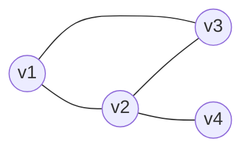

# 文本摘要：自动提取关键信息

作者：禅与计算机程序设计艺术

## 1. 背景介绍
### 1.1 文本摘要的定义与意义
#### 1.1.1 什么是文本摘要？
文本摘要是指通过计算机自动分析文本内容，提取出能够代表原文主要信息的简短语句或段落，生成浓缩版本的过程。它是自然语言处理和信息检索领域的重要研究课题之一。

#### 1.1.2 文本摘要的重要性
在信息爆炸的时代，人们每天接收到海量的文本信息，如新闻报道、科技文献、评论等。文本摘要技术可以帮助人们快速获取文本的核心内容，节省阅读时间，提高信息获取和处理的效率。

#### 1.1.3 文本摘要的应用场景
文本摘要在很多领域都有广泛应用，例如：
- 搜索引擎对网页内容进行摘要，生成摘要片段
- 新闻聚合网站自动提取新闻要点
- 学术文献的摘要生成，帮助研究者快速了解论文主旨
- 商品评论的关键观点提取
- 会议记录的自动总结
- 等等

### 1.2 文本摘要的发展历程
#### 1.2.1 早期的统计学方法
早期的文本摘要主要采用基于统计学的方法，如词频统计、TF-IDF等。这些方法通过分析文本中词语的出现频率和分布情况，找出重要的词语，再选取包含这些词语的句子作为摘要。

#### 1.2.2 基于图模型的方法
21世纪初，一些研究者提出了基于图模型的文本摘要方法，代表性的有TextRank和LexRank。它们将文本看作一个句子网络，通过计算句子之间的相似度构建图模型，再用图排序算法如PageRank找出中心句子。

#### 1.2.3 深度学习方法
近年来，随着深度学习的发展，一些研究者开始将神经网络应用到文本摘要任务中。典型的有基于注意力机制的Seq2Seq模型，还有BERT等预训练语言模型在摘要任务上的应用。深度学习方法可以更好地捕捉语义信息，生成流畅、连贯的摘要。

## 2. 核心概念与联系
### 2.1 文本表示
将文本转化为计算机可以处理的数字形式表示，是文本摘要的基础。常见的文本表示方法有：
- One-hot编码
- TF-IDF向量
- Word2Vec词嵌入
- BERT等预训练语言模型的Embedding

### 2.2 语料预处理
对原始语料进行预处理，去除噪声，规范化文本格式。主要步骤包括：
- 分句：将文本按句子边界切分成句子序列
- 分词：将句子切分成词语序列
- 去除停用词：过滤掉常见的虚词、连词等
- 词形还原：将词语规范化为原形

### 2.3 关键词提取
从文本中识别出重要的词语，作为后续生成摘要的线索。常见算法有：
- 基于词频的TF-IDF
- TextRank
- 主题模型如LDA

### 2.4 句子相似度计算
度量两个句子在语义上的相似程度，是很多摘要算法的核心。相似度计算方法有：  
- 基于词重叠的Jaccard系数
- 余弦相似度
- Word Mover's Distance
- BERT等语言模型的句子Embedding

### 2.5 句子排序
对文本中的句子按重要程度排序，得分高的句子将优先被选入摘要。排序算法有：
- 基于图排序的TextRank、LexRank  
- 序列标注模型，如CRF
- 句子级别的分类器

### 2.6 摘要句子选择
从排序后的句子中选取部分作为最终的摘要。需要考虑摘要的长度、信息覆盖度、冗余度等因素。常见策略有：
- 返回排名最高的前K个句子
- 考虑句子之间的多样性，避免重复
- 最大边际相关算法(MMR)

## 3. 核心算法原理具体操作步骤
下面以TextRank算法为例，详细讲解其原理和实现步骤。

### 3.1 TextRank算法原理
TextRank是一种无监督的文本摘要算法，借鉴了PageRank的思想。它将文本看作一个由句子节点构成的图，句子之间的边代表语义相似度。通过迭代计算每个节点的重要性得分，得分高的句子被选为摘要。

### 3.2 TextRank算法步骤
1. 将文本切分为句子序列 $S=(s_1,s_2,...,s_n)$
2. 对每对句子 $s_i,s_j$ 计算它们的相似度 $Sim(s_i,s_j)$，构建相似度矩阵 $M$
3. 根据相似度矩阵 $M$ 构建无向有权图 $G=(V,E)$，$V$ 为句子节点，$E$ 为两句子间相似度大于给定阈值时的边
4. 通过迭代计算每个节点 $v_i$ 的TextRank得分 $TR(v_i)$：

$$
TR(v_i) = (1-d) + d \times \sum_{j \in In(v_i)} \frac{w_{ji}}{\sum_{k \in Out(v_j)} w_{jk}} TR(v_j)
$$

其中 $d$ 为阻尼系数，$In(v_i)$ 为指向 $v_i$ 的节点集合，$Out(v_j)$ 为 $v_j$ 指向的节点集合，$w_{ij}$ 为 $v_i$ 到 $v_j$ 的边权重

5. 迭代计算直到收敛，得到各句子的TextRank得分
6. 按TextRank得分降序排列句子，取前 $K$ 个作为摘要

### 3.3 句子相似度计算
TextRank的一个关键步骤是计算句子相似度。常用的相似度计算方法有：

1. 基于词重叠的Jaccard相似度：
$$
Sim_{jaccard}(s_i,s_j) = \frac{|s_i \cap s_j|}{|s_i \cup s_j|}
$$

2. 基于TF-IDF的余弦相似度：
$$
Sim_{tfidf}(s_i,s_j) = \frac{\sum_w {tfidf(w,s_i) \times tfidf(w,s_j)}}{\sqrt{\sum_w tfidf(w,s_i)^2} \times \sqrt{\sum_w tfidf(w,s_j)^2}}
$$

3. 基于Word2Vec的词嵌入相似度：
$$
Sim_{w2v}(s_i,s_j) = \frac{1}{|s_i||s_j|} \sum_{w_i \in s_i} \sum_{w_j \in s_j} cos(v_{w_i}, v_{w_j})
$$

其中 $v_w$ 为词 $w$ 的Word2Vec嵌入向量

## 4. 数学模型和公式详细讲解举例说明
本节我们详细讲解TextRank中用到的一些数学模型和公式。

### 4.1 TextRank得分计算公式
TextRank得分计算公式源自PageRank算法，思想是一个节点的重要性由指向它的其他重要节点决定。公式为：

$$
TR(v_i) = (1-d) + d \times \sum_{j \in In(v_i)} \frac{w_{ji}}{\sum_{k \in Out(v_j)} w_{jk}} TR(v_j)
$$

其中各符号含义如下：
- $TR(v_i)$：节点 $v_i$ 的TextRank得分
- $d$：阻尼系数，一般取值0.85
- $In(v_i)$：指向节点 $v_i$ 的节点集合
- $Out(v_j)$：节点 $v_j$ 指向的节点集合
- $w_{ij}$：节点 $v_i$ 到 $v_j$ 的边权重，即两句子的相似度

举例说明：假设一个句子网络如下图所示，节点 $v_1$ 的TextRank得分计算过程为：



$$
\begin{aligned}
TR(v_1) &= 0.15 + 0.85 \times (\frac{w_{21}}{w_{21}+w_{23}+w_{24}} TR(v_2) + \frac{w_{31}}{w_{31}+w_{32}} TR(v_3)) \\
&= 0.15 + 0.85 \times (\frac{1}{3} TR(v_2) + \frac{1}{2} TR(v_3))
\end{aligned}
$$

可见 $v_1$ 的得分取决于 $v_2$ 和 $v_3$ 的得分以及它们之间的边权重。

### 4.2 句子相似度计算公式
以余弦相似度为例，公式为：

$$
Sim_{tfidf}(s_i,s_j) = \frac{\sum_w {tfidf(w,s_i) \times tfidf(w,s_j)}}{\sqrt{\sum_w tfidf(w,s_i)^2} \times \sqrt{\sum_w tfidf(w,s_j)^2}}
$$

其中：
- $tfidf(w,s)$ 表示词 $w$ 在句子 $s$ 中的TF-IDF值
- 分子为两个句子的TF-IDF向量内积
- 分母为两个向量的L2范数乘积，起到归一化作用

举例说明：假设句子 $s_1,s_2$ 的TF-IDF向量分别为：

$$
\begin{aligned}
s_1 &= (0.5, 0.3, 0.2, 0.0) \\
s_2 &= (0.1, 0.2, 0.1, 0.6)
\end{aligned}
$$

则它们的余弦相似度为：

$$
\begin{aligned}
Sim_{tfidf}(s_1,s_2) &= \frac{0.5 \times 0.1 + 0.3 \times 0.2 + 0.2 \times 0.1 + 0.0 \times 0.6}{\sqrt{0.5^2+0.3^2+0.2^2+0.0^2} \times \sqrt{0.1^2+0.2^2+0.1^2+0.6^2}} \\
&= \frac{0.05+0.06+0.02+0.0}{\sqrt{0.38} \times \sqrt{0.62}} \\
&= 0.265
\end{aligned}
$$

## 5. 项目实践：代码实例和详细解释说明
下面我们用Python实现一个简单的TextRank文本摘要系统。

### 5.1 环境准备
首先安装需要的第三方库：
```bash
pip install jieba networkx numpy
```

- jieba：中文分词工具
- networkx：图数据结构和算法库
- numpy：数值计算库

### 5.2 分句与分词
```python
import jieba

def cut_sentences(text):
    sentences = []
    sent_cuts = re.split(r'[。！？]', text)
    for sent in sent_cuts:
        if len(sent) > 5:  # 去除过短的句子
            sentences.append(sent)
    return sentences

def cut_words(sent):
    return list(jieba.cut(sent))
```

### 5.3 构建句子相似度图
```python
import networkx as nx

def build_graph(sents):
    G = nx.Graph()
    for i, sent1 in enumerate(sents):
        for j, sent2 in enumerate(sents):
            if i != j:
                G.add_edge(i, j, weight=calc_similarity(sent1, sent2))
    return G

def calc_similarity(sent1, sent2):
    words1 = cut_words(sent1)
    words2 = cut_words(sent2)
    common_words = set(words1) & set(words2)
    sim = len(common_words) / (len(words1) + len(words2))
    return sim
```

### 5.4 TextRank得分计算
```python
def textrank(G, d=0.85, max_iter=100):
    scores = nx.pagerank(G, alpha=d, max_iter=max_iter)
    return scores
```

### 5.5 摘要生成
```python
def summarize(text, num_sents=3):
    sents = cut_sentences(text)
    G = build_graph(sents)
    scores = textrank(G)
    top_sents = sorted(scores.items(), key=lambda x: x[1], reverse=True)[:num_sents]
    top_sents = sorted(top_sents, key=lambda x: x[0])
    summary = [sents[i] for i, _ in top_sents]
    return summary
```

### 5.6 测试
```python
text = '''
据中