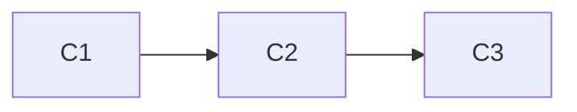

# 版本控制:有效管理模型演进和回滚的策略

## 1.背景介绍

在软件开发的过程中,版本控制是一个至关重要的实践。随着项目的不断迭代和演进,代码也在持续地变化和更新。有效地管理这些变化不仅可以确保开发过程的高效性和可追溯性,而且还能够在出现问题时快速回滚到之前的稳定版本,从而最大限度地减少对生产环境的影响。

版本控制系统(Version Control System,VCS)是一种用于管理代码变更的工具,它可以记录每一次代码修改的细节,包括作者、时间、注释等信息。通过版本控制系统,开发人员可以轻松地协作、合并代码、解决冲突,并且可以随时回滚到之前的任何版本。

常见的版本控制系统包括Git、Subversion(SVN)、Mercurial等。其中,Git因其分布式特性、高效性和灵活性而被广泛采用。本文将重点探讨如何利用Git有效地管理模型演进和回滚策略。

## 2.核心概念与联系

在深入探讨版本控制的策略之前,我们需要先了解一些核心概念:

### 2.1 Repository(仓库)

Repository是存储项目代码及其历史记录的地方。Git使用分布式存储模型,每个开发人员都拥有一个完整的本地仓库副本,可以在离线状态下进行版本控制操作。

### 2.2 Commit(提交)

Commit是Git中最基本的操作单元,它记录了对代码所做的修改。每次提交都会生成一个唯一的哈希值(SHA-1)作为标识符,并包含作者信息、提交时间和提交说明等元数据。

### 2.3 Branch(分支)

Branch是Git中一个非常重要的概念。它允许开发人员在不影响主线代码的情况下,创建一个独立的开发线路。每个分支都可以进行独立的提交,最终可以合并回主线分支。

### 2.4 Merge(合并)

Merge是将不同分支的修改合并到一起的操作。Git会自动尝试合并不同分支的修改,如果存在冲突,开发人员需要手动解决冲突后再进行合并。

### 2.5 Tag(标签)

Tag是对特定提交的一个引用,通常用于标记发布版本或特定里程碑。标签可以是轻量级的(lightweight)或附注型的(annotated),后者包含更多元数据信息。

### 2.6 Rebase(变基)

Rebase是一种将一个分支的修改整合到另一个分支的技术。它会创建一个新的提交历史,使得分支的提交顺序更加线性。Rebase通常用于在合并之前整理提交历史,使其更加清晰和易于理解。

## 3.核心算法原理具体操作步骤

Git的核心算法原理基于内容可寻址文件系统和有向无环图(DAG)。下面我们将详细探讨Git的工作原理和常用操作步骤。

### 3.1 Git对象模型

Git使用四种基本对象来存储和管理数据:

1. **Blob对象**: 用于存储文件的原始数据。
2. **树对象**: 用于存储目录结构和文件名,并将文件名与相应的Blob对象关联起来。
3. **提交对象**: 用于存储提交的元数据,包括作者、提交者、提交时间、提交说明以及指向树对象和父提交对象的指针。
4. **标签对象**: 用于存储标签信息,包括标签名称、标签创建者、创建时间以及指向特定提交对象的指针。

这些对象通过SHA-1哈希值进行标识和寻址,形成了Git的内容可寻址文件系统。

### 3.2 Git工作流程

Git的工作流程可以概括为以下几个步骤:

1. **初始化仓库**: 使用`git init`命令在当前目录创建一个新的Git仓库。
2. **添加文件到暂存区**: 使用`git add`命令将修改的文件添加到暂存区(staging area)。
3. **提交修改**: 使用`git commit`命令将暂存区中的修改提交到本地仓库。
4. **推送到远程仓库**: 使用`git push`命令将本地提交推送到远程仓库。
5. **拉取远程更新**: 使用`git pull`命令从远程仓库拉取最新的提交并合并到本地分支。

### 3.3 分支管理

Git的分支管理是一个强大且灵活的功能。下面是一些常用的分支操作:

1. **创建新分支**: 使用`git branch <branch-name>`命令创建一个新的分支。
2. **切换分支**: 使用`git checkout <branch-name>`命令切换到指定分支。
3. **合并分支**: 使用`git merge <branch-name>`命令将指定分支合并到当前分支。
4. **删除分支**: 使用`git branch -d <branch-name>`命令删除指定分支。

### 3.4 回滚和恢复

Git提供了多种方式来回滚和恢复代码:

1. **回滚提交**: 使用`git reset`命令可以将当前分支回滚到指定的提交。
2. **恢复文件**: 使用`git checkout`命令可以从特定提交或分支中恢复文件。
3. **重置暂存区**: 使用`git reset HEAD <file>`命令可以将指定文件从暂存区移除。
4. **丢弃本地修改**: 使用`git checkout -- <file>`命令可以丢弃对指定文件的本地修改。

### 3.5 高级操作

除了基本操作之外,Git还提供了一些高级功能,如:

1. **Rebase**: 使用`git rebase`命令可以将一个分支的修改整合到另一个分支,并创建一个新的提交历史。
2. **Cherry-pick**: 使用`git cherry-pick`命令可以将特定的提交应用到当前分支。
3. **Stash**: 使用`git stash`命令可以临时保存当前工作区的修改,以便切换到其他分支。
4. **Submodule**: 使用`git submodule`命令可以在一个Git仓库中包含另一个Git仓库作为子模块。

## 4.数学模型和公式详细讲解举例说明

虽然Git的核心算法并不涉及复杂的数学模型,但是它确实使用了一些基本的数据结构和算法来实现版本控制功能。下面我们将探讨Git中使用的一些数学模型和公式。

### 4.1 SHA-1哈希算法

Git使用SHA-1哈希算法来计算每个对象的唯一标识符。SHA-1是一种密码散列函数,它可以将任意长度的输入数据映射到一个长度为160位(20字节)的哈希值。

SHA-1算法的基本公式如下:

$$
H_0 = 0x67452301\\
H_1 = 0xEFCDAB89\\
H_2 = 0x98BADCFE\\
H_3 = 0x10325476\\
H_4 = 0xC3D2E1F0
$$

$$
W_t = \begin{cases}
M_t^{(i)} & 0 \leq t \leq 15\\
\operatorname{ROTL}^1(W_{t-3} \oplus W_{t-8} \oplus W_{t-14} \oplus W_{t-16}) & 16 \leq t \leq 79
\end{cases}
$$

$$
\begin{align*}
A &= H_0\\
B &= H_1\\
C &= H_2\\
D &= H_3\\
E &= H_4
\end{align*}
$$

$$
\begin{align*}
\text{for } t &= 0 \text{ to } 79\\
\text{TEMP} &= \operatorname{ROTL}^5(A) + f_t(B,C,D) + E + K_t + W_t\\
E &= D\\
D &= C\\
C &= \operatorname{ROTL}^{30}(B)\\
B &= A\\
A &= \text{TEMP}
\end{align*}
$$

$$
\begin{align*}
H_0 &= H_0 + A\\
H_1 &= H_1 + B\\
H_2 &= H_2 + C\\
H_3 &= H_3 + D\\
H_4 &= H_4 + E
\end{align*}
$$

其中,$\operatorname{ROTL}^n(x)$表示将$x$循环左移$n$位,$\oplus$表示按位异或操作,$f_t$和$K_t$是SHA-1算法中预定义的常量。

SHA-1算法的输出是一个160位的哈希值,通常以40个十六进制字符表示。由于SHA-1算法的单向性和抗冲突性,Git可以使用这些哈希值来唯一标识每个对象,并确保对象的完整性。

### 4.2 Git对象模型

Git使用有向无环图(DAG)来表示提交对象之间的关系。每个提交对象都包含一个或多个父提交对象的引用,形成了一棵提交树。

假设我们有一个包含三个提交的Git仓库,其提交历史如下:

```
C3 <- C2 <- C1
```

其中,$C_1$是最早的提交,$C_2$是基于$C_1$的新提交,$C_3$是基于$C_2$的最新提交。我们可以使用一个有向无环图来表示这种关系:



在这个图中,每个节点代表一个提交对象,边表示父子关系。Git使用这种有向无环图来跟踪提交历史,并支持各种版本控制操作,如分支、合并、回滚等。

## 5.项目实践:代码实例和详细解释说明

为了更好地理解版本控制的实践,我们将通过一个简单的示例项目来演示Git的使用。

### 5.1 初始化Git仓库

首先,我们需要创建一个新的Git仓库。在命令行中,导航到项目目录并执行以下命令:

```bash
git init
```

这将在当前目录创建一个新的Git仓库。你可以看到一个名为`.git`的隐藏目录,它用于存储Git的元数据和对象数据库。

### 5.2 添加文件并提交

接下来,让我们创建一个新文件并将其添加到Git仓库中。在项目目录中创建一个名为`README.md`的新文件,并添加以下内容:

```markdown
# My Project

This is a simple project for demonstrating Git version control.
```

现在,我们需要将这个文件添加到Git的暂存区,然后提交到本地仓库。执行以下命令:

```bash
git add README.md
git commit -m "Initial commit"
```

第一个命令将`README.md`文件添加到暂存区,第二个命令将暂存区中的修改提交到本地仓库,并附加一个提交说明"Initial commit"。

### 5.3 创建分支并进行修改

现在,让我们创建一个新的分支来进行一些修改。执行以下命令:

```bash
git checkout -b feature/add-license
```

这个命令将创建一个名为`feature/add-license`的新分支,并自动切换到该分支。

在这个新分支上,我们将创建一个新文件`LICENSE`并添加一些内容。执行以下命令:

```bash
echo "MIT License" > LICENSE
git add LICENSE
git commit -m "Add license file"
```

这将创建一个新的`LICENSE`文件,并将其添加到暂存区和本地仓库中。

### 5.4 合并分支

现在,我们已经在`feature/add-license`分支上完成了修改,让我们将这些修改合并回主分支。首先,切换回主分支:

```bash
git checkout main
```

然后,执行合并操作:

```bash
git merge feature/add-license
```

Git将自动尝试合并两个分支的修改。如果没有冲突,合并将顺利完成。否则,你需要手动解决冲突后再次提交。

### 5.5 推送到远程仓库

最后,让我们将本地提交推送到远程仓库。首先,我们需要创建一个新的远程仓库(例如在GitHub或GitLab上)。然后,将远程仓库的URL添加到本地Git配置中:

```bash
git remote add origin https://github.com/username/my-project.git
```

现在,我们可以将本地提交推送到远程仓库:

```bash
git push -u origin main
```

这个命令将本地的`main`分支推送到远程仓库的`origin`远程,并设置上游分支(upstream branch)。以后,你可以使用`git push`命令直接推送本地提交。

通过这个示例,你应该已经掌握了Git的基本使用方法,包括初始化仓库、添加文件、