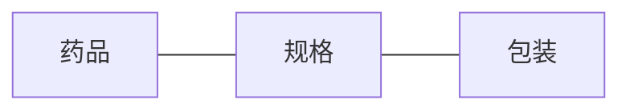

# 药品进销存管理系统详细设计与具体代码实现

作者：禅与计算机程序设计艺术

## 1. 背景介绍

### 1.1 药品进销存管理系统的重要性
在现代医疗卫生事业中,药品是不可或缺的重要组成部分。药品进销存管理是医院、药店等机构的一项重要工作,直接关系到患者用药安全、药品质量控制以及经济效益等诸多方面。传统的人工管理模式已经无法满足日益增长的药品管理需求,因此开发一套功能完善、操作简单、安全可靠的药品进销存管理系统就显得尤为重要和迫切。

### 1.2 药品进销存管理系统的主要功能
一个优秀的药品进销存管理系统需要具备以下主要功能:  
(1)药品信息管理:对药品的各种信息(如药品名称、编码、规格、产地、批号、有效期等)进行录入、修改、删除、查询等操作。  
(2)供应商管理:对药品供应商的信息进行管理,如供应商名称、联系方式、地址、结算方式等。  
(3)采购管理:药品采购计划制定、采购订单生成、采购入库等。  
(4)库存管理:药品出入库登记、库存预警、库存盘点、药品调拨等。  
(5)销售管理:处方调配、药品销售、退换货管理等。  
(6)统计报表:采购、销售、库存等各类统计报表。  
(7)系统管理:操作员管理、权限管理、数据备份与恢复等基础功能。

### 1.3 本文的主要内容
本文将重点介绍药品进销存管理系统的详细设计思路,并给出核心功能模块的代码实现。通过本文的学习,读者可以:  
(1)掌握一个完整系统的软件开发设计思路和方法。  
(2)了解药品进销存管理业务流程和功能需求。  
(3)学习实际项目开发中数据库设计、功能设计的一些经验和技巧。  
(4)借鉴文中给出的代码,快速实现一个药品管理系统的原型。

## 2. 核心概念与关联

### 2.1 药品、药品规格与包装
药品是指用于预防、治疗、诊断人的疾病,有目的地调节生理机能并规定有适应症或功能主治、用法和用量的物质。在系统中,药品信息包括:  
- 药品编码(唯一)
- 通用名
- 商品名  
- 拼音码
- 剂型(片剂/胶囊/注射液等)
- 规格(如500mg*24片/盒)
- 包装(如24片/盒,100支/盒)
- 单位(如盒、支)
- 生产厂家
- 产地
- 有效期

其中,药品、规格、包装是三个密切相关但又相互区分的概念。以"阿莫西林胶囊"为例:  
- 药品:"阿莫西林胶囊"
- 规格:"0.25g","0.5g"等
- 包装:"12粒/盒","24粒/盒","100粒/瓶"等

它们之间的关系如下图所示:



### 2.2 供应商与采购管理
供应商是指向医院、药店等单位提供药品的厂家或经销商。系统中需要记录供应商的名称、联系人、电话、地址、银行账户、结算方式等信息。

采购是指根据库存情况和销售预测,向供应商订购药品并入库的过程。采购业务流程通常包括:
1. 采购计划制定:分析库存和销售情况,确定需要采购的药品种类和数量。
2. 供应商选择:根据药品品种、价格、质量、服务等因素选择合适的供应商。
3. 采购订单生成:形成采购订单并发送给供应商。
4. 采购入库:供应商送货,验收入库并登记入库单。
5. 采购结算:与供应商按约定方式结算货款。

### 2.3 库存管理
库存是指医院、药店等单位储备的药品数量。合理控制库存量,对于降低资金占用、减少药品过期损失、保障供应非常重要。库存管理的主要工作包括:
- 库存登记:药品出入库时及时准确登记。
- 库存预警:设置安全库存和最高库存两个阈值,当库存低于安全库存或高于最高库存时发出预警。
- 库存盘点:定期对实物库存进行清点核对,保证账实一致。
- 药品调拨:不同仓库间药品的调拨。
- 药品养护:定期检查,合理存储,防止药品变质。

### 2.4 处方与销售管理
处方是医生根据病情开具的药品清单。药品销售要严格按照处方调配,未经处方不得随意销售处方药。

销售管理的主要工作包括:
- 处方录入:将医生开具的纸质处方录入系统。
- 处方调配:根据处方内容,进行药品调配。
- 发药:核对药品与处方后交付患者。
- 退换货处理:药品如有质量问题,过期等需要退换货时进行登记。
- 销售统计:统计一定时间范围内的销售情况。

## 3. 核心算法原理与具体操作步骤

### 3.1 ABC分类法
ABC分类法是一种对库存商品进行分类管理的方法。其基本思想是:将库存商品按其价值(一般为年度用量与单价的乘积)从高到低排列,前面累计占总价值70%左右的商品归为A类,累计占总价值20%左右的商品归为B类,其余的归为C类。

对于药品库存管理,可以参考以下步骤实施ABC分类:
1. 统计一定时期(如一年)内各种药品的消耗量和单价。
2. 计算各种药品的年度价值(年消耗量×单价)。 
3. 按年度价值从高到低排序。
4. 计算每种药品的年度价值占总价值的百分比,以及累计百分比。
5. 将累计百分比在0~70%的药品归为A类,70%~90%的归为B类,90%以上的归为C类。
6. 对A类药品严格管理,控制库存量;B类药品可适当放宽管理;C类药品只需要保证供应即可。

通过ABC分类,可以集中人力物力重点管控对药品流通速度和资金占用影响最大的A类药品,从而在保证供应的同时,降低库存积压,提高资金周转率。

### 3.2 EOQ模型
EOQ(Economic Order Quantity)经济订货批量模型是一种确定最佳采购或生产批量以降低总库存成本的方法。EOQ的计算公式为:

$$
EOQ = \sqrt{\frac{2DS}{H}}
$$

其中:
- D:年需求量
- S:单次订货(或生产)的固定成本
- H:单位商品的年度持有成本

举例说明:某医院年度阿莫西林胶囊使用量为5000盒,每次订货的固定成本(如订单处理费、运费、人工等)为100元,每盒胶囊的年持有成本(如仓储费、资金占用等)为2元。则其EOQ为:

$$
EOQ = \sqrt{\frac{2×5000×100}{2}} = 500(盒)
$$

这表明,医院每次订购500盒阿莫西林胶囊时,总库存成本最低。

使用EOQ需要注意以下几点:
1. EOQ模型假设需求量固定且已知,现实中难以做到。
2. 订货和持有成本难以准确估算。
3. 对于需求波动大、采购周期长、药效期短的药品慎用EOQ模型。
4. 可在EOQ的基础上,结合ABC分类法、安全库存等方法,制定更加灵活的采购策略。

### 3.3 VED分类法
VED分类法是根据药品的重要性和紧迫性,将其分为重点(Vital)、必需(Essential)和普通(Desirable)三类的方法。

- V类:对患者生命有重大影响,必须时刻备齐的药品,如抢救药、麻醉药、解毒药等。要保证100%供应,库存也要保持较高水平。
- E类:临床常用药,选择面较广,可选择性购买,如一般抗生素、解热镇痛药等。
- D类:非必需品,可有可无,不常用,如维生素、保健品等。

VED分类的步骤如下:
1. 请临床专家根据药品的重要性和紧迫性,将其划分为V、E、D三类。
2. 对V类药品列出重点采购清单,单独管理。
3. 经常统计V类药品的消耗量,调整储备量。
4. 对V类药品建立定期警示制度,确保100%供应。
5. 对E类和D类药品可相对放宽管理。

VED分类与ABC分类可结合使用,对AV类药品实行最严格管理,DE类药品相对放宽管理。

## 4. 数学模型和公式详细讲解举例说明

### 4.1 安全库存模型
安全库存是指为了防止因需求波动或供应延迟而准备的额外库存。安全库存的计算公式为:

$$
SS = Z × σ × \sqrt{LT}
$$

其中:
- Z:服务水平因子,取决于期望的缺货概率。例如服务水平为95%时,Z≈1.64。
- σ:需求标准差,表示一定时期内需求量的波动水平。
- LT:前置时间,表示从发出订货到货物入库的时间。

举例说明:某药店青霉素销售量平均每周100盒,标准差为20盒,前置时间为2周,期望服务水平为98%,则其安全库存为:

$$
SS = 2.05 × 20 × \sqrt{2} = 58(盒)
$$

这表明,该药店需要额外储备58盒青霉素,才能保证98%的需求都能满足。

### 4.2 再订货点模型  
再订货点(ROP)是指当库存降至某一数量时,需要发出补货订单以避免库存短缺。ROP的计算公式为:

$$
ROP = \bar{d}×LT + SS
$$

其中:
- $\bar{d}$:单位时间内的平均需求量
- LT:前置时间
- SS:安全库存

仍以上例为例,青霉素的再订货点为:

$$
ROP = 100 × 2 + 58 = 258(盒)
$$

这表明,当青霉素库存降到258盒时,就需要发出新的采购订单了。

### 4.3 库存周转率与库存天数
库存周转率和库存天数是评价库存管理绩效的两个重要指标。其计算公式为:

$$
库存周转率 = \frac{一定时期的销售成本}{平均库存} \\
库存天数 = \frac{365}{库存周转率}
$$

举例说明:某医院2022年药品销售成本为1000万元,年初库存为120万元,年末库存为150万元,则其库存周转率和库存天数分别为:

$$
库存周转率 = \frac{1000}{(120+150)/2} = 7.41(次) \\
库存天数 = \frac{365}{7.41} = 49(天) 
$$

这表明,该医院2022年的药品平均库存周转7.41次,平均每49天周转一次库存。

## 5. 项目实践:代码实例与详细解释说明

下面我们给出药品进销存管理系统的一些核心功能的代码实现。项目采用主流的Spring Boot框架,使用MySQL数据库。

### 5.1 药品信息管理

#### 5.1.1 药品实体类

```java
@Data
@Entity
@Table(name = "drug")
public class Drug {
    @Id
    @GeneratedValue(strategy = GenerationType.IDENTITY)
    private Long id;
    
    private String code; //药品编码
    
    private String genericName; //通用名
    
    private String tradeName; //商品名
    
    private String pinyinCode; //拼音码
    
    private String dosageForm; //剂型
    
    private String spec; //规格
    
    private String packageUnit; //包装单位
    
    private String manufacturer; //生产厂家
    
    private String origin; //产地
    
    private Integer validityPeriod; //有效期
}
```

#### 5.1.2 药品Repository

```java
@Repository
public interface DrugRepository extends Jpa