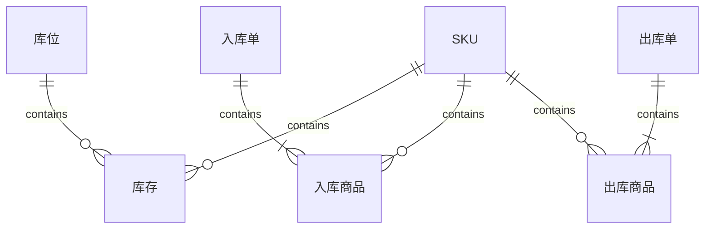

# 仓库管理系统详细设计与具体代码实现

作者：禅与计算机程序设计艺术

## 1. 背景介绍
### 1.1 仓库管理系统的重要性
在现代企业运营中,高效的仓库管理是至关重要的。仓库管理系统可以帮助企业优化库存管理、提高订单履行效率、降低运营成本。一个设计良好的仓库管理系统不仅可以提高仓库的整体效率,还能为企业带来显著的竞争优势。

### 1.2 仓库管理系统的主要功能
一个全面的仓库管理系统通常包括以下主要功能:
- 库存管理:跟踪和管理库存水平,实时更新库存信息。
- 入库管理:处理和记录商品的接收和上架。
- 出库管理:处理和记录商品的拣货、包装和发货。
- 库位管理:优化仓库布局,管理库位的分配和利用。
- 报表和分析:生成各种报表,分析仓库运营数据,支持决策。

### 1.3 本文的目的和结构
本文旨在详细阐述仓库管理系统的设计和实现。我们将从核心概念出发,深入探讨系统架构、数据模型、核心算法,并提供详细的代码实例。同时,我们还将讨论仓库管理系统在实际应用中的场景和挑战。

## 2. 核心概念与关联
### 2.1 SKU(最小存货单位)
SKU是Stock Keeping Unit的缩写,指库存管理中的最小可用单位,通常是指一个单品。每个SKU都有唯一的编号,用于跟踪和管理库存。

### 2.2 库位(Location)
库位是指仓库中存放商品的具体位置。每个库位都有唯一的编码,通常采用货架-层-列-位的编码方式,如A-01-02-03。

### 2.3 入库(Inbound)和出库(Outbound)  
入库是指商品进入仓库并上架的过程。主要包括收货、质检、上架等环节。
出库是指商品从仓库发出的过程。主要包括订单分配、拣货、复核、打包、发货等环节。

### 2.4 库存(Inventory)
库存是指当前仓库中实际储备的商品数量。准确的库存信息对仓库运营至关重要。

### 2.5 波次(Wave)
波次是指在一定时间内处理一批订单的出库作业。合理的波次规划可以提高出库效率。

## 3. 系统架构设计
### 3.1 总体架构
仓库管理系统采用经典的三层架构:
- 表示层:提供用户界面,与用户交互。
- 业务逻辑层:处理业务逻辑,协调数据层与表示层。
- 数据访问层:与数据库交互,执行数据的CRUD操作。

### 3.2 技术选型
- 后端:Spring Boot + MyBatis
- 前端:Vue.js + Element UI
- 数据库:MySQL
- 缓存:Redis
- 消息队列:RabbitMQ

### 3.3 模块划分
系统分为以下几个主要模块:
- 基础数据管理:SKU、供应商、客户等基础数据的维护。
- 入库管理:入库单创建、收货、上架等。
- 出库管理:订单分配、拣货、复核、发货等。
- 库存管理:库存查询、盘点、调整等。
- 库位管理:库位设置、库位分配等。
- 报表统计:各类报表和数据分析。

## 4. 数据模型设计
### 4.1 概念模型
根据仓库管理的业务需求,设计以下核心实体:
- SKU:库存管理的最小单位,包含编号、名称、规格、单位等属性。
- 库位:存放商品的位置,包含编码、类型、容量、状态等属性。
- 入库单:入库操作的单据,包含单号、供应商、操作人、入库时间等属性,关联多个入库商品。
- 出库单:出库操作的单据,包含单号、客户、操作人、出库时间等属性,关联多个出库商品。
- 库存:记录每个SKU在各个库位的数量,包含SKU、库位、数量等属性。

### 4.2 E-R图设计
根据上述概念模型,绘制实体-关系(E-R)图:



### 4.3 数据库表设计
根据E-R图,设计以下数据库表:
- sku(id, sn, name, spec, unit, ...)
- location(id, code, type, capacity, status, ...)
- inbound_order(id, sn, supplier_id, operator, inbound_time, ...)
- inbound_item(id, inbound_order_id, sku_id, quantity, ...)
- outbound_order(id, sn, customer_id, operator, outbound_time, ...)
- outbound_item(id, outbound_order_id, sku_id, quantity, ...)
- inventory(id, sku_id, location_id, quantity, ...)

## 5. 核心算法与流程
### 5.1 入库流程
1. 创建入库单,选择供应商,填写入库商品明细。
2. 收货:扫描商品条码,录入实收数量。
3. 质检:抽检商品质量,记录质检结果。
4. 上架:根据入库单分配库位,将商品放置到指定库位。
5. 更新库存:增加对应SKU在相应库位的数量。

### 5.2 出库流程
1. 创建出库单,选择客户,填写出库商品明细。
2. 分配库位:根据出库单和库存情况,为每个商品分配最优库位。
3. 拣货:根据分配的库位,使用拣货设备拣选商品。
4. 复核:扫描拣货完成的商品,与出库单核对。
5. 打包:将复核通过的商品进行打包。
6. 发货:安排运输,将打包好的商品发运给客户。
7. 更新库存:减少对应SKU在相应库位的数量。

### 5.3 库位分配算法
库位分配是出库的关键环节,目标是在满足出库要求的同时,尽可能提高拣货效率。常用的库位分配算法有:
- 先进先出(FIFO):优先使用入库时间最早的库存。
- 货位优先:根据货位的拣货难易程度,优先使用易拣货位。
- 动态路径规划:根据实时库存和拣货任务,动态规划最优拣货路径。

以下是一个简单的FIFO库位分配算法:

```python
def allocate_location(sku_id, quantity):
    # 查询该SKU的库存记录,按入库时间排序
    inventory_list = Inventory.query.filter_by(sku_id=sku_id).order_by(Inventory.inbound_time).all()
    
    allocated_qty = 0
    allocation = []
    
    for inv in inventory_list:
        if inv.quantity >= quantity - allocated_qty:
            # 该库位数量足够,直接分配
            allocation.append((inv.location_id, quantity - allocated_qty))
            return allocation
        else:
            # 该库位数量不足,全部分配,继续下一个库位
            allocation.append((inv.location_id, inv.quantity))
            allocated_qty += inv.quantity
    
    # 库存不足,无法完全分配
    return None
```

## 6. 代码实现
下面是使用Spring Boot和MyBatis实现的部分核心代码。

### 6.1 SKU管理
SKU实体类:
```java
@Data
public class Sku {
    private Long id;
    private String sn;
    private String name;
    private String spec;
    private String unit;
    // 其他属性...
}
```

SKU Mapper接口:
```java
@Mapper
public interface SkuMapper {
    @Select("SELECT * FROM sku WHERE id = #{id}")
    Sku getById(Long id);
    
    @Insert("INSERT INTO sku(sn, name, spec, unit) VALUES (#{sn}, #{name}, #{spec}, #{unit})")
    void insert(Sku sku);
    
    // 其他方法...
}
```

SKU Service:
```java
@Service
public class SkuService {
    @Autowired
    private SkuMapper skuMapper;
    
    public Sku getSkuById(Long id) {
        return skuMapper.getById(id);
    }
    
    public void createSku(Sku sku) {
        skuMapper.insert(sku);
    }
    
    // 其他业务方法...
}
```

### 6.2 入库管理
入库单实体类:
```java
@Data
public class InboundOrder {
    private Long id;
    private String sn;
    private Long supplierId;
    private String operator;
    private Date inboundTime;
    
    private List<InboundItem> items;
    // 其他属性...
}
```

入库单Mapper接口:
```java
@Mapper
public interface InboundOrderMapper {
    @Select("SELECT * FROM inbound_order WHERE id = #{id}")
    @Results({
        @Result(property = "items", javaType = List.class, 
            column = "id", many = @Many(select = "com.example.mapper.InboundItemMapper.getByOrderId"))
    })
    InboundOrder getById(Long id);
    
    @Insert("INSERT INTO inbound_order(sn, supplier_id, operator, inbound_time) VALUES (#{sn}, #{supplierId}, #{operator}, #{inboundTime})")
    @Options(useGeneratedKeys=true, keyProperty="id")
    void insert(InboundOrder order);
    
    // 其他方法...
}
```

入库Service:
```java
@Service
public class InboundService {
    @Autowired
    private InboundOrderMapper orderMapper;
    
    @Autowired
    private InboundItemMapper itemMapper;
    
    @Autowired
    private InventoryMapper inventoryMapper;
    
    @Transactional
    public void createInboundOrder(InboundOrder order) {
        // 插入入库单
        orderMapper.insert(order);
        // 插入入库商品
        for (InboundItem item : order.getItems()) {
            item.setInboundOrderId(order.getId());
            itemMapper.insert(item);
            // 更新库存
            inventoryMapper.increase(item.getSkuId(), item.getQuantity());
        }
    }
    
    // 其他业务方法...
}
```

### 6.3 出库管理
出库单实体类:
```java
@Data
public class OutboundOrder {
    private Long id;
    private String sn;
    private Long customerId;
    private String operator;
    private Date outboundTime;
    
    private List<OutboundItem> items;
    // 其他属性...
}
```

出库单Mapper接口:
```java
@Mapper
public interface OutboundOrderMapper {
    @Select("SELECT * FROM outbound_order WHERE id = #{id}")
    @Results({
        @Result(property = "items", javaType = List.class, 
            column = "id", many = @Many(select = "com.example.mapper.OutboundItemMapper.getByOrderId"))
    })
    OutboundOrder getById(Long id);
    
    @Insert("INSERT INTO outbound_order(sn, customer_id, operator, outbound_time) VALUES (#{sn}, #{customerId}, #{operator}, #{outboundTime})")
    @Options(useGeneratedKeys=true, keyProperty="id")
    void insert(OutboundOrder order);
    
    // 其他方法...
}
```

出库Service:
```java
@Service
public class OutboundService {
    @Autowired
    private OutboundOrderMapper orderMapper;
    
    @Autowired
    private OutboundItemMapper itemMapper;
    
    @Autowired
    private InventoryMapper inventoryMapper;
    
    @Transactional
    public void createOutboundOrder(OutboundOrder order) {
        // 插入出库单
        orderMapper.insert(order);
        for (OutboundItem item : order.getItems()) {
            item.setOutboundOrderId(order.getId());
            // 分配库位
            List<InventoryAllocation> allocations = inventoryMapper.allocate(item.getSkuId(), item.getQuantity());
            if (allocations == null) {
                throw new RuntimeException("库存不足");
            }
            item.setAllocations(allocations);
            // 插入出库商品
            itemMapper.insert(item);
            // 更新库存
            for (InventoryAllocation alloc : allocations) {
                inventoryMapper.decrease(alloc.getLocationId(), item.getSkuId(), alloc.getQuantity());
            }
        }
    }
    
    // 其他业务方法...
}
```

## 7. 应用场景与挑战
### 7.1 电商仓储
电商是仓库管理系统的主要应用场景之一。电商仓库需要快速处理大量订单,对出库效率要求很高。同时,电商SKU品类繁多,需要精细化的库存管理。

### 7.2 制造业库存
制造业的原材料、半成品、产成品都需要仓储。与电商不同,制造业的物