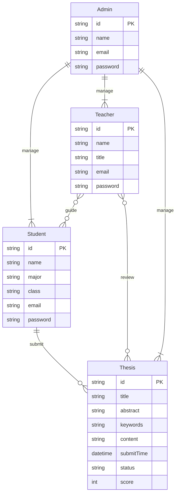

# 在线毕业论文提交系统详细设计与具体代码实现

## 1. 背景介绍
### 1.1 在线毕业论文提交系统的必要性
在当今数字化时代,高校毕业生人数逐年增加,传统的纸质版毕业论文提交方式已经难以满足高校管理的需求。开发一个在线毕业论文提交系统势在必行,它可以大大提高毕业论文收集、管理、审核的效率,减轻教务管理人员的工作量。
### 1.2 系统的主要功能
在线毕业论文提交系统主要实现以下功能:
1. 学生在线提交毕业论文
2. 教师在线审核、批改、打分
3. 系统自动查重,防止抄袭
4. 论文版本管理,支持多次修改提交
5. 教务管理人员汇总统计、下载论文
### 1.3 系统架构设计
系统采用B/S架构,学生和教师通过浏览器访问,服务端采用Java语言开发,使用Spring Boot框架,数据库选用MySQL。系统部署在云服务器上,保证了系统的高可用性。

## 2. 核心概念与关系
### 2.1 学生(Student)
属性:学号、姓名、专业、班级、邮箱、密码等
与论文(Thesis)是一对多关系,即一个学生可以提交多篇论文
### 2.2 教师(Teacher) 
属性:教工号、姓名、职称、邮箱、密码等
与学生(Student)是多对多的指导关系
与论文(Thesis)是多对多的审核关系,一个教师可以审核多篇论文,一篇论文也可以分配给多个教师审核
### 2.3 管理员(Admin)
属性:管理员ID、姓名、邮箱、密码等
拥有对学生、教师、论文的管理权限
### 2.4 论文(Thesis)
属性:论文ID、标题、摘要、关键词、正文、提交时间、审核状态、成绩等
与学生是多对一的关系,与教师是多对多的关系
### 2.5 E-R图设计
根据以上分析,绘制系统的E-R图如下:



## 3. 核心算法原理与具体步骤
### 3.1 论文查重算法
论文查重是防止学生抄袭的重要手段。本系统采用SimHash算法实现论文查重功能。
#### 3.1.1 SimHash算法原理
SimHash算法是一种局部敏感哈希算法,将一段文本映射为一个二进制编码。编码的比特位数越多,区分度越大。如果两个文本的SimHash值的汉明距离小于一定阈值,就认为这两个文本相似。
#### 3.1.2 算法步骤
1. 对文本进行分词,得到一组关键词及其权重
2. 对每个关键词做hash,得到一组二进制编码
3. 对这组编码做加权累加,大于0的位置1,小于0的位置0,得到SimHash值
4. 比较两篇文章SimHash值的汉明距离,小于阈值则认为相似

### 3.2 论文推荐算法
为了方便教师查找相关论文,系统使用协同过滤算法实现论文推荐功能。
#### 3.2.1 协同过滤算法原理
协同过滤是一种基于用户行为的推荐算法,通过分析用户的历史行为,发现用户的喜好,从而给用户推荐感兴趣的内容。
#### 3.2.2 算法步骤
1. 收集用户行为数据,如浏览、点赞、评论等
2. 计算用户相似度矩阵
   
$$
w(i,j) = \frac{|N(i)\cap N(j)|}{\sqrt{|N(i)||N(j)|}}
$$

其中$w(i,j)$表示用户$i$和用户$j$的相似度,$N(i)$和$N(j)$分别表示用户$i$和$j$有过行为的论文集合。

3. 根据用户相似度,计算用户对每篇论文的兴趣度

$$
p(u,i) = \frac{\sum_{v\in S(u,K)\cap N(i)}w(u,v)}{\sum_{v\in S(u,K)}w(u,v)}
$$

其中$p(u,i)$表示用户$u$对论文$i$的兴趣度,$S(u,K)$表示与用户$u$最相似的$K$个用户,$N(i)$表示对论文$i$有过行为的用户集合。

4. 将兴趣度高的论文推荐给用户

## 4. 数学模型与公式详解
### 4.1 论文相似度计算
假设论文$A$的SimHash值为$S_A$,论文$B$的SimHash值为$S_B$,两者的汉明距离为:

$$
d(A,B) = \sum_{i=1}^{n}S_A(i)\oplus S_B(i)
$$

其中$\oplus$表示异或运算,$n$为SimHash的位数。

相似度可以用汉明距离归一化得到:

$$
\mathrm{sim}(A,B) = 1 - \frac{d(A,B)}{n}
$$

若$\mathrm{sim}(A,B)$大于给定阈值,如0.8,则认为论文$A$和$B$相似。

### 4.2 推荐结果评估
为了评估推荐算法的效果,引入准确率和召回率两个指标。

准确率(Precision)衡量推荐结果的精确程度,公式为:

$$
\mathrm{Precision} = \frac{|R\cap T|}{|R|}
$$

召回率(Recall)衡量推荐结果的完整程度,公式为:

$$
\mathrm{Recall} = \frac{|R\cap T|}{|T|}
$$

其中$R$表示推荐给用户的论文集合,$T$表示用户实际感兴趣的论文集合。

$F_1$值是准确率和召回率的调和平均,兼顾了二者,公式为:

$$
F_1 = \frac{2\cdot \mathrm{Precision}\cdot \mathrm{Recall}}{\mathrm{Precision}+\mathrm{Recall}}
$$

$F_1$值越高,说明推荐效果越好。

## 5. 项目实践
下面给出系统的部分核心代码实现。
### 5.1 论文提交接口
```java
@PostMapping("/submit")
public Result submitThesis(@RequestBody Thesis thesis, HttpSession session) {
    // 从session中获取当前登录学生的信息
    Student student = (Student) session.getAttribute("student");
    
    thesis.setStudentId(student.getId());
    thesis.setSubmitTime(new Date());
    thesis.setStatus("待审核");
    
    // 计算论文的SimHash值
    String content = thesis.getContent();
    String simHash = SimHash.calculate(content);
    thesis.setSimHash(simHash);
    
    thesisService.save(thesis);
    
    return Result.ok("论文提交成功");
}
```

### 5.2 论文查重
```java
@GetMapping("/check/{id}")
public Result checkThesis(@PathVariable String id) {
    Thesis thesis = thesisService.getById(id);
    String simHash = thesis.getSimHash();
    
    // 从数据库中查询所有论文的SimHash值
    List<String> simHashList = thesisService.getAllSimHash();
    
    // 计算当前论文与其他论文的相似度
    List<Thesis> similarList = new ArrayList<>();
    for (String otherSimHash : simHashList) {
        double similarity = SimHash.getSimilarity(simHash, otherSimHash);
        if (similarity > 0.8) {
            String otherId = SimHash.getThesisId(otherSimHash);
            Thesis otherThesis = thesisService.getById(otherId);
            similarList.add(otherThesis);
        }
    }
    
    // 返回查重结果
    Map<String, Object> map = new HashMap<>();
    map.put("thesis", thesis);
    map.put("similarList", similarList);
    
    return Result.ok(map);
}
```

### 5.3 论文推荐
```java
@GetMapping("/recommend/{id}")
public Result recommendThesis(@PathVariable String id) {
    // 获取当前教师
    Teacher teacher = teacherService.getById(id);
    
    // 获取当前教师审阅过的所有论文
    List<String> thesisList = teacherService.getReviewedThesis(id);
    
    // 构建用户-论文矩阵
    Map<String, Map<String, Integer>> scoreMap = new HashMap<>();
    for (String thesis : thesisList) {
        List<String> reviewers = thesisService.getReviewers(thesis);
        for (String reviewer : reviewers) {
            if (!scoreMap.containsKey(reviewer)) {
                scoreMap.put(reviewer, new HashMap<>());
            }
            Map<String, Integer> thesisscore = scoreMap.get(reviewer);
            thesisscore.put(thesis, 1);
        }
    }
    
    // 计算教师相似度矩阵
    Map<String, Map<String, Double>> similarityMatrix = new HashMap<>();
    List<String> teachers = new ArrayList<>(scoreMap.keySet());
    for (String t1 : teachers) {
        similarityMatrix.put(t1, new HashMap<>());
        for (String t2 : teachers) {
            if (!similarityMatrix.get(t1).containsKey(t2)) {
                double similarity = CosineSimilarity.calculate(scoreMap.get(t1), scoreMap.get(t2));
                similarityMatrix.get(t1).put(t2, similarity);
                similarityMatrix.get(t2).put(t1, similarity);
            }
        }
    }
    
    // 计算推荐结果
    Map<String, Double> recommendMap = new HashMap<>();
    for (String thesis : thesisList) {
        double predictScore = 0.0;
        double similaritySum = 0.0;
        for (String other : teachers) {
            if (!other.equals(id) && scoreMap.get(other).containsKey(thesis)) {
                double similarity = similarityMatrix.get(id).get(other);
                predictScore += similarity * scoreMap.get(other).get(thesis);
                similaritySum += similarity;
            }
        }
        recommendMap.put(thesis, predictScore / similaritySum);
    }
    
    // 按推荐得分降序排列
    List<Map.Entry<String, Double>> recommendList = new ArrayList<>(recommendMap.entrySet());
    recommendList.sort((o1, o2) -> o2.getValue().compareTo(o1.getValue()));
    
    // 取前10篇论文
    List<String> resultList = new ArrayList<>();
    for (int i = 0; i < 10 && i < recommendList.size(); i++) {
        resultList.add(recommendList.get(i).getKey());
    }
    
    // 根据论文id查询论文详细信息
    List<Thesis> thesisDetailList = thesisService.getByIds(resultList);
    
    return Result.ok(thesisDetailList);
}
```

## 6. 实际应用场景
在线毕业论文提交系统可以应用于以下场景:
1. 高校教务管理:学生通过系统提交毕业论文,教师在线审核打分,教务人员统一管理,大大提高管理效率。
2. 学术期刊投稿:作者通过系统提交论文,编辑部在线审稿,减少了纸质稿件的往来时间。
3. 会议论文管理:参会者通过系统提交论文,会务组在线审核分组,方便会议的组织安排。
4. 学生作业提交:学生通过系统提交作业,教师在线批改,方便作业的布置与管理。

## 7. 工具与资源推荐
1. IntelliJ IDEA:功能强大的Java IDE,适合开发Spring Boot项目。
2. Postman:API测试工具,方便测试接口的正确性。
3. Navicat:数据库管理工具,支持多种数据库,界面友好。
4. Swagger:API文档生成工具,可以根据代码中的注解自动生成API文档。
5. Hutool:小而全的Java工具类库,提供了很多开发中常用的工具方法。
6. Echarts:基于JavaScript的开源可视化图表库,可以用来实现一些统计图表。
7. Vue.js:渐进式JavaScript框架,适合用来开发单页Web应用。
8. Element UI:基于Vue.js的组件库,提供了很多常用的UI组件。
9. Spring Boot官方文档:https://spring.io/projects/spring-boot
10. Vue.js官方文档:https://cn.vuejs.org/

## 8. 总结与展望
### 8.1 系统优点
1. 提高了毕业论文管理的