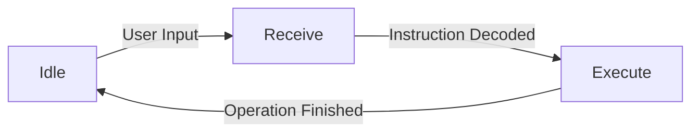

## 1.背景介绍

在快节奏的现代生活中，外卖已经成为了我们日常生活的一部分。然而，由于人们的工作和生活节奏不同，外卖配送的时间问题一直是一个难题。为了解决这个问题，智能外卖存取柜出现了。它们可以安全地存储食物，直到客户准备取餐。本文将介绍如何使用STM32微控制器设计和实现一个智能外卖存取柜。

STM32是STMicroelectronics（ST）推出的32位Flash微控制器产品，基于ARM Cortex-M3核。它具有高性能、实时能力强、数字信号处理（DSP）功能和低功耗等特点，对于智能外卖存取柜的设计和实现具有很大的帮助。

## 2.核心概念与联系

智能外卖存取柜主要包含以下几个核心部分：输入模块、处理模块、存储模块、输出模块和电源模块。其中，输入模块主要负责接收用户的操作指令，如开锁、关锁等；处理模块负责处理用户的指令，执行相应的操作；存储模块负责存储用户的操作记录，以供后续查询；输出模块负责显示处理结果；电源模块负责为整个系统提供稳定的电源。

在这个系统中，STM32微控制器主要扮演着处理模块的角色。它接收来自输入模块的用户指令，通过内部的处理逻辑，驱动存储模块和输出模块，完成用户的指令。

## 3.核心算法原理具体操作步骤

设计智能外卖存取柜的核心算法主要包括以下步骤:

1. 接收用户指令: 通过输入模块，如按键、触摸屏等，接收用户的操作指令。
2. 解析用户指令: STM32微控制器解析用户的指令，确定需要执行的操作。
3. 执行操作: 根据解析出的操作，STM32微控制器驱动相应的硬件模块，如电机、锁等，执行操作。
4. 存储操作记录: STM32微控制器将操作记录存储在存储模块中，以供后续查询。
5. 显示处理结果: STM32微控制器驱动输出模块，如LED、液晶显示屏等，显示处理结果。

## 4.数学模型和公式详细讲解举例说明

在这个系统中，我们主要使用有限状态机（Finite State Machine, FSM）模型来描述和设计整个流程。有限状态机是一种数学模型，它通过一系列的状态和转换来描述系统的行为。

假设我们的系统有三种状态：空闲（Idle）、接收指令（Receive）和执行操作（Execute）。初始状态为空闲。状态转换图如下所示：



在这个模型中，我们可以将每个状态看作是一个函数，如下所示：

- IdleState(): 等待用户输入
- ReceiveState(): 接收并解析用户输入
- ExecuteState(): 执行用户指令并返回结果

每个函数在结束时，都会返回下一个状态应该执行的函数。例如：

```c
StateFunc IdleState()
{
    if (HasUserInput())
    {
        return ReceiveState;
    }
    else
    {
        return IdleState;
    }
}
```

这样，我们就可以通过一个循环来不断地执行当前状态的函数，实现状态的转换：

```c
StateFunc currentState = IdleState;

while (1)
{
    currentState = currentState();
}
```

## 4.项目实践：代码实例和详细解释说明

下面我们来看一个简单的例子，如何使用STM32来实现一个智能锁。这个智能锁接收用户的密码输入，如果密码正确，就开锁；否则，就显示错误信息。

首先，我们需要定义一个全局变量来保存当前的状态：

```c
typedef enum
{
    STATE_IDLE,
    STATE_RECEIVE,
    STATE_EXECUTE
} State;

State g_state = STATE_IDLE;
```

然后，我们需要一个函数来接收用户的输入：

```c
void ReceiveInput()
{
    // Receive user input
    ...
}

```

接下来，我们需要一个函数来解析用户的输入，并执行相应的操作：

```c
void ExecuteOperation()
{
    // Decode user input
    ...

    // Execute operation
    ...

}

```

最后，我们需要一个主循环来不断地检查当前的状态，如果状态改变，就执行相应的操作：

```c
int main()
{
    while (1)
    {
        switch (g_state)
        {
        case STATE_IDLE:
            ReceiveInput();
            break;

        case STATE_RECEIVE:
            DecodeInput();
            break;

        case STATE_EXECUTE:
            ExecuteOperation();
            break;

        default:
            break;
        }
    }

    return 0;
}
```

这就是一个基于STM32的智能锁的简单实现。通过这个例子，我们可以看到，使用STM32微控制器，我们可以轻松地实现各种复杂的功能。

## 5.实际应用场景

智能外卖存取柜广泛应用于餐饮外卖、快递包裹等场景。它可以帮助解决外卖配送的时间问题，提高配送效率，降低配送成本。此外，由于其自助服务的特性，智能外卖存取柜还可以减少人与人之间的接触，降低疫情传播的风险。

## 6.工具和资源推荐

对于STM32的开发，我推荐使用以下工具和资源：

1. Keil uVision: 这是一个强大的嵌入式软件开发工具，支持STM32系列微控制器。
2. STM32CubeMX: 这是ST官方提供的一个图形化配置工具，可以帮助用户快速配置STM32微控制器的各种功能。
3. FreeRTOS: 这是一个开源的实时操作系统，可以帮助你更好地管理STM32的各种任务和资源。

## 7.总结：未来发展趋势与挑战

随着科技的发展，智能外卖存取柜的应用将越来越广泛。我们可以期待在未来看到更多的智能化、自动化和网络化的外卖存取柜。

然而，这也带来了一些挑战。首先，如何保证食物的新鲜和安全是一个问题。其次，如何提高存取柜的使用率，避免出现闲置的情况也是一个问题。最后，如何保护用户的隐私，避免信息泄露也是一个重要的问题。

但是，我相信，随着科技的进步，这些问题都将得到解决。智能外卖存取柜将为我们的生活带来更多的便利。

## 8.附录：常见问题与解答

Q: STM32微控制器有哪些优点？

A: STM32微控制器具有高性能、实时能力强、数字信号处理（DSP）功能和低功耗等特点。

Q: 如何选择合适的STM32微控制器？

A: 选择STM32微控制器时，主要需要考虑你的需求，如处理能力、IO口数量、价格等。

Q: 如何学习STM32微控制器的开发？

A: 我推荐使用Keil uVision、STM32CubeMX和FreeRTOS这些工具进行学习。同时，你可以参考ST官方的文档和教程，以及网络上的各种教程和论坛。

Q: 智能外卖存取柜在疫情期间有哪些优点？

A: 智能外卖存取柜可以减少人与人之间的接触，降低疫情传播的风险。同时，由于其自助服务的特性，它可以提高配送效率，降低配送成本。