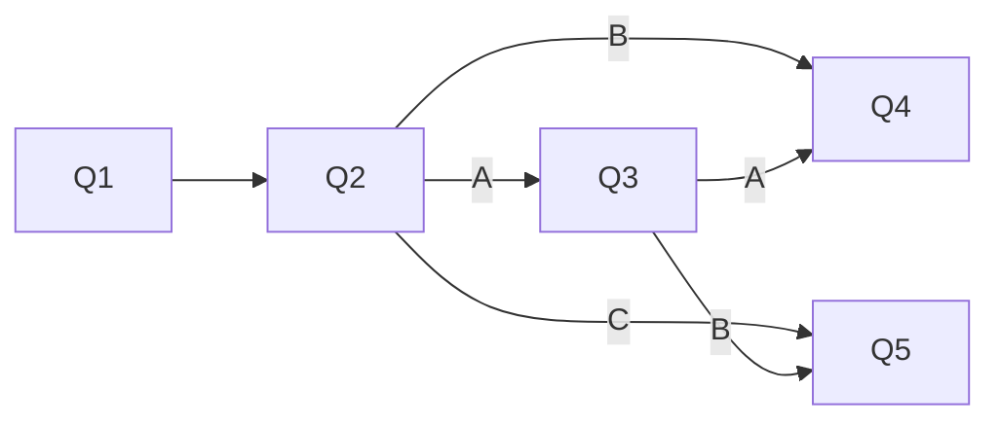

# 基于springboot的问卷调查系统

作者：禅与计算机程序设计艺术

## 1. 背景介绍

### 1.1 问卷调查系统的重要性

在当今数据驱动的时代,问卷调查系统在各个领域扮演着越来越重要的角色。无论是市场调研、客户满意度评估,还是学术研究,问卷调查都是收集数据、了解受众观点和需求的有效方式。

### 1.2 传统问卷调查方式的局限性

传统的问卷调查方式,如纸质问卷或电子表格,存在诸多局限性。例如:

- 发放和回收问卷的过程耗时耗力
- 数据录入和统计分析工作量大
- 问卷设计缺乏灵活性,难以动态调整
- 数据安全和隐私保护难以保证

### 1.3 在线问卷调查系统的优势

基于Web的在线问卷调查系统能够有效克服传统方式的局限性,带来诸多优势:

- 问卷发放和数据收集更加便捷高效
- 自动化的数据录入和统计分析
- 问卷设计灵活,支持动态调整题目
- 数据加密传输和存储,保障隐私安全
- 跨平台、跨设备,支持更广泛的受众

### 1.4 springboot框架简介

springboot是一个基于Java的开源Web应用开发框架。它基于spring平台,通过简化配置来快速构建独立的、生产级别的应用程序。springboot具有如下特点:

- 创建独立的spring应用程序
- 直接嵌入Tomcat、Jetty等Web服务器
- 提供自动配置的"starter"依赖,简化构建配置
- 自动配置spring和第三方库
- 提供生产就绪型功能,如指标、健康检查和外部配置
- 绝对没有代码生成,对XML没有要求配置

springboot使得构建基于spring的Web应用变得更加简单高效。

## 2. 核心概念与关联

### 2.1 MVC架构

springboot遵循MVC(Model-View-Controller)架构模式。

- Model(模型):管理应用程序的数据、逻辑和规则
- View(视图):负责数据的展示,与用户进行交互
- Controller(控制器):接收输入,并将其转换为模型或视图的命令

MVC模式有利于实现Web应用程序的"关注点分离",使得代码结构更加清晰、可维护性更好。

### 2.2 依赖注入(DI)

springboot使用依赖注入来管理应用程序组件之间的依赖关系。通过DI,对象无需自己查找或创建与其所关联的其他对象。相反,容器负责将需要的依赖注入到对象中。这有助于提高组件的可重用性和可测试性。

### 2.3 控制反转(IoC)

控制反转是一种设计原则,springboot的核心就是IoC容器。传统的编程方式中,业务逻辑的流程由应用程序控制。而在IoC模式下,业务逻辑的流程由框架控制,应用程序只需要提供相应的组件即可。这种"反转"有利于降低组件之间的耦合度。

### 2.4 RESTful API

REST(Representational State Transfer)是一种软件架构风格,它定义了一组创建Web服务的约束条件和原则。RESTful API是一种遵循REST原则设计的应用程序编程接口。

RESTful API的特点包括:

- 使用HTTP方法(GET、POST、PUT、DELETE等)
- 无状态通信
- 使用URI(Uniform Resource Identifier)来标识资源
- 返回JSON或XML格式的数据

springboot对构建RESTful API提供了良好的支持。

## 3. 核心算法原理与具体操作步骤

### 3.1 问卷设计算法

问卷设计是问卷调查系统的核心功能之一。一个好的问卷设计算法应该能够:

1. 支持多种题型:单选题、多选题、填空题、矩阵量表题等
2. 支持题目的动态增删和顺序调整
3. 支持题目的逻辑跳转,根据答题情况动态展示题目
4. 支持题目的必答和非必答设置
5. 支持问卷的分页展示
6. 支持问卷的定时发布和截止

具体实现上,可以将问卷定义为一个JSON对象,每个题目也是一个JSON对象。例如:

```json
{
  "id": 1,
  "title": "问卷标题",
  "pages": [
    {
      "id": 1,
      "questions": [
        {
          "id": 1,
          "type": "single_choice",
          "title": "单选题标题",
          "options": [
            {"id": 1, "text": "选项1"},
            {"id": 2, "text": "选项2"},
            {"id": 3, "text": "选项3"}
          ],
          "is_required": true
        },
        {
          "id": 2,
          "type": "multiple_choice",
          "title": "多选题标题",
          "options": [
            {"id": 1, "text": "选项1"},
            {"id": 2, "text": "选项2"},
            {"id": 3, "text": "选项3"}
          ],
          "is_required": false
        }
      ]
    }
  ]
}
```

### 3.2 问卷发放算法

问卷发放支持以下几种方式:

1. 通过短链接或二维码分享问卷
2. 通过邮件批量发放问卷
3. 在特定网页或App中嵌入问卷
4. 定时发放问卷

其中,短链接可以通过算法生成唯一的、可读性好的字符串,并与问卷的唯一标识ID进行映射。当用户访问短链接时,系统根据映射关系找到对应的问卷并展示给用户。

邮件发放可以通过批量导入邮箱,自动生成包含问卷链接的邮件内容并发送。

网页或App嵌入需要提供相应的JS SDK,供网页开发者调用以在特定区域展示问卷。

定时发放则需要提供任务调度功能,在指定时间自动开放问卷。

### 3.3 数据收集与统计算法

数据收集需要记录每个用户对每道题的作答情况。可以将用户答题数据定义为一个JSON对象,与问卷定义的格式相对应。例如:

```json
{
  "id": 1,
  "questionnaire_id": 1,
  "user_id": 1,
  "start_time": "2023-05-01 10:00:00",
  "end_time": "2023-05-01 10:10:00",
  "answers": [
    {
      "question_id": 1,
      "option_id": 2
    },
    {
      "question_id": 2,
      "option_ids": [1, 3]
    }
  ]
}
```

在数据统计方面,需要支持以下功能:

1. 按题目类型进行统计,如单选题选项分布、多选题选项分布等
2. 支持按用户属性进行数据筛选和对比,如按性别、年龄等
3. 支持将统计结果以图表的形式直观展示
4. 支持将原始数据和统计结果导出为Excel或CSV文件

统计算法可以采用MapReduce思想,将数据按照题目ID进行分组,然后对每组数据进行统计汇总。

## 4. 数学模型和公式详细讲解举例说明

### 4.1 问卷逻辑跳转的有向图模型

问卷中的逻辑跳转可以用有向图来建模。每个题目是图中的一个节点,题目之间的跳转关系是有向边。

例如,一个包含5个题目的问卷,其中Q3根据Q2的答案决定是跳转到Q4还是Q5,可以用下面的有向图表示:



在实现问卷逻辑跳转时,可以采用深度优先搜索(DFS)算法遍历有向图,根据用户的答题情况动态决定下一题。

### 4.2 问卷评分的加权平均模型

某些问卷需要对用户的答题情况进行评分,可以采用加权平均模型。

假设问卷包含$n$道题,每道题的满分为$s_i$,用户得分为$x_i$,题目权重为$w_i$。则用户的总得分$S$为:

$$S=\frac{\sum_{i=1}^n w_i \cdot \frac{x_i}{s_i}}{\sum_{i=1}^n w_i}$$

例如,一个包含3道题的问卷,满分分别为5分、10分、15分,题目权重分别为20%、30%、50%,用户得分分别为4分、8分、12分。则用户的总得分为:

$$S=\frac{20\% \cdot \frac{4}{5}+30\% \cdot \frac{8}{10}+50\% \cdot \frac{12}{15}}{20\%+30\%+50\%}=0.84$$

即用户的总得分为84分(百分制)。

### 4.3 问卷信度的Cronbach's Alpha系数

问卷的信度(Reliability)指的是问卷测量的一致性和稳定性,可以用Cronbach's Alpha系数来衡量。

假设问卷包含$k$道题,第$i$题的得分为$X_i$,总分为$X$。则Cronbach's Alpha系数$\alpha$的计算公式为:

$$\alpha=\frac{k}{k-1}(1-\frac{\sum_{i=1}^k \mathrm{Var}(X_i)}{\mathrm{Var}(X)})$$

其中,$\mathrm{Var}(X_i)$表示第$i$题得分的方差,$\mathrm{Var}(X)$表示总分的方差。

一般来说,Cronbach's Alpha系数越接近1,问卷的信度越高。通常认为,Cronbach's Alpha系数大于0.7时,问卷的信度可以接受;大于0.8时,问卷的信度很好;大于0.9时,问卷的信度非常高。

## 5. 项目实践:代码实例与详细解释说明

下面以springboot为基础,演示问卷调查系统的部分核心代码实现。

### 5.1 问卷设计模块

问卷设计模块主要包括问卷、页面、题目等实体类的定义,以及问卷的创建、修改、删除等API接口。

#### 5.1.1 实体类定义

```java
@Data
@Entity
public class Questionnaire {
    @Id
    @GeneratedValue(strategy = GenerationType.IDENTITY)
    private Long id;
    
    private String title;
    
    @OneToMany(mappedBy = "questionnaire", cascade = CascadeType.ALL)
    private List<Page> pages;
}

@Data
@Entity
public class Page {
    @Id
    @GeneratedValue(strategy = GenerationType.IDENTITY) 
    private Long id;
    
    @ManyToOne
    private Questionnaire questionnaire;
    
    @OneToMany(mappedBy = "page", cascade = CascadeType.ALL)
    private List<Question> questions;
}

@Data
@Entity
public class Question {
    @Id
    @GeneratedValue(strategy = GenerationType.IDENTITY)
    private Long id;
    
    private String type;
    
    private String title;
    
    @OneToMany(mappedBy = "question", cascade = CascadeType.ALL)
    private List<Option> options;
    
    private Boolean isRequired;
    
    @ManyToOne
    private Page page;
}

@Data
@Entity
public class Option {
    @Id
    @GeneratedValue(strategy = GenerationType.IDENTITY)
    private Long id;
    
    private String text;
    
    @ManyToOne
    private Question question;
}
```

#### 5.1.2 API接口定义

```java
@RestController
@RequestMapping("/api/questionnaires")
public class QuestionnaireController {
    
    @Autowired
    private QuestionnaireService questionnaireService;
    
    @PostMapping
    public Questionnaire createQuestionnaire(@RequestBody Questionnaire questionnaire) {
        return questionnaireService.createQuestionnaire(questionnaire);
    }
    
    @PutMapping("/{id}")
    public Questionnaire updateQuestionnaire(@PathVariable Long id, @RequestBody Questionnaire questionnaire) {
        return questionnaireService.updateQuestionnaire(id, questionnaire);
    }
    
    @DeleteMapping("/{id}")
    public void deleteQuestionnaire(@PathVariable Long id) {
        questionnaireService.deleteQuestionnaire(id);
    }
    
    @GetMapping("/{id}")
    public Questionnaire getQuestionnaire(@PathVariable Long id) {
        return questionnaireService.getQuestionnaire(id);
    }
}
```

### 5.2 问卷发放模块

问卷发放模块主要包括短链接生成、邮件发送、任务调度等功能。

#### 5.2.1 短链接生成

```java
@Service
public class ShortUrlService {
    
    private static