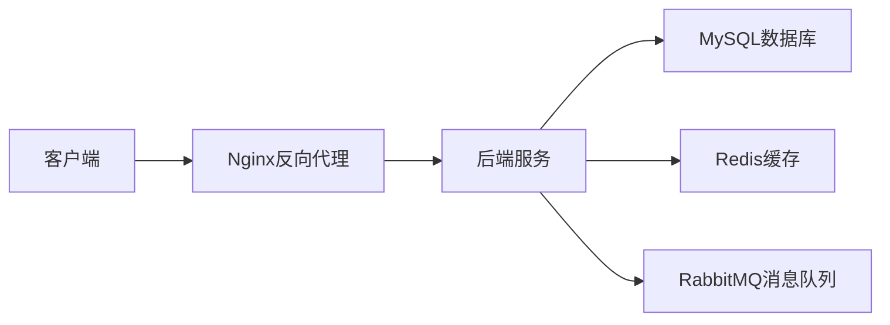
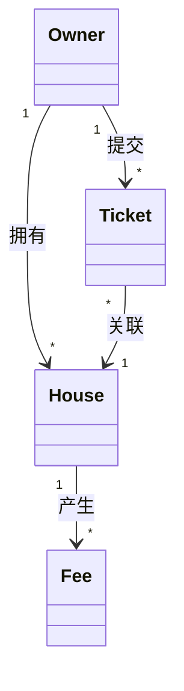

# 小区物业管理系统详细设计与具体代码实现

作者：禅与计算机程序设计艺术

## 1. 背景介绍

随着城市化进程的加快,越来越多的人选择在小区内居住。小区物业管理是一项复杂而繁琐的工作,涉及业主信息管理、费用收缴、设施维护、安保巡逻等多个方面。传统的人工管理模式已经难以满足现代化小区管理的需求。因此,开发一套高效、智能、易用的小区物业管理系统势在必行。

本文将详细介绍一个基于Java技术栈的小区物业管理系统的设计与实现。该系统采用前后端分离架构,后端使用Spring Boot框架,前端使用Vue.js框架。系统具有业主信息管理、费用管理、设施管理、安保管理、投诉管理等主要功能模块。

### 1.1 系统目标

本系统的主要目标如下:

1. 提高物业管理效率,减轻物业人员工作负担
2. 加强数据管理,保证信息准确性和安全性 
3. 方便业主缴费和反馈问题,提升业主满意度
4. 实现智能化管理,如自动生成费用账单、设施故障预警等

### 1.2 系统架构

系统采用前后端分离架构,架构图如下:



- 客户端:包括PC Web端和移动端,分别适配不同的终端设备
- Nginx:作为反向代理服务器,负责请求转发和负载均衡
- 后端服务:使用Spring Boot框架开发,提供RESTful API接口
- MySQL:关系型数据库,存储业务数据
- Redis:内存数据库,用于缓存和Session管理
- RabbitMQ:消息队列,实现异步通信和解耦

## 2. 核心概念与关系

在进入具体设计和实现之前,我们先明确一些核心概念:

### 2.1 业主(Owner)

业主是购买或租赁小区房屋的个人或组织,是物业服务的对象。每个业主都有一个唯一的ID,并登记基本信息如姓名、身份证号、手机号、房屋信息等。业主可以通过系统查询自己的费用账单,也可以提交投诉和维修申请。

### 2.2 房屋(House)

房屋是业主拥有产权或使用权的物业实体。每个房屋也有唯一ID,记录房屋的基本信息如楼栋号、单元号、房间号、面积等。一个业主可以拥有多套房屋。费用账单是按房屋为单位生成的。

### 2.3 费用(Fee)

费用是业主需要定期缴纳的各项物业管理费用,包括卫生费、绿化费、维修基金等。系统根据房屋面积、费用标准等自动生成每月的费用账单。业主可以通过多种方式(如微信、支付宝)在线缴费。

### 2.4 工单(Ticket)

工单是业主提交的投诉和报修申请。工单包括问题描述、图片附件、处理状态、处理结果等信息。物业管理人员通过工单系统受理、派单、处理、反馈业主投诉和报修。

以上几个核心概念之间的关系如下图所示:



一个业主可以拥有多套房屋,每套房屋都会产生物业费用账单。业主也可以针对房屋提交多个工单。每个工单只关联一套房屋。

## 3. 核心算法原理与具体操作步骤

本节介绍系统中的几个核心算法,包括费用账单生成算法和工单智能派单算法。

### 3.1 费用账单生成算法

每月月初,系统需要自动为每套房屋生成费用账单。账单费用根据房屋面积和各项费用标准计算得出。算法步骤如下:

1. 从House表中查询所有房屋记录
2. 对于每套房屋,获取其面积area
3. 从Fee_Item表中读取各项费用标准,包括费用类型type、单价price、固定金额fixed等
4. 计算每项费用的金额,规则为:
   - 如果存在单价,则费用 = 面积 x 单价
   - 如果存在固定金额,则费用 = 固定金额
   - 如果两者都存在,取固定金额
5. 将房屋ID、月份、费用项、费用金额、缴费状态、截止日期等信息写入Fee表
6. 重复步骤2-5,直到所有房屋处理完毕

账单生成后,系统会以微信公众号消息、短信、APP推送等方式通知业主。

### 3.2 工单智能派单算法

业主提交工单后,如何快速准确地将工单分配给负责该项任务的维修人员,是提高工单处理效率的关键。传统的人工派单方式效率低下,我们可以使用智能派单算法。算法主要思路是:

1. 工单提交后,先根据问题类型(如电梯、水电、门窗等)做初步分类
2. 再根据房屋所在楼栋位置,优先将工单派给负责该片区的维修人员
3. 如果维修人员当前任务较多,则顺延给其他维修人员,避免工单积压

算法步骤如下:

1. 业主提交工单时,选择问题类型,填写问题描述和图片
2. 根据房屋ID,查询房屋的楼栋号和单元号
3. 根据问题类型和楼栋号,从Staff表中查询负责该片区该类型问题的维修人员(维修工种、负责楼栋、当前工单数量)
4. 如果只有一个维修人员,则直接派单给他
5. 如果有多个维修人员,则按当前工单数量升序排列,选择工单最少的派单
6. 如果工单最少的维修人员当前工单数量已经超过阈值(比如5个),则选择次少的人员派单
7. 将工单状态设置为"已派单",记录派单时间和维修人员
8. 向维修人员推送工单消息

派单完成后,维修人员即可在自己的APP工单列表中看到新工单,开始处理。

## 4. 数学模型和公式详细讲解举例说明

本节我们详细讲解费用账单生成算法中的数学模型和公式。

我们定义如下符号:

- $area$:房屋面积,单位平方米
- $type$:费用类型,如水费、电费、卫生费等
- $price$:费用单价,单位元/平方米/月
- $fixed$:固定费用金额,单位元/月
- $amount$:费用金额,单位元

则每项费用的计算公式为:

$$
amount=\begin{cases}
area \times price, & price>0 \and fixed=0 \\
fixed, & fixed>0 \\
0, & \text{其他情况}
\end{cases}
$$

举例说明:

假设一套房屋面积为120平方米,费用标准如下:

| 费用类型 | 单价(元/平米/月) | 固定金额(元/月) |
|----------|------------------|-----------------|
| 物业管理费 | 1.5 | 0 |
| 水费   | 0 | 50 |
| 电费   | 0 | 0 |
| 公共维修基金 | 0.5 | 0 |

则该房屋当月各项费用为:

- 物业管理费:$120 \times 1.5 = 180$元
- 水费:$50$元
- 电费:$0$元(费用依实际使用量收取)
- 公共维修基金:$120 \times 0.5 = 60$元

当月费用总计:$180 + 50 + 0 + 60 = 290$元

系统根据上述公式,自动计算出每套房屋的费用明细和总额,生成账单。

## 5. 项目实践:代码实例和详细解释说明

下面我们使用Java代码实现费用账单生成的核心逻辑。

首先定义House、FeeItem、Fee等实体类:

```java
@Data
public class House {
    private Long id;
    private String building;
    private String unit;
    private String number;
    private BigDecimal area;
    //其他字段
}

@Data
public class FeeItem {
    private Long id;
    private String type;
    private BigDecimal price;
    private BigDecimal fixed;
    //其他字段
}

@Data
public class Fee {
    private Long id;
    private Long houseId;
    private String month;
    private String type;
    private BigDecimal amount;
    private String status;
    private LocalDateTime deadline;
    //其他字段
}
```

然后是账单生成服务类:

```java
@Service
public class BillService {
    
    @Autowired
    private HouseRepository houseRepository;
    @Autowired
    private FeeItemRepository feeItemRepository;
    @Autowired
    private FeeRepository feeRepository;
    
    //生成账单
    public void generateBills(String month) {
        //查询所有房屋
        List<House> houses = houseRepository.findAll();
        //查询费用项目
        List<FeeItem> items = feeItemRepository.findAll();
        
        for (House house : houses) {
            for (FeeItem item : items) {
                Fee fee = new Fee();
                fee.setHouseId(house.getId());
                fee.setMonth(month);
                fee.setType(item.getType());
                
                //计算费用
                BigDecimal amount;
                if (item.getPrice().compareTo(BigDecimal.ZERO) > 0) {
                    amount = house.getArea().multiply(item.getPrice());
                } else {
                    amount = item.getFixed();
                }
                fee.setAmount(amount);
                
                fee.setStatus("UNPAID"); //待缴费
                fee.setDeadline(LocalDate.now().with(TemporalAdjusters.lastDayOfMonth()).atStartOfDay());
                //其他字段赋值
                //...
                
                //保存账单  
                feeRepository.save(fee);
            }
        }   
    }
}
```

代码说明:

1. 注入House、FeeItem、Fee三个Repository,用于数据库查询和保存
2. generateBills方法接收一个月份参数,比如"202106"
3. 先查询所有房屋和费用项目
4. 遍历每套房屋,再遍历每个费用项目,生成一条费用记录
5. 根据公式计算费用金额
6. 设置其他字段如状态、截止日期等
7. 保存费用记录到数据库

以上就是账单生成的核心代码实现。代码中使用了Spring Data JPA进行数据库操作,BigDecimal类型进行金额计算,避免浮点数精度问题。

## 6. 实际应用场景

小区物业管理系统在实际的小区管理中有广泛的应用,下面列举几个典型场景。

### 6.1 业主自助缴费

业主可以登录微信公众号或APP,查看自己的费用账单,选择在线支付。系统自动对账,实时更新缴费状态,方便业主缴费。

### 6.2 费用催收管理

对于逾期未缴费的业主,物业管理人员可以在系统中批量查询、导出,形成催收清单。系统还可以自动向业主发送催缴通知,提高催收效率。

### 6.3 工单报修处理

业主可以随时通过微信或APP提交报修工单,上传问题照片。工单提交后,系统自动派单给维修人员。整个流程在线跟踪,业主可以实时查看进度。

### 6.4 物业费用统计分析

管理人员可以通过系统查询一定时间范围内的物业费用收支情况,包括各项费用的收缴率、欠费金额等。系统还可以生成可视化报表如柱状图、饼图等,直观展示收费数据。

### 6.5 短信微信消息推送

系统可以自动向业主推送各类通知消息,如缴费提醒、工单处理结果等。推送渠道包括短信、微信模板消息、APP推送等,多渠道触达,提升业主体验。

## 7. 工具和资源推荐

### 7.1 开发工具

- IntelliJ IDEA:Java IDE,集成开发环境
- Navicat:数据库管理工具
- Postman:API测试工具
- Git:版本控制工具
- Jenkins:持续集成工具

### 7.2 技术框架

- Spring Boot:Java Web开发框架
- Vue.js:前端JavaScript框架