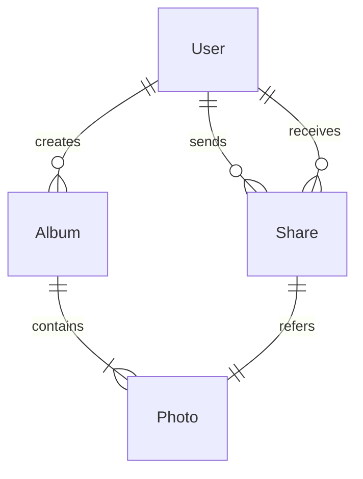

# 校园相册管理系统详细设计与具体代码实现

作者：禅与计算机程序设计艺术

## 1. 背景介绍

### 1.1 校园相册管理系统的意义
在数字时代,高校师生拍摄和收集了大量的照片和视频,记录了校园生活的点点滴滴。但是,这些珍贵的影像资料往往散落在个人电脑、移动硬盘等存储设备中,缺乏统一规范的管理,查找和分享起来十分不便。因此,开发一套功能完善、易于使用的校园相册管理系统具有重要意义。

### 1.2 系统目标与需求分析
校园相册管理系统的目标是为师生提供一个集中存储、管理、检索、分享校园影像资料的平台。通过需求分析,系统应具备以下主要功能:

1. 用户管理:支持用户注册、登录、权限控制等基本功能。
2. 相册管理:用户可以创建、修改、删除个人相册,并对相册进行分类。  
3. 照片管理:提供照片上传、编辑、删除、搜索、浏览等功能。
4. 照片分享:用户可以方便地将照片分享给其他用户或生成分享链接。
5. 后台管理:管理员可对用户、相册、照片等进行集中管理和监控。

### 1.3 技术选型与架构设计
考虑到系统的性能、可扩展性和开发效率,我们选择使用以下技术栈:

- 前端:Vue.js + ElementUI
- 后端:Spring Boot + MyBatis
- 数据库:MySQL
- 对象存储:阿里云OSS
- 部署环境:Docker + K8s

系统采用前后端分离的架构设计,前端负责页面展示和交互,后端提供RESTful API接口,实现业务逻辑和数据持久化。同时,引入阿里云OSS对象存储服务,将图片等静态资源存储在OSS中,减轻服务器压力。

## 2. 核心概念与关联

### 2.1 领域模型设计
根据需求分析,我们可以识别出系统中的以下核心领域概念:

- 用户(User):包含用户基本信息,如用户名、密码、邮箱等。
- 相册(Album):由用户创建,包含相册名称、描述、分类等元数据。
- 照片(Photo):包含照片文件、拍摄时间、地点、描述等元数据,隶属于某个相册。
- 分享(Share):表示用户将照片分享给其他用户,包含分享时间、过期时间等信息。

### 2.2 E-R图设计
根据领域模型,我们绘制出系统的实体-关系(E-R)图:



从E-R图可以看出:
- 一个用户可以创建多个相册,一个相册只属于一个用户。
- 一个相册可以包含多张照片,一张照片只能属于一个相册。
- 一个用户可以分享多张照片,也可以接收多个分享,一个分享只能指向一张照片。

### 2.3 数据库表结构设计
根据E-R图,我们设计出以下数据库表:

- 用户表(user)

| 字段 | 类型 | 约束 |
| ---- | ---- | ---- |
| id | int | 主键 |
| username | varchar | 非空,唯一 |
| password | varchar | 非空 |
| email | varchar | 非空,唯一 |
| created_at | datetime | 非空 |

- 相册表(album)

| 字段 | 类型 | 约束 |
| ---- | ---- | ---- |
| id | int | 主键 |
| name | varchar | 非空 |
| description | varchar | |
| category | varchar | |
| user_id | int | 外键,非空 |
| created_at | datetime | 非空 |

- 照片表(photo)

| 字段 | 类型 | 约束 |
| ---- | ---- | ---- |
| id | int | 主键 |
| album_id | int | 外键,非空 |
| url | varchar | 非空 |
| name | varchar | 非空 |
| description | varchar | |
| taken_at | datetime | |
| created_at | datetime | 非空 |

- 分享表(share)

| 字段 | 类型 | 约束 |
| ---- | ---- | ---- |
| id | int | 主键 |
| photo_id | int | 外键,非空 |
| sender_id | int | 外键,非空 |
| receiver_id | int | 外键,非空 |
| expired_at | datetime | |
| created_at | datetime | 非空 |

## 3. 核心算法原理与具体操作步骤

### 3.1 用户密码加密存储
为了保护用户隐私,对用户密码进行加密很有必要。我们采用BCrypt算法对密码进行不可逆加密:

1. 前端使用BCrypt算法,结合随机salt对用户密码进行hash处理。
2. 将hash后的密码发送到后端。
3. 后端将密码hash值存入数据库的password字段。
4. 用户登录时,前端发送用户输入的密码,后端取出盐值并进行hash,将结果与数据库存储的hash值进行比对。

BCrypt的核心思想是利用Blowfish加密算法,引入work factor,多次迭代加盐hash,增加破解难度。伪代码如下:

```
function bcrypt(password, salt, cost)
  
  state <- EksBlowfishSetup(cost, salt)
  ctext <- "OrpheanBeholderScryDoubt"
  repeat (64)
    ctext <- EncryptECB(state, ctext)
  return Concatenate(cost, salt, ctext)
```

### 3.2 照片元数据自动提取
为了方便用户管理照片,我们可以在用户上传照片时自动提取照片的EXIF元数据,如拍摄时间、地点、设备等。以下是提取EXIF元数据的步骤:

1. 使用commons-imaging库读取上传的图片文件。
2. 调用`Imaging.getMetadata()`方法获取图片元数据`ImageMetadata`对象。
3. 判断元数据类型是否为`JpegImageMetadata`,若是则强制转换类型。
4. 调用`JpegImageMetadata`的`getExif()`方法,获取`TiffImageMetadata`对象。
5. 通过`TiffImageMetadata`获取所需的EXIF标签,如`ExifIFD0Directory`、`ExifSubIFDDirectory`等。
6. 从标签中提取对应的元数据值,如时间、经纬度、设备型号等。
7. 将提取的元数据填充到`Photo`对象的对应字段。

### 3.3 照片检索算法
为了提高用户检索照片的效率,我们可以对照片的名称、描述等文本字段建立倒排索引。同时,考虑到用户可能会按拍摄时间、地点等条件进行筛选,我们还需要对时间、地理位置等字段建立B+树索引。检索的基本步骤如下:

1. 用户输入检索关键词,如"毕业典礼"。
2. 后端对关键词进行分词、去停用词处理,得到词项列表。
3. 倒排索引模块根据词项快速找到包含该词项的照片ID列表。
4. 用户选择其他过滤条件,如时间范围"2023-06-01 至 2023-06-30"。
5. B+树索引模块根据时间范围条件找到满足条件的照片ID列表。
6. 对倒排索引和B+树索引检索的结果取交集,得到同时满足文本和其他条件的照片。
7. 根据照片ID列表查询数据库,返回照片详细信息。

倒排索引的核心数据结构是(词项,倒排列表)的键值对,检索时可以快速找到包含词项的文档。而B+树作为多路平衡搜索树,可以高效支持范围查询。

## 4. 数学模型与公式详解

### 4.1 TF-IDF文本相关性计算
在照片检索中,我们希望能根据照片的文本信息评估其与查询词的相关性,这里可以借助TF-IDF算法。TF-IDF分数由两部分组成:

- TF(Term Frequency):词项在文档中出现的频率。
- IDF(Inverse Document Frequency):词项在整个文档集合中的稀缺程度。

TF的计算公式为:

$$
TF(t,d) = \frac{f_{t,d}}{\sum_{t'\in d} f_{t',d}}
$$

其中,$f_{t,d}$表示词项$t$在文档$d$中出现的次数,$\sum_{t'\in d} f_{t',d}$表示文档$d$的总词数。

IDF的计算公式为:

$$
IDF(t,D) = \log \frac{|D|}{|\{d\in D:t\in d\}|}
$$

其中,$|D|$表示文档集合的总数,$|\{d\in D:t\in d\}|$表示包含词项$t$的文档数。

将TF和IDF相乘,即可得到词项$t$在文档$d$中的TF-IDF权重:

$$
TFIDF(t,d,D) = TF(t,d) \times IDF(t,D)
$$

最后,将查询词的词项向量$q$与每个文档的词项向量$d_i$进行点积,即可得到查询与文档的相关性分数:

$$
score(q,d_i) = \sum_{t\in q} TFIDF(t,d_i,D)
$$

### 4.2 地理位置距离计算
用户可能会希望按照拍摄地点的距离远近对照片进行排序,这就需要计算两个地理坐标之间的距离。我们可以使用Haversine公式计算地球表面两点之间的大圆距离:

$$
d = 2r \arcsin(\sqrt{\sin^2(\frac{\varphi_2-\varphi_1}{2}) + \cos(\varphi_1)\cos(\varphi_2)\sin^2(\frac{\lambda_2-\lambda_1}{2})})
$$

其中:
- $d$:两点之间的距离
- $r$:地球半径,平均值约6371km
- $\varphi_1,\varphi_2$:两点的纬度(弧度制)
- $\lambda_1,\lambda_2$:两点的经度(弧度制)

将用户输入的位置坐标作为参考点,利用Haversine公式计算每张照片的拍摄位置与参考点的距离,然后按距离排序即可。

## 5. 项目实践:代码实例与解析

下面我们给出一些核心功能的代码示例。

### 5.1 用户密码加密存储

```java
// 用户注册
public void register(UserDTO userDTO) {
    String password = userDTO.getPassword();
    // 生成随机盐值
    String salt = BCrypt.gensalt();
    // 加盐hash
    String hashedPassword = BCrypt.hashpw(password, salt);
    
    User user = new User();
    user.setUsername(userDTO.getUsername());
    user.setPassword(hashedPassword);
    user.setEmail(userDTO.getEmail());
    userMapper.insert(user);
}

// 用户登录
public User login(String username, String password) {
    User user = userMapper.selectByUsername(username);
    if (user != null) {
        // 取出盐值并hash
        String hashedPassword = BCrypt.hashpw(password, user.getPassword());
        // 比对hash值
        if (hashedPassword.equals(user.getPassword())) {
            return user;
        }
    }
    return null;
}
```

### 5.2 照片元数据提取

```java
public Photo uploadPhoto(MultipartFile file, Integer albumId) throws Exception {
    // 上传照片到OSS
    String url = ossClient.uploadFile(file);
    
    // 读取照片元数据
    ImageMetadata metadata = Imaging.getMetadata(file.getInputStream());
    JpegImageMetadata jpegMetadata = (JpegImageMetadata) metadata;
    TiffImageMetadata exif = jpegMetadata.getExif();
    
    // 提取拍摄时间
    Date takenAt = null;
    if (exif.containsField(ExifIFD0Directory.TAG_DATETIME)) {
        String dateStr = exif.getFieldValue(ExifIFD0Directory.TAG_DATETIME);
        takenAt = DateUtils.parseDate(dateStr, "yyyy:MM:dd HH:mm:ss");
    }
    
    // 提取经纬度
    Double latitude = null;
    Double longitude = null;
    if (exif.containsField(ExifSubIFDDirectory.TAG_GPS_LATITUDE) 
        && exif.containsField(ExifSubIFDDirectory.TAG_GPS_LONGITUDE)) {
        String latStr = exif.getFieldValue(ExifSubIFDDirectory.TAG_GPS_LATITUDE);
        String lonStr = exif.getFieldValue(ExifSubIFDDirectory.TAG_GPS_LONGITUDE);
        latitude = parseCoordinate(lat