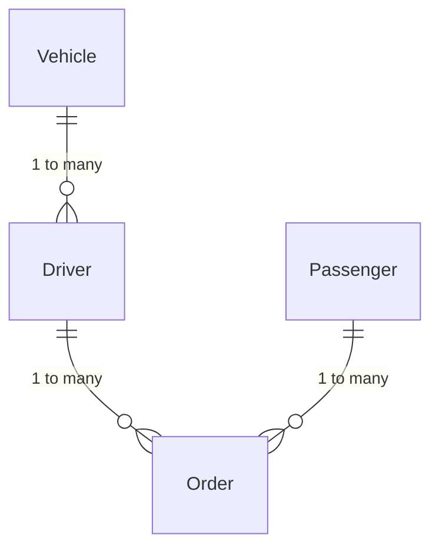

# XX市出租车服务管理信息系统设计与实现

作者：禅与计算机程序设计艺术

## 1. 背景介绍

### 1.1 出租车服务管理的现状与挑战

在现代城市生活中,出租车已成为不可或缺的交通工具。然而,随着城市规模的扩大和人口的增长,传统的出租车服务管理模式已经难以满足日益增长的需求。主要面临以下挑战:

#### 1.1.1 服务效率低下
#### 1.1.2 调度管理困难 
#### 1.1.3 信息化程度不足

### 1.2 信息化管理的必要性

为了应对上述挑战,建立一个高效、智能的出租车服务管理信息系统已成为当务之急。通过信息化手段,可以:

#### 1.2.1 提高调度效率
#### 1.2.2 优化资源配置
#### 1.2.3 提升服务质量
#### 1.2.4 加强监管力度

### 1.3 系统设计目标

本文旨在设计并实现一个面向XX市的出租车服务管理信息系统,主要目标包括:

#### 1.3.1 实现车辆和驾驶员信息管理
#### 1.3.2 支持实时调度和订单管理
#### 1.3.3 提供数据分析和决策支持
#### 1.3.4 兼顾系统性能与可扩展性

## 2. 核心概念与关联

### 2.1 出租车服务管理的业务流程

出租车服务管理涉及多个参与主体,主要业务流程如下:

#### 2.1.1 乘客叫车
#### 2.1.2 调度中心派单
#### 2.1.3 驾驶员接单
#### 2.1.4 行程开始与结束
#### 2.1.5 费用结算

### 2.2 关键数据实体

根据业务需求,系统中的核心数据实体包括:

#### 2.2.1 车辆 Vehicle
属性:车牌号、车型、车况等

#### 2.2.2 驾驶员 Driver  
属性:姓名、驾龄、星级等

#### 2.2.3 乘客 Passenger
属性:姓名、手机号、常用地址等

#### 2.2.4 订单 Order
属性:起点、终点、预估里程、费用等

### 2.3 实体关系模型

上述实体之间存在一定的关联关系,可用ER图表示如下:



## 3. 核心算法原理与操作步骤

### 3.1 实时调度算法

为实现高效的出租车调度,系统采用改进的KM(Kuhn-Munkres)算法。其基本原理是:

#### 3.1.1 问题建模
将调度问题转化为二分图的最大权完美匹配问题。

#### 3.1.2 权值矩阵构建
根据车辆与乘客的位置等因素,计算权值矩阵。

#### 3.1.3 匈牙利算法求解
应用匈牙利算法在权值矩阵中寻找最大权完美匹配。

#### 3.1.4 匹配结果解析
将算法的输出结果转化为具体的调度方案。

### 3.2 KM算法的具体步骤

KM算法的详细操作步骤如下:

#### 3.2.1 初始化
对权值矩阵进行预处理,减去每行的最小值。

#### 3.2.2 初始匹配
为左侧节点寻找初始匹配,并标记匹配边。

#### 3.2.3 寻找交错路
从未匹配点出发,交替寻找非匹配边和匹配边,直到找到未匹配点或无路可走。

#### 3.2.4 更新标记
根据交错路调整标记值,缩小匹配边权值。

#### 3.2.5 扩大匹配
利用交错路扩大匹配,更新匹配边集合。

重复步骤3-5,直到找到完美匹配为止。

## 4. 数学模型与公式详解

### 4.1 二分图匹配模型

将调度问题抽象为二分图$G=(U,V,E)$,其中:

- $U$表示车辆节点集合
- $V$表示乘客节点集合  
- $E$表示车乘匹配边集合

假设$w(u,v)$表示车辆$u$和乘客$v$之间的权值,则调度问题可形式化为:

$$
\max \sum_{(u,v)\in E} w(u,v) \cdot x_{u,v}
$$

其中$x_{u,v}$为匹配变量,满足:

$$
\begin{aligned}
\sum_{v\in V} x_{u,v} \leq 1, \forall u \in U \\
\sum_{u\in U} x_{u,v} \leq 1, \forall v \in V \\
x_{u,v} \in \{0,1\}, \forall (u,v) \in E
\end{aligned}
$$

### 4.2 KM算法的迭代公式

在KM算法的迭代过程中,关键是标记值的更新。设$l(u)$和$l(v)$分别表示左右节点的标记值,则有:

$$
l(u) + l(v) \geq w(u,v), \forall (u,v) \in E
$$

当找到交错路时,设$\delta$为路上最小的松弛量:

$$
\delta = \min_{(u,v)\in E\backslash M} \{l(u) + l(v) - w(u,v)\}
$$

然后根据节点所在的集合(记为$S$和$T$)更新标记值:

$$
\begin{aligned}
l(u) \leftarrow l(u) - \delta, \forall u \in S \\
l(v) \leftarrow l(v) + \delta, \forall v \in T
\end{aligned}
$$

直到找到完美匹配,算法结束。

## 5. 项目实践:代码实例与详解

下面给出KM算法的Python实现代码:

```python
def km(weights):
    m, n = len(weights), len(weights[0])
    
    # 初始化标记值
    u = [max(row) for row in weights]
    v = [0] * n
    
    # 初始化匹配
    match = [-1] * n
    visit = [False] * n
    
    for i in range(m):
        slack = [float('inf')] * n
        while True:
            visit = [False] * n
            if dfs(weights, u, v, i, visit, match, slack):
                break
            else:
                # 更新标记值
                delta = min(slack[j] for j in range(n) if not visit[j])
                u[i] -= delta
                for j in range(n):
                    if visit[j]:
                        v[j] += delta
                    else:
                        slack[j] -= delta
                        
    return match
        
def dfs(weights, u, v, i, visit, match, slack):
    visit[i] = True
    for j in range(len(weights[0])):
        if not visit[j]:
            gap = u[i] + v[j] - weights[i][j]
            if abs(gap) < 1e-6:
                visit[j] = True
                if match[j] == -1 or dfs(weights, u, v, match[j], visit, match, slack):
                    match[j] = i
                    return True
            else:
                slack[j] = min(slack[j], gap)
    return False
```

其中,主要函数说明如下:

- `km(weights)`:KM算法的入口函数,输入权值矩阵,返回最大权匹配。
- `dfs(weights, u, v, i, visit, match, slack)`:深度优先搜索函数,用于寻找交错路。
  - `weights`:权值矩阵
  - `u`和`v`:左右节点标记值
  - `i`:当前搜索的左节点编号
  - `visit`:节点访问标记数组
  - `match`:右节点的匹配状态数组
  - `slack`:松弛量数组

算法的时间复杂度为$O(n^3)$,其中$n$为节点数。

## 6. 实际应用场景

### 6.1 实时叫车与智能调度

乘客通过手机App发起叫车请求后,系统可根据车辆位置、行驶方向、载客状态等信息,利用KM算法实时计算最优的调度方案,并将订单推送给匹配的驾驶员。

### 6.2 热点区域车辆调配

通过对历史订单数据进行分析,识别出城市中的热点区域和高峰时段,提前调配空车前往这些区域,提高接单效率。

### 6.3 智能派单与组合优化

在派单时,综合考虑车辆与乘客的距离、预估行程时长、驾驶员接单意愿等多个因素,以最大化全局调度效益为目标,求解组合优化问题。

## 7. 工具与资源推荐

### 7.1 地图服务API

- 百度地图API: http://lbsyun.baidu.com/
- 高德地图API: https://lbs.amap.com/

### 7.2 优化求解工具

- Google OR-Tools: https://developers.google.com/optimization
- JuMP: https://jump.dev/

### 7.3 数据分析平台

- Apache Hadoop: https://hadoop.apache.org/
- Apache Spark: https://spark.apache.org/

## 8. 总结:未来发展与挑战

### 8.1 个性化服务与需求预测

利用大数据和机器学习技术,分析乘客的个性化需求,提供差异化的出租车服务。通过对历史数据的挖掘,预测不同时空的用车需求,提前进行资源调配。

### 8.2 自动驾驶技术的应用

随着自动驾驶技术的发展和成熟,无人驾驶出租车有望成为未来的发展方向。调度系统需要适应车辆自动化带来的变革,提供更加智能和灵活的调度策略。

### 8.3 跨平台协同与生态建设

打通出租车、网约车、顺风车等多个平台,实现供需信息的共享和协同调度。同时,与城市交通管理部门合作,建设智慧交通生态,提升城市交通效率。

## 9. 附录:常见问题与解答

### Q1:系统如何处理乘客取消订单的情况?

A1:当乘客取消订单时,系统会即时更新调度方案,将该订单从匹配队列中移除,并重新进行调度计算。同时,向原匹配的驾驶员发送订单取消通知,释放车辆资源。

### Q2:如何保证乘客的隐私和数据安全?

A2:系统采用多种技术手段保护乘客隐私,如:
- 对敏感信息进行脱敏处理,如手机号、家庭住址等
- 使用加密传输协议,防止数据在网络传输过程中被窃取
- 严格控制数据访问权限,避免内部人员的非法访问
- 定期进行数据安全审计,及时发现和处置潜在的安全隐患

### Q3:如何提高调度算法的实时性?

A3:可以从以下几个方面着手:
- 优化算法实现,如采用增量计算、剪枝等技巧,降低计算复杂度
- 使用分布式计算框架,如Spark、Flink等,提高并行计算能力
- 合理设置调度频率和超时阈值,在实时性和系统开销间取得平衡
- 引入多路复用、缓存等机制,减少不必要的I/O和网络开销

希望这篇文章能为XX市的出租车服务管理信息化建设提供有益的参考和指导。面对新技术和新需求带来的机遇与挑战,我们要不断创新,用技术的力量提升管理效率和服务品质,为智慧城市建设贡献自己的力量。