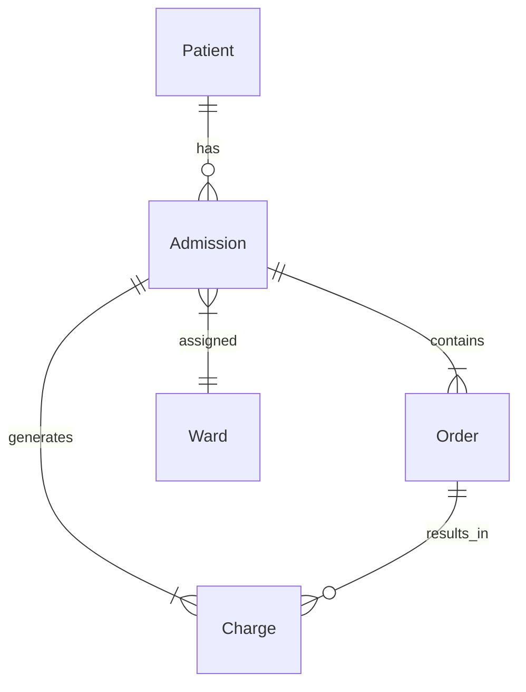

# 医院住院管理系统详细设计与具体代码实现

作者：禅与计算机程序设计艺术

## 1. 背景介绍
### 1.1 医院住院管理系统的重要性
在现代医疗体系中,医院住院管理系统扮演着至关重要的角色。它不仅能够提高医院的工作效率,减轻医护人员的工作负担,还能够提升患者的就医体验,保障医疗数据的安全性。一个设计良好、功能完善的住院管理系统能够为医院的运营管理提供强有力的支持。

### 1.2 系统开发的目标和意义
医院住院管理系统的开发目标是实现住院病人的全流程、精细化管理,涵盖入院登记、分配病房、医嘱开立、费用管理、出院结算等各个环节。通过信息化手段,提高医院的管理水平,规范医疗行为,保证医疗质量,最终为患者提供优质高效的医疗服务。

### 1.3 系统涉及的主要业务流程
医院住院管理系统涉及的主要业务流程包括:

1. 入院登记:患者提供相关信息进行登记,安排入住病房。
2. 医嘱管理:医生根据病情开具医嘱,护士执行医嘱。  
3. 费用管理:记录患者住院期间的各项费用,如药品费、检查费等。
4. 病房管理:合理分配病房资源,记录病房使用情况。
5. 护理管理:记录患者的生命体征、护理措施等。
6. 出院管理:办理出院手续,进行费用结算,打印出院小结。

## 2. 核心概念与关联
### 2.1 住院号(AdmissionID)
住院号是患者住院的唯一标识,贯穿整个住院流程。每次患者住院,系统都会生成一个新的住院号。住院号与患者基本信息、病房、医嘱、费用等多个实体关联。

### 2.2 病人(Patient)
病人是住院管理系统的核心实体之一,包含患者的基本信息,如姓名、性别、年龄、联系方式等。每个病人可以有多次住院记录。

### 2.3 病房(Ward)
病房是患者在医院住院期间的主要场所。系统需要管理病房的基本信息,如房间号、床位数、房间类型等,并记录病房的使用情况。

### 2.4 医嘱(Order)  
医嘱是医生根据患者病情开具的诊疗指令,包括药品、检查、手术等。每条医嘱都与特定的住院号关联。护士根据医嘱执行相应的医疗护理工作。

### 2.5 费用(Charge)
费用是患者在住院期间产生的各项费用明细,如药品费、检查费、手术费等。每项费用都与相应的医嘱和住院号关联。系统需要准确记录并计算患者的总费用。

### 2.6 实体关系图
下面是医院住院管理系统的简要实体关系(ER)图,展示了主要实体之间的关系:



从ER图可以看出,Patient和Admission是一对多的关系,每个Patient可以有多个Admission。Admission与Order和Charge都是一对多的关系。每个Admission都关联到一个Ward。Order和Charge之间也是一对多的关系,即一个Order可以产生多个Charge。

## 3. 核心算法原理与具体操作步骤
### 3.1 住院号生成算法
住院号是由前缀和序列号两部分组成,前缀通常为字母,表示住院类型,如"I"表示普通住院,"E"表示急诊住院。序列号是一个自增的数字,每次住院时从1开始递增。

算法步骤如下:
1. 确定住院号的前缀,如"I"。 
2. 查询数据库中该前缀的最大序列号:
   ```sql
   SELECT MAX(CAST(SUBSTRING(AdmissionID, 2) AS UNSIGNED)) 
   FROM Admission 
   WHERE AdmissionID LIKE 'I%';
   ```
3. 在最大序列号的基础上加1,得到新的序列号。
4. 将前缀和新序列号拼接得到新的住院号,如"I1001"。

### 3.2 费用统计算法
费用统计是住院管理系统的重要功能,需要根据患者的医嘱和费用明细,计算出总费用。

算法步骤如下:
1. 根据住院号查询出所有关联的费用明细。
2. 遍历费用明细,根据费用类型和项目单价,计算每项费用的小计。
3. 将所有费用小计相加,得到总费用。
4. 返回总费用结果。

## 4. 数学模型和公式详细讲解举例说明
在医院住院管理系统中,可以使用排队论模型来分析病房的使用情况。假设病房的分配服从泊松分布,病人的住院时间服从指数分布,那么可以使用M/M/c/K排队模型进行建模分析。

### 4.1 M/M/c/K排队模型
- M:泊松分布(Poisson distribution),表示病人到达的分布。
- M:指数分布(Exponential distribution),表示病人住院时间的分布。
- c:病房的数量。
- K:系统的最大容量,即最多可容纳的病人数。

### 4.2 重要公式
- 系统平均利用率:$\rho=\lambda/(c\mu)$
- 系统中病人数的概率分布:
  $$
  P_k=\begin{cases}
  \frac{(c\rho)^k}{k!}P_0, & k\leq c \\
  \frac{c^c\rho^k}{c!}P_0, & c<k\leq K
  \end{cases}
  $$
  其中,$P_0$为系统空闲的概率,可由归一化条件求得:
  $$
  P_0=\left[\sum_{k=0}^{c-1}\frac{(c\rho)^k}{k!}+\frac{(c\rho)^c}{c!}\frac{1-\rho^{K-c+1}}{1-\rho}\right]^{-1}
  $$
- 平均等待时间:$W_q=\frac{L_q}{\lambda(1-P_K)}$
- 平均逗留时间:$W_s=W_q+\frac{1}{\mu}$

### 4.3 举例说明
假设某医院有50个普通病房,平均每小时有2个病人入院,每个病人的平均住院时间为5天。求:
1. 病房的平均利用率。
2. 病人入院时需要等待的概率。
3. 病人的平均等待时间。

解:
1. 到达率$\lambda=2$,服务率$\mu=1/(5\times24)$,病房数$c=50$。
   则平均利用率$\rho=\lambda/(c\mu)=2/(50\times1/(5\times24))=0.8$。
2. 由于病房数较多,可近似认为$K=\infty$,则$P_K\approx0$。
   等待的概率$P_w=\sum_{k=c}^{\infty}P_k\approx0.2$。
3. 平均等待时间$W_q=\frac{L_q}{\lambda(1-P_K)}\approx\frac{P_c\rho}{c\mu(1-\rho)^2}\approx0.5$小时。

通过以上分析,医院可以合理安排病房资源,提高病房利用率,减少病人的等待时间,提升服务质量。

## 5. 项目实践:代码实例与详细解释说明
下面是医院住院管理系统的部分核心代码实例,使用Java语言实现。

### 5.1 住院号生成
```java
public class AdmissionService {
    private static final String PREFIX = "I";
    
    @Autowired
    private AdmissionMapper admissionMapper;
    
    public String generateAdmissionId() {
        String maxId = admissionMapper.selectMaxAdmissionId(PREFIX + "%");
        int newSeq = 1;
        if (maxId != null) {
            newSeq = Integer.parseInt(maxId.substring(1)) + 1;
        }
        return PREFIX + String.format("%06d", newSeq);
    }
}
```
说明:
- `AdmissionService`是住院服务的业务类,包含住院号生成的方法。
- `PREFIX`是住院号的前缀,这里设置为"I"。
- `AdmissionMapper`是MyBatis的Mapper接口,用于访问数据库。
- `generateAdmissionId()`方法用于生成新的住院号。首先调用`selectMaxAdmissionId()`方法查询指定前缀的最大住院号,然后在此基础上加1得到新的序列号,最后与前缀拼接返回新的住院号。

### 5.2 费用统计
```java
public class ChargeService {
    @Autowired
    private ChargeMapper chargeMapper;
    
    public BigDecimal calculateTotalCharge(String admissionId) {
        List<Charge> charges = chargeMapper.selectByAdmissionId(admissionId);
        BigDecimal totalCharge = BigDecimal.ZERO;
        for (Charge charge : charges) {
            BigDecimal subtotal = charge.getPrice().multiply(new BigDecimal(charge.getQuantity()));
            totalCharge = totalCharge.add(subtotal);
        }
        return totalCharge;
    }
}
```
说明:
- `ChargeService`是费用服务的业务类,包含费用统计的方法。 
- `ChargeMapper`是MyBatis的Mapper接口,用于访问数据库。
- `calculateTotalCharge()`方法用于计算指定住院号的总费用。首先调用`selectByAdmissionId()`方法查询该住院号的所有费用明细,然后遍历费用明细,计算每项小计,累加得到总费用。
- 使用`BigDecimal`类型进行金额计算,避免浮点数精度问题。

### 5.3 数据访问层
```java
@Mapper
public interface AdmissionMapper {
    @Select("SELECT MAX(AdmissionID) FROM Admission WHERE AdmissionID LIKE #{prefix}")
    String selectMaxAdmissionId(String prefix);
    
    @Insert("INSERT INTO Admission (AdmissionID, PatientID, WardID, AdmissionDate) VALUES (#{admissionId}, #{patientId}, #{wardId}, #{admissionDate})")
    void insertAdmission(Admission admission);
}

@Mapper
public interface ChargeMapper {
    @Select("SELECT * FROM Charge WHERE AdmissionID = #{admissionId}")
    List<Charge> selectByAdmissionId(String admissionId);
    
    @Insert("INSERT INTO Charge (AdmissionID, ItemID, ItemName, Price, Quantity) VALUES (#{admissionId}, #{itemId}, #{itemName}, #{price}, #{quantity})")
    void insertCharge(Charge charge);
}
```
说明:
- `AdmissionMapper`和`ChargeMapper`是MyBatis的Mapper接口,分别对应`Admission`和`Charge`表的数据访问。
- 使用MyBatis的注解方式编写SQL语句,`@Select`表示查询,`@Insert`表示插入。
- SQL语句中的`#{}`表示参数占位符,与方法的参数名对应。

以上代码实例展示了医院住院管理系统的部分核心功能的实现,包括住院号生成、费用统计和数据访问。实际项目中还需要完善其他功能模块,如医嘱管理、病房管理等,并进行系统集成和测试。

## 6. 实际应用场景
医院住院管理系统在医院的日常运营中发挥着重要作用,下面是一些典型的应用场景:

### 6.1 入院登记
当患者办理入院手续时,医院工作人员通过住院管理系统录入患者的基本信息,包括姓名、性别、年龄、联系方式等,同时系统自动生成唯一的住院号。根据患者的病情和需求,系统推荐合适的病房和床位,并完成分配。

### 6.2 医嘱开立与执行
医生根据患者的诊断结果,在系统中开具相应的医嘱,如药品、检查、手术等。医嘱信息会实时传递给护士站和药房。护士根据医嘱执行相应的医疗护理任务,并在系统中记录执行情况。药房根据医嘱准备药品,并登记发药信息。

### 6.3 费用管理
在患者住院期间,所有的医疗服务和消耗品都会产生相应的费用,如床位费、药品费、检查费、手术费等。这些费用信息会实时录入到住院管理系统中,并与相应的医嘱关联。患者或家属可以通过系统查询费用明细,了解实时费用情况。

### 6.4 出院结算
当患者达到出院条件时,医生在系统中下达出院