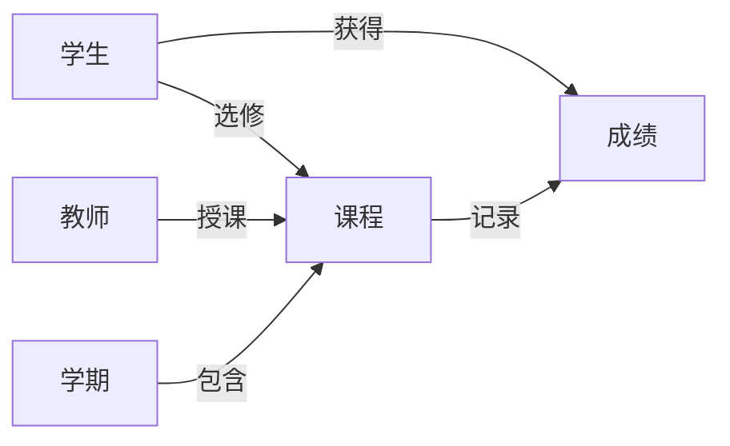

# 学生成绩信息管理系统详细设计与具体代码实现

作者：禅与计算机程序设计艺术

## 1. 背景介绍

### 1.1 学生成绩管理的重要性
在现代教育体系中,学生成绩管理是一项至关重要的工作。它不仅关系到学生个人的学习和发展,也影响着学校教学质量的评估和提升。高效、准确、安全的成绩管理系统能够极大地提高教务工作效率,为教学管理决策提供数据支持。

### 1.2 传统成绩管理方式的局限性
传统的学生成绩管理通常采用纸质档案或电子表格的方式,存在诸多不足:
- 数据录入繁琐,容易出错
- 查询、统计功能单一
- 数据安全性难以保证
- 系统扩展性差,难以满足日益增长的管理需求

### 1.3 开发学生成绩信息管理系统的意义
因此,开发一套功能完善、易于使用、安全可靠的学生成绩信息管理系统具有重要意义。它可以:
- 提高成绩数据录入、查询、统计的效率和准确性
- 实现成绩数据的集中管理和备份,保障数据安全
- 为教学管理提供丰富的数据分析功能,辅助决策
- 具备良好的可扩展性,适应教学管理需求的变化

## 2. 核心概念与关系

### 2.1 核心概念
学生成绩管理系统涉及的核心概念包括:
- 学生:具有学号、姓名等基本信息
- 课程:具有课程号、课程名、学分等属性 
- 成绩:学生修读课程所得分数,与学生和课程相关联
- 教师:负责登记学生选课和成绩,具有工号、姓名等信息
- 学期:成绩记录的时间维度,如2022-2023学年第1学期

### 2.2 实体关系图
下图展示了学生、课程、教师、成绩等实体之间的关系:



学生与课程是多对多的选课关系,教师与课程是一对多的授课关系。学生和课程与成绩则分别是一对多和多对一的关系。学期与课程也是一对多的包含关系。

### 2.3 数据库设计
根据上述实体关系,我们设计如下数据库表:

- 学生表(Student):
  - 学号 ID (PK)
  - 姓名 Name
  - 专业 Major
  - 入学年份 EnrollYear
- 教师表(Teacher):  
  - 工号 ID (PK)
  - 姓名 Name
  - 职称 Title
- 课程表(Course):
  - 课程号 ID (PK) 
  - 课程名 Name
  - 学分 Credit
  - 授课教师 TeacherID (FK)
  - 开课学期 SemesterID (FK)
- 成绩表(Grade):  
  - 学号 StudentID (PK, FK)
  - 课程号 CourseID (PK, FK)
  - 成绩 Score
- 学期表(Semester):
  - 学期号 ID (PK)
  - 学年 Year
  - 学期 Term

主键(PK)唯一标识一条记录,外键(FK)则体现了表之间的引用关系。例如Grade表的StudentID和CourseID分别引用了Student和Course表的主键ID。

## 3. 核心算法原理与具体操作步骤

### 3.1 成绩录入
成绩录入是指教师在系统中登记学生的考试成绩。其基本步骤如下:
1. 教师登录系统,进入成绩录入界面
2. 选择要录入成绩的课程和学期
3. 系统根据选课记录,生成学生成绩录入表格
4. 教师在表格中填写每个学生的成绩
5. 提交成绩,系统进行合法性检查(分数范围、必填等)
6. 检查通过,则将成绩记录插入数据库,否则提示错误信息

后台成绩录入的核心逻辑可表示为:
```
function inputGrades(courseID, semesterID, scores):
    for each student in scores:
        if not isValid(student.score):
            return error
    for each student in scores:
        insertGrade(student.id, courseID, student.score) 
    return success
```

### 3.2 成绩查询
成绩查询是指学生或教师查看已录入系统的成绩信息。查询可以按学生、课程、学期等条件进行。以按学生查询为例,其步骤如下:
1. 用户输入学号,系统验证学号合法性
2. 从数据库检索出该学生的所有选课记录
3. 对每门选课,关联查询出成绩信息
4. 将成绩数据返回给用户界面展示

后台成绩查询的核心逻辑可表示为:
```sql
function queryGrades(studentID):
    student = getStudent(studentID)
    if student is null:
        return error
    
    grades = query(`
        SELECT c.Name as CourseName, g.Score as Grade 
        FROM Grade g
        JOIN Course c ON g.CourseID = c.ID
        WHERE g.StudentID = studentID
    `)
    
    return grades
```

### 3.3 成绩统计
成绩统计是对学生成绩数据进行汇总分析,如计算课程平均分、学生平均学分绩点等。以课程平均分计算为例:
1. 用户选择课程和学期,系统检索出该课程的所有成绩记录
2. 计算成绩总分和学生人数
3. 用总分除以人数得到平均分
4. 将平均分返回给用户界面展示

后台成绩统计的核心逻辑可表示为:
```sql
function avgScore(courseID, semesterID):
    result = query(`
        SELECT AVG(Score) as avg
        FROM Grade 
        WHERE CourseID = courseID AND SemesterID = semesterID
    `)
    
    return result[0].avg
```

## 4. 数学模型和公式详细讲解举例说明

在成绩管理中,我们经常需要用到一些数学模型和公式,如平均分、标准差、加权平均等。下面以几个常见模型为例进行讲解。

### 4.1 算术平均分
算术平均分是指所有学生成绩的总和除以学生人数,反映了学生整体成绩的中心趋势。设有$n$个学生,第$i$个学生的成绩为$x_i$,则算术平均分$\bar{x}$的计算公式为:

$$\bar{x} = \frac{1}{n} \sum_{i=1}^n x_i$$

例如,某课程5个学生的成绩分别为80、85、90、95、85,则该课程的平均分为:

$$\bar{x} = \frac{80 + 85 + 90 + 95 + 85}{5} = 87$$

### 4.2 标准差
标准差是衡量一组数据离散程度的指标,反映了学生成绩的差异性。设有$n$个学生,第$i$个学生的成绩为$x_i$,平均分为$\bar{x}$,则成绩标准差$s$的计算公式为:

$$s = \sqrt{\frac{1}{n} \sum_{i=1}^n (x_i - \bar{x})^2}$$

例如,上例5个学生成绩的标准差为:

$$s = \sqrt{\frac{(80-87)^2 + (85-87)^2 + (90-87)^2 + (95-87)^2 + (85-87)^2}{5}} \approx 5.48$$

### 4.3 加权平均分
在计算学生的总评成绩时,通常采用加权平均的方法,即按各项成绩的学分权重计算平均分。设第$i$门课程的成绩为$x_i$,学分为$w_i$,共修$n$门课程,则加权平均分$\bar{x}_w$的计算公式为:

$$\bar{x}_w = \frac{\sum_{i=1}^n w_i x_i}{\sum_{i=1}^n w_i}$$

例如,某学生修了3门课,分数和学分分别为(90, 4)、(85, 3)、(80, 2),则该学生的加权平均分为:

$$\bar{x}_w = \frac{90 \times 4 + 85 \times 3 + 80 \times 2}{4 + 3 + 2} \approx 86.1$$

### 4.4 在系统中的应用
以上几个模型在成绩管理系统中都有广泛应用,如:
- 计算课程的平均分,评估教学效果
- 计算成绩的标准差,了解学生成绩分布情况
- 计算学生的加权平均分,作为评奖评优的依据
- 计算标准分(z-score),进行不同课程成绩的横向比较

在系统后台,我们可以用SQL语句或编程语言来实现这些数学模型,如计算平均分的SQL:
```sql
SELECT AVG(Score) FROM Grade WHERE CourseID = ?
```

计算标准差的Java代码片段:
```java
double avg(List<Double> scores) {
    return scores.stream().mapToDouble(s -> s).average().orElse(0);
}

double std(List<Double> scores) {
    double avgScore = avg(scores);
    double sum = scores.stream().mapToDouble(s -> Math.pow(s - avgScore, 2)).sum();
    return Math.sqrt(sum / scores.size());
}
```

## 5. 项目实践：代码实例和详细解释说明

下面我们以Java语言为例,展示学生成绩管理系统的部分核心代码实现。

### 5.1 数据库操作
我们使用JDBC(Java Database Connectivity)来连接和操作数据库。以查询学生成绩为例:

```java
public List<Grade> queryGrades(String studentId) throws SQLException {
    List<Grade> grades = new ArrayList<>();
    
    String sql = "SELECT c.Name, g.Score " + 
                 "FROM Grade g " +
                 "JOIN Course c ON g.CourseID = c.ID " +
                 "WHERE g.StudentID = ?";
    
    try (Connection conn = dataSource.getConnection();
         PreparedStatement stmt = conn.prepareStatement(sql)) {
        
        stmt.setString(1, studentId);
        
        try (ResultSet rs = stmt.executeQuery()) {
            while (rs.next()) {
                String courseName = rs.getString("Name");
                double score = rs.getDouble("Score");
                grades.add(new Grade(courseName, score));
            }
        }
    }
    
    return grades;
}
```

这段代码使用了`PreparedStatement`来避免SQL注入,提高安全性。同时使用`try-with-resources`语句来自动关闭数据库连接,避免资源泄漏。

### 5.2 业务逻辑
成绩录入是系统的一个核心业务逻辑,包括数据校验和数据库插入两个主要步骤:

```java
public void inputGrades(String courseId, String semesterId, List<GradeInput> inputs) {
    // 数据校验
    for (GradeInput input : inputs) {
        double score = input.getScore();
        if (score < 0 || score > 100) {
            throw new IllegalArgumentException("Invalid score: " + score);
        }
    }
    
    // 数据库插入
    String sql = "INSERT INTO Grade (StudentID, CourseID, SemesterID, Score) VALUES (?, ?, ?, ?)";
    
    try (Connection conn = dataSource.getConnection();
         PreparedStatement stmt = conn.prepareStatement(sql)) {
        
        for (GradeInput input : inputs) {
            stmt.setString(1, input.getStudentId());
            stmt.setString(2, courseId);
            stmt.setString(3, semesterId);
            stmt.setDouble(4, input.getScore());
            stmt.addBatch();
        }
        
        stmt.executeBatch();
        
    } catch (SQLException e) {
        throw new RuntimeException("Error inputting grades", e);
    }
}
```

这段代码首先对每个学生的成绩进行校验,如果不在合法范围内则抛出异常。然后使用`PreparedStatement`的批处理功能,将所有成绩记录一次性插入数据库,提高效率。

### 5.3 数据分析
在上一节我们讲解了一些常用的数学模型,下面以计算课程平均分为例,展示如何用Java代码实现:

```java
public double avgScore(String courseId, String semesterId) {
    String sql = "SELECT AVG(Score) AS avg " +
                 "FROM Grade " +
                 "WHERE CourseID = ? AND SemesterID = ?";
    
    try (Connection conn = dataSource.getConnection();
         PreparedStatement stmt = conn.prepareStatement(sql)) {
        
        stmt.setString(1, courseId);
        stmt.setString(2, semesterId);
        
        try (ResultSet rs = stmt.executeQuery()) {
            if (rs.next()) {
                return rs.getDouble("avg");