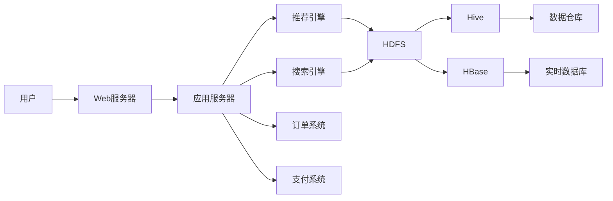

# 网上图书销售系统详细设计与具体代码实现

作者：禅与计算机程序设计艺术

## 1. 背景介绍
### 1.1 网上图书销售系统的发展历程
#### 1.1.1 早期的网上书店
#### 1.1.2 电子商务的兴起
#### 1.1.3 移动互联网时代的网上图书销售

### 1.2 网上图书销售系统的意义
#### 1.2.1 方便读者购书
#### 1.2.2 拓宽图书销售渠道
#### 1.2.3 促进图书行业发展

### 1.3 网上图书销售系统面临的挑战  
#### 1.3.1 用户体验
#### 1.3.2 物流配送
#### 1.3.3 大数据应用

## 2. 核心概念与联系
### 2.1 电子商务
#### 2.1.1 定义
电子商务（Electronic Commerce）是指通过互联网、计算机网络和数字交互式媒体来实现商务活动的一种新型商业运营模式。
#### 2.1.2 分类
- B2B：企业对企业
- B2C：企业对消费者
- C2C：消费者对消费者
- O2O：线上到线下

#### 2.1.3 特点
- 全球化 
- 低成本
- 高效率

### 2.2 网上图书销售
#### 2.2.1 定义
网上图书销售是电子商务在图书零售领域的具体应用，通过互联网进行图书的展示、推荐、交易、配送等活动。
#### 2.2.2 优势
- 图书种类丰富
- 购书便捷
- 个性化推荐
- 价格优惠

### 2.3 用户体验
#### 2.3.1 定义
用户体验是用户在使用产品或服务的过程中建立起来的一种纯主观感受。
#### 2.3.2 要素
- 可用性
- 易用性
- 美观性
- 愉悦性

#### 2.3.3 评估方法
- 用户调查
- 用户测试
- A/B测试
- 数据分析

## 3. 核心算法原理具体操作步骤
### 3.1 协同过滤推荐算法
#### 3.1.1 原理
协同过滤推荐算法是根据用户的历史行为，发掘用户的兴趣爱好，将相似用户或物品聚集在一起，实现推荐的一种算法。
#### 3.1.2 分类
- 基于用户的协同过滤
- 基于物品的协同过滤
- 基于模型的协同过滤

#### 3.1.3 计算步骤
1. 收集用户行为数据
2. 计算用户或物品的相似度
3. 生成推荐列表
4. 对推荐结果进行排序
5. 呈现给用户

### 3.2 基于内容的推荐算法
#### 3.2.1 原理
基于内容的推荐算法是通过分析物品的内容属性，发现用户感兴趣的特征，从而实现推荐的一种算法。
#### 3.2.2 计算步骤
1. 表示物品的特征
2. 学习用户的兴趣特征
3. 计算候选物品与用户的相似度
4. 生成推荐列表

### 3.3 组合推荐算法
#### 3.3.1 定义
组合推荐算法是指将多种推荐算法进行组合，取各自的优势，避免单一算法的局限性，从而获得更好的推荐效果。
#### 3.3.2 常见组合方式
- 加权融合
- 分层叠加
- 交替使用
- 特征组合

## 4. 数学模型和公式详细讲解举例说明
### 4.1 协同过滤推荐算法
#### 4.1.1 基于用户的协同过滤
- 用户相似度计算

$sim(u,v) = \frac{\sum_{i \in I_{uv}}(r_{ui}-\bar{r}_u)(r_{vi}-\bar{r}_v)}{\sqrt{\sum_{i \in I_{uv}}(r_{ui}-\bar{r}_u)^2}\sqrt{\sum_{i \in I_{uv}}(r_{vi}-\bar{r}_v)^2}}$

其中，$I_{uv}$ 表示用户u和v共同评分的物品集合，$r_{ui}$ 表示用户u对物品i的评分，$\bar{r}_u$ 表示用户u的平均评分。

- 预测评分计算

$p_{ui} = \bar{r}_u + \frac{\sum_{v \in S^k_u(i)}sim(u,v)(r_{vi}-\bar{r}_v)}{\sum_{v \in S^k_u(i)}\lvert sim(u,v) \rvert}$

其中，$S^k_u(i)$ 表示与用户u最相似的k个用户中对物品i有评分的用户集合。

#### 4.1.2 基于物品的协同过滤
- 物品相似度计算

$sim(i,j) = \frac{\sum_{u \in U_{ij}}(r_{ui}-\bar{r}_i)(r_{uj}-\bar{r}_j)}{\sqrt{\sum_{u \in U_{ij}}(r_{ui}-\bar{r}_i)^2}\sqrt{\sum_{u \in U_{ij}}(r_{uj}-\bar{r}_j)^2}}$

其中，$U_{ij}$ 表示对物品i和j都有评分的用户集合，$\bar{r}_i$ 表示物品i的平均评分。

- 预测评分计算

$p_{ui} = \frac{\sum_{j \in S^k_i(u)}sim(i,j)r_{uj}}{\sum_{j \in S^k_i(u)}\lvert sim(i,j) \rvert}$

其中，$S^k_i(u)$ 表示用户u评分过的物品中与物品i最相似的k个物品集合。

### 4.2 基于内容的推荐算法
#### 4.2.1 TF-IDF算法
TF-IDF（Term Frequency-Inverse Document Frequency）是一种常用的文本特征表示方法。

- TF（词频）

$tf_{ij} = \frac{n_{ij}}{\sum_k n_{kj}}$

其中，$n_{ij}$ 表示词语 $t_i$ 在文档 $d_j$ 中出现的次数，$\sum_k n_{kj}$ 表示文档 $d_j$ 中所有词语出现的次数之和。

- IDF（逆文档频率）

$idf_i = \log \frac{\lvert D \rvert}{\lvert \{j:t_i \in d_j\} \rvert}$

其中，$\lvert D \rvert$ 表示语料库中文档的总数，$\lvert \{j:t_i \in d_j\} \rvert$ 表示包含词语 $t_i$ 的文档数。

- TF-IDF

$tfidf_{ij} = tf_{ij} \times idf_i$

#### 4.2.2 余弦相似度
余弦相似度用于计算两个向量之间的夹角余弦值，可以用来衡量两个文本之间的相似程度。

$cos(\theta) = \frac{\vec{a} \cdot \vec{b}}{\lVert \vec{a} \rVert \lVert \vec{b} \rVert} = \frac{\sum^n_{i=1}a_i b_i}{\sqrt{\sum^n_{i=1}(a_i)^2} \sqrt{\sum^n_{i=1}(b_i)^2}}$

其中，$\vec{a}$ 和 $\vec{b}$ 是两个n维向量，$a_i$ 和 $b_i$ 分别是向量的第i个元素。

## 5. 项目实践：代码实例和详细解释说明
### 5.1 系统架构设计
#### 5.1.1 总体架构



#### 5.1.2 技术选型
- Web服务器：Nginx
- 应用服务器：Tomcat
- 推荐引擎：Mahout
- 搜索引擎：Elasticsearch
- 订单系统：MySQL
- 支付系统：支付宝/微信支付
- 数据存储：HDFS/HBase
- 数据处理：Hive/Spark

### 5.2 推荐系统实现
#### 5.2.1 数据预处理
```python
import pandas as pd

# 读取评分数据
ratings = pd.read_csv('ratings.csv')

# 读取图书元数据
books = pd.read_csv('books.csv') 

# 合并评分数据和图书元数据
data = pd.merge(ratings, books, on='ISBN')

# 对图书进行统计
book_stats = data.groupby('ISBN').agg({'bookRating': [np.size, np.mean]})
book_stats.columns = ['ratingCount', 'meanRating']

# 筛选评分数大于50的图书
popular_books = book_stats['ratingCount'] >= 50
book_stats[popular_books].sort_values('meanRating', ascending=False)
```

#### 5.2.2 基于协同过滤的推荐
```python
from surprise import Dataset, Reader
from surprise import SVD

# 加载数据
reader = Reader(rating_scale=(1, 10))
data = Dataset.load_from_df(ratings[['userID', 'ISBN', 'bookRating']], reader)

# 构建模型
algo = SVD()
trainset = data.build_full_trainset()
algo.fit(trainset)

# 生成推荐
userID = '100'
isbn = '0316769487'
pred = algo.predict(userID, isbn, r_ui=4, verbose=True)
```

#### 5.2.3 基于内容的推荐
```python
from sklearn.feature_extraction.text import TfidfVectorizer
from sklearn.metrics.pairwise import cosine_similarity

# 提取图书描述信息
book_descriptions = books['Book-Description'].tolist()

# 创建TF-IDF向量
vectorizer = TfidfVectorizer(stop_words='english')
tfidf_matrix = vectorizer.fit_transform(book_descriptions)

# 计算图书之间的相似度
cosine_sim = cosine_similarity(tfidf_matrix, tfidf_matrix)

# 生成推荐
book_index = books[books['ISBN'] == isbn].index[0]
similar_books = list(enumerate(cosine_sim[book_index]))
sorted_similar_books = sorted(similar_books, key=lambda x:x[1], reverse=True)[1:6]

for book in sorted_similar_books:
    print(books.iloc[book[0]]['Book-Title'])
```

### 5.3 搜索系统实现
#### 5.3.1 创建索引
```json
PUT books
{
  "mappings": {
    "properties": {
      "ISBN": {
        "type": "keyword"
      },
      "Book-Title": {
        "type": "text",
        "analyzer": "ik_max_word",
        "search_analyzer": "ik_smart"
      },
      "Book-Author": {
        "type": "keyword"
      },
      "Book-Description": {
        "type": "text",
        "analyzer": "ik_max_word",
        "search_analyzer": "ik_smart"  
      }
    }
  }
}
```

#### 5.3.2 数据导入
```python
from elasticsearch import Elasticsearch
from elasticsearch import helpers

es = Elasticsearch()

actions = []
for _, row in books.iterrows():
    action = {
        "_index": "books",
        "_source": {
            "ISBN": row['ISBN'],
            "Book-Title": row['Book-Title'],
            "Book-Author": row['Book-Author'],
            "Book-Description": row['Book-Description']
        }
    }
    actions.append(action)

helpers.bulk(es, actions)
```

#### 5.3.3 查询搜索
```json
GET books/_search
{
  "query": {
    "multi_match": {
      "query": "Python编程",
      "fields": ["Book-Title", "Book-Description"]
    }
  },
  "highlight": {
    "fields": {
      "Book-Title": {},
      "Book-Description": {}
    }
  }
}
```

## 6. 实际应用场景
### 6.1 个性化图书推荐
根据用户的历史浏览、购买、评分等行为数据，利用协同过滤、基于内容等推荐算法，为用户推荐感兴趣的图书，提高用户的购买转化率和满意度。
### 6.2 图书搜索引擎
利用搜索引擎技术，为用户提供高效、准确的图书搜索服务。用户可以通过关键词、作者、出版社等多种方式进行图书检索，快速找到所需图书。
### 6.3 图书销售数据分析
通过收集用户的浏览、购买、评论等行为数据，进行大数据分析，挖掘用户的阅读偏好、消费习惯等信息，为图书采购、营销策略制定等提供数据支持。

## 7. 工具和资源推荐
### 7.1 开发工具
- IDEA：Java开发IDE
- PyCharm：Python开发IDE