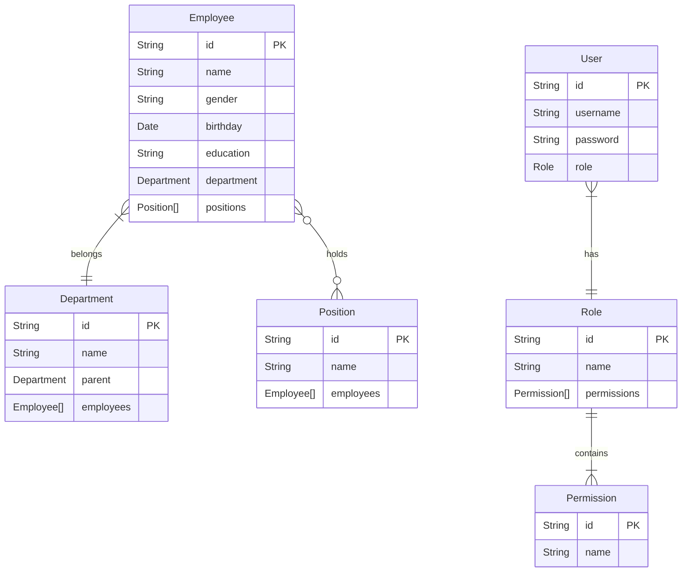
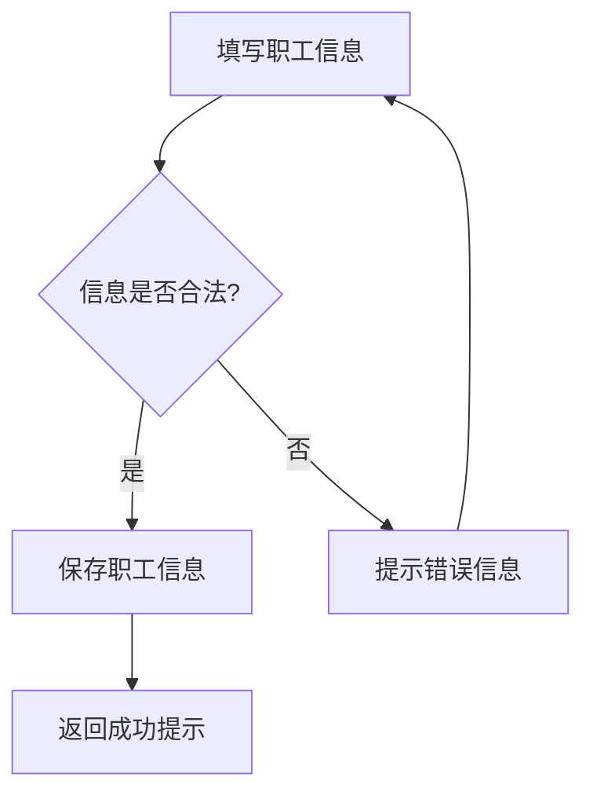
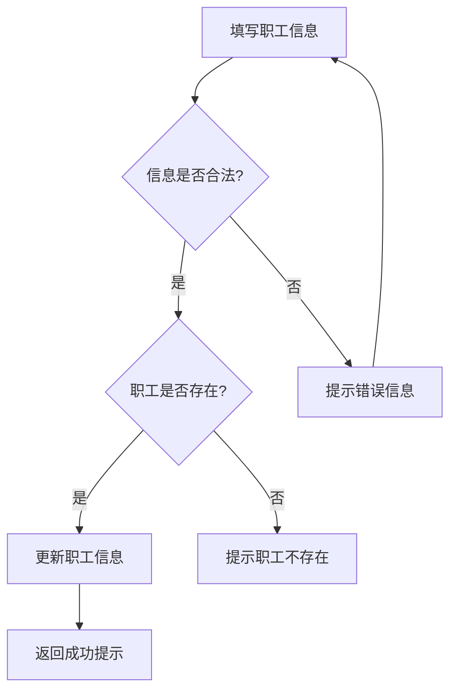
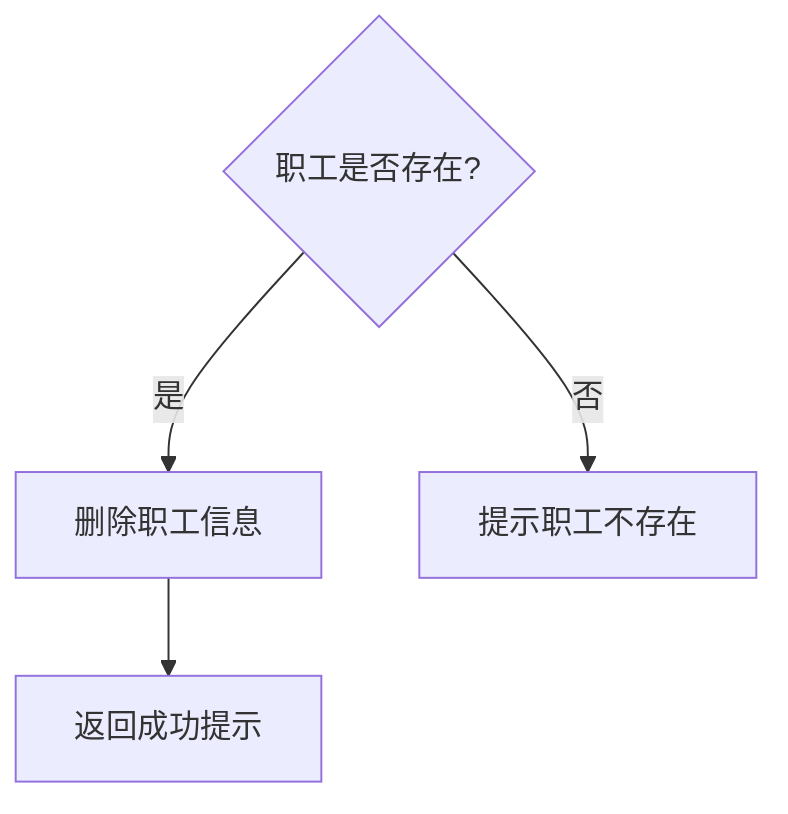
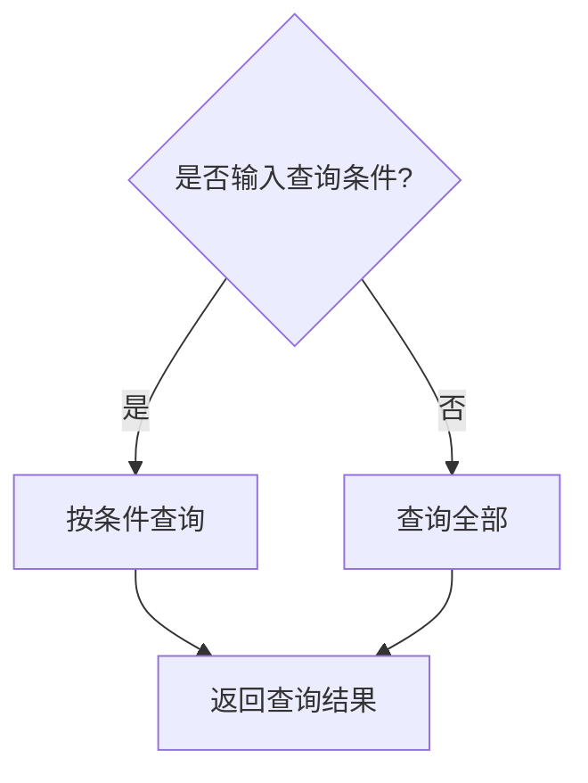

# 职工信息管理系统详细设计与具体代码实现

作者：禅与计算机程序设计艺术

## 1. 背景介绍

### 1.1 企业信息化管理的重要性

在现代企业管理中,信息化管理已成为提高企业运营效率、增强市场竞争力的关键因素。企业需要借助信息技术手段,对内部各种资源进行有效整合和优化配置,实现信息的高效传递和共享,为企业决策提供及时、准确的数据支持。

### 1.2 职工信息管理系统的必要性

职工是企业最宝贵的资源之一。一个完善的职工信息管理系统可以帮助企业全面掌握职工的基本信息、工作履历、绩效考核、薪酬福利等各方面情况,为人力资源管理决策提供依据。同时,系统还能够简化日常人事管理工作,提高工作效率。

### 1.3 系统开发目标

本文旨在设计并实现一个功能完备、易于使用的职工信息管理系统。系统将采用B/S架构,使用Java语言开发,主要功能包括:

- 职工信息的录入、修改、删除、查询
- 部门管理
- 职位管理
- 用户权限管理
- 数据的导入导出

## 2. 核心概念与关系

### 2.1 职工 

职工是系统的核心实体,包含职工的各种基本信息,如姓名、性别、出生日期、学历、所属部门、职位等。每个职工都有一个唯一的工号作为标识。

### 2.2 部门

部门是职工所属的组织单元。一个部门可以包含多名职工,而每名职工只能属于一个部门。部门具有层级关系(如总公司、分公司、部门、组等)。

### 2.3 职位

职位是职工在企业中担任的工作岗位。一个职位可以由多名职工担任,每名职工可以同时担任一个或多个职位。

### 2.4 用户与权限

用户是指可以登录系统的人员,通常是企业内部的HR或管理人员。不同用户拥有不同的操作权限(如信息浏览、录入、修改、删除等)。权限可以根据实际需要灵活配置。

## 3. 系统架构与技术选型

### 3.1 系统架构

本系统采用B/S(Browser/Server)架构,即浏览器/服务器架构。用户通过浏览器访问系统,服务器负责处理请求并返回结果。系统的整体架构如下:


### 3.2 技术选型

- 开发语言:Java
- Web框架:Spring Boot
- 持久层框架:MyBatis 
- 数据库:MySQL
- 前端框架:Vue.js
- 构建工具:Maven
- 版本控制:Git

选择这些技术主要基于以下考虑:
1. Java是成熟、稳定的开发语言,拥有丰富的类库和框架,开发效率高。
2. Spring Boot简化了Spring应用的开发配置,内置了常用组件如Tomcat、Hibernate等。
3. MyBatis是优秀的持久层框架,与Spring Boot集成方便,SQL映射灵活。
4. MySQL是使用广泛的开源关系型数据库,性能好,支持事务。
5. Vue.js是轻量级的MVVM前端框架,上手快,适合与后端分离的开发模式。
6. Maven用于项目构建和依赖管理,使项目结构清晰规范。
7. Git方便团队协作开发,代码版本管理。

## 4. 数据库设计

### 4.1 概念模型设计

根据需求分析,设计系统的ER图(实体-联系图)如下:



从ER图可以看出:
- 职工(Employee)与部门(Department)是多对一的关系,即一个职工只能属于一个部门,而一个部门可以有多个职工。
- 职工与职位(Position)是多对多的关系,一个职工可以担任多个职位,一个职位也可以由多个职工担任。
- 用户(User)与角色(Role)是多对一的关系,一个用户只能拥有一种角色,而一种角色可以赋予多个用户。
- 角色与权限(Permission)是多对多的关系,一个角色可以包含多个权限,一个权限也可以属于多个角色。

### 4.2 逻辑模型设计

根据ER图,设计数据库表结构如下:

```sql
-- 职工表
CREATE TABLE employee (
    id VARCHAR(20) PRIMARY KEY,
    name VARCHAR(20) NOT NULL,
    gender CHAR(1) NOT NULL,
    birthday DATE NOT NULL,
    education VARCHAR(20) NOT NULL,
    department_id VARCHAR(20) NOT NULL,
    FOREIGN KEY (department_id) REFERENCES department(id)
);

-- 部门表 
CREATE TABLE department (
    id VARCHAR(20) PRIMARY KEY,
    name VARCHAR(20) NOT NULL,
    parent_id VARCHAR(20),
    FOREIGN KEY (parent_id) REFERENCES department(id)
);

-- 职位表
CREATE TABLE position (
    id VARCHAR(20) PRIMARY KEY,
    name VARCHAR(20) NOT NULL
);

-- 职工职位关联表
CREATE TABLE employee_position (
    employee_id VARCHAR(20) NOT NULL,
    position_id VARCHAR(20) NOT NULL,
    PRIMARY KEY (employee_id, position_id),
    FOREIGN KEY (employee_id) REFERENCES employee(id),
    FOREIGN KEY (position_id) REFERENCES position(id)
);

-- 用户表
CREATE TABLE user (
    id VARCHAR(20) PRIMARY KEY,
    username VARCHAR(20) NOT NULL,
    password VARCHAR(100) NOT NULL,
    role_id VARCHAR(20) NOT NULL,
    FOREIGN KEY (role_id) REFERENCES role(id)
);

-- 角色表
CREATE TABLE role (
    id VARCHAR(20) PRIMARY KEY,
    name VARCHAR(20) NOT NULL
);

-- 权限表 
CREATE TABLE permission (
    id VARCHAR(20) PRIMARY KEY,
    name VARCHAR(20) NOT NULL
);

-- 角色权限关联表
CREATE TABLE role_permission (
    role_id VARCHAR(20) NOT NULL,
    permission_id VARCHAR(20) NOT NULL,
    PRIMARY KEY (role_id, permission_id),
    FOREIGN KEY (role_id) REFERENCES role(id),
    FOREIGN KEY (permission_id) REFERENCES permission(id)
);
```

需要注意的是:
1. 主键一般定义为VARCHAR类型,可以存储字母、数字等各种字符,灵活性更大。
2. 密码需要加密存储,否则容易泄露,引发安全问题。
3. 多对多关系需要通过中间表来实现,如职工和职位的关联表employee_position。
4. 外键约束可以保证数据的参照完整性,避免出现"孤儿"数据。

## 5. 核心功能设计与实现

### 5.1 职工管理

#### 5.1.1 职工信息录入

**流程图:**



**核心代码:**

```java
@PostMapping("/add")
public Result add(@RequestBody Employee employee) {
    // 参数校验
    if (StringUtils.isBlank(employee.getName())) {
        return Result.error("姓名不能为空");
    }
    if (StringUtils.isBlank(employee.getGender())) {
        return Result.error("性别不能为空");
    }
    // 其他参数校验...

    // 保存职工信息
    employeeService.save(employee);

    return Result.ok("添加成功");
}
```

#### 5.1.2 职工信息修改

**流程图:**



**核心代码:**

```java
@PutMapping("/update")
public Result update(@RequestBody Employee employee) {
    // 参数校验
    if (StringUtils.isBlank(employee.getId())) {
        return Result.error("职工ID不能为空");
    }
    if (StringUtils.isBlank(employee.getName())) {
        return Result.error("姓名不能为空");
    }
    // 其他参数校验...
    
    // 检查职工是否存在
    Employee existingEmployee = employeeService.getById(employee.getId());
    if (existingEmployee == null) {
        return Result.error("职工不存在");
    }

    // 更新职工信息  
    employeeService.updateById(employee);

    return Result.ok("修改成功");
}
```

#### 5.1.3 职工信息删除

**流程图:**



**核心代码:**

```java
@DeleteMapping("/delete/{id}")
public Result delete(@PathVariable String id) {
    // 检查职工是否存在
    Employee existingEmployee = employeeService.getById(id);
    if (existingEmployee == null) {
        return Result.error("职工不存在");
    }

    // 删除职工信息
    employeeService.removeById(id);

    return Result.ok("删除成功");
}
```

#### 5.1.4 职工信息查询

**流程图:**



**核心代码:**

```java
@GetMapping("/list")
public Result list(@RequestParam(required = false) String name,
                   @RequestParam(required = false) String departmentId) {
    // 构建查询条件
    QueryWrapper<Employee> wrapper = new QueryWrapper<>();
    if (StringUtils.isNotBlank(name)) {
        wrapper.like("name", name);
    }
    if (StringUtils.isNotBlank(departmentId)) {
        wrapper.eq("department_id", departmentId);
    }

    // 执行查询
    List<Employee> list = employeeService.list(wrapper);

    return Result.ok(list);
}
```

### 5.2 部门管理

#### 5.2.1 部门的增删改查

部门的增删改查与职工类似,这里不再赘述。需要注意的是:
1. 删除部门时,要先判断该部门下是否还有职工,如果有则不允许删除。
2. 查询部门列表时,要按照层级关系进行排序和缩进显示。

#### 5.2.2 部门树的构建

由于部门之间存在层级关系,在前端展示时通常需要以树形结构呈现。因此后端需要提供一个接口,将扁平化的部门数据构建成树形结构。

**核心代码:**

```java
@GetMapping("/tree")
public Result tree() {
    // 查询所有部门
    List<Department> list = departmentService.list();

    // 构建部门树
    List<DepartmentVO> tree = buildTree(list);

    return Result.ok(tree);
}

/**
 * 构建部门树
 * @param list 部门列表
 * @return 部门树
 */
private List<DepartmentVO> buildTree(List<Department> list) {
    List<DepartmentVO> tree = new ArrayList<>();
    Map<String, DepartmentVO> map = new HashMap<>();

    // 先将部门转换为VO对象,并存入Map
    for (Department department : list) {
        DepartmentVO vo = new DepartmentVO();
        BeanUtils.copyProperties(department, vo);
        map.put(vo.getId(), vo);
    }

    // 遍历部门,将子部门添加到父部门的children属性中
    for (Department department : list) {
        String parentId = department.getParentId();
        if (StringUtils.isBlank(parentId)) {
            // 没有父部门,说明是一级部门
            tree.add(map.get(department.getId()));
        } else {
            // 有父部门,将当前部门添加到父部门的children中
            DepartmentVO parent = map.get(parentId);
            if (parent != null) {
                if (parent.getChildren() == null) {
                    parent.setChildren(new ArrayList<>());
                }
                parent.getChildren().add(map.get(department.getId()));
            }
        }
    }

    return tree;
}
```

其中DepartmentVO是Department的视图对