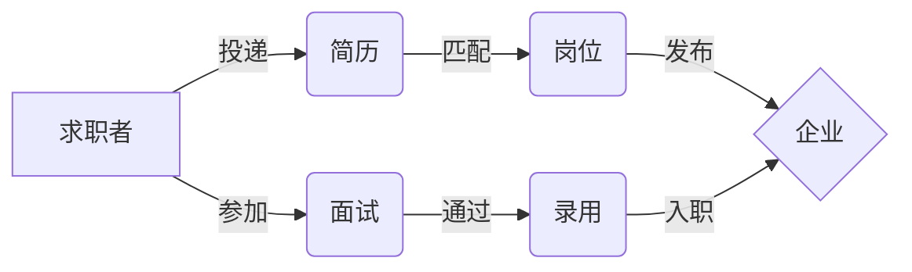

# 兼职中介管理系统详细设计与具体代码实现

作者：禅与计算机程序设计艺术

## 1. 背景介绍

### 1.1 兼职中介行业现状

随着社会经济的快速发展和就业形势的日益严峻,越来越多的人选择兼职来增加收入或积累工作经验。兼职中介平台应运而生,为求职者和用人单位提供了便利的对接渠道。然而,传统的兼职中介存在信息不对称、管理混乱等问题,亟需引入现代化的信息管理系统来提升运营效率和用户体验。

### 1.2 兼职中介管理系统的必要性

#### 1.2.1 提高信息匹配效率

兼职中介管理系统可以通过智能算法实现求职者与岗位的精准匹配,大大提高了信息匹配效率,节省了双方的时间和精力。

#### 1.2.2 规范业务流程

引入规范化的管理系统,可以将报名、面试、签约、结算等环节进行流程化管理,减少人工操作失误,提高工作效率。

#### 1.2.3 加强数据安全管理

系统采用先进的数据加密和权限控制技术,有效保护用户隐私和企业数据安全,提升平台的公信力和美誉度。

### 1.3 系统设计目标

#### 1.3.1 功能完善

系统应覆盖兼职中介业务的各个环节,提供全面的功能支持,满足用户多样化需求。

#### 1.3.2 性能优异

系统应具备高并发、低延迟的性能表现,确保在用户量大幅增长时仍能保持稳定运行。

#### 1.3.3 易用友好

系统应提供简洁明了的用户界面和清晰的操作流程,方便用户上手使用,提升用户粘性。

#### 1.3.4 安全可靠

系统应严格遵循安全开发规范,经过充分的测试和验证,确保系统的安全性和可靠性。

## 2. 核心概念与联系

### 2.1 用户角色

#### 2.1.1 求职者

寻找兼职机会的个人用户,可在系统中浏览岗位,投递简历,参与面试等。

#### 2.1.2 企业HR

发布兼职岗位的企业用户,可在系统中管理岗位,筛选简历,安排面试等。

#### 2.1.3 平台管理员

负责系统运维和管理的特殊用户,拥有系统的最高权限。

### 2.2 业务实体

#### 2.2.1 兼职岗位

由企业发布的用工需求,包含岗位名称、工作内容、薪酬待遇、任职要求等信息。

#### 2.2.2 求职简历

求职者提交的个人简历,包含基本信息、教育背景、工作经历、技能特长等。

#### 2.2.3 面试邀请

企业向合适的求职者发出的面试邀请,包含面试时间、地点、联系人等信息。

#### 2.2.4 录用通知

面试通过后,企业向求职者发出的录用通知,包含入职时间、薪酬待遇、合同签订等事宜。

### 2.3 实体关系图



## 3. 核心算法原理与具体操作步骤

### 3.1 岗位推荐算法

#### 3.1.1 协同过滤算法

利用用户行为数据(如浏览、投递、收藏等),计算用户之间的相似度,然后根据相似用户的偏好为目标用户推荐岗位。

##### 3.1.1.1 用户相似度计算

采用余弦相似度计算用户 $i$ 和用户 $j$ 的相似度:

$$
sim(i,j) = \frac{\sum_{k=1}^n r_{ik}r_{jk}}{\sqrt{\sum_{k=1}^n r_{ik}^2}\sqrt{\sum_{k=1}^n r_{jk}^2}}
$$

其中 $r_{ik}$ 表示用户 $i$ 对岗位 $k$ 的偏好值。

##### 3.1.1.2 岗位偏好预测

根据目标用户 $u$ 的相似用户集合 $S_u$,预测其对岗位 $i$ 的偏好值:

$$
p_{ui} = \frac{\sum_{v \in S_u} sim(u,v)r_{vi}}{\sum_{v \in S_u} sim(u,v)}
$$

#### 3.1.2 基于内容的推荐算法

利用岗位的属性特征(如工作类型、所需技能等)与用户属性(如教育背景、工作经验等)进行匹配,为用户推荐相似度高的岗位。

##### 3.1.2.1 特征提取与表示

对岗位和用户的文本信息进行分词、去停用词等预处理,然后采用 TF-IDF 等方法进行向量化表示。

##### 3.1.2.2 相似度计算

采用余弦相似度计算岗位向量 $\vec{p}$ 与用户向量 $\vec{u}$ 的相似度:

$$
sim(\vec{p},\vec{u}) = \frac{\vec{p} \cdot \vec{u}}{\|\vec{p}\| \|\vec{u}\|}
$$

### 3.2 简历解析算法

#### 3.2.1 基于规则的解析方法

利用正则表达式等规则,从简历文本中抽取关键信息,如姓名、学历、工作经历等。

##### 3.2.1.1 定义解析规则

```python
name_pattern = r'姓名[:：]?\s*([^,，。]+)'
edu_pattern = r'学历[:：]?\s*([^,，。]+)'
```

##### 3.2.1.2 信息抽取

```python
name = re.findall(name_pattern, resume_text)
edu = re.findall(edu_pattern, resume_text)
```

#### 3.2.2 基于机器学习的解析方法

将简历解析看作一个序列标注问题,采用条件随机场(CRF)等算法进行建模和训练。

##### 3.2.2.1 数据标注

对简历样本进行人工标注,如:

```
张/B-NAME 三/I-NAME 
硕士/O 研究生/B-EDU
```

##### 3.2.2.2 特征提取

提取词性、命名实体等特征:

```python
def extract_features(sentence, i):
    features = {
        'word': sentence[i],
        'pos': pos_tag(sentence)[i][1],
        'ner': ner_tag(sentence, i)
    }
    return features
```

##### 3.2.2.3 模型训练与预测

```python
model = sklearn_crfsuite.CRF(
    algorithm='lbfgs',
    max_iterations=100
)
model.fit(X_train, y_train)
y_pred = model.predict(X_test)
```

## 4. 数学模型和公式详细讲解举例说明

### 4.1 文本相似度模型

#### 4.1.1 One-hot 编码

将词表中的每个词映射为一个唯一的整数索引,然后将文本表示为一个由 0/1 组成的稀疏向量。

例如,对于词表 $\{$`我`,`爱`,`编程`$\}$,文本"我爱编程"可表示为:

$$
\begin{bmatrix}
1 \\ 1 \\ 1
\end{bmatrix}
$$

#### 4.1.2 TF-IDF 加权

TF-IDF 是一种统计方法,用于评估一个词对于一个文档集或一个语料库中的其中一份文档的重要程度。

TF(Term Frequency)表示词频,IDF(Inverse Document Frequency)表示逆文档频率。

$$
tfidf_{i,j} = tf_{i,j} \times idf_i
$$

其中,$tf_{i,j}$ 表示词 $i$ 在文档 $j$ 中的频率,$idf_i$ 表示词 $i$ 的逆文档频率:

$$
idf_i = \log \frac{|D|}{|\{j:t_i \in d_j\}|}
$$

$|D|$ 表示语料库中的文档总数,$|\{j:t_i \in d_j\}|$ 表示包含词 $i$ 的文档数。

#### 4.1.3 Word2Vec 词嵌入

Word2Vec 是一种常用的词嵌入学习算法,可以将词映射到一个低维连续空间,使得语义相似的词在该空间中距离较近。

其核心是两个模型:CBOW(Continuous Bag-of-Words)和 Skip-gram。

以 CBOW 为例,模型结构如下:


模型的优化目标是最大化给定上下文 $Context(w_i)$ 生成中心词 $w_i$ 的概率:

$$
\mathcal{L} = \sum_{w_i \in \mathcal{V}} \log p(w_i | Context(w_i))
$$

其中,$\mathcal{V}$ 为词表。

### 4.2 智能排班模型

#### 4.2.1 整数规划模型

设第 $i$ 个员工在第 $j$ 个时段是否上班为决策变量 $x_{ij}$,目标是在满足排班约束的前提下,最小化总人数:

$$
\begin{aligned}
\min \quad & \sum_{i=1}^n y_i \\
\text{s.t.} \quad & \sum_{i=1}^n x_{ij} \geq d_j, \forall j \\
& \sum_{j=1}^m x_{ij} \leq M y_i, \forall i \\
& x_{ij} \in \{0,1\}, \forall i,j \\
& y_i \in \{0,1\}, \forall i
\end{aligned}
$$

其中,$d_j$ 表示第 $j$ 个时段的人员需求量,$y_i$ 表示第 $i$ 个员工是否被安排上班,$M$ 为一个大常数。

#### 4.2.2 启发式算法

由于整数规划求解复杂度高,实际应用中常采用启发式算法,如模拟退火算法。

算法流程如下:

1. 初始化一个可行解 $S$,设初始温度 $T$,迭代次数 $L$
2. 重复 $L$ 次:
   1. 在 $S$ 的邻域内随机选择一个解 $S'$ 
   2. 若 $S'$ 优于 $S$,则接受 $S'$ 作为新的当前解
   3. 否则,以概率 $\exp(\frac{f(S)-f(S')}{T})$ 接受 $S'$
   4. $T$ 按一定规律降温
3. 输出当前解 $S$

其中,$f(\cdot)$ 为目标函数。

## 5. 项目实践：代码实例和详细解释说明

### 5.1 数据库设计

#### 5.1.1 用户表(user)

```sql
CREATE TABLE user (
  id INT PRIMARY KEY AUTO_INCREMENT,
  username VARCHAR(50) NOT NULL,
  password VARCHAR(50) NOT NULL,
  email VARCHAR(50) NOT NULL,
  role ENUM('jobseeker', 'hr', 'admin') NOT NULL
);
```

#### 5.1.2 简历表(resume)

```sql
CREATE TABLE resume (
  id INT PRIMARY KEY AUTO_INCREMENT,
  user_id INT NOT NULL,
  name VARCHAR(50) NOT NULL,
  gender ENUM('male', 'female') NOT NULL,
  age INT NOT NULL,
  education VARCHAR(50) NOT NULL,
  experience TEXT NOT NULL,
  FOREIGN KEY (user_id) REFERENCES user(id)
);
```

#### 5.1.3 岗位表(job)

```sql
CREATE TABLE job (
  id INT PRIMARY KEY AUTO_INCREMENT,
  title VARCHAR(100) NOT NULL,
  description TEXT NOT NULL,
  requirement TEXT NOT NULL,
  company VARCHAR(100) NOT NULL,
  address VARCHAR(100) NOT NULL,
  salary VARCHAR(50) NOT NULL
);
```

### 5.2 后端 API 设计

#### 5.2.1 用户注册

- URL: `/api/register`
- Method: `POST`
- Request Body:
  ```json
  {
    "username": "zhangsan",
    "password": "123456",
    "email": "zhangsan@example.com",
    "role": "jobseeker"
  }
  ```
- Response:
  - 成功:
    ```json
    {
      "code": 0,
      "message": "注册成功"
    }
    ```
  - 失败:
    ```json
    {
      "code": 1001,
      "message": "用户名已存在"
    }
    ```

#### 5.2.2 岗位列表

- URL: `/api/jobs`
- Method: `GET`
- Query Parameters:
  - `page`: 页码,默认为 1
  