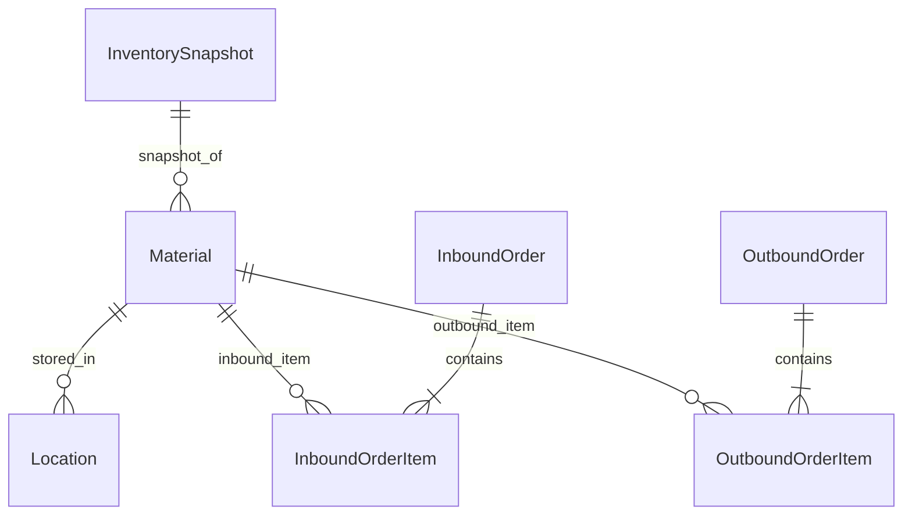

# 基于J2EE的库房管理系统的设计与实现

作者：禅与计算机程序设计艺术

## 1. 背景介绍
### 1.1 库房管理系统的重要性
在现代企业运营中,高效的库房管理是确保供应链顺畅运转、降低成本和提高客户满意度的关键。传统的人工管理方式已经无法满足日益增长的业务需求,因此开发一个功能完善、易于使用的库房管理系统势在必行。

### 1.2 J2EE技术的优势
J2EE(Java 2 Platform, Enterprise Edition)是一个广泛应用于企业级应用开发的技术平台。它提供了一系列的API和规范,使得开发人员能够快速构建安全、可扩展、高性能的分布式应用。J2EE的优势包括:
- 跨平台性:基于Java语言开发,可以在不同的操作系统上运行。
- 组件化开发:提供了EJB(Enterprise JavaBeans)、Servlet、JSP等组件,便于模块化设计和开发。
- 安全性:内置了完善的安全机制,如JAAS(Java Authentication and Authorization Service)。
- 可扩展性:支持集群部署和负载均衡,易于横向扩展。

### 1.3 本文的目标和结构
本文旨在探讨如何利用J2EE技术设计和实现一个高效、可靠的库房管理系统。我们将从需求分析入手,详细阐述系统的架构设计、数据库设计、核心功能实现等方面,并给出具体的代码示例。最后,我们将讨论系统的部署和优化,以及未来的改进方向。

## 2. 核心概念与关系
### 2.1 库房管理的业务流程
库房管理涉及到多个业务流程,包括:
- 入库管理:材料采购、验收、上架等。
- 出库管理:订单处理、拣货、发货等。  
- 库存管理:库存盘点、库存调整等。
- 库位管理:库位设置、库位调整等。

这些业务流程环环相扣,需要在系统中进行合理的抽象和建模。

### 2.2 J2EE的核心组件
在J2EE平台中,几个核心组件将在我们的库房管理系统中发挥重要作用:
- EJB:用于实现系统的业务逻辑,提供事务管理、并发控制等服务。
- Servlet/JSP:用于实现系统的表示层,负责与用户的交互。
- JDBC:用于与数据库进行交互,执行数据的CRUD操作。
- JMS:用于实现系统的异步通信和解耦,如发送入库/出库通知等。

我们将合理运用这些组件,构建一个分层的、松耦合的系统架构。

### 2.3 领域模型设计
在库房管理系统中,我们可以识别出以下几个关键的领域实体:
- 物料(Material):库房中存储的物品。
- 库位(Location):物料存放的位置。
- 入库单(InboundOrder):material入库时生成的单据。
- 出库单(OutboundOrder):material出库时生成的单据。
- 库存快照(InventorySnapshot):某一时刻的库存状态。

通过分析这些实体之间的关系,我们可以建立领域模型,为后续的数据库设计和功能实现奠定基础。

## 3. 架构设计
### 3.1 分层架构
我们采用经典的三层架构模式:
- 表示层:使用Servlet/JSP实现,负责接收用户请求,并将结果返回给用户。
- 业务逻辑层:使用EJB实现,负责处理业务逻辑,并与数据访问层交互。
- 数据访问层:使用JDBC实现,负责与数据库交互,执行数据的CRUD操作。

这种分层架构有利于系统的解耦和维护,每一层只专注于自己的职责,与其他层通过明确的接口进行通信。

### 3.2 模块划分
根据业务需求,我们可以将系统划分为以下几个模块:
- 基础数据管理:物料、库位等基础数据的维护。
- 入库管理:入库单的创建、审核、上架等。
- 出库管理:出库单的创建、审核、拣货、发货等。
- 库存管理:库存查询、库存盘点、库存调整等。
- 报表统计:各种报表的生成和导出,如入库报表、出库报表、库存报表等。

每个模块都有明确的职责边界,通过接口与其他模块协作,实现整个系统的功能。

### 3.3 接口设计
为了实现模块之间的解耦,我们需要为每个模块设计清晰的接口。以入库管理模块为例,我们可以设计以下接口:
- InboundOrderService:提供入库单的创建、查询、修改、删除等操作。
- InboundOrderApprovalService:提供入库单的审核操作。
- InboundOrderExecutionService:提供入库单的上架操作。

其他模块的接口可以按照类似的方式进行设计。通过接口的方式,我们可以实现模块之间的低耦合,提高系统的可维护性和可扩展性。

## 4. 数据库设计
### 4.1 E-R模型设计
根据领域模型,我们可以设计出系统的E-R模型。以下是一个简化的E-R模型示例:



在这个模型中,我们可以看到:
- 一个Material可以存放在多个Location中。
- 一个Material可以出现在多个InboundOrderItem和OutboundOrderItem中。
- 一个InboundOrder包含多个InboundOrderItem,一个OutboundOrder包含多个OutboundOrderItem。
- 一个InventorySnapshot包含多个Material的库存快照。

### 4.2 数据库表设计
根据E-R模型,我们可以设计出对应的数据库表结构。以下是一些核心表的设计示例:

```sql
CREATE TABLE material (
  id BIGINT PRIMARY KEY,
  name VARCHAR(255),
  specification VARCHAR(255),
  unit VARCHAR(50)
);

CREATE TABLE location (
  id BIGINT PRIMARY KEY,
  code VARCHAR(50),
  type VARCHAR(50),
  capacity INT
);

CREATE TABLE inbound_order (
  id BIGINT PRIMARY KEY,
  code VARCHAR(50),
  supplier_id BIGINT,
  create_time DATETIME,
  status VARCHAR(50)
);

CREATE TABLE inbound_order_item (
  id BIGINT PRIMARY KEY,
  inbound_order_id BIGINT,
  material_id BIGINT,
  quantity INT,
  FOREIGN KEY (inbound_order_id) REFERENCES inbound_order(id),
  FOREIGN KEY (material_id) REFERENCES material(id)
);

-- 其他表结构类似
```

通过合理的表结构设计,我们可以确保数据的完整性和一致性,为系统的功能实现提供坚实的数据基础。

## 5. 核心功能实现
### 5.1 入库管理
入库管理是库房管理系统的核心功能之一。以下是入库单创建的核心逻辑示例:

```java
@Stateless
public class InboundOrderServiceImpl implements InboundOrderService {

    @PersistenceContext
    private EntityManager em;

    @Override
    public InboundOrder createInboundOrder(InboundOrder inboundOrder) {
        // 设置入库单状态为"新建"
        inboundOrder.setStatus(InboundOrderStatus.CREATED);
        
        // 持久化入库单及其明细
        em.persist(inboundOrder);
        for (InboundOrderItem item : inboundOrder.getItems()) {
            item.setInboundOrder(inboundOrder);
            em.persist(item);
        }
        
        return inboundOrder;
    }
}
```

在这个示例中,我们使用了EJB的`@Stateless`注解来实现一个无状态的服务,并通过JPA(Java Persistence API)的`EntityManager`来执行持久化操作。

入库单的审核和上架操作可以按照类似的方式实现。

### 5.2 出库管理
出库管理是另一个核心功能。以下是出库单创建的核心逻辑示例:

```java
@Stateless
public class OutboundOrderServiceImpl implements OutboundOrderService {

    @PersistenceContext
    private EntityManager em;

    @Override
    public OutboundOrder createOutboundOrder(OutboundOrder outboundOrder) {
        // 设置出库单状态为"新建"
        outboundOrder.setStatus(OutboundOrderStatus.CREATED);
        
        // 持久化出库单及其明细
        em.persist(outboundOrder);
        for (OutboundOrderItem item : outboundOrder.getItems()) {
            item.setOutboundOrder(outboundOrder);
            em.persist(item);
        }
        
        return outboundOrder;
    }
}
```

出库单的审核、拣货、发货等操作可以按照类似的方式实现。

### 5.3 库存管理
库存管理是库房管理系统的重要功能,包括库存查询、库存盘点、库存调整等。以下是库存查询的核心逻辑示例:

```java
@Stateless
public class InventoryServiceImpl implements InventoryService {

    @PersistenceContext
    private EntityManager em;

    @Override
    public List<InventorySnapshot> getInventorySnapshots() {
        String jpql = "SELECT new InventorySnapshot(m.id, m.name, SUM(ii.quantity) - SUM(oi.quantity)) " +
                      "FROM Material m " +
                      "LEFT JOIN InboundOrderItem ii ON m.id = ii.material.id " +
                      "LEFT JOIN OutboundOrderItem oi ON m.id = oi.material.id " +
                      "GROUP BY m.id, m.name";
        
        return em.createQuery(jpql, InventorySnapshot.class).getResultList();
    }
}
```

在这个示例中,我们使用了JPQL(Java Persistence Query Language)来执行一个复杂的查询,生成库存快照。通过左连接入库单明细和出库单明细,我们可以计算出每个物料的当前库存数量。

库存盘点和调整可以通过类似的方式实现,通过对比实际库存和系统库存,生成盘点单和调整单,并相应地更新库存数据。

## 6. 系统部署与优化
### 6.1 部署架构
为了实现高可用和可扩展性,我们可以采用如下的部署架构:
- 负载均衡:使用Nginx等负载均衡器,将用户请求分发到多个应用服务器。
- 应用服务器集群:部署多个应用服务器,运行系统的业务逻辑。
- 数据库集群:使用MySQL等关系型数据库的主从复制或集群模式,提高数据的可用性和性能。
- 缓存服务器:使用Redis等内存数据库,缓存常用的数据,减轻数据库的压力。
- 消息队列:使用ActiveMQ等消息队列,实现系统的异步通信和解耦。

通过合理的部署架构,我们可以确保系统的高可用性、可扩展性和性能。

### 6.2 性能优化
为了提高系统的性能,我们可以采取以下优化措施:
- 数据库索引:对于常用的查询条件,创建合适的索引,加速数据的检索。
- 查询优化:对于复杂的查询,使用explain分析执行计划,优化查询语句。
- 缓存优化:对于常用的数据,如物料基础信息等,可以缓存在Redis中,减少数据库的访问。
- 异步处理:对于一些耗时的操作,如生成报表等,可以采用异步处理的方式,提高系统的响应速度。
- 数据分片:对于大规模的数据,可以考虑使用数据分片的方式,将数据分散存储在多个数据库中,提高系统的吞吐量。

通过不断的监控和优化,我们可以确保系统在高并发、大数据量的情况下,仍然能够保持良好的性能。

## 7. 未来展望
### 7.1 智能化
随着人工智能技术的发展,我们可以考虑将AI应用到库房管理系统中,实现更加智能化的管理。例如:
- 智能补货:根据历史数据和预测算法,自动生成补货建议,优化库存水平。
- 智能分配:根据订单情况和库存分布,自动为出库单分配最优的拣货路线。
- 智能异常检测:通过机器学习算法,自动识别异常的入库、出库行为,提高系统的安全性。

### 7.2 移动化
随着移动互联网的普及,我们可以考虑为库房管理系统开发移动端应用