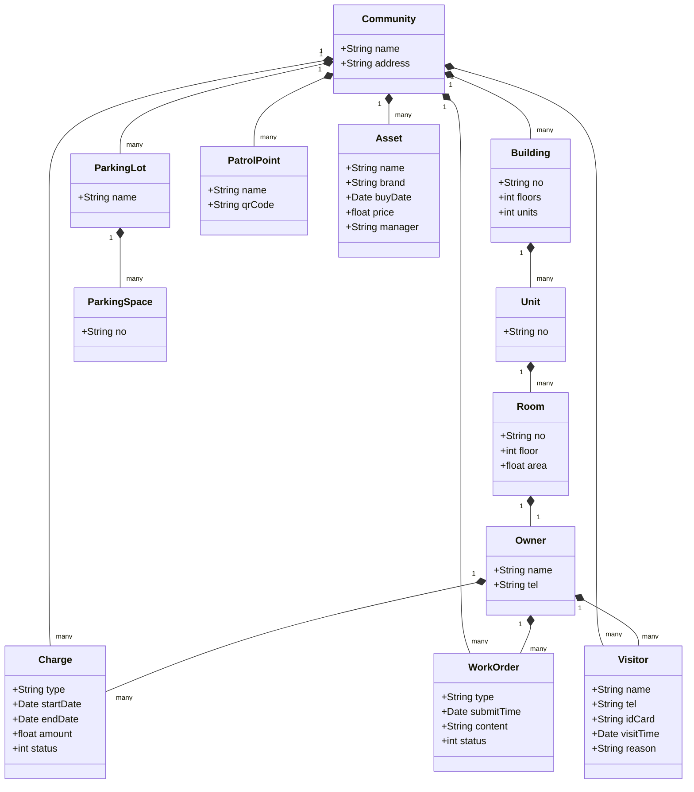
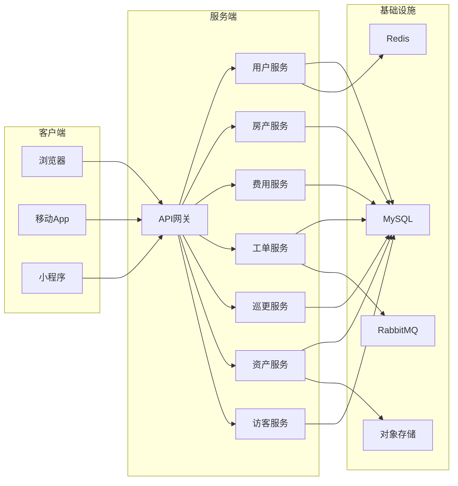

# 物业管理系统详细设计与具体代码实现

作者：禅与计算机程序设计艺术

## 1. 背景介绍

### 1.1 物业管理系统的重要性

在现代社会中,物业管理已成为一个不可或缺的行业。高效的物业管理不仅能够提高居民的生活质量,还能保障物业资产的保值增值。而信息化是提升物业管理效率的重要手段。物业管理系统作为物业管理信息化的核心,在实际工作中发挥着越来越重要的作用。

### 1.2 物业管理系统的主要功能

一个完善的物业管理系统通常包括以下主要功能模块:

- 基础信息管理:包括业主信息、房产信息、车位信息等的录入、查询和维护。
- 费用管理:包括物业费、水电费、停车费等各种费用的收取、统计和催缴。
- 报修管理:业主报修的受理、派工、跟踪、评价等全过程管理。
- 投诉管理:业主投诉的记录、处理、反馈和统计分析。
- 巡更管理:对保安员的巡更任务下达、执行情况跟踪和考核。
- 资产管理:对小区公共资产和设施设备的台账管理、使用登记、维修养护等。
- 停车管理:车辆进出登记、停车费用管理、车位使用管理等。
- 访客管理:访客信息登记、预约管理和门禁授权等。

### 1.3 物业管理系统的开发技术选型

目前主流的物业管理系统大多采用BS架构,即浏览器/服务器架构。系统服务端采用Java、.NET等技术,客户端采用HTML5、CSS、JavaScript等Web前端技术。移动端App采用Android、iOS等原生开发技术或者跨平台开发框架如Flutter、React Native等。

本文将重点介绍一个基于Java技术栈的物业管理系统的设计与实现。后端采用主流的Spring Boot框架,前端采用流行的Vue.js框架。数据库选用MySQL。整个系统采用微服务架构和前后端分离的设计思想。

## 2. 核心概念与关系

### 2.1 领域模型

在物业管理领域,核心概念包括:

- 小区:物业管理的基本单元,包含多栋楼宇和各种配套设施。
- 楼宇:小区内的建筑物,每栋楼宇划分为若干单元、楼层。
- 房产:楼宇内的具体房间,是费用收取、报修投诉的主体。
- 业主:房产的产权所有者,是物业服务的对象。
- 车位:小区内的车辆停放位置,可能属于业主或出租。
- 费用:物业管理过程中向业主收取的各种费用,包括物业费、水电费、停车费、维修基金等。
- 工单:业主报修或投诉形成的处理单,经过受理、派工、处理、回访等环节。
- 巡更点:保安员巡逻时必须经过的位置,一般设置考勤设备。
- 资产:小区内的公共资产,如健身器材、绿化设施、消防设备等。
- 访客:到访小区的外来人员,需要登记并授权门禁。

这些概念之间的关系可以用UML类图表示如下:



### 2.2 系统架构

系统整体采用前后端分离的架构,前端和后端通过RESTful API通信。后端采用微服务架构,将系统拆分为若干个独立的微服务,每个微服务负责一个相对独立的业务领域。微服务之间通过HTTP或消息队列进行通信。每个微服务内部采用分层架构,自下而上分为基础设施层、持久化层、领域层、应用层和接口层。

系统架构图如下所示:



## 3. 核心算法原理与具体操作步骤

本系统涉及的核心算法主要包括:

### 3.1 费用账单生成算法

每月月初,系统需要为每个房产生成一张当月的费用账单。账单内容包括各项费用的金额、计费起止时间、缴费截止日期、逾期金额等。生成账单的基本步骤如下:

1. 从房产服务获取所有房产信息,遍历每个房产
2. 根据房产面积、计费标准、费用起止时间计算各项费用金额
3. 查询上月是否有未缴费用,若有则合并到本月账单
4. 根据物业收费政策确定账单的缴费截止日期
5. 将账单保存到数据库并推送给业主

核心代码如下:

```java
@Service
public class BillService {

    @Autowired
    private RoomService roomService;
    
    @Autowired
    private ChargeService chargeService;
    
    @Autowired
    private BillRepository billRepository;
    
    @Transactional
    public void generateBills(String communityId, Date startDate, Date endDate) {
        List<Room> rooms = roomService.getAllRooms(communityId);
        for (Room room : rooms) {
            Bill bill = new Bill();
            bill.setRoomId(room.getId());
            bill.setOwnerId(room.getOwnerId());
            bill.setStartDate(startDate);
            bill.setEndDate(endDate);
            
            List<Charge> charges = chargeService.getCharges(communityId);
            for (Charge charge : charges) {
                switch (charge.getType()) {
                    case "property":
                        bill.setPropertyFee(charge.getPrice() * room.getArea());
                        break;
                    case "water":
                        bill.setWaterFee(charge.getPrice() * room.getWaterUsage());
                        break;
                    case "energy":
                        bill.setEnergyFee(charge.getPrice() * room.getEnergyUsage());
                        break;
                    default:
                        break;
                }
            }
            
            Bill lastBill = billRepository.findByRoomIdAndEndDate(room.getId(), startDate);
            if (lastBill != null && lastBill.getStatus() == BillStatus.UNPAID) {
                bill.setUnpaidAmount(lastBill.getTotalAmount());
            }
            
            bill.setDueDate(getDueDate(startDate));
            bill.setStatus(BillStatus.UNPAID);
            billRepository.save(bill);
            
            // 推送账单给业主
            pushBillToOwner(bill);
        }
    }
    
    private Date getDueDate(Date startDate) {
        Calendar calendar = Calendar.getInstance();
        calendar.setTime(startDate);
        calendar.set(Calendar.DAY_OF_MONTH, 15);
        return calendar.getTime();
    }
    
    private void pushBillToOwner(Bill bill) {
        // 调用消息服务推送账单
    }
}
```

### 3.2 工单自动派单算法

业主提交报修或投诉工单后,系统需要根据工单类型、优先级等因素自动将工单派发给合适的处理人员。派单的基本逻辑如下:

1. 根据工单类型确定处理部门(维修部、客服部等)
2. 在部门内根据员工的工单处理数、响应时间、评分等因素选择最佳人选
3. 若最佳人选不可用,则选择次佳人选,以此类推
4. 将工单分配给选定的处理人员,并发送通知

核心代码如下:

```java
@Service
public class WorkOrderService {

    @Autowired
    private WorkOrderRepository workOrderRepository;
    
    @Autowired
    private UserService userService;
    
    @Transactional
    public void autoAssign(WorkOrder workOrder) {
        String type = workOrder.getType();
        Long deptId = getDeptByType(type);
        List<User> users = userService.getUsersByDept(deptId);
        
        // 根据工单处理量倒序排序
        users.sort(Comparator.comparingInt(User::getWorkOrderCount).reversed());
        
        // 找到可用的员工
        User user = users.stream()
            .filter(u -> u.getStatus() == UserStatus.AVAILABLE)
            .findFirst()
            .orElse(null);
        
        if (user != null) {
            workOrder.setHandlerId(user.getId());
            workOrder.setStatus(WorkOrderStatus.ASSIGNED);
            workOrderRepository.save(workOrder);
            
            // 发送通知给处理人员
            notifyHandler(workOrder, user);
        } else {
            // 无可用员工,发送告警
            alarmNoHandlerAvailable(workOrder);
        }
    }
    
    private Long getDeptByType(String type) {
        switch (type) {
            case "repair":
                return 1L;
            case "complain":
                return 2L;
            default:
                return 1L;
        }
    }
    
    private void notifyHandler(WorkOrder workOrder, User user) {
        // 调用消息服务发送通知
    }
    
    private void alarmNoHandlerAvailable(WorkOrder workOrder) {
        // 调用消息服务发送告警
    }
}
```

### 3.3 巡更路线规划算法

物业保安每天需要按照一定的路线对小区进行巡查,系统可以根据各巡更点位置自动规划最优巡更路线。这是一个典型的旅行商问题(TSP),可以使用贪心算法、动态规划等方法求解。这里采用一种简单的贪心策略:

1. 从起点出发,每次选择距离最近的未巡查点作为下一个目标
2. 重复上述步骤直到所有点都巡查完毕
3. 返回起点,形成一个闭环

核心代码如下:

```java
@Service
public class PatrolService {

    @Autowired
    private PatrolPointRepository patrolPointRepository;
    
    public List<PatrolPoint> planPatrolRoute(Long communityId) {
        List<PatrolPoint> points = patrolPointRepository.findByCommunityId(communityId);
        
        // 设置起点
        PatrolPoint start = points.stream()
            .filter(PatrolPoint::getIsStart)
            .findFirst()
            .orElse(null);
        
        if (start == null) {
            throw new IllegalStateException("Patrol start point not found.");
        }
        
        List<PatrolPoint> route = new ArrayList<>();
        route.add(start);
        points.remove(start);
        
        PatrolPoint current = start;
        while (!points.isEmpty()) {
            PatrolPoint next = findNearestPoint(current, points);
            route.add(next);
            points.remove(next);
            current = next;
        }
        route.add(start);
        
        return route;
    }
    
    private PatrolPoint findNearestPoint(PatrolPoint current, List<PatrolPoint> points) {
        return points.stream()
            .min(Comparator.comparing(p -> distance(current, p)))
            .orElse(null);
    }
    
    private