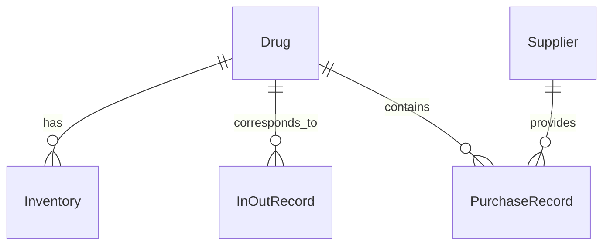

# 药品进销存管理系统详细设计与具体代码实现

作者：禅与计算机程序设计艺术

## 1. 背景介绍
### 1.1 药品进销存管理的重要性
在现代医疗卫生事业中,药品是不可或缺的重要组成部分。药品进销存管理直接关系到医院的运营效率、患者用药安全以及经济效益。一个高效、准确、安全的药品进销存管理系统能够帮助医院实现药品的精细化管理,提高工作效率,确保患者用药安全。

### 1.2 传统药品进销存管理面临的问题
传统的药品进销存管理大多采用人工记录、Excel表格等方式,存在诸多问题:

1. 效率低下:人工记录和统计耗时耗力,难以应对医院日益增长的药品管理需求。
2. 准确性差:人工操作容易出错,数据准确性难以保证。
3. 数据孤岛:不同部门各自为政,数据难以共享,影响协同工作。
4. 追溯困难:缺乏系统化的数据管理,药品的进销存全过程难以追溯。

### 1.3 信息化药品进销存管理系统的优势
信息化的药品进销存管理系统能够有效解决上述问题,其优势包括:

1. 提高效率:信息系统能够自动处理大量数据,大幅提升工作效率。
2. 减少错误:规范化、标准化的系统操作能够最大限度地减少人为错误。
3. 信息共享:系统打通各部门数据,实现信息共享,促进协同工作。
4. 全程可控:系统记录药品从采购到使用的全过程,数据可追溯、可管理。

## 2. 核心概念与关系
### 2.1 药品 Drug
药品是系统的核心实体,包含药品编码、名称、规格、单位、生产厂家等基本信息。药品与供应商、库存、出入库记录等都有直接关联。

### 2.2 供应商 Supplier
供应商是药品的来源,系统需要记录供应商的编号、名称、联系方式、地址等信息。供应商与采购记录相关联。

### 2.3 库存 Inventory
库存代表医院当前各种药品的数量,包括药品编号、库存数量、库存单位等。库存与出入库记录直接相关。

### 2.4 出入库记录 InOutRecord
出入库记录体现了药品的流动,包括出入库类型(入库/出库)、数量、操作人、操作时间等。一条出入库记录对应一种药品的一次出入库操作。

### 2.5 采购记录 PurchaseRecord 
采购记录对应一次药品采购,包含供应商、采购药品、采购数量、采购时间、采购人等信息。

### 2.6 核心概念ER图
下图展示了药品进销存管理系统的核心概念及其关系:



## 3. 核心算法原理与具体操作步骤
### 3.1 库存预警算法
#### 3.1.1 算法原理
库存预警算法旨在根据药品的历史用量、当前库存、采购周期等因素,计算合理的预警阈值。当库存低于预警值时,系统自动提醒管理员采购。预警值的计算公式为:

$$
预警值 = 日均用量 \times 采购周期系数 + 安全库存
$$

其中,日均用量根据历史出库记录计算,采购周期系数一般取1.5~2,安全库存根据药品重要程度设定。

#### 3.1.2 具体操作步骤
1. 计算日均用量:统计最近一个月的出库量,除以30得到日均用量。
2. 确定采购周期系数:根据药品的采购周期,一般取值1.5~2。
3. 设定安全库存:根据药品的重要程度,设定一定数量的安全库存。
4. 计算预警值:将日均用量、采购周期系数、安全库存代入公式,得到预警值。
5. 定时检查库存:系统定时(如每日)检查各药品的库存,当低于预警值时自动提醒采购。

### 3.2 药品出入库算法
#### 3.2.1 算法原理
药品出入库算法是对药品库存的增减操作。入库时,库存数量增加;出库时,库存数量减少。同时生成相应的出入库记录。具体公式为:

$$
入库后库存 = 当前库存 + 入库数量 \\
出库后库存 = 当前库存 - 出库数量
$$

#### 3.2.2 具体操作步骤
1. 药品入库:
   - 选择药品,输入入库数量
   - 根据公式计算入库后库存
   - 更新药品库存数量
   - 生成入库记录
2. 药品出库:
   - 选择药品,输入出库数量
   - 判断出库数量是否超出当前库存,如是则提示错误
   - 根据公式计算出库后库存
   - 更新药品库存数量 
   - 生成出库记录

## 4. 数学模型和公式详细讲解举例说明
### 4.1 经济订货批量模型(EOQ)
#### 4.1.1 模型介绍
经济订货批量(Economic Order Quantity,EOQ)模型是一种确定最佳订货量以最小化总库存成本的模型。该模型考虑了订货成本和持有成本,旨在找到两者的平衡点。EOQ模型的公式为:

$$
EOQ = \sqrt{\frac{2DS}{H}}
$$

其中,$D$为年需求量,$S$为单次订货成本,$H$为单位持有成本。

#### 4.1.2 举例说明
假设某药品的年需求量为1000盒,每次订货的固定成本为100元,每盒药品的年持有成本为2元。则该药品的经济订货批量为:

$$
EOQ = \sqrt{\frac{2\times 1000 \times 100}{2}} = 100
$$

这表明,每次订购100盒药品是最经济的,此时总库存成本最小。

### 4.2 安全库存模型
#### 4.2.1 模型介绍
安全库存(Safety Stock)是为应对需求变化而准备的额外库存。安全库存的计算需要考虑需求的标准差和服务水平。其公式为:

$$
SS = Z \times \sigma \times \sqrt{LT}
$$

其中,$Z$为服务水平对应的标准正态分布的$Z$值,$\sigma$为需求标准差,$LT$为前置时间(单位为需求周期)。

#### 4.2.2 举例说明
假设某药品的日需求量服从均值为100,标准差为20的正态分布,前置时间为5天,目标服务水平为95%(对应的$Z$值为1.65)。则该药品的安全库存为:

$$
SS = 1.65 \times 20 \times \sqrt{5} = 73.76
$$

这表明,除了循环库存外,还需要额外准备74盒(向上取整)药品作为安全库存,以应对需求的波动。

## 5. 项目实践:代码实例与详细解释说明
下面以Java语言为例,展示药品进销存管理系统的部分核心代码。

### 5.1 药品出入库服务
```java
@Service
public class DrugInventoryServiceImpl implements DrugInventoryService {

    @Autowired
    private DrugInventoryDao inventoryDao;
    
    @Autowired
    private InOutRecordDao recordDao;
    
    @Override
    @Transactional
    public void stockIn(Drug drug, int quantity) {
        // 查询当前库存
        DrugInventory inventory = inventoryDao.findByDrug(drug);
        if (inventory == null) {
            inventory = new DrugInventory();
            inventory.setDrug(drug);
            inventory.setQuantity(0);
        }
        // 计算入库后库存
        int newQuantity = inventory.getQuantity() + quantity;
        inventory.setQuantity(newQuantity);
        // 更新库存
        inventoryDao.save(inventory);
        // 生成入库记录
        InOutRecord record = new InOutRecord();
        record.setDrug(drug);
        record.setType(InOutType.IN);
        record.setQuantity(quantity);
        record.setOperator(SecurityUtils.getCurrentUserName());
        record.setOperateTime(new Date());
        recordDao.save(record);
    }
    
    @Override
    @Transactional
    public void stockOut(Drug drug, int quantity) {
        // 查询当前库存
        DrugInventory inventory = inventoryDao.findByDrug(drug);
        if (inventory == null || inventory.getQuantity() < quantity) {
            throw new IllegalArgumentException("库存不足");
        }
        // 计算出库后库存
        int newQuantity = inventory.getQuantity() - quantity;
        inventory.setQuantity(newQuantity);
        // 更新库存
        inventoryDao.save(inventory);
        // 生成出库记录
        InOutRecord record = new InOutRecord();
        record.setDrug(drug);
        record.setType(InOutType.OUT);
        record.setQuantity(quantity);
        record.setOperator(SecurityUtils.getCurrentUserName());
        record.setOperateTime(new Date());
        recordDao.save(record);
    }
}
```

上述代码实现了药品出入库的核心逻辑,主要包括:

1. 药品入库:
   - 查询药品当前库存
   - 计算入库后新库存
   - 更新药品库存
   - 生成入库记录
2. 药品出库:
   - 查询药品当前库存,校验库存是否充足
   - 计算出库后新库存
   - 更新药品库存
   - 生成出库记录

其中,使用了Spring的`@Transactional`注解来保证出入库操作的原子性,避免出现数据不一致的情况。

### 5.2 库存预警服务
```java
@Service
public class InventoryWarningServiceImpl implements InventoryWarningService {

    @Autowired
    private DrugInventoryDao inventoryDao;
    
    @Autowired
    private InOutRecordDao recordDao;
    
    @Override
    public List<InventoryWarningVO> checkInventoryWarning() {
        List<InventoryWarningVO> warningList = new ArrayList<>();
        // 查询所有药品的库存
        List<DrugInventory> inventoryList = inventoryDao.findAll();
        for (DrugInventory inventory : inventoryList) {
            Drug drug = inventory.getDrug();
            // 计算日均用量
            int dailyUsage = calculateDailyUsage(drug);
            // 获取采购周期系数和安全库存
            int cycleCoefficient = drug.getPurchaseCycleCoefficient();
            int safetyStock = drug.getSafetyStock();
            // 计算预警值
            int warningValue = dailyUsage * cycleCoefficient + safetyStock;
            // 判断是否低于预警值
            if (inventory.getQuantity() < warningValue) {
                InventoryWarningVO vo = new InventoryWarningVO();
                vo.setDrug(drug);
                vo.setInventory(inventory);
                vo.setWarningValue(warningValue);
                warningList.add(vo);
            }
        }
        return warningList;
    }
    
    /**
     * 计算日均用量
     */
    private int calculateDailyUsage(Drug drug) {
        Calendar calendar = Calendar.getInstance();
        calendar.add(Calendar.MONTH, -1); // 最近一个月
        Date startDate = calendar.getTime();
        Date endDate = new Date();
        List<InOutRecord> records = recordDao.findByDrugAndTypeAndOperateTimeBetween(drug, InOutType.OUT, startDate, endDate);
        int totalUsage = records.stream().mapToInt(InOutRecord::getQuantity).sum();
        return totalUsage / 30;
    }
}
```

上述代码实现了库存预警的核心逻辑,主要包括:

1. 查询所有药品的当前库存
2. 对每种药品:
   - 计算最近一个月的日均用量
   - 获取药品的采购周期系数和安全库存
   - 根据公式计算预警值
   - 判断当前库存是否低于预警值,如是则加入预警清单
3. 返回库存预警清单

其中,`calculateDailyUsage`方法用于计算药品最近一个月的日均用量,通过查询最近一个月的出库记录,对出库量求和后除以30得到。

## 6. 实际应用场景
药品进销存管理系统在医院药房管理中有广泛的应用,主要场景包括:

### 6.1 药品采购
- 根据库存预警信息,及时下达药品采购订单
- 采购入库时,扫码录入药品信息和数量,自动入库并更新库存

### 6.2 药品调拨
- 不同药房间调拨药品时,通过系统操作实现药品的出库和入库
- 药品调拨信息自动同步,库存实时更新