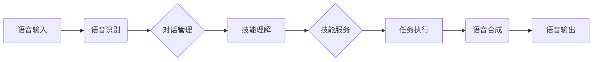

# 智能家居与AIAgent：构建智能化的家居生活体验

作者：禅与计算机程序设计艺术

## 1.背景介绍

### 1.1 智能家居的概念与发展 
#### 1.1.1 智能家居的定义
智能家居是指利用物联网、云计算、人工智能等技术，将家中的各种设备（如照明系统、安防系统、家电等）进行连接，提供自动化、智能化的控制和管理，为用户带来更加舒适、安全、便捷、节能的居住体验的家居环境。

#### 1.1.2 智能家居的发展历程
智能家居的概念最早出现在20世纪90年代，当时主要是通过有线网络连接家电设备。随着无线通信技术的发展，如WiFi、ZigBee等，智能家居开始走入普通家庭。近年来，人工智能、物联网、大数据等技术的快速发展，进一步推动了智能家居的普及和应用。

#### 1.1.3 智能家居的市场现状
据预测，全球智能家居市场规模将从2020年的741亿美元增长到2025年的1558亿美元，年复合增长率为16.0%。随着技术的不断成熟和消费者接受度的提高，智能家居已成为物联网时代最具发展潜力的领域之一。

### 1.2 AI助手(AIAgent)技术与应用

#### 1.2.1 AI助手的定义
AI助手是一种基于人工智能技术，可以与人进行自然语言交互，完成特定任务或提供个性化服务的应用程序。目前广泛应用的AI助手包括苹果的Siri、谷歌助手、亚马逊的Alexa、微软的Cortana等。

#### 1.2.2 AI助手的工作原理
AI助手的核心是自然语言处理(NLP)和知识图谱技术。它们通过语音识别或文本输入获取用户指令，然后利用自然语言理解技术对指令进行语义分析，通过知识图谱进行推理和决策，最后将结果反馈给用户。同时，AI助手还具有从大量数据中持续学习，不断改进模型性能，提升用户体验的能力。

#### 1.2.3 AI助手在智能家居中的应用
AI助手在智能家居生态中扮演着重要的角色，主要体现在以下几个方面：

1. 语音交互：用户可以直接用语音控制家中的智能设备，如"关闭卧室灯"、"将空调温度调到26度"等。

2. 设备联动：AI助手可以根据用户的习惯和场景，自动协调不同设备的工作，营造舒适的环境。比如用户回家时，AI助手自动打开门廊灯、打开空调、播放欢迎音乐等。 

3. 信息查询：用户可以通过AI助手查询天气、新闻、日程、路况等各种信息。

4. 家庭安防：AI助手可以连接摄像头、门铃等安防设备，在发现可疑情况时及时报警。

5. 个性化服务：AI助手可以根据用户的偏好提供个性化的服务，比如根据口味推荐食谱，根据日程提醒用户服药等。

可以预见，随着人工智能技术的不断发展，AI助手将在智能家居中发挥越来越重要的作用，成为人机交互的重要载体和入口。

## 2.核心概念与联系

### 2.1 智能家居的关键技术

智能家居的实现需要多种技术的协同支持，主要包括以下几个方面：

#### 2.1.1 物联网(IoT)
物联网是实现家居设备互联互通的基础。通过各种通信协议，如WiFi、蓝牙、ZigBee等，将家中的传感器、控制器、家电等设备连接起来，实现信息的采集、传输和处理。 

#### 2.1.2 人工智能(AI)
人工智能技术是实现家居自动化和智能化的关键。机器学习算法可以分析用户行为,学习用户偏好,预测用户需求。自然语言处理让设备能听懂用户的语音指令。计算机视觉使摄像头能进行人脸识别、行为分析等。

#### 2.1.3 云计算 
云计算提供了海量数据存储和高性能计算的支撑。用户的设备状态、环境参数、行为数据等都可以上传到云端进行存储和分析。云端强大的计算能力能针对具体场景给出实时反馈。

#### 2.1.4 大数据分析
大数据分析技术能从海量数据中挖掘用户行为模式,优化资源配置。比如通过分析历史用电数据,预测未来的用电量,制定合理的用电计划。通过分析用户的活动规律,自动调节采暖制冷。

### 2.2  AI助手的关键技术

作为智能家居的交互中心,AI助手需要掌握听、说、思考、执行的全部能力。其核心技术包括：

#### 2.2.1 语音识别
语音识别让AI助手能将用户的语音指令转换成计算机可读的文本格式。涉及声学模型、语言模型、声学特征提取等技术。目前主流的语音识别系统准确率已经超过95%。

#### 2.2.2 自然语言理解(NLU)
自然语言理解让AI助手能理解用户指令的真正意图。它需要完成词法分析、句法分析、语义分析、消歧、指代消解等一系列任务,最终形成机器可执行的逻辑表达式或行动序列。深度学习和知识图谱是NLU的主要技术手段。

#### 2.2.3 对话管理(DM)
对话系统负责管理人机对话的进程。根据当前对话状态、上下文信息，合成下一步系统动作,比如继续提问、给出回复、执行任务等。马尔可夫决策过程(MDP)、深度强化学习是常用的对话管理算法。

#### 2.2.4 语音合成(TTS)  
语音合成是将系统生成的文本回复转化成自然流畅的语音反馈。它涉及文本前处理、韵律预测、声学参数预测、语音合成等步骤。目前主流的语音合成系统多基于深度神经网络,在自然度和流畅度上已接近真人发声。

### 2.3 智能家居与AI助手的关系

智能家居与AI助手是密不可分的。智能家居为AI助手提供了丰富的应用场景,让其能力得以充分发挥。反过来,AI助手以更自然的人机交互方式来连接人与智能家居,让普通用户无门槛地享受到智能家居带来的便利和舒适。可以说,没有AI助手,智能家居的普及之路将举步维艰；没有智能家居,AI助手的应用拓展也将受到局限。

从技术角度看,AI助手和智能家居共享了物联网、大数据、云计算的基础架构。AI助手可以调用智能家居设备提供的API来完成设备发现、注册、连接、监控、控制等任务。而设备产生的环境数据、状态数据、音视频数据又可以回流到AI助手云端进行存储和分析,用于优化AI助手的决策模型。

不仅如此,AI助手与智能家居的结合还催生了一些新的应用模式,如：

1. 场景联动：根据用户的语音指令,触发多个设备的协同工作,比如"我要看电影"可以把灯光调暗、窗帘关闭、音响打开。

2. 家庭机器人：一些智能音箱产品集成了机器视觉技术,具备人脸识别、手势识别、环境感知等能力,可以作为类人形的"管家"来照看老人、小孩。

3. 智能客服：用户可以直接通过语音问询一些家电使用常见问题,比如"洗衣机的柔顺剂放在哪里"、"空调遥控器换电池的方法"等。 

总之,智能家居与AI助手携手共进,将极大丰富人类未来的居住生活方式。下面进一步介绍AI助手技术的实现原理。

### 3. AI助手的技术架构

从功能上看,一个完整的AI助手需要语音交互、对话管理、技能服务等多个模块的协同,其架构如下图所示：

#### 3.1 语音交互

语音交互是AI助手的前端,负责将用户的语音指令转换成文本,以及将系统的文本回复合成为语音反馈。主要包括语音识别、语音合成、声纹识别等。

##### 3.1.1 语音识别
语音识别的目标是将连续的音频信号转换为一段文本。其处理流程如下：
1. 端点检测：从音频流中检测有意义的语音片段。通常利用短时能量、短时过零率等特征,判断语音和静音的边界。
2. 特征提取：提取语音信号的频谱特征,如MFCC(梅尔频率倒谱系数)、LPCC(线性预测倒谱系数)等。
3. 声学模型：对提取的特征进行建模,得到各发音状态的概率。常用的模型有高斯混合模型(GMM)、深度神经网络(DNN)。 
4. 语言模型：刻画词与词之间的转移概率。通常使用N-gram模型或RNN。
5. 解码搜索：在声学模型和语言模型的约束下,搜索产生文本概率最大的词序列。常用的方法有Viterbi算法、Beam Search等。

经过几十年的发展,语音识别技术已经相当成熟。但在嘈杂环境、远场拾音、口音、类人的语病处理等方面还有待进一步提高。

##### 3.1.2 语音合成
语音合成负责将文本转换成接近人声的语音。其关键步骤包括：
1. 文本预处理：将文本规范化,进行分词、词性标注、断句等。
2. 语言分析：从文本中提炼韵律信息,如停顿、重音、语调等。
3. 声学参数预测：根据语言分析结果,预测音素持续时长、基频等声学参数。
4. 语音合成：基于声学参数驱动声码器生成语音波形。主要方法有拼接合成、参数合成、端到端合成等。

目前主流的语音合成系统多基于深度学习,尤其是基于Transformer的端到端语音合成,在自然度和流畅性上已经接近真人发声。但在感情表达、个性化等方面仍有不足。

#### 3.2 对话管理

对话管理是AI助手的大脑,负责理解用户意图,规划对话流程,调用和协调各个技能服务完成任务。对话管理的核心是一个策略学习的过程,根据当前对话状态选择最优的下一步系统动作。形式上可以用一个函数表示：

$$
\pi: (StateTracker) \longrightarrow (DialogueAct)
$$

其中StateTracker负责跟踪对话历史,记录用Dialogue Act完成意图理解后的语义表示、提及的实体槽位、对话流等关键信息。基于StateTracker的输出,策略函数$\pi$会选择一个合适的Dialogue Act作为下一步系统动作,如继续提问、澄清、确认、查询、执行任务等。

对话管理的策略学习方法主要有两类：

1. 基于规则的有限状态机(FSM)：通过人工定义每个对话状态下可选的系统动作及迁移条件,但扩展性差。
2. 基于强化学习：把对话过程看做一个马尔可夫决策过程(MDP),通过与用户交互获得奖赏,训练一个最大化累积奖赏的策略。主流的算法有DQN、A3C等。

此外,一些学者尝试将对话管理建模为一个序列到序列的生成过程,用Seq2Seq、Transformer等模型端到端生成系统回复。

除了决策以外,对话管理还要负责协调各个技能服务。这需要提供一个统一的接口规范,定义意图、实体、对话流等抽象。常用的技能封装方式有类似编程语言的Agent系统,或者基于微服务架构