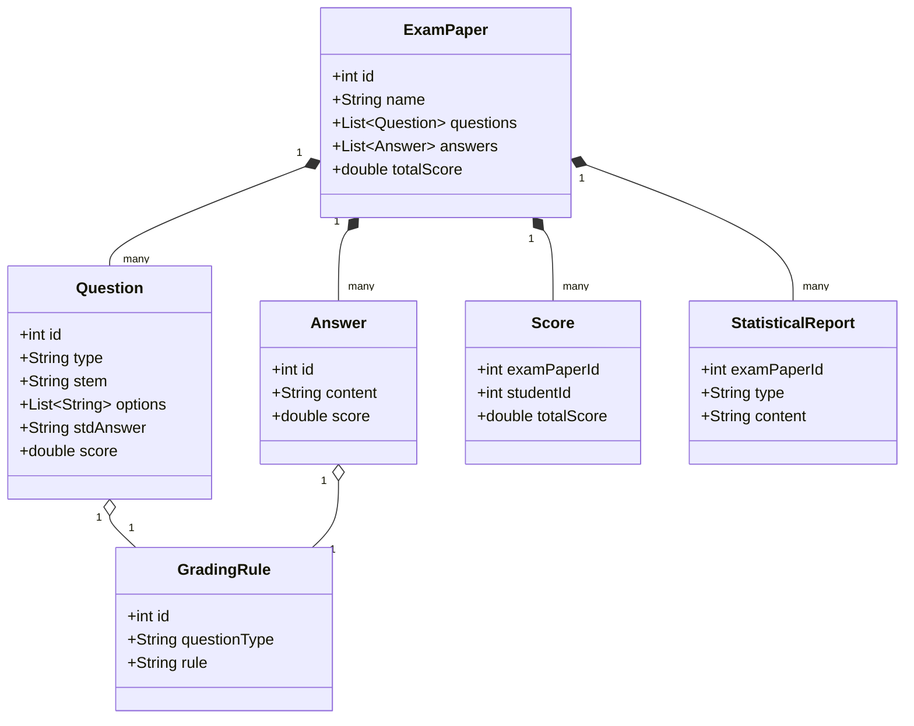

# 考试分析评价系统详细设计与具体代码实现

作者：禅与计算机程序设计艺术

## 1. 背景介绍

### 1.1 考试分析评价系统的重要性

在现代教育体系中,考试是评估学生学习效果和教学质量的重要手段。然而,传统的考试分析和评价方法往往需要消耗大量的人力和时间,效率较低。因此,开发一个自动化的考试分析评价系统对于提高教育质量和效率具有重要意义。

### 1.2 考试分析评价系统的主要功能

一个完善的考试分析评价系统应该具备以下主要功能:

1. 试卷扫描与识别:将纸质试卷转化为电子版,并准确识别试卷上的信息,如考生信息、题目、答案等。
2. 答案判断与评分:根据预设的标准答案,判断考生答案的正确性,并给出相应的分数。
3. 成绩统计与分析:对考生成绩进行统计和分析,生成各种统计报告,如成绩分布、难度分布、区分度等。
4. 质量评估与反馈:根据考试结果,评估试卷质量和教学效果,并给出相应的改进建议。

### 1.3 考试分析评价系统的技术挑战

开发一个高效、准确、易用的考试分析评价系统面临着诸多技术挑战,主要包括:

1. 图像处理与文字识别:如何准确识别试卷上的文字、图形等信息,尤其是手写答案的识别难度较大。
2. 自然语言处理:如何理解和判断考生的文字答案,特别是主观题的评判需要一定的语义理解能力。
3. 数据存储与管理:如何高效地存储和管理大量的考试数据,并支持快速查询和分析。
4. 系统性能与可扩展性:如何设计一个高性能、可扩展的系统架构,以支持大规模的考试分析和评价。

## 2. 核心概念与关系

### 2.1 试卷(Exam Paper)

试卷是考试分析评价系统的核心对象,包含了考试的所有信息,如考生信息、题目、答案等。每张试卷都有一个唯一的识别号(ID),用于标识和管理。

### 2.2 题目(Question)

题目是构成试卷的基本单元,包括题干、选项(如果是选择题)和标准答案。每个题目都有一个在试卷中的序号,以及对应的分值。题目可以分为多种类型,如选择题、填空题、解答题等。

### 2.3 答案(Answer)  

答案是考生对题目作出的响应,可以是选择的选项、填写的文字,或者是计算的结果。答案的形式与题目类型相对应。

### 2.4 评分规则(Grading Rule)

评分规则定义了如何判断答案的正确性并给出相应的分数。对于客观题(如选择题),评分规则比较简单,只需比对考生答案与标准答案是否一致。而对于主观题,评分规则可能会复杂一些,需要考虑答案的完整性、正确性、逻辑性等多个维度。

### 2.5 成绩(Score)

成绩是考生在一门考试中的得分情况,由各个题目的得分汇总而成。成绩通常会进一步转化为等第(如A、B、C等)或者排名,以便进行横向比较。

### 2.6 统计报告(Statistical Report)

统计报告是对考试结果的各种统计分析,如成绩分布、难度分布、区分度等。这些报告可以帮助教师评估试卷质量和教学效果,并为改进教学提供依据。

以上是考试分析评价系统的一些核心概念。这些概念之间的关系可以用下面的UML类图来表示:



从类图可以看出,ExamPaper(试卷)包含了多个Question(题目)和Answer(答案),每个Question和Answer都对应一个GradingRule(评分规则)。ExamPaper与Score(成绩)和StatisticalReport(统计报告)也是一对多的关系。理解这些概念之间的关系对于设计考试分析评价系统的数据模型和架构非常重要。

## 3. 核心算法原理与具体步骤

本节将介绍考试分析评价系统中的几个核心算法,包括图像预处理、文字识别、自然语言答案判分等。

### 3.1 图像预处理

试卷扫描后得到的原始图像往往存在一些问题,如倾斜、模糊、噪点等,需要进行预处理以提高后续识别的准确率。常见的预处理步骤包括:

1. 灰度化:将彩色图像转化为灰度图像,减少计算量。
2. 二值化:将灰度图像转化为黑白二值图像,进一步减少噪点干扰。常用的二值化算法有固定阈值法、自适应阈值法(如Otsu算法)等。
3. 倾斜校正:通过霍夫变换等算法检测图像中的直线,计算其倾斜角度,然后进行旋转校正。
4. 噪点去除:通过中值滤波、形态学处理等方法去除图像中的孤立噪点和细小干扰。

以下是一个简单的Python实现示例:

```python
import cv2
import numpy as np

# 读取原始图像
img = cv2.imread('exam_paper.jpg')

# 灰度化
gray = cv2.cvtColor(img, cv2.COLOR_BGR2GRAY)

# 二值化
_, binary = cv2.threshold(gray, 0, 255, cv2.THRESH_BINARY_INV + cv2.THRESH_OTSU)

# 倾斜校正
edges = cv2.Canny(binary, 50, 150, apertureSize=3)
lines = cv2.HoughLines(edges, 1, np.pi/180, 200)
for rho,theta in lines[0]:
    a = np.cos(theta)
    b = np.sin(theta)
    x0 = a*rho
    y0 = b*rho
    x1 = int(x0 + 1000*(-b))
    y1 = int(y0 + 1000*(a))
    x2 = int(x0 - 1000*(-b))
    y2 = int(y0 - 1000*(a))
    cv2.line(img,(x1,y1),(x2,y2),(0,0,255),2)
    angle = np.arctan2(y2-y1, x2-x1) * 180 / np.pi  
    print(angle)
    if abs(angle) > 10:
        img = cv2.rotate(img, cv2.ROTATE_90_CLOCKWISE if angle > 0 else cv2.ROTATE_90_COUNTERCLOCKWISE)

# 去除噪点
kernel = np.ones((3,3),np.uint8)
binary = cv2.morphologyEx(binary, cv2.MORPH_OPEN, kernel, iterations = 2)

# 显示预处理结果
cv2.imshow('Result', binary)
cv2.waitKey(0)
cv2.destroyAllWindows()
```

经过预处理后,试卷图像的质量得到了显著提升,为后续的文字识别奠定了基础。

### 3.2 文字识别

试卷图像预处理完成后,需要从图像中识别出文字信息,如考生姓名、准考证号、题目文字、答案文字等。常用的文字识别方法有以下几种:

1. 基于模板匹配的识别:预先建立各种字符的模板库,然后在图像中进行匹配,找出最相似的字符。这种方法对字体变化比较敏感,泛化能力较差。

2. 基于特征提取的识别:提取图像中字符的特征(如笔画方向、拓扑结构等),然后用分类器(如SVM、神经网络)进行分类识别。这种方法抗噪声能力较强,但是特征工程比较复杂。

3. 基于深度学习的识别:利用卷积神经网络(CNN)等深度学习模型,直接从图像中学习字符的特征表示,然后进行分类。这种方法能够自动学习字符特征,识别准确率高,但是需要大量的标注数据进行训练。

下面是一个基于Tesseract的Python文字识别示例:

```python
import cv2
import pytesseract

# 读取预处理后的图像
img = cv2.imread('exam_paper_processed.jpg')

# 使用Tesseract进行文字识别
text = pytesseract.image_to_string(img, lang='chi_sim+eng', config='--psm 6')

print(text)
```

Tesseract是一个开源的OCR引擎,支持多种语言的识别。通过指定`lang`参数为`chi_sim+eng`,可以同时识别中英文。`config`参数用于设置Tesseract的页面分割模式(PSM),这里设为6表示假设图像是一个统一的文本块。

### 3.3 自然语言答案判分

对于主观题的答案,系统需要能够理解其语义,并根据预设的评分规则给出分数。这里可以使用自然语言处理(NLP)技术,将答案与标准答案进行语义相似度匹配。常用的方法有:

1. 基于关键词匹配:提取标准答案中的关键词,然后在考生答案中进行匹配,根据匹配度给分。这种方法简单直观,但是无法考虑语义信息。

2. 基于语义相似度计算:利用词向量(如Word2Vec、GloVe等)将答案映射到语义空间,然后计算其与标准答案的相似度(如余弦相似度)。这种方法能够捕捉语义信息,但是对于不同表述方式的答案,效果可能不太理想。

3. 基于知识图谱的判分:将答案关键信息提取出来,构建成知识图谱,然后与标准答案的知识图谱进行比较,计算其覆盖度和正确性。这种方法能够考虑答案的结构化信息,判分更加全面和准确,但是构建知识图谱需要大量的领域知识和人工标注。

下面是一个基于语义相似度的Python判分示例:

```python
from gensim.models import KeyedVectors

# 加载预训练的词向量模型
model = KeyedVectors.load_word2vec_format('sgns.zhihu.bigram', binary=False)

# 标准答案
std_answer = "机器学习是一门研究如何使计算机具有学习能力的学科,它利用统计学、优化理论、信息论等多种方法,使得计算机能够从数据中自动分析获得规律,并利用规律对未知数据进行预测。"

# 考生答案
stu_answer = "机器学习是人工智能的一个重要分支,它主要研究如何让计算机nung从数据中学习,自动发现数据中的规律,并应用这些规律对新数据进行预测。常用的方法包括决策树、神经网络、支持向量机等。"

# 将答案转化为词向量
std_vec = sum([model[word] for word in std_answer if word in model], [])
stu_vec = sum([model[word] for word in stu_answer if word in model], [])

# 计算余弦相似度
sim = np.dot(std_vec,stu_vec) / (np.linalg.norm(std_vec) * np.linalg.norm(stu_vec))

print(sim)
```

这里使用了基于中文知乎问答语料预训练的词向量模型,将答案中的每个词映射为一个向量,然后将所有词向量相加得到答案向量。最后通过计算两个向量的余弦值来衡量其相似度。相似度越高,说明考生答案与标准答案越接近,得分也应该越高。当然,这只是一个简单的示例,实际的判分逻辑会更加复杂,需要考虑更多的因素,如答案的完整性、逻辑性等。

## 4