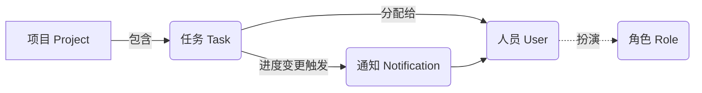

# 云计算环境下的协同办公系统的实现-任务管理子系统的设计与实现

作者：禅与计算机程序设计艺术

## 1. 背景介绍
### 1.1 云计算与协同办公系统
#### 1.1.1 云计算的概念与特点
云计算(Cloud Computing)是一种基于互联网的计算方式，通过这种方式，共享的软硬件资源和信息可以按需求提供给计算机各种终端和其他设备。云计算描述了一种基于互联网的新的IT服务增加、使用和交付模式，通常涉及通过互联网来提供动态易扩展且经常是虚拟化的资源。

云计算的主要特点包括：
1. 虚拟化：云计算通过虚拟化技术将物理资源抽象为逻辑资源池，实现资源的灵活调度和动态分配。
2. 按需服务：用户可以根据需要，随时获取所需的计算、存储等资源服务。
3. 可扩展性：云计算支持弹性扩展，可以根据负载情况自动调整资源配置。
4. 高可靠性：云计算采用多副本数据存储、计算节点互备等方式来保证服务的高可靠性。

#### 1.1.2 协同办公系统的需求与挑战
协同办公系统是利用计算机网络技术，实现组织内部成员之间信息共享与工作协同的一种新型办公模式。随着企业组织规模的扩大和业务复杂度的提高，传统的办公方式已经无法满足快速变化的市场环境对企业协同工作的要求。

构建高效的协同办公系统面临诸多挑战：
1. 异构环境集成：办公系统需要集成多种异构的软硬件系统与数据源，如何有效集成是一大难题。
2. 安全性与权限管理：办公系统涉及机密数据，需要严格的身份认证与权限管控机制。 
3. 移动办公支持：移动互联网时代，移动办公已成为刚需，需要提供便捷的移动端访问。
4. 系统性能与扩展性：办公系统需要支撑大规模并发访问，对系统性能与扩展性要求很高。

### 1.2 任务管理子系统
#### 1.2.1 任务管理在协同办公中的重要性
任务管理是协同办公的核心业务之一。通过任务分解与协作，可以提高整个组织的执行力和工作效率。一个优秀的任务管理系统应该包含以下主要功能：
1. 任务分解：将目标分解为多个具体的任务，细化工作内容。
2. 任务分配：根据人员角色与能力，合理分配任务，明确责任人。
3. 任务协作：提供多人协作机制，支持任务讨论、文档共享等。
4. 任务跟踪：实时掌控任务进度，了解项目健康状态。
5. 统计报表：生成各类统计报表，辅助管理决策。

#### 1.2.2 云计算给任务管理带来的机遇
云计算技术的发展为构建新一代高效协同的任务管理系统提供了契机：
1. 基础设施云化：通过IaaS云服务构建系统基础设施，降低部署与运维成本。
2. 平台服务云化：利用PaaS云服务快速构建系统业务模块，聚焦核心业务逻辑实现。
3. 软件应用云化：采用SaaS模式交付任务管理系统，提供多租户支持，实现随需应变。
4. 海量数据处理：借助云计算的海量数据存储与处理能力，实现任务大数据分析。

## 2. 核心概念与联系
### 2.1 核心概念
#### 2.1.1 项目(Project)
项目是任务管理的最顶层逻辑单元，通常对应一个独立交付的工作成果。一个项目包含多个子任务，形成任务分解树。
项目的主要属性包括：
- 项目名称
- 负责人
- 开始时间
- 截止时间 
- 项目描述
- 项目状态

#### 2.1.2 任务(Task)  
任务是项目中的最小执行单元，通常由一个人在特定时间内完成。每个任务都隶属于一个项目。
任务的主要属性包括：
- 任务名称
- 所属项目
- 负责人
- 截止时间
- 优先级 
- 任务描述
- 任务状态

#### 2.1.3 人员(User)
人员是系统的使用主体，通过扮演不同的角色参与到项目任务中。
人员的主要属性包括：
- 姓名
- 所属部门
- 角色
- 联系方式

#### 2.1.4 角色(Role)
角色是对人员的分类，具有特定的功能操作权限。常见的角色包括：
- 管理员：拥有系统的全部权限
- 项目经理：可以创建项目，管理项目下的任务与成员
- 普通成员：加入项目，领取并完成任务

#### 2.1.5 通知(Notification)  
通知是系统内的一种消息，用于告知成员任务进度变更。通知机制可以大大提升协同效率。
通知的主要属性包括：
- 通知内容
- 发送者
- 接收者
- 发送时间
- 通知类型

### 2.2 概念联系
协同办公任务管理系统的核心概念之间的联系如下：



项目由多个任务组成，形成任务分解树;任务会分配给特定人员去完成;人员通过扮演不同角色参与项目;任务进度变更时会发送通知给相关人员。

## 3. 核心算法原理与具体步骤
任务调度是任务管理系统的核心算法之一，其目的是在诸多待分配的任务和可选资源中，寻求一种最优的匹配方案，在满足各种约束的前提下，实现如任务按时完成、负载均衡、公平分配等调度目标。

### 3.1 任务调度算法原理
#### 3.1.1 标准约束
任务调度问题可以使用『整数线性规划模型』来描述。
设决策变量$x_{ij} \in \{0,1\}$,表示是否将任务$i$分配给人员$j$。
目标函数可以是最小化总工时，最小化完成时间，或最大化人员均衡度等，例如:  

$$
 min \sum_i \sum_j c_{ij}x_{ij} 
$$
其中$c_{ij}$ 表示任务$i$分配给人员$j$的成本

约束条件通常包括：

1. 每个任务只能分配给一个人员:
$$
\sum_j x_{ij} = 1, \forall i
$$ 
2. 每个人员的工时不能超过可用时间:
$$
\sum_i t_i x_{ij} \leq T_j,\forall j  
$$
其中$t_i$表示任务$i$的工时，$T_j$表示人员$j$的可用工时

3. 任务的先后依赖关系:
$$
C_i + t_i \leq C_{i'}, \forall (i,i') \in E
$$
其中$C_i$表示任务$i$的完成时间，$E$为任务依赖集合。

通过求解该整数规划模型，可以得到一个最优的任务分配方案。

#### 3.1.2 启发式算法 
由于任务调度属于NP-Hard问题，当问题规模较大时，采用精确算法求解将非常耗时。这时可以考虑启发式算法，用较小的时间代价得到一个可接受的次优解。

常见的启发式任务调度算法包括：

1. 贪心算法：每次选择最紧急或最重要的任务，优先安排
2. 模拟退火算法：类比物理退火过程，引入温度参数控制解的接受概率，全局搜索解空间 
3. 遗传算法：模拟生物进化，通过选择、交叉、变异等遗传操作优化调度解
4. 蚁群算法：模拟蚂蚁觅食行为，通过信息素的正反馈机制找到优质解 

### 3.2 基于模拟退火算法的任务调度
下面以模拟退火算法为例，给出一个任务调度的具体实现步骤。

#### 3.2.1 算法流程
1. 初始化：随机生成一个初始调度方案，计算其目标函数值$f$
2. 循环搜索：重复下述步骤，直到满足终止条件
    a. 产生新解：在当前解的邻域内，随机选择一个新的调度方案，计算其目标函数值$f'$
    b. 接受判断：若$f' < f$则接受新解，否则以概率$exp(-(f'-f)/T)$接受新解
    c. 降温：T=aT(0<a<1)，降低温度  
3. 输出：当前最优调度方案

其中，初始温度$T$、降温系数$a$、终止温度$T_f$均为算法参数。

#### 3.2.2 关键步骤
模拟退火算法的关键在于新解的产生方式以及温度的控制。

1. 新解产生 
通过对当前解进行局部扰动产生新解，扰动的方式可以是：
- 随机交换两个任务的分配人员
- 将一个任务重新分配给另一个人员
- 将一个任务插入到另一个位置

2. 温度控制
初始温度$T$要足够高，使得绝大多数新解都能被接受，常取:
$$
T = -\frac{f_{max} - f_{min}}{\ln p}
$$
其中$f_{max},f_{min}$分别为可接受解中目标函数的最大值和最小值,$p$为初始接受概率。

而降温过程应该缓慢进行,每个温度下需进行充分次数的迭代：
$$
T_{k+1} = aT_k
$$
其中$a$常取0.8～0.99。

终止条件可以是温度低于某一阈值$T_f$,或者连续若干次迭代解都没有改进。

#### 3.2.3 算法实现
模拟退火算法可以用如下伪代码描述：
```
Input: 任务集合 Tasks，人员集合 Users
Output: 最优调度方案 best_solution

best_solution = random_solution(Tasks, Users)
current_solution = best_solution
T = initial_temperature()

while T > T_final:
    for i = 1 to iteration:
        new_solution = get_new_solution(current_solution)
        delta = cost(new_solution) - cost(current_solution) 
        if delta < 0 or random(0,1) < exp(-delta/T):
            current_solution = new_solution
        if cost(current_solution) < cost(best_solution):
            best_solution = current_solution
    T = a*T
    
return best_solution
```

其中cost()为计算目标函数值,$delta$为新旧解目标函数的差值。通过以一定概率接受劣解，算法可以跳出局部最优，进行全局搜索。

## 4. 数学模型与公式推导
本节我们将任务调度问题形式化为一个数学模型,并推导出其最优解的求解公式。

### 4.1 符号定义
给定一个任务集合$Tasks=\{t_1,t_2,...,t_n\}$,每个任务$t_i$有如下属性:
- $d_i$: 任务$t_i$的截止时间(deadline)
- $p_i$: 任务$t_i$的处理时间(processing time) 

同时给定一个人员集合$Users=\{u_1,u_2,...,u_m\}$,假设每个人员的工作效率相同。

定义决策变量$x_{ij} \in \{0,1\}$,表示任务$t_i$是否分配给人员$u_j$。

### 4.2 目标函数
调度的目标是使所有任务在截止时间内完成,同时尽量使任务在人员上均匀分布。因此我们定义目标函数如下：

$$
min \sum_{j=1}^m \sum_{i=1}^n (c_j - \frac{\sum_{i=1}^n x_{ij}p_{ij}}{m})^2
$$

其中$c_j = \max\limits_{1 \leq i \leq n}(x_{ij}(p_{ij}+d_i))$表示人员$u_j$的任务完成时间,$p