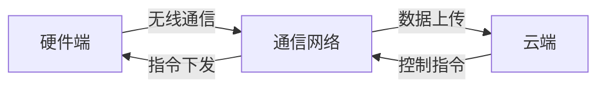

# 基于Java的智能家居设计：模块化智能插座的设计与实现

作者：禅与计算机程序设计艺术

## 1. 背景介绍
### 1.1 智能家居发展现状
#### 1.1.1 智能家居市场规模与趋势
#### 1.1.2 智能家居主要应用场景
#### 1.1.3 智能家居面临的挑战

### 1.2 智能插座在智能家居中的作用
#### 1.2.1 智能插座的功能特点 
#### 1.2.2 智能插座的应用优势
#### 1.2.3 智能插座的发展现状

### 1.3 本文的研究目的与意义
#### 1.3.1 研究目的
#### 1.3.2 研究意义
#### 1.3.3 文章结构安排

## 2. 核心概念与联系
### 2.1 智能插座的定义与特点
#### 2.1.1 智能插座的定义
智能插座是一种集成了微处理器、传感器、通信模块等组件的新型插座，可以实现电器设备的远程控制、能耗监测、定时开关等智能化功能。与传统插座相比，智能插座具有以下特点：

1. 远程控制：用户可以通过手机APP、语音助手等方式，远程控制接入智能插座的电器设备，如灯具、电视、空调等。

2. 能耗监测：智能插座内置电流、电压传感器，可以实时监测接入设备的功率、电流、电压等参数，并通过APP展示给用户，帮助用户了解家中用电情况。

3. 定时开关：用户可以为智能插座设置定时开关任务，如设置空调在下班前1小时开启，灯具在晚上11点自动关闭等。

4. 场景联动：多个智能插座可以组合成情景模式，一键实现多个设备的联动控制。如设置"观影模式"，自动关闭大灯、打开电视和音响。

5.语音控制：接入天猫精灵、小爱同学等智能音箱后，用户可以通过语音指令控制智能插座。

6. 安全防护：智能插座可以实时监控电流，在发生过载、短路等异常情况时自动切断电源，保障用电安全。

总之，智能插座利用物联网、人工智能等技术，将传统插座赋予了感知、互联、智能分析的能力，为用户带来了更加智能、便捷、安全的用电体验。

#### 2.1.2 智能插座的系统架构
一个典型的智能插座系统通常由硬件端、通信网络、云端三大部分组成，如下图所示：

1. 硬件端：包括智能插座主控芯片、继电器、电流电压传感器、无线通信模块等。主控芯片负责数据采集、控制逻辑执行等核心任务；继电器用于切断或接通电源；传感器感知实时功率、电压等参数；通信模块用于与云端进行数据交互。

2. 通信网络：智能插座多采用Wi-Fi、蓝牙、Zigbee等无线通信技术接入家庭网络，并通过网关设备接入广域网，实现与云端的通信。

3. 云端：包括设备管理服务、数据存储服务、大数据分析服务、API网关等。设备管理服务维护设备与用户的绑定关系，并下发控制指令；数据存储服务负责设备数据的持久化存储；大数据分析根据设备数据进行用电行为分析、异常检测等；API网关为APP提供设备控制、数据查询等接口。

在智能插座系统中，数据流的方向为：硬件端采集电参数数据并通过通信网络上传至云端，云端进行存储与分析后，将控制指令通过通信网络下发至硬件端执行。

### 2.2 相关技术介绍
#### 2.2.1 Java嵌入式开发技术
智能插座的核心控制逻辑通常使用嵌入式芯片来实现。Java作为一种跨平台的高级编程语言，近年来在嵌入式领域得到了广泛应用。

Java ME(Java Platform Micro Edition)是Sun公司推出的一套适用于资源受限设备的Java平台，包括Java虚拟机(KVM)和类库(CLDC、MIDP)等，可以支持在ARM、MIPS等嵌入式处理器上运行Java程序。一些流行的嵌入式实时操作系统如FreeRTOS、RT-Thread，也提供了Java虚拟机，使得Java程序获得了实时调度、外设控制等能力。

由于Java语言具备面向对象、平台无关、类库丰富等优势，采用Java进行智能插座嵌入式软件的开发，不仅可以提高程序的可维护性和可复用性，还能够大幅度缩短开发周期。同时，Java庞大的开发者生态，也给智能插座的功能扩展提供了更多可能。

#### 2.2.2 MQTT通信协议
MQTT(Message Queuing Telemetry Transport)是一种基于发布/订阅模式的轻量级物联网通信协议。智能插座通过内置的Wi-Fi模块接入互联网后，可采用MQTT协议与云端服务器进行通信。

MQTT协议数据结构简洁，占用带宽低，非常适合应用在资源受限及网络不稳定的物联网场景中。它有以下几个主要特点：

1. 发布/订阅模式：MQTT客户端作为发布者(Publisher)，将消息发布到特定主题(Topic)；同时，作为订阅者(Subscriber)，可以订阅感兴趣的主题。MQTT服务器作为消息中间件，负责将发布的消息路由到相应的订阅者。

2. 主题(Topic)：主题用于对消息进行分类，采用层次化的命名方式，类似文件路径，如：`home/livingroom/socket1/status`。MQTT客户端可以订阅通配符主题，如订阅 `home/livingroom/#`，可以接收到该目录下的所有消息。

3. 消息服务质量(QoS)：为满足不同应用场景的需求，MQTT定义了三种QoS等级。QoS 0为最多一次送达；QoS 1保证至少一次送达；QoS 2保证仅一次送达。QoS等级越高，通信的可靠性就越强，但会有额外的性能开销。

4. 遗嘱(Will)机制：MQTT客户端可以预设一条遗嘱消息，并在连接时发送给服务器。一旦客户端异常掉线，服务器就将这条遗嘱消息发送给其他订阅者，告知设备已经离线。这种机制可以提高系统的健壮性。

5. 基于TCP长连接：MQTT基于TCP进行可靠传输。客户端与服务器建立持久化的连接，避免了频繁的连接建立和释放，减小了网络开销与时延。

智能插座作为MQTT客户端，可订阅控制指令主题，如 `home/socket1/ctrl` ,同时发布状态数据到特定主题，如 `home/socket1/status`。云端服务订阅状态主题获取设备数据，并通过控制主题下发指令。MQTT使得智能插座与云端的通信变得简单高效。

#### 2.2.3 面向对象设计
面向对象设计(OOD)是一种常用的软件设计方法，强调以对象为中心来组织程序的结构。采用OOD进行智能插座软件设计，有如下好处：

1. 提高代码复用性：将智能插座的各项功能封装成相互独立的类，如设备控制类、数据采集类等。这些类可以在其他项目中方便地复用。

2. 增强可维护性：对象之间职责单一，交互通过定义良好的接口进行。修改或新增某个功能时，只需修改相关的类，不会影响其他部分，使得程序更容易维护。

3. 提高可扩展性：若要增加新的功能，只需新增相应的类并重新组织类之间的关系，而不用大规模修改现有代码。

4. 更贴近问题域：OOD中的对象概念与现实世界中的实体相对应，类之间的关系反映了实体之间的联系。这使得程序结构更加直观，符合人们的思维方式。

总之，OOD方法与Java语言相辅相成，充分发挥了Java的面向对象特性，能够帮助我们开发出结构清晰、易于复用、便于维护的智能插座软件系统。

### 2.3 智能插座的功能需求分析
#### 2.3.1 智能控制
用户可以通过手机APP、网页等方式，远程控制智能插座的通断状态。控制方式可以是手动开关，也可以是定时任务。同时，智能插座需要支持一键执行场景模式，如"离家模式"自动关闭所有插座。主要功能点如下：

1. 实时控制：控制命令下发后，插座需在2秒内完成状态切换，并返回执行结果。
2. 定时控制：可设置插座的定时开启/关闭任务，精度不低于1分钟。
3. 场景模式：提供常用场景的一键控制，如"回家模式"、"睡眠模式"等。 
4. 语音控制：接入主流智能音箱，支持语音命令控制。

#### 2.3.2 能耗监测
智能插座需实时监测通过的电流、电压、功率等参数，并将采集到的数据上传至云端。数据采集频率不低于1次/分钟，数据上传频率不低于1次/5分钟。云端提供数据展示与分析服务，包括但不限于：

1. 实时功率展示：用曲线图展示最近1小时的功率变化情况，刷新频率不低于1次/分钟。
2. 日用电量统计：统计每日的总用电量(度)，并以柱状图的形式展示最近30天的用电量分布。
3. 用电行为分析：根据用电曲线判断接入的设备类型(如灯具、风扇)，分析用电习惯，对高耗能行为给出优化建议。
4. 月度用电报告：自动生成月度用电情况分析报告，内容包括总用电量、费用、同比环比分析、耗能排名等，可通过邮件、微信等方式推送给用户。

#### 2.3.3 安全防护
智能插座作为用电安全的"前哨"，需要提供完善的安全防护措施。

1. 过载保护：实时监测电流，当电流持续超过额定值10%以上时，自动切断电源，并推送报警信息给用户。
2. 短路保护：当发生短路时，微秒级切断故障电流，防止电气火灾发生。
3. 过温保护：监测内部温度，当温度超过阈值时，自动切断电源。
4. 漏电保护：配备漏电保护器，切断漏电故障电路。
5. 智能防雷：内置浪涌吸收器，防止雷电浪涌损坏设备。
6. 安全预警：根据插座状态变化，结合环境传感器数据，智能识别危险状况(如电器发热、电线老化)，给出安全提示。

#### 2.3.4 智能联动
智能插座不应是"信息孤岛"，要能够与其他智能设备实现联动，提供更加个性化、人性化的服务。

1. 感应联动：通过人体红外、门磁等传感器感知用户状态，自动控制接入设备。如用户进入房间时自动打开灯具。
2. 天气联动：基于天气预报信息，自动做出相应控制。如夏季高温时自动开启电风扇。
3. 手机位置联动：当手机处于特定位置时(如离家500米外)，智能插座执行预设任务，如关闭所有用电设备。
4. IFTTT联动：支持IFTTT(If This Then That)服务，用户可以定制个性化的联动场景。如当室内PM2.5超标时，自动打开空气净化器。

#### 2.3.5 软件系统需求
智能插座需配套一套功能完善的APP，提供设备绑定、控制、数据展示、分享互动等服务。APP的主要功能需求如下：

1. 设备管理：用户可以通过扫描二维码、输入编号等方式添加智能插座。APP负