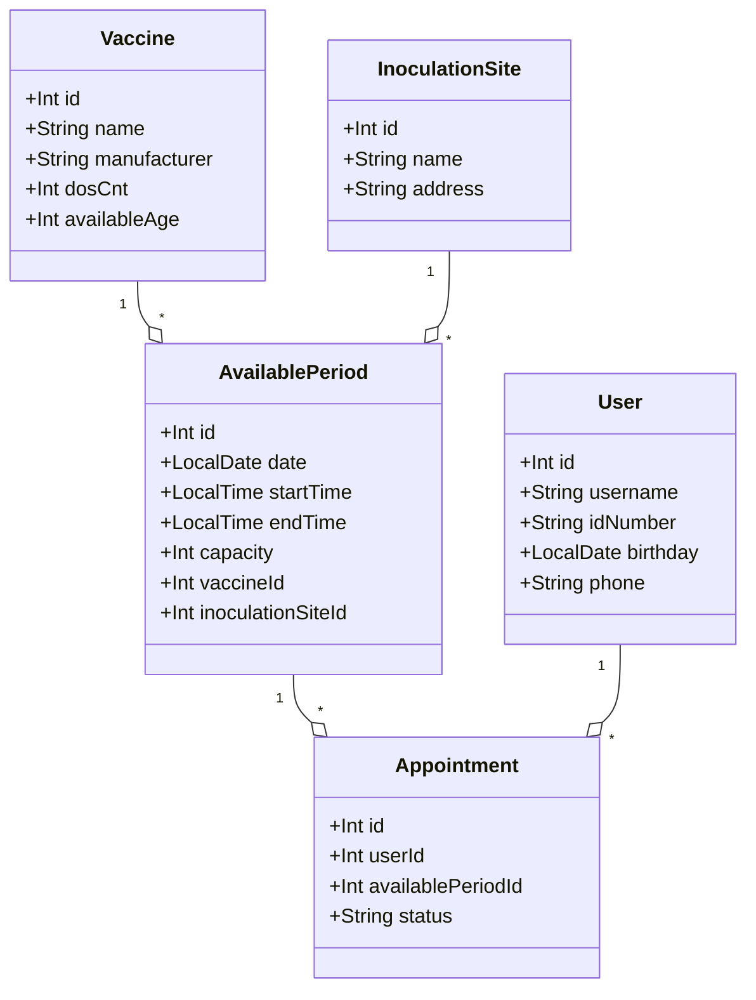

好的,那我们现在就开始撰写这篇技术博客文章的正文部分。

## 1.背景介绍
   
### 1.1 新冠疫情对疫苗预约的影响
2020年初新冠疫情在全球范围内爆发,给人类的生产生活带来了巨大影响。为了遏制病毒的传播,各国都在积极开发和推广新冠疫苗。然而,由于人口基数大,接种需求量巨大,如何高效、有序地组织疫苗预约和接种成为一大难题。传统的线下现场预约方式,存在信息不对称、排队时间长、易引发交叉感染等问题。因此,开发一套线上的疫苗预约系统显得尤为必要和迫切。

### 1.2 系统技术架构选型  
疫苗预约系统作为一个典型的web应用,在技术选型上我们采用目前主流的Java语言及SSM (Spring+SpringMVC+MyBatis)框架。其中:
- Spring框架负责核心逻辑如业务对象管理和依赖注入;
- SpringMVC用于控制层,处理http请求和响应;
- MyBatis作为数据访问层,与MySQL数据库交互,实现数据的持久化。
三者有机结合,既保证了系统的灵活性和可维护性,又能快速开发,适合该预约系统的需求特点。

### 1.3 功能模块划分
根据需求分析,我们将系统划分为以下几个功能模块:  
- 疫苗信息管理:由管理员操作,支持疫苗信息的录入、修改和删除。
- 可预约时段管理:管理不同疫苗的可预约日期和时段,并设置预约上限。
- 用户注册及个人信息维护:普通用户注册帐号,登录系统,修改个人信息。
- 在线预约:用户选择疫苗种类、接种地点、日期时段等信息提交预约。
- 预约管理:用户可查看和取消自己的预约,管理员可查看和调整所有预约。
- 数据统计:生成预约和接种数据报表,为疫情防控决策提供数据支撑。

## 2.核心概念与联系

### 2.1 领域模型设计
我们通过领域驱动设计(DDD),识别出系统中的五个核心领域概念:疫苗(Vaccine)、接种地点(InoculationSite)、可预约时段(AvailablePeriod)、预约记录(Appointment)、用户(User)。它们之间的关系可用UML类图表示如下:



疫苗和接种点是相对独立的两个实体,可预约时段将二者关联在一起,每个时段有其容量上限,并约束该时段只服务某一种疫苗。用户提交预约后,创建一条关联到相应可预约时段的预约记录。

### 2.2 分层架构 

在代码组织上,我们基于分层架构模式,将系统分为三个层次:
- 表示层:又称UI层或web层,负责界面展示和用户交互。我们使用JSP作为视图模板。
- 业务逻辑层:系统的核心,协调各层之间的业务逻辑。使用Spring的@Service注解标注服务类。
- 数据访问层:负责与数据库打交道,使用MyBatis的Mapper接口,并用@Repository标注DAO类。

分层架构的示意图如下:


### 2.3 数据库设计

根据领域模型,我们设计出对应的数据库表结构如下:

```sql
-- 疫苗表
CREATE TABLE `vaccine` (
  `id` int(11) NOT NULL AUTO_INCREMENT,
  `name` varchar(50) NOT NULL,
  `manufacturer` varchar(50) DEFAULT NULL,
  `dos_cnt` int(11) NOT NULL,
  `available_age` int(11) DEFAULT NULL, 
  PRIMARY KEY (`id`)
) 

-- 接种点表  
CREATE TABLE `inoculation_site` (
  `id` int(11) NOT NULL AUTO_INCREMENT,
  `name` varchar(50) NOT NULL,
  `address` varchar(100) DEFAULT NULL,
  PRIMARY KEY (`id`)
)

-- 可预约时段表
CREATE TABLE `available_period` (
  `id` int(11) NOT NULL AUTO_INCREMENT, 
  `vaccine_id` int(11) NOT NULL,
  `inoculation_site_id` int(11) NOT NULL,
  `date` date NOT NULL,
  `start_time` time NOT NULL,
  `end_time` time NOT NULL,
  `capacity` int(11) NOT NULL,
  PRIMARY KEY (`id`),
  KEY `vaccine_id` (`vaccine_id`),
  KEY `inoculation_site_id` (`inoculation_site_id`),
  CONSTRAINT `available_period_ibfk_1` FOREIGN KEY (`vaccine_id`) REFERENCES `vaccine` (`id`),
  CONSTRAINT `available_period_ibfk_2` FOREIGN KEY (`inoculation_site_id`) REFERENCES `inoculation_site` (`id`)
)

-- 用户表 
CREATE TABLE `user` (
  `id` int(11) NOT NULL AUTO_INCREMENT,
  `username` varchar(50) NOT NULL,
  `password` varchar(50) NOT NULL,
  `id_number` varchar(18) NOT NULL,
  `phone` varchar(11) DEFAULT NULL,
  `birthday` date DEFAULT NULL,
  PRIMARY KEY (`id`),
  UNIQUE KEY `username` (`username`),
  UNIQUE KEY `id_number` (`id_number`)
)

-- 预约记录表
CREATE TABLE `appointment` (
  `id` int(11) NOT NULL AUTO_INCREMENT,
  `user_id` int(11) NOT NULL,
  `available_period_id` int(11) NOT NULL, 
  `status` varchar(20) NOT NULL,
  PRIMARY KEY (`id`),
  KEY `user_id` (`user_id`), 
  KEY `available_period_id` (`available_period_id`),
  CONSTRAINT `appointment_ibfk_1` FOREIGN KEY (`user_id`) REFERENCES `user` (`id`),
  CONSTRAINT `appointment_ibfk_2` FOREIGN KEY (`available_period_id`) REFERENCES `available_period` (`id`)
)
```

其中,用户名、身份证号有唯一性约束,预约记录通过外键关联到用户和可预约时段。status字段标识预约的状态,如"已预约"、"已取消"、"已完成"等。

## 3.核心算法原理与流程

### 3.1 预约算法
预约的核心在于对可预约时段的余量进行管理,主要流程如下:
1. 用户选择疫苗种类、接种地点,系统查询出对应的可预约时段列表及其当前余量。
2. 用户选定预约时段,提交预约请求。
3. 系统再次检查该时段余量是否>0,并使用数据库悲观锁(如MySQL的select ... for update)保证余量检查和更新操作的原子性。
4. 若余量充足,则创建一条预约记录,并将可预约时段的余量减一。
5. 若余量不足,则提示用户重新选择其他时段。

可预约时段余量的计算可表示为:

$剩余可预约数量 = 容量上限 - COUNT(预约记录表中该时段相关记录)$

### 3.2 用户预约限制
为避免铺天盖地的重复预约,系统限定每个用户每种疫苗只能有一个有效的预约。在提交预约时,需要检查是否存在相同疫苗的预约记录。

```sql
SELECT COUNT(*)
FROM appointment a
JOIN available_period p ON a.available_period_id = p.id
WHERE a.user_id = #{userId} 
  AND p.vaccine_id = #{vaccineId}
  AND a.status IN ('已预约','已完成') 
```
  
如果count>0,说明用户已有该疫苗的预约记录,不允许再次预约。取消预约时,也要将相关预约记录的status更新为"已取消"。

### 3.3 秒杀优化
可预约时段的管理,本质上是一个"秒杀"类问题。当面向较大体量的并发用户时,需要采取一些优化手段,如:
- 缓存化:将疫苗和接种点等基础数据缓存在如Redis中,降低数据库压力。
- 异步化:对一些非核心流程采用异步处理,如短信通知、接种完成状态同步等。
- 限流:在网关或者预约接口侧设置限流,避免恶意请求或流量洪峰。
- 队列:对于明显超出系统实时处理能力的请求,可使用消息队列缓冲。

## 4.数学模型与公式详解

某些功能模块中涉及到数学建模和计算,如疫苗分发算法、隔离人数预测等。限于篇幅,本文仅对疫苗分发中使用到的配送模型做简要说明。

### 4.1 疫苗配送的车辆路径问题  

疫苗配送可抽象为经典的车辆路径问题(VRP):
给定若干个疫苗接收点(医院/疾控中心)和其疫苗需求量,配送中心安排若干辆货车,在满足载重量约束和行驶里程约束的前提下,求最短的配送路线。这里以最基本的capacitated VRP为例建模:

**定义决策变量**:

$x_{ij}^k$ 表示第k辆车从点i到点j的行驶情况。取值为0/1,1表示行驶,0表示不行驶。其中,点0代表配送中心。

$y_i^k$ 表示第k辆车配送给接收点i的疫苗数量,取值为正整数。

**目标函数**:
$$min\sum_{k=1}^K\sum_{i=0}^N\sum_{j\ne i}^N c_{ij}x_{ij}^k$$
其中,$c_{ij}$ 表示点i到点j的行驶成本(如距离、时间等)。目标是最小化总行驶成本。

**约束条件**: 

$\sum_{i=1}^N y_i^k \leq Q_k, \forall k \in [1,K]$ 
每辆车配送的总量不超过其载重量$Q_k$。

$\sum_{k=1}^K y_i^k = q_i, \forall i \in [1,N]$ 
每个接收点的需求量$q_i$必须被满足。

$\sum_{i=0}^N x_{ip}^k=\sum_{i=0}^N x_{pi}^k=y_p^k, \forall k, \forall p \in [1,N]$ 
对于车辆k,流入/流出点p的弧数量等于决定给点p配送与否。

$\sum_{i=0}^N\sum_{j\ne i}^N c_{ij}x_{ij}^k \leq L_k$ 
每辆车的行驶里程不超过其里程限制$L_k$。

该模型是个典型的混合整数规划问题。求解方法可使用精确算法如分支定界,也可采用各类启发式/元启发式算法,如遗传算法、禁忌搜索等。引入时间窗约束,则是更复杂的VRPTW问题了。

## 5.项目实践:代码设计与实现

接下来,我们使用SSM框架,实现上述疫苗预约系统的部分核心功能。

### 5.1 项目结构

项目采用经典的maven项目结构,主要的包层次如下:

```
src
|-- main
|   |-- java 
|   |   |-- com.example.vaccine.appointment
|   |   |   |-- controller (SpringMVC 控制器)
|   |   |   |-- service (业务逻辑服务)   
|   |   |   |   |-- impl (服务实现)
|   |   |   |-- dao (数据访问对象)
|   |   |   |-- model (领域模型)
|   |   |   |-- util (工具类)
|   |   |-- resources
|   |   |   |-- mapper (MyBatis XML 映射文件)
|   |   |   |-- spring (Spring 配置文件)
|   |-- webapp
|   |   |-- WEB-INF
|   |   |   |-- views (JSP 视图)
|   |   |-- static (静态资源)
|   |   |   |-- css
|   |   |   |-- js  
```

### 5.2