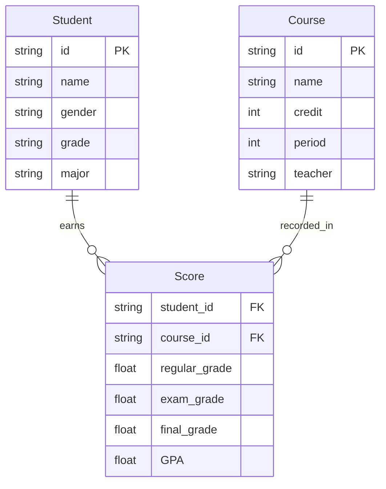
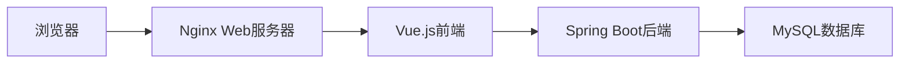

# 学生成绩学分制管理系统设计与实现

作者：禅与计算机程序设计艺术

## 1. 背景介绍

### 1.1 学分制管理系统的重要性

在现代高等教育中,学分制管理系统扮演着至关重要的角色。它不仅仅是一个记录学生成绩的工具,更是一个全面管理学生学习进程、评估教学质量、优化教育资源配置的综合性平台。

### 1.2 传统管理方式的局限性

传统的学生成绩管理通常采用人工记录、手工计算的方式,这不仅效率低下,而且容易出错。随着高校规模的不断扩大,学生人数的持续增长,传统管理模式已经无法满足日益复杂的教学管理需求。

### 1.3 信息化管理的优势

学分制管理系统利用计算机技术和数据库系统,实现了学生成绩的自动化、规范化、精细化管理。它可以快速、准确地计算学生的学分绩点,生成各类成绩统计报表,为教学管理决策提供数据支持。同时,学生也可以通过系统实时查询自己的学习进度和成绩,为自主学习提供了便利。

## 2. 核心概念与关系

### 2.1 学生 Student  

代表一个具体的学生个体,具有学号、姓名、性别、年级、专业等基本属性。学生与课程成绩之间形成多对多的关系,即一个学生可以修读多门课程,一门课程也可以被多个学生选修。

### 2.2 课程 Course

代表一门具体的课程,具有课程编号、课程名称、学分、学时等基本属性。每门课程会有相应的授课教师、考核方式等要素。课程与学生成绩之间也是多对多的关系。

### 2.3 成绩 Score

反映学生修读某门课程的学习效果,通常由平时成绩、期末考试等部分组成。一条成绩记录与一个学生和一门课程形成三元组合关系。成绩的最终结果会折算成绩点 GPA (Grade Point Average) 作为衡量学习质量的指标。

### 2.4 学分 Credit

学分是评价学生学习量的一个单位,每门课程根据课程内容、学时等因素确定相应的学分。学生通过修读课程并考核合格后才能获得相应的学分,累计达到培养方案规定的总学分方可毕业。

### 2.5 实体关系图 ER Diagram

以上几个核心概念之间的关系可以用下面的实体-关系图来表示:



## 3. 核心算法原理与具体步骤

### 3.1 学生成绩录入

#### 3.1.1 单个成绩录入

1. 接收学生学号、课程编号、平时成绩、期末成绩等信息
2. 对输入数据进行校验,如数据类型、取值范围等
3. 根据配置的权重计算出总评成绩
4. 将成绩信息写入数据库

#### 3.1.2 批量成绩导入

1. 解析上传的 Excel 表格文件
2. 逐行读取学生学号、课程编号、各项成绩
3. 对每条记录执行单个成绩录入的流程
4. 全部处理完成后给出导入结果反馈

### 3.2 平均学分绩点 GPA 计算

#### 3.2.1 单科课程绩点计算

1. 根据课程的总评成绩确定等级 (如 A、B、C 等) 
2. 在配置表中找到等级对应的绩点 (如 A=4.0, B=3.0 等)  
3. 返回该课程的学分绩点

#### 3.2.2 平均学分绩点计算

1. 找出学生所修读的所有课程
2. 计算每门课程的学分绩点
3. 学分绩点乘以对应课程学分,得到学分绩点数
4. 把所有课程的学分绩点数加总,除以总学分,得到平均学分绩点
5. 结果保留小数点后两位

```python
def calculate_gpa(scores, courses):
    total_credit = 0 
    total_gp = 0
    for score in scores:
        course = courses.get(score['course_id'])
        credit = course['credit'] 
        gp = get_gpa_point(score['final_grade'])
        total_credit += credit
        total_gp += credit * gp
    
    return round(total_gp / total_credit, 2) if total_credit > 0 else 0
```

### 3.3 学生学业预警

#### 3.3.1 预警条件设定

1. 平均学分绩点 GPA 低于特定值(如2.0)
2. 单学期 GPA 低于特定值
3. 累计不及格学分超过特定值

#### 3.3.2 预警名单生成

1. 筛选出符合预警条件的学生
2. 生成预警学生名单
3. 对应学生的预警次数加1
4. 预警信息推送给学生、导师、教务人员         

## 4. 数学模型与公式推导

### 4.1 平均学分绩点计算模型

假设一个学生修读了 $n$ 门课程,每门课程的学分设为 $c_i$,相应课程的绩点设为 $g_i$,则该生的平均学分绩点 $\overline{G}$ 可用以下公式计算:

$$
\overline{G} = \frac{\sum_{i=1}^{n} c_i g_i}{\sum_{i=1}^{n} c_i}
$$

其中 $1 \leq i \leq n$。举个例子,小明修读了3门课,分别是:

| 课程   | 学分   | 成绩 | 等级 | 绩点 |
|--------|--------|------|------|------|
| 高等数学 | 6     | 85   |  A   |  4.0 | 
| 大学英语 | 4     | 73   |  B   |  3.0 |
| 程序设计 | 4     | 92   |  A   |  4.0 |

则小明的平均学分绩点为:

$$
\overline{G} = \frac{6 \times 4.0 + 4 \times 3.0 + 4 \times 4.0}{6 + 4 + 4} = \frac{52}{14} \approx 3.71
$$

可见,学分绩点模型充分体现了课程难度、学习投入对学习质量评价的影响。学分越高、绩点越高,对平均学分绩点的贡献就越大。学分制管理系统应该提供灵活的绩点等级配置功能,以适应不同学校的成绩评定规则。

### 4.2 学生排名模型

在实际应用中,学校经常需要对学生的学习成绩进行排名,以体现学生的相对学习效果。一个简单的做法是将学生的平均学分绩点从高到低进行排序。但仅靠GPA一项指标难以全面评价学生的综合素质。因此需要建立一个加权排名模型:

$$
S_i = \sum_{j=1}^{m} W_j R_{ij}
$$

其中,$S_i$ 是第 $i$ 个学生的综合得分, $W_j$ 是第 $j$ 项指标的权重系数,$R_{ij}$ 是第 $i$ 个学生的第 $j$ 项指标的标准化排名(排名值除以总人数)。通常选取的排名指标有:

- 平均学分绩点
- 获得学分数
- 课外活动加分
- 获奖加分

例如,某班有5个学生,各项指标得分如下:

| 学生   | GPA  | 学分 | 课外活动 | 获奖 |
|--------|------|------|---------|-----|
| 甲     | 3.8  | 30   |   5     |  0  |
| 乙     | 3.5  | 28   |   7     |  3  |
| 丙     | 3.2  | 25   |   8     |  5  |
| 丁     | 3.7  | 32   |   6     |  2  |
| 戊     | 3.6  | 27   |   9     |  4  |

如果权重分配为 GPA 40%,学分 20%,课外活动 20%,获奖 20%,则可以计算出每位学生的综合得分:

$$
\begin{aligned}
S_甲 &= 0.4 \times \frac{2}{5} + 0.2 \times \frac{2}{5} + 0.2 \times \frac{5}{5} + 0.2 \times \frac{5}{5} = 0.72 \\
S_乙 &= 0.4 \times \frac{4}{5} + 0.2 \times \frac{3}{5} + 0.2 \times \frac{4}{5} + 0.2 \times \frac{3}{5} = 0.68 \\ 
S_丙 &= 0.4 \times \frac{5}{5} + 0.2 \times \frac{5}{5} + 0.2 \times \frac{2}{5} + 0.2 \times \frac{1}{5} = 0.64 \\ 
S_丁 &= 0.4 \times \frac{3}{5} + 0.2 \times \frac{1}{5} + 0.2 \times \frac{3}{5} + 0.2 \times \frac{4}{5} = 0.60 \\
S_戊 &= 0.4 \times \frac{1}{5} + 0.2 \times \frac{4}{5} + 0.2 \times \frac{1}{5} + 0.2 \times \frac{2}{5} = 0.56
\end{aligned} 
$$

据此可以得出最终的学生综合排名为:甲>乙>丙>丁>戊。这个模型的优点是可以根据学校的实际情况灵活调整各项指标的权重,全面评判学生的发展情况。当然,具体指标的选取和数据的标准化需要教务部门和系统开发者深入讨论确定。

## 5. 系统设计与实现

### 5.1 系统架构设计

学分制管理系统采用 Browser/Server 架构模式,前后端分离。前端使用 Vue.js 进行页面开发,后端使用 Spring Boot + MyBatis 框架提供 RESTful API 接口,数据持久层选用 MySQL 数据库。



### 5.2 数据库设计

根据需求分析和概念设计,系统的数据库主要包含以下表:

- 学生表 student
- 课程表 course  
- 教师表 teacher
- 成绩表 score
- 学分等级表 credit_grade
- 学院表 department
- 专业表 major
- 行政班表 admin_class
- 学年学期表 semester

各个实体之间的关系可以参考第2节的 ER 图。下面以学生表和成绩表为例给出具体的表结构设计:

```sql
CREATE TABLE `student` (
  `id` varchar(20) NOT NULL COMMENT '学号',
  `name` varchar(20) NOT NULL COMMENT '姓名',
  `gender` varchar(10) DEFAULT NULL COMMENT '性别',
  `birthday` date DEFAULT NULL COMMENT '出生日期',
  `deptid` int DEFAULT NULL COMMENT '所属学院',
  `majorid` int DEFAULT NULL COMMENT '所属专业',
  `classid` int DEFAULT NULL COMMENT '所属班级',
  `status` varchar(20) DEFAULT NULL COMMENT '学籍状态',
  PRIMARY KEY (`id`),
  KEY `idx_student_name` (`name`)
) ENGINE=InnoDB DEFAULT CHARSET=utf8mb4 COLLATE=utf8mb4_0900_ai_ci;

CREATE TABLE `score` (
  `id` int NOT NULL AUTO_INCREMENT COMMENT '成绩编号',
  `student_id` varchar(20) NOT NULL COMMENT '学号',
  `course_id` varchar(20) NOT NULL COMMENT '课程编号',  
  `semester_id` int NOT NULL COMMENT '学期编号',
  `regular_grade` float(5,2) DEFAULT NULL COMMENT '平时成绩',
  `exam_grade` float(5,2) DEFAULT NULL COMMENT '考试成绩',
  `final_grade` float(5,2) DEFAULT NULL COMMENT '总评成绩',
  `gpa` float(3,1) DEFAULT NULL COMMENT '学分绩点',
  PRIMARY KEY (`id`),
  UNIQUE KEY `uni_score_student_course` (`student_id`,`course_id`),
  KEY `idx