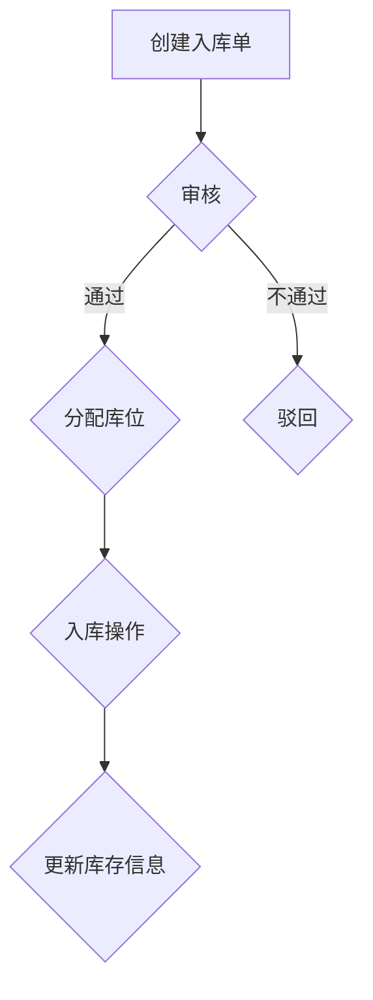
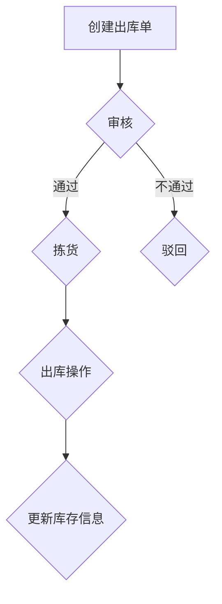

## 1. 背景介绍

### 1.1. 仓库管理的重要性

在现代企业运营中，仓库作为连接生产、销售和客户的重要环节，其管理效率直接影响着企业的运营成本、客户满意度以及市场竞争力。随着业务规模的扩大和市场需求的不断变化，传统的仓库管理模式已经难以满足企业发展的需求，仓库管理系统应运而生。

### 1.2. 仓库管理系统的目标

企业仓库管理系统旨在通过信息化手段，实现对仓库资源的全面、高效、精准管理，其主要目标包括：

*   **提高仓储作业效率:**  通过自动化、智能化手段，简化操作流程，减少人工干预，提高出入库效率。
*   **优化库存结构:**  实时监控库存状态，精准预测库存需求，避免库存积压和缺货，降低库存成本。
*   **加强信息共享:**  实现与生产、销售等环节的信息互通，提高供应链协同效率。
*   **提升数据分析能力:**  收集、分析仓库运营数据，为企业决策提供数据支持。

### 1.3. 本文目标

本文将详细介绍企业仓库管理系统的详细设计与具体代码实现，涵盖系统需求分析、架构设计、功能模块设计、数据库设计、代码实现等方面，旨在为企业构建高效、智能的仓库管理系统提供参考。

## 2. 核心概念与联系

### 2.1. 仓库管理系统核心概念

*   **库存:**  指企业在仓库中存储的各种物料或商品，包括原材料、半成品、成品等。
*   **出入库:**  指物料或商品进出仓库的操作过程，包括入库、出库、调拨等。
*   **库位:**  指仓库中用于存放物料或商品的具体位置，例如货架、托盘等。
*   **库存盘点:**  指定期或不定期对仓库中的库存进行清点，核实库存数量和状态。
*   **条形码/二维码:**  用于标识物料或商品的编码，方便进行出入库操作和库存管理。

### 2.2. 核心概念之间的联系

*   库存是仓库管理的核心对象，出入库操作是库存变化的主要方式。
*   库位是存放库存的场所，不同的库位对应不同的库存类型和数量。
*   库存盘点用于核实库存信息，保证库存数据的准确性。
*   条形码/二维码技术可以提高出入库操作的效率和准确性。

## 3. 核心算法原理具体操作步骤

### 3.1. 入库管理

#### 3.1.1.  流程图



#### 3.1.2. 操作步骤

1.  创建入库单：录入供应商、物料信息、数量等信息。
2.  审核入库单：审核入库单信息的准确性和完整性。
3.  分配库位：根据物料类型和数量，选择合适的库位进行存放。
4.  入库操作：将物料放置到指定的库位，并扫描条形码/二维码进行确认。
5.  更新库存信息：将入库信息更新到系统数据库中，包括物料名称、数量、库位等信息。

### 3.2. 出库管理

#### 3.2.1. 流程图



#### 3.2.2. 操作步骤

1.  创建出库单：录入客户、物料信息、数量等信息。
2.  审核出库单：审核出库单信息的准确性和完整性。
3.  拣货：根据出库单信息，从指定的库位拣选物料。
4.  出库操作：将拣选好的物料进行打包、发货，并扫描条形码/二维码进行确认。
5.  更新库存信息：将出库信息更新到系统数据库中，包括物料名称、数量、库位等信息。

## 4. 数学模型和公式详细讲解举例说明

### 4.1. 库存周转率

库存周转率是衡量企业仓库管理效率的重要指标，其计算公式如下：

$$
库存周转率 =  \frac{年度销售成本}{平均库存价值}
$$

其中：

*   年度销售成本是指企业在一年内销售产品的总成本。
*   平均库存价值是指企业在一年内库存商品的平均价值。

**举例说明:**

假设某企业年度销售成本为 1000 万元，平均库存价值为 200 万元，则该企业的库存周转率为：

$$
库存周转率 = \frac{1000}{200} = 5
$$

这意味着该企业一年内库存商品周转了 5 次。

### 4.2. 库存预警

库存预警是指当库存量低于预设的安全库存量时，系统会自动发出预警信息，提醒管理人员及时补充库存。安全库存量的计算公式如下：

$$
安全库存量 = (最大日消耗量 \times 最大交货期) + (平均日消耗量 \times 平均交货期)
$$

其中：

*   最大日消耗量是指企业在一天内消耗的最大物料数量。
*   最大交货期是指供应商供货的最长时间。
*   平均日消耗量是指企业在一天内平均消耗的物料数量。
*   平均交货期是指供应商供货的平均时间。

**举例说明:**

假设某物料的最大日消耗量为 100 件，最大交货期为 7 天，平均日消耗量为 50 件，平均交货期为 3 天，则该物料的安全库存量为：

$$
安全库存量 = (100 \times 7) + (50 \times 3) = 850 件
$$

这意味着当该物料的库存量低于 850 件时，系统会发出预警信息。

## 5. 项目实践：代码实例和详细解释说明

### 5.1. 技术选型

本项目采用 Spring Boot 框架进行开发，数据库采用 MySQL，前端框架采用 Vue.js。

### 5.2. 代码实例

#### 5.2.1. 入库管理接口

```java
@RestController
@RequestMapping("/api/warehouse/inbound")
public class InboundController {

    @Autowired
    private InboundService inboundService;

    @PostMapping
    public Result createInboundOrder(@RequestBody InboundOrderDTO inboundOrderDTO) {
        return inboundService.createInboundOrder(inboundOrderDTO);
    }

    @PutMapping("/{id}/audit")
    public Result auditInboundOrder(@PathVariable Long id, @RequestParam Boolean pass) {
        return inboundService.auditInboundOrder(id, pass);
    }

    @PutMapping("/{id}/allocate")
    public Result allocateLocation(@PathVariable Long id, @RequestParam String locationCode) {
        return inboundService.allocateLocation(id, locationCode);
    }

    @PutMapping("/{id}/inbound")
    public Result inbound(@PathVariable Long id) {
        return inboundService.inbound(id);
    }

}
```

#### 5.2.2. 出库管理接口

```java
@RestController
@RequestMapping("/api/warehouse/outbound")
public class OutboundController {

    @Autowired
    private OutboundService outboundService;

    @PostMapping
    public Result createOutboundOrder(@RequestBody OutboundOrderDTO outboundOrderDTO) {
        return outboundService.createOutboundOrder(outboundOrderDTO);
    }

    @PutMapping("/{id}/audit")
    public Result auditOutboundOrder(@PathVariable Long id, @RequestParam Boolean pass) {
        return outboundService.auditOutboundOrder(id, pass);
    }

    @PutMapping("/{id}/pick")
    public Result pick(@PathVariable Long id) {
        return outboundService.pick(id);
    }

    @PutMapping("/{id}/outbound")
    public Result outbound(@PathVariable Long id) {
        return outboundService.outbound(id);
    }

}
```

### 5.3. 代码解释

*   以上代码示例展示了入库管理和出库管理的 RESTful API 接口，分别对应入库单和出库单的创建、审核、分配库位、入库/出库操作等功能。
*   代码中使用了 Spring Boot 框架提供的注解，例如 `@RestController`、`@RequestMapping`、`@PostMapping`、`@PutMapping` 等，简化了接口的开发。
*   代码中使用了依赖注入的方式，将 `InboundService` 和 `OutboundService` 注入到 Controller 中，实现了业务逻辑与接口的分离。

## 6. 实际应用场景

### 6.1. 制造业

制造企业可以使用仓库管理系统对原材料、半成品、成品进行管理，提高生产效率，降低库存成本。

### 6.2. 电商

电商企业可以使用仓库管理系统对商品进行管理，提高订单处理效率，提升客户满意度。

### 6.3. 物流

物流企业可以使用仓库管理系统对货物进行管理，提高运输效率，降低物流成本。

## 7. 总结：未来发展趋势与挑战

### 7.1. 未来发展趋势

*   **智能化:**  随着人工智能、物联网等技术的不断发展，仓库管理系统将更加智能化，例如机器人自动拣货、无人叉车搬运等。
*   **云化:**  云计算技术可以为企业提供更加灵活、便捷的仓库管理服务，例如云端部署、按需付费等。
*   **一体化:**  仓库管理系统将与其他企业信息系统更加紧密地集成，例如 ERP、CRM 等，实现信息共享和业务协同。

### 7.2. 挑战

*   **数据安全:**  仓库管理系统中存储了大量的企业敏感数据，如何保障数据安全是一个重要挑战。
*   **系统集成:**  仓库管理系统需要与其他企业信息系统进行集成，如何实现无缝集成是一个挑战。
*   **人才缺乏:**  仓库管理系统的开发、维护需要专业的技术人才，如何培养和引进人才是一个挑战。

## 8. 附录：常见问题与解答

### 8.1. 如何选择合适的仓库管理系统？

选择合适的仓库管理系统需要考虑以下因素：

*   企业规模和业务需求
*   系统功能和性能
*   成本预算
*   供应商实力和服务

### 8.2. 如何保证仓库管理系统的数据安全？

*   建立完善的数据安全管理制度
*   采用数据加密、访问控制等技术手段
*   定期进行数据备份和恢复

### 8.3. 如何解决仓库管理系统集成问题？

*   选择支持标准接口的系统
*   采用中间件技术
*   与供应商进行充分沟通和协商
